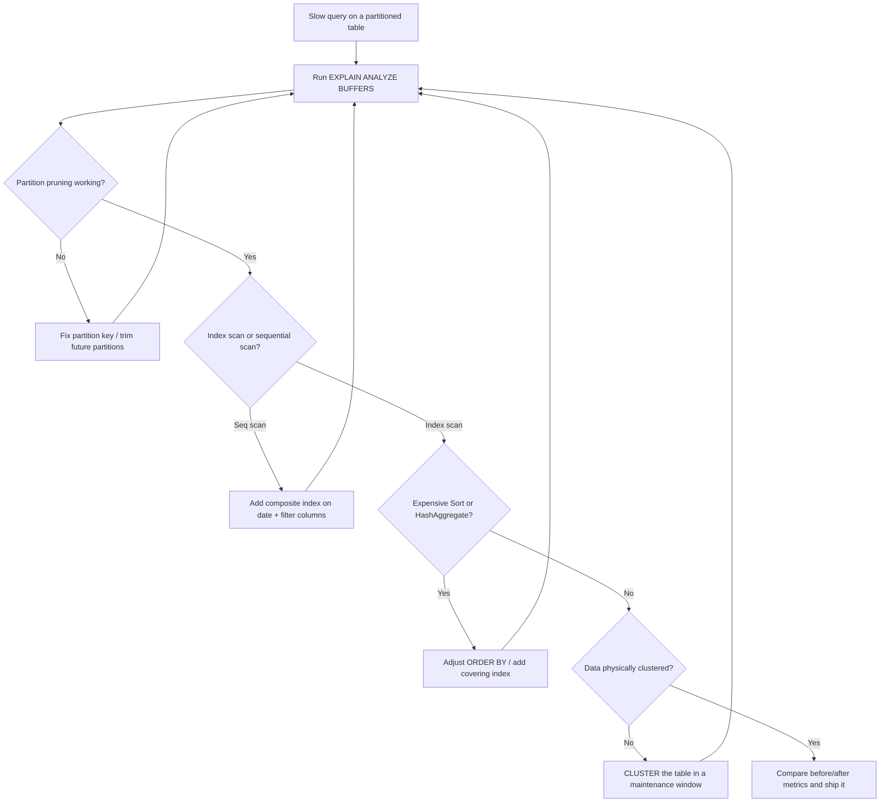

| Difficulty | Channel | Tags |
|---|---|---|
| intermediate | database | explain, query-plan, partitioning |

CoinGecko's hourly crypto price table had been quietly accumulating data for eight years. Then it crossed 1TB, and the performance cliff arrived: average query times over 30 seconds, daily breaches of a 24K IOPS budget, requests queued in droves, and replica lag that threatened their SLO/SLA commitments [1]. The team clawed p99 latency from 4.13 seconds down to 578ms — an 86% improvement — only to discover a plot twist: one query got slower after partitioning [1]. Their journey is the perfect lens for mastering the EXPLAIN plan, the tool you will need the moment your own 100M-row table starts crawling.

---

> ### Real-World Case — CoinGecko
>
> CoinGecko's hourly crypto price table grew past 1TB after 8 years of data, so queries took over 30 seconds on average. Endpoints started breaching their 24K IOPS budget daily, requests queued up, Apdex dropped, and replica lag threatened their SLO/SLA commitments.
>
> | | |
> |---|---|
> | **Challenge** | A 1TB+ PostgreSQL table storing time-series price data had become unmanageable. Adding indexes failed because queries filtered on JSONB keys per currency (an index would only help one app), and raising IOPS to 24K kept getting breached with daily alerts. |
> | **Solution** | They migrated to a range-partitioned table (monthly, `table_YYYYMM` format) because nearly every query filters on a timestamp range. They copied 1.2TB via foreign data wrappers (to avoid warming the cold production table), prewarmed partitions with pg_prewarm, and cut over by renaming tables with a sync trigger as rollback safety. |
> | **Outcome** | p99 response time dropped from 4.13s to 578ms (~86% reduction), IOPS fell 20% (cost savings multiplied across multiple replicas), replica lag disappeared, and dry runs showed 6-8x faster queries. The plot twist: a query with `created_at > ?` and no upper bound got WORSE after partitioning because the planner scanned all partitions including empty future ones - fixed by rewriting the query and trimming pre-created future partitions. |
> | **Lesson** | Partitioning only helps if queries can be pruned. Even after a successful migration, one unbounded query regressed because the planner had to scan every partition - always verify with EXPLAIN that the WHERE clause lets the planner prune, and avoid creating empty future partitions that unbounded range queries will scan. |

---

## Hook — The 1TB Table That Broke the Budget

Picture this: a table that has grown for eight years, absorbing one data point after another until it weighs over a terabyte. That was CoinGecko's hourly price table, and its query latency had grown to match — over 30 seconds on average [1]. Sound familiar? Any developer who has managed a long-lived time-series table knows the creeping dread: every month the queries feel a little slower, every deploy a little riskier. For CoinGecko, the breaking point came when endpoints began breaching the 24K IOPS budget daily, requests queued up, Apdex scores dropped, and replica lag put their SLOs on the line [1]. The stakes were simple: fix it, or watch the service fall apart. The fix would start not in the code, but in a single, deceptively small command: EXPLAIN.

## Problem — 100M Rows and a Query That Refuses to Cooperate

You have a table with 100M rows, partitioned by date. The partition strategy looks right on paper — the data is split cleanly across time. Yet a query filtering on a specific date range is still slow, embarrassingly slow. Why? Here is the thing: partitioning is not a performance cheat code; it is a data organization strategy. It helps the planner prune irrelevant data, but the optimizer's output is only as good as the statistics, indexes, and query shape it sees [2][6]. Most developers discover that slow queries on partitioned tables fall into a handful of buckets: partition pruning silently not happening, indexes being ignored in favor of sequential scans, or an expensive sort or hash aggregate hiding in the middle of the plan. The trouble is that none of these are visible until you learn to read the plan the way a detective reads a crime scene. That is what this journey is about — turning EXPLAIN output from a mysterious wall of text into a precise diagnosis.

## Real-World Case — CoinGecko

CoinGecko's incident is the textbook version of this problem [1]. After eight years, the hourly price table surpassed 1TB. Queries averaged over 30 seconds, endpoints blew past the 24K IOPS budget every single day, requests queued, Apdex fell, and replica lag became a standing threat to SLO/SLA commitments [1]. The team partitioned by time, then attacked query shape with composite indexes and clustering. The results were dramatic: p99 latency dropped from 4.13 seconds to 578ms — an ~86% reduction — IOPS fell 20%, and replica lag disappeared. Dry runs showed 6-8x faster queries across the board [1]. But here is the plot twist: a query with `created_at > ?` and no upper bound got WORSE after partitioning, because the planner scanned every partition, including pre-created empty future ones [1]. The fix was a query rewrite plus trimming future partitions. The lesson echoes through every system that stores time-series data: the partition key and your query patterns must be designed together, or the cure can hurt worse than the disease.

## Deep Dive — Reading EXPLAIN Like a Detective

Building on the CoinGecko story, the practical skill to sharpen is EXPLAIN literacy [3]. There are five questions to answer, in order. First, is partition pruning working? A scan touching one or two partitions is a win; a scan fanning out across all of them is a red flag, because the planner can only prune when the partition key appears in the WHERE clause with safe, immutable comparisons [6]. Second, are indexes being used? If the plan shows a parallel sequential scan reading millions of rows while an index sits unused, the optimizer is telling you the index is not selective enough or the statistics are stale. Third, where do the expensive operations hide? Sort and HashAggregate nodes chew through memory and I/O, and usually the filter columns are simply not indexed. Fourth, are composite indexes shaped like your WHERE clause? A composite index on (date, filtered_columns) usually beats two single-column indexes, because it lets the planner walk the tree once and skip the re-sort [4][8]. Fifth, is the data physically ordered? Indexes speed up lookups, but CLUSTER physically rewrites rows into index order, shrinking the number of pages touched for a date range [5]. None of these steps is a silver bullet — together, they form a checklist.

Here is the cheat sheet you will want in front of you the first time:

| What the plan shows | What it means | What to do |
| --- | --- | --- |
| Append scanning every partition | Pruning failed or query shape blocks it | Rewrite the predicate or trim empty future partitions [6] |
| Parallel Seq Scan over a huge range | No usable, selective index | Add a composite index matching the WHERE clause [4] |
| Sort node between scan and result | Missing index ordering | Match index column order to ORDER BY / GROUP BY [8] |
| Buffers: read high, hit low | Data physically scattered | CLUSTER or re-partition for locality [5] |

## Workflow — The Five-Step Diagnosis Loop

With the theory in hand, here is the exact workflow to run when a partitioned query crawls. The diagram below maps the journey — notice that every branch loops back to re-running the query, because optimization is an experiment, not a one-shot fix.

Start by running EXPLAIN (ANALYZE, BUFFERS) with your real query and real parameters — placeholder-free. Then check for pruning; if the planner is touching every partition, revisit the partition key or trim pre-created partitions. Next, examine the scan method; if it is a sequential scan and you are filtering on selective columns, add a composite index shaped like the WHERE clause. After that, hunt for Sort or HashAggregate nodes; a covering index or an adjusted ORDER BY can eliminate them. Finally, evaluate physical layout; CLUSTER the table so a date range lives on fewer pages [5]. Then loop back and re-run the EXPLAIN, comparing numbers before and after. CoinGecko validated their approach with dry runs showing 6-8x faster queries before committing to production changes [1] — steal that habit. Every change gets measured, never assumed.

## Code Example — Putting the Plan Into Action

Now make the workflow concrete with the exact command sequence you would run against a partitioned `events` table. The script below walks the full loop: diagnose, index, analyze, cluster, and re-verify — each command maps to one step of the workflow above.

## Lessons Learned — What 1TB of History Teaches

So what do you take from CoinGecko's 8-year table? Start with the discipline: never guess, always ask the planner first with EXPLAIN (ANALYZE, BUFFERS) [3]. 🔥 Hot Take: adding an index without reading the plan is superstition, not engineering. 💡 Insight: the column order in a composite index is the column order of your WHERE clause — get it wrong and you get the sort you were trying to avoid [8]. ⚠️ Watch Out: partition keys and query shapes must be designed together. CoinGecko's open-ended `created_at > ?` query scanned every pre-created future partition, and only a rewrite plus trimming fixed it [1]. Keep future partitions tight, run ANALYZE after schema changes so the optimizer sees fresh statistics, and let autovacuum do its maintenance job rather than disabling it out of impatience [7]. 🎯 Key Point: benchmark before and after every change, like the dry runs that validated CoinGecko's 6-8x gains [1]. If this feels like a lot, you are not alone — but the loop is only five steps, and it never gets longer.

---

## Query Optimization Loop

<strong>Original Interview Question</strong>

**Q:** You have a PostgreSQL table with 100M rows partitioned by date. A query filtering on a specific date range is still slow. What would you check in the EXPLAIN plan and how would you optimize it?

**A:** Check partition pruning effectiveness, index utilization patterns, and expensive sort operations. Create composite indexes on (date, filtered_columns) and evaluate clustering strategies for optimal data access.

## Conclusion

Go back to CoinGecko's numbers for a moment: 4.13 seconds to 578ms, IOPS down 20%, replica lag gone [1]. None of that came from rewriting business logic or buying bigger hardware — it came from asking the planner questions and trusting the answers. Tomorrow morning, run EXPLAIN (ANALYZE, BUFFERS) on your slowest query. Ask whether pruning is actually happening, whether your index matches your WHERE clause, whether a sort is hiding in the plan, and whether the data physically matches the way you read it. The insight worth sharing with your team: a query plan is not a verdict — it is an invitation to ask better questions. Partition wisely, measure twice, and never assume the index you added is the index the planner will actually use.

---

## References

1. [CoinGecko incident report](https://amree.dev/2025/06/13/scaling-postgresql-performance-with-table-partitioning/) — article
2. [PostgreSQL Documentation: Declarative Partitioning](https://www.postgresql.org/docs/current/ddl-partitioning.html) — documentation
3. [PostgreSQL Documentation: Using EXPLAIN](https://www.postgresql.org/docs/current/using-explain.html) — documentation
4. [PostgreSQL Documentation: CREATE INDEX](https://www.postgresql.org/docs/current/sql-createindex.html) — documentation
5. [PostgreSQL Documentation: CLUSTER](https://www.postgresql.org/docs/current/sql-cluster.html) — documentation
6. [PostgreSQL Documentation: Partition Pruning](https://www.postgresql.org/docs/current/ddl-partitioning.html#DDL-PARTITION-PRUNING) — documentation
7. [PostgreSQL Documentation: Routine Database Maintenance](https://www.postgresql.org/docs/current/routine-vacuuming.html) — documentation
8. [DigitalOcean: How to Use Indexes in PostgreSQL](https://www.digitalocean.com/community/tutorials/how-to-use-indexes-in-postgresql) — tutorial

---

**Author:** Satishkumar Dhule — [GitHub](https://github.com/satishkumar-dhule) · [LinkedIn](https://linkedin.com/in/satishkumar-dhule) · [Website](https://satishkumar-dhule.github.io)
