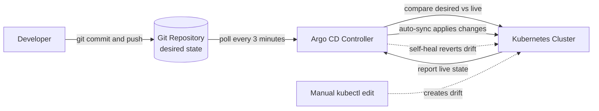

| Difficulty | Channel | Tags |
|---|---|---|
| beginner | devops | argocd, flux, declarative |

Intuit — the company behind TurboTax and QuickBooks — doesn't just run Kubernetes; it runs a platform called Answer that spans hundreds of clusters and powers roughly 1,000 deployments per day for 5,000 engineers [1]. That scale did not happen by accident. It happened because Intuit abandoned imperative kubectl scripts and made Git the single source of truth for what runs in the cluster. This is the story of declarative GitOps with Argo CD — and why your microservices probably need the same medicine.

---

> ### Real-World Case — Intuit
>
> Intuit — the fintech behind TurboTax and QuickBooks — built a massive Kubernetes platform ('Answer') spanning hundreds of clusters and thousands of engineers, and hit a wall: deployment through imperative kubectl commands and scripts across 12,000 applications was impossible to track, audit, or keep consistent. They needed a way to make Git the single source of truth and let the cluster converge itself on the declared state.
>
> | | |
> |---|---|
> | **Challenge** | Configuration drift, auditability, and scale. With 12,000 applications, 370 clusters, and 3,000+ Git repositories, any manual kubectl change or scripted deploy created drift that broke the 'single source of truth' model, and rollbacks/reviews at that scale were unmanageable. No existing CD tool reconciled the cluster back to a Git-declared state continuously. |
> | **Solution** | Intuit created and open-sourced Argo CD: a declarative GitOps controller that watches Git repositories (raw YAML, Helm, Kustomize), defines each deployment as an Application CRD, and continuously reconciles live cluster state against the desired Git state — with auto-sync and self-healing that reverts unauthorized manual changes. Intuit dogfoods it at extreme scale, even managing its own fleet of 140+ Argo CD instances using GitOps itself (App-of-Apps with Kustomize waves). |
> | **Outcome** | Argo CD at Intuit scaled to manage 12,000 applications across 370 clusters from 3,000 Git repositories, accessed by thousands of developers; the platform runs ~15,000 nodes across 350 clusters and powers roughly 1,000 deployments per day for 5,000 engineers. Argo CD later became a CNCF graduated project used by tens of thousands of organizations. |
> | **Lesson** | At serious scale, the imperative model (kubectl/scripts against a live cluster) is a liability: every manual change is invisible drift, an audit hole, and a rollback nightmare. Making Git the declarative single source of truth and letting a reconciler (self-heal) enforce it turns deployment into an auditable, automatically revertible operation — the exact declarative-vs-imperative distinction the question asks about, proven by the company that invented Argo CD. |

---

## Hook — The 3 a.m. drift that nobody could explain

It was 3 a.m., and the pager was screaming. A staging cluster is running a version of the checkout service nobody recognizes. The pipeline log says v2.4.1 was deployed, but the running pods report v2.9.0 — an image tag that exists nowhere in any pipeline. Nobody touched it. Did they?

This is the quiet nightmare of imperative workflows: every direct kubectl command leaves a ghost behind. No commit, no owner, no history. At Intuit, with 12,000 applications and 3,000 Git repositories to wrangle, those ghosts multiplied until the platform was genuinely impossible to track, audit, or keep consistent [1]. And here is the uncomfortable truth: the bigger your microservices platform gets, the closer you are to this exact situation. So what changed for Intuit — and what can it teach your clusters? The answer involves a tool called Argo CD and a mindset shift so fundamental it has a name: GitOps.

## Problem — When kubectl commands turn your cluster into a house of mirrors

Imperative commands feel productive because they are immediate. You type `kubectl scale deploy checkout --replicas=8`, and Kubernetes does exactly what you asked, right now [6]. The catch is that "right now" is the entire problem. There is no durable record of intent anywhere. Re-run a command in the wrong order, hand-edit a manifest that an automation later overwrites, or forget to propagate a hotfix to every environment — and the cluster quietly drifts from what anyone believes is deployed.

For one service, that drift is an inconvenience. For a microservices architecture, it is a slow-motion disaster. Environments diverge. Rollbacks become archaeology, where "which of these three YAML files is the real one?" is a legitimate question. Audits become exercises in creative storytelling. And collaboration? Code reviews, PRs, and branch protection — the entire machinery developers trust — is completely bypassed when the cluster is mutated by direct commands.

Consequently, the deeper problem is subtle and often invisible: the cluster no longer matches the repository, and nobody has a reliable way to even know it. That gap has a name in the Kubernetes world, and you have probably already met it: configuration drift.

## Real-World Case — Intuit: 12,000 applications and the wall that ended imperative deploys

Intuit hit this wall so hard that it became the subject of a conference talk. Its internal Kubernetes platform, called Answer, grew to manage 12,000 applications across 370 clusters, pulling desired state from 3,000 Git repositories, with roughly 15,000 nodes spread over 350 clusters [1]. At that scale, deployment through imperative kubectl commands and homegrown scripts collapsed under its own weight: there was no way to track, audit, or keep thousands of engineers' changes consistent.

The pivot was decisive — make Git the declared truth and let the cluster converge itself onto that state. Intuit adopted Argo CD, and the numbers tell the rest of the story: roughly 1,000 deployments per day, supported by 5,000 engineers, without the platform crumbling [1]. Every change had a commit. Every rollback was a git revert. Drift stopped being a 3 a.m. mystery and became a condition the controller was explicitly designed to eliminate.

Argo CD went on to graduate as a CNCF project, and the same reconciliation pattern now underpins the infrastructure of tens of thousands of organizations [8]. The pattern even has a name — GitOps, coined by the team at Weaveworks in 2017 [2]. But naming a thing does not make it easy. Which brings us to the question hiding at the heart of this whole story: what is the actual difference between declarative and imperative?

## Deep Dive — Declarative vs. imperative: it was never about the commands

This leads to the interview question that started the conversation — and the answer is not about the commands at all. It is about where the truth lives. The imperative approach says: "run this command now, cluster, and do what it says." The declarative approach says: "here is the entire desired state; keep converging until you match it, forever."

Argo CD implements the declarative model as a reconciliation loop: it continuously compares the live cluster state against the desired state declared in Git, and whenever the two differ, it acts to close the gap [3]. Two settings do most of the heavy lifting inside that loop. Auto-sync automatically applies whatever lands in Git, with the controller checking for drift on a configurable interval — typically one to five minutes, with three minutes being the classic sweet spot [4]. Self-healing goes one crucial step further: if someone sneaks in a manual kubectl edit, Argo CD reverts it back to the Git state [4].

Here is the plot twist that surprises most developers: `kubectl apply` is already declarative — you submit a complete desired state to the API server [5]. But that state lives in a last-applied annotation attached to each individual object, not in a versioned repository [7]. Consequently, the minute two people apply competing manifests, or an operator tweaks one field by hand, the truth shatters into fragments that only the cluster can see.

GitOps fixes the real problem: one source of truth, versioned, reviewable, and immutable — plus a machine that enforces it. Moreover, because that desired state can be expressed as plain YAML, Helm charts, or Kustomize overlays, teams get to choose their abstraction level instead of being forced into one [9]. The table below sums up the trade-off you are actually signing up for.

| Dimension | Imperative (kubectl) | Declarative GitOps (Argo CD) |
|---|---|---|
| Source of truth | The cluster itself | The Git repository [2] |
| Change mechanism | Direct commands [6] | Git commits, auto-synced [4] |
| Drift handling | None — it accumulates | Continuous reconcile + self-heal |
| Audit trail | No durable record | Full commit history |
| Rollback | Manual, error-prone | git revert and push |
| Collaboration | Essentially none | PRs, reviews, branch policies |

## Workflow — From git commit to self-healing cluster in six steps

Building on the theory, the path from a fresh repository to a self-healing cluster is shorter than most developers expect — and it hinges on one rule: you only ever touch the cluster indirectly, through Git. The workflow below shows the loop Argo CD runs every few minutes, and the diagram beneath this section (Figure 1) maps the same journey visually.

- **Step 1 — Put the desired state in Git.** Manifests, a Helm chart, or a Kustomize directory, committed and reviewed exactly like application code [9].
- **Step 2 — Install Argo CD** on your cluster and expose its CLI or UI [3].
- **Step 3 — Declare an Application CRD** that points at the repository, the directory, the branch, and the destination namespace [3].
- **Step 4 — Enable automated sync with self-healing.** This is the "let it converge" moment, and skipping either half is where most setups quietly fail [4].
- **Step 5 — Commit a change and push.** Within the reconciliation interval, Argo CD detects the difference and applies it to the cluster automatically.
- **Step 6 — Resist the urge to kubectl edit anything by hand.** Self-heal will correctly roll it back, which is both the point and the easiest way to develop a healthy respect for the system.

Each step exists for one reason: to keep Git and the cluster in lockstep without a human standing in the deploy path.

## Code Example — Declaring your first Argo CD Application

Putting the workflow into practice, here is a minimal but production-realistic way to declare your first Argo CD Application — straight from the terminal where every platform engineer already lives. The script below tunes the reconciliation interval, declares an Application that treats a Git repository as the single source of truth, and then steps back to watch the controller do its job.

## Lessons Learned — Battle scars from the reconciliation loop

After walking through the whole loop, here is what the battle scars teach:

First, **auto-sync without self-heal is only half a solution** — it deploys changes but happily tolerates drift, so enable both together [4]. Second, **pin your image tags**. Mutable `:latest` references in Git undermine the versioning that makes rollbacks boring; immutable tags make git revert actually mean something. Third, **respect the pruner**. Argo CD's prune deletes anything that disappears from Git, which is powerful and occasionally terrifying — make sure the namespace and project scope are correct before that power points at prod [3].

Fourth, **treat the Argo CD UI and CLI as read-only windows** into a system you control through commits; every "quick fix" from the dashboard is drift you just scheduled to be rolled back. Fifth, **start small**: one service, one path, one team. Prove the reconcile loop end to end, then scale to ApplicationSets for the multi-cluster, many-services case [3].

And finally, remember the auditability payoff: because every state change is a commit, answering "what changed and who approved it?" becomes a `git log` one-liner instead of a production incident. That is the real currency of GitOps.

---

## GitOps reconciliation loop

<strong>Original Interview Question</strong>

**Q:** You're setting up GitOps for a microservices deployment. How would you configure ArgoCD to automatically sync changes from your Git repository to Kubernetes, and what's the difference between declarative and imperative approaches in this context?

**A:** I'd configure ArgoCD by setting up a Git repository containing Kubernetes manifests or Helm charts, creating an Application CRD that points to the Git repository, enabling auto-sync with a health check interval of 3 minutes, and implementing self-healing to automatically revert any manual changes. The declarative approach involves defining the desired state in Git through YAML manifests, Helm charts, or Kustomize configurations, where ArgoCD continuously reconciles the actual state with the desired state. In contrast, the imperative approach uses kubectl commands to make direct changes to the cluster, bypassing the Git repository as the single source of truth.

## Conclusion

Intuit did not become one of the largest GitOps deployments on the planet by accident. It took a deliberate decision to let Git hold the truth and let machines do the converging — and the result is roughly 1,000 deployments a day across hundreds of clusters without the platform collapsing [1]. The same pattern scales down gracefully to your stack. The moment you declare your desired state in a repository, turn on auto-sync and self-heal, and delete kubectl from your deploy muscle memory, every deployment becomes a commit, every rollback becomes a revert, and every 3 a.m. page about mysterious drift becomes a story you tell newcomers. So tomorrow, do this: pick one service, write its desired state into a repo, and let the cluster heal itself. The on-call engineer who doesn't get that call is you.

---

## References

1. [Intuit incident report](https://argoproj.github.io/argocon21/) — article
2. [GitOps — Wikipedia](https://en.wikipedia.org/wiki/GitOps) — article
3. [Argo CD Documentation](https://argo-cd.readthedocs.io/en/stable/) — documentation
4. [Argo CD Automatic Sync Policy Documentation](https://argo-cd.readthedocs.io/en/stable/user-guide/auto_sync/) — documentation
5. [Declarative Management of Kubernetes Objects Using Configuration Files](https://kubernetes.io/docs/concepts/declarative-configuration/) — documentation
6. [Manage Kubernetes Objects Using Imperative Commands](https://kubernetes.io/docs/tasks/manage-kubernetes-objects/imperative-command/) — documentation
7. [Understanding Kubernetes Objects](https://kubernetes.io/docs/concepts/overview/working-with-objects/) — documentation
8. [Argo (software) — Wikipedia](https://en.wikipedia.org/wiki/Argo_(software)) — article
9. [Helm Documentation](https://helm.sh/docs/) — documentation
10. [Argo CD GitHub Repository](https://github.com/argoproj/argo-cd) — documentation

---

**Author:** Satishkumar Dhule — [GitHub](https://github.com/satishkumar-dhule) · [LinkedIn](https://linkedin.com/in/satishkumar-dhule) · [Website](https://satishkumar-dhule.github.io)
