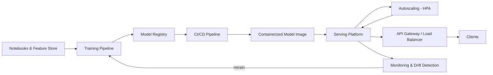

| Difficulty | Channel | Tags |
|---|---|---|
| beginner | devops | mlops, deployment |

In 2015, Uber's data scientists finished brilliant models in Jupyter notebooks - and then everything ground to a halt. Every model needed a hand-built pipeline, every team reinvented serving, and there was no reproducible path from training to production [1]. Uber built Michelangelo to fix it, and today the platform serves more than 15 million real-time predictions per second at peak [1]. Here is the twist that has quietly cost countless engineering teams years: the hard part was never the model - it was everything that happens after you press 'train'.

---

> ### Real-World Case — Uber
>
> In 2015, Uber data scientists built ML models in Jupyter notebooks while engineers hand-crafted bespoke pipelines to get each model into production — there was no standard path to deployment, no reproducible training pipelines, no experiment tracking, and every team reinvented serving. Uber built Michelangelo, an internal ML-as-a-service platform, to cover the entire workflow from data and training to deployment and prediction at scale.
>
> | | |
> |---|---|
> | **Challenge** | Distinguish and automate the two halves of production ML: (1) deployment — packaging model artifacts, CI/CD, canary rollouts, rollbacks, and monitoring — and (2) serving — low-latency runtime inference, request routing, model loading/versioning, and horizontal autoscaling. This had to work across online (real-time RPC), offline (batch Spark), and library-embedded deployment modes. |
> | **Solution** | Michelangelo separated concerns explicitly. Deployment: models are packaged as ZIP archives (metadata, params, compiled DSL) and pushed via a standard code deployment pipeline with a UI/API, three deploy modes (offline/online/library), shadow and canary validation with auto-rollback, and a Hue observability stack for drift and feature health. Serving: a shared Java Real-time Prediction Service behind load balancers scales horizontally since models are stateless, with features precomputed into Cassandra for sub-10ms reads, plus dynamic model loading that decouples model iteration from server release cycles. Later iterations adopted TensorFlow Serving and NVIDIA Triton as the online serving engine. |
> | **Outcome** | P95 serving latency of under 5ms (models without feature-store lookups) and under 10ms (with Cassandra features); the highest-traffic models served 250,000+ predictions/second as early as 2017. Today Michelangelo runs 400+ active use cases, 5,000+ production models, 20,000+ training jobs monthly, and serves over 15 million real-time predictions per second at peak. |
> | **Lesson** | Deployment and serving need separate-but-orchestrated systems: treating model rollout like software (CI/CD, shadow/canary, auto-rollback) while keeping the serving layer a shared, stateless, horizontally-scalable runtime with dynamic model loading is what lets thousands of models ship daily without downtime. Also: data pipelines, not model code, are the most common source of production ML failures. |

---

## Hook - It's 2015, and Every Uber Model Is a Hand-Carved Snowflake

Picture the scene in 2015. An Uber data scientist trains a demand-forecasting model in a notebook, and it is genuinely good - it beats every in-house baseline. Now get it into production. There is no button. There is no pipeline. A separate engineer writes a one-off scraper to extract the weights, a custom microservice to host them, a cron job to refresh them, and a monitoring script that only one person on the planet understands. Multiply that by every team and every model, and you have a platform problem wearing an ML costume [1].

That is the moment every serious MLOps journey begins: the realization that 'just deploy it' is not a single step, it is a gauntlet. The stakes at Uber were concrete - a ride-price or ETA model that answers in half a second is useless, and one quietly serving stale versions is dangerous. Sound familiar? If you have ever shipped a model and then spent two weeks arguing about which version is actually live, you already know where this story is heading.

## Problem - 'Just Deploy It' Is Actually Two Very Different Jobs

Here is the confusion that sinks more ML projects than bad accuracy ever will: developers use 'deployment' and 'serving' as if they were the same word. They are not, and the difference is where the money goes.

Deployment is the journey to production - CI/CD pipelines, container images, infrastructure provisioning, model registries, monitoring setup, and rollback strategies [4][6]. Serving is the destination - the runtime system that actually loads model weights, exposes an inference API, routes requests, batches traffic, and scales to match demand [2][3][5].

Why does the distinction matter? Because these two jobs fail in completely different ways. Deployment failures are loud and slow: a red build, a stuck rollout, a terraform error at 3am. Serving failures are quiet and deadly: the model answers, but 30ms slower than the SLO allows; a GPU pod OOMs at peak; a cold cache blows the p95 budget for the whole afternoon.

The requirements are unforgiving. Real-time inference targets sub-100ms end-to-end; batch scoring can stretch to a second or more per row. Hitting those numbers is not an algorithm problem - it is an infrastructure problem, and most teams are not even aware they are solving it. Consequently, teams that collapse these two jobs into one usually ship a model that technically runs but operationally terrifies. Which is exactly the situation Uber walked into - and exactly why they made a very public, very expensive decision to fix it.

## Real-World Case - Uber Builds Michelangelo to End the Chaos

Facing notebook-to-production chaos in 2015, Uber made a radical call: build an internal ML-as-a-service platform covering the entire workflow - data, training, deployment, and prediction - at Uber scale [1]. They called it Michelangelo, and the results were staggering.

- P95 serving latency under 5ms for models that do not need feature-store lookups [1]
- P95 latency under 10ms when models fetch features from Cassandra [1]
- 250,000+ predictions per second served by the highest-traffic models as early as 2017 [1]
- Today: 400+ active use cases, 5,000+ production models, 20,000+ training jobs per month, and 15 million+ real-time predictions per second at peak [1]

Here is the plot twist, though: Michelangelo did not win because of some magical inference engine. It won because it standardized the boring stuff - reproducible training, versioned artifacts, and one golden path from experiment to serving container. When every team follows the same pipeline, deployment becomes routine, which is precisely what freed Uber's engineers to obsess over the genuinely hard part: keeping sub-10ms latency while scaling to hundreds of thousands of predictions per second [1].

## Deep Dive - Deployment vs Serving: A Divorce You Need to Understand

Building on Uber's lesson, pull these two worlds apart - the technology, the failure modes, and the metrics are all different.

Deployment is a delivery problem. Its toolbox reads like a DevOps shopping list: Docker and Kubernetes for packaging and orchestration [6], Terraform for infrastructure, GitHub Actions or Jenkins for CI/CD, and registries like MLflow or managed platforms like SageMaker to track experiments and promote artifacts [4][8]. Deployment is 'done' the moment a model sits safely and reproducibly in front of traffic.

Serving is a systems problem. Now the model must answer requests - fast, consistently, and without a human in the loop. That means model servers like TensorFlow Serving or TorchServe that load and version models efficiently [2][3], FastAPI or gRPC interfaces that expose prediction APIs [9], and load balancers like NGINX or Envoy that route and split traffic. Serving never 'finishes': it scales, degrades, fails, and gets monitored forever.

| Dimension | Deployment | Serving |
| --- | --- | --- |
| Core question | How do we ship it safely? | How do we answer requests fast? |
| Cadence | Event-driven, per release | Continuous, per request |
| Primary tools | CI/CD, Docker, K8s, MLflow, SageMaker [4][6][8] | TF Serving, TorchServe, FastAPI, gRPC [2][3][9] |
| Failure mode | Loud build and rollout failures | Silent latency and throughput degradation |
| Key metrics | Build time, deploy frequency, rollback time | Latency, throughput, error rate |
| Scaling trigger | Manual or scheduled | Autoscaling driven by QPS [7] |

And the trade-offs that keep teams up at night:

- Latency vs throughput - batching boosts throughput but adds queueing delay; streaming every request solo is fast but wastes GPU capacity.
- Real-time vs batch - real-time scoring needs the model warm and cached (<100ms); batch scoring can grind through millions of rows overnight at <1s per row. Pick wrong, and you are either burning GPU budget or serving stale predictions.
- Cold starts - the first request after a scale-out can pay a model-loading tax of seconds. For a 50ms SLO, that is instant death. Warm pools, model caches, and carefully tuned autoscaling are the antidote [7].

Scaling itself has two flavors: horizontal (add pod replicas behind the orchestrator, autoscaling on QPS or CPU [7]) and vertical (upgrade GPU memory, tune batch sizes - fewer, bigger workers can beat many small ones). And do not forget A/B testing: split traffic across two model versions to check whether offline metrics survive contact with the real world [10].

The sneaky part: serving is where hidden technical debt in ML systems lives. The glue code, config, and data dependencies that are 'not ML' eat your latency budget alive [11]. Michelangelo's under-10ms number is exactly that story - the model was never the bottleneck; the Cassandra feature lookup was [1].

## Workflow - From Git Commit to Live Prediction in Seven Steps

However, theory only helps if you have a path to run. Here is the golden path Uber's standardization made possible - and any team can steal it:

1. Train and register - a training job writes a versioned artifact to the model registry (MLflow, SageMaker, or even a versioned bucket) with metrics attached [4][8].
2. Package - the model becomes a self-contained serving unit: a BentoML Bento, a TorchServe archive, or a Docker image [3][5].
3. CI/CD gate - tests run: schema checks, smoke inference, and latency benchmarks against the SLO. No green build, no ship.
4. Push the artifact - the image lands in a registry the serving cluster can pull from [6].
5. Roll out safely - canary to a slice of traffic, watch the error rate, then ramp [10].
6. Autoscale the serving layer - a HorizontalPodAutoscaler adds replicas as QPS climbs, while warm models stay cached [7].
7. Monitor and retrain - latency, drift, and data-quality dashboards feed the retraining loop and close the circle.

The diagram below shows how the loop closes - note that monitoring feeds back into training, which is the step most teams forget.

If this workflow looks suspiciously like plain DevOps, that is the point. The team that treats ML release as a software release problem stops reinventing serving and starts shipping models.

## Code Example - A Production-Flavored Model Server in Python

To make it concrete, here is the skeleton of a real serving pattern: a FastAPI model server that pins the model version in the URL, keeps hot models warm in a cache, and exposes the health endpoint Kubernetes uses to decide whether your pod can take traffic. This is the 'serving' half of the story - deployment is wrapping this image in a Deployment plus an autoscaler [6][7].

The details worth studying:

- Version pinning in the URL means clients explicitly ask for the model they validated against - no silent drift between what you tested and what you served.
- The CACHE map keeps hot models in memory so requests skip disk I/O - this is how you survive a cold-start budget.
- /healthz is the contract Kubernetes probes; return 200 only when you can actually serve, and the orchestrator stops routing to unhealthy pods [6].
- Returning latency_ms in the response is a cheap tracing hack - correlate it with your monitoring stack before reaching for full distributed tracing.

Then wrap it: build the image, deploy it as a Kubernetes Deployment behind an autoscaler, and you have gone from notebook to served model the boring, reliable way [6][7].

## Lessons Learned - What 15 Million Predictions per Second Taught Us

Here is what this journey leaves you with - the takeaways worth writing on a sticky note:

- Deployment and serving are different disciplines with different tools, metrics, and failure modes. Confusing them is how production ML dies quietly.
- Standardization beats cleverness. Uber's win was not a faster inference engine; it was one golden path every team used [1].
- Serving is a distributed systems problem. Latency budgets, autoscaling, caching, and traffic splitting decide whether your p95 looks like 5ms or 500ms [7].
- Monitor the whole system, not just the model. The feature lookup, the cache, the cold start - that is where the p95 goes to die [11].
- Roll out like a software engineer. Canary, A/B, and rollback make model changes boring instead of terrifying [10].

And the battle scars, because you do not get to skip these by being talented: the cold-start tax on the first request after a scale-out; an autoscaler tuned only on CPU while a QPS spike shredded the latency SLO; versions drifting between what was trained and what was served; and the classic - a 'fixed' latency issue that turned out to be the database under the feature store. You do not have to make these mistakes; Uber already made them, at scale [1].

Tomorrow, do this: audit your own pipeline. Can you answer 'which version is live, how fast does it answer, and can I roll it back in five minutes?' If not, that is your Michelangelo moment.

---

## Model Lifecycle Flow

<strong>Original Interview Question</strong>

**Q:** Explain the key differences between model serving and model deployment in ML systems, including specific technologies, scaling considerations, and real-world implementation patterns?

**A:** Deployment encompasses CI/CD pipelines, infrastructure setup, and monitoring using tools like Kubernetes, MLflow, and SageMaker. Serving focuses on runtime inference APIs with frameworks like TensorFlow Serving, TorchServe, or BentoML, handling request routing, model versioning, and autoscaling. Key trade-offs include latency vs throughput, batch vs real-time inference, and cold start optimization.

## Conclusion

The journey ends where it began: Uber's notebook chaos, and the platform that turned it into 15 million predictions per second [1]. The models were never the hard part. Deployment is a delivery discipline, serving is a systems discipline, and you need both - because the teams that separate them ship faster, roll back safer, and sleep better.

So here is the one line to share with your team: deploy the model like software, serve it like infrastructure - and let the notebook stay in the notebook.

---

## References

1. [Uber incident report](https://www.uber.com/us/en/blog/michelangelo-machine-learning-platform/) — article
2. [TensorFlow Serving - GitHub](https://github.com/tensorflow/serving) — documentation
3. [TorchServe - GitHub](https://github.com/pytorch/serve) — documentation
4. [MLflow - GitHub](https://github.com/mlflow/mlflow) — documentation
5. [BentoML - GitHub](https://github.com/bentoml/BentoML) — documentation
6. [Kubernetes Deployments](https://kubernetes.io/docs/concepts/workloads/controllers/deployment/) — documentation
7. [Kubernetes Horizontal Pod Autoscaling](https://kubernetes.io/docs/tasks/run-application/horizontal-pod-autoscale/) — documentation
8. [What is Amazon SageMaker AI?](https://docs.aws.amazon.com/sagemaker/latest/dg/whatis.html) — documentation
9. [gRPC](https://en.wikipedia.org/wiki/GRPC) — documentation
10. [A/B testing](https://en.wikipedia.org/wiki/A/B_testing) — documentation
11. [Hidden Technical Debt in Machine Learning Systems (Sculley et al., NIPS 2015)](https://proceedings.neurips.cc/paper_files/paper/2015/file/86df7dcfd896fcaf2674f757a2463eba-Paper.pdf) — paper

---

**Author:** Satishkumar Dhule — [GitHub](https://github.com/satishkumar-dhule) · [LinkedIn](https://linkedin.com/in/satishkumar-dhule) · [Website](https://satishkumar-dhule.github.io)
