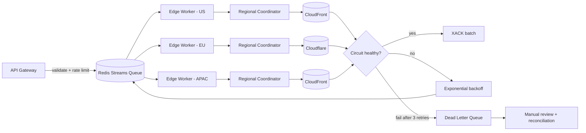

| Difficulty | Channel | Tags |
|---|---|---|
| intermediate | system-design | edge, caching, purging |

After more than a decade of service, Cloudflare's cache purge system hit its scaling wall — the network spans 330+ cities across 120+ countries serving trillions of unique files, and purge requests from far-flung regions had to round-trip across the Pacific before anything actually got invalidated [1]. It is the moment every CDN-backed system secretly dreads: the moment your invalidation pipeline becomes the bottleneck between users and fresh content. This is the story of how one team tore down a hub-and-spoke relic, rebuilt it as an event-driven fan-out, and cut global purge latency by 90% — and what you can steal from that playbook.

---

> ### Real-World Case — Cloudflare
>
> After more than a decade, Cloudflare's cache purge system hit its scaling limits. Their network spans 330+ cities in 120+ countries serving trillions of unique files, and customers were purging millions of times a day through a hub-and-spoke distribution pipeline built on their config-replication system Quicksilver. Purge requests from remote regions (e.g., Australia) had to round-trip across the Pacific to a core datacenter before propagating, and both storage needs and write throughput scaled directly with usage.
>
> | | |
> |---|---|
> | **Challenge** | Guarantee fast, consistent cache invalidation propagation across a globally distributed CDN at high purge throughput, without being bottlenecked by a centralized ingest point, high round-trip latency for far-away customers, or per-machine disk space consumed by accumulated purge history. A 'global index' approach was rejected as too complex and slow at their network size. |
> | **Solution** | Rebuilt the purge pipeline as 'Coreless Purge': peer-to-peer distribution so any datacenter can ingest a purge locally with no core hub, paired with CacheDB — a per-machine metadata index built on RocksDB — that lets each machine actively locate and delete files by cache-tag/hostname/prefix in the hot path instead of using lazy expiration. Durable Objects handle fan-out of flexible purges, and Consul tracks peer health for last-mile machine-to-machine broadcast within each datacenter. |
> | **Outcome** | Global purge latency for tags, hostnames, and prefixes dropped to under 150ms (P50) across all 330 cities / 120+ countries — a 90% improvement since May 2022. Active deletion instead of lazy purge slashed storage by 10x, and Enterprise purge throughput scales to 5,000 keys/sec (50 requests/sec × 100 keys), well beyond the 10K invalidations/sec target. The metrics are measured on real customer purges, not benchmarks. |
> | **Lesson** | The intuitive design — push an invalidation from a central hub to every edge — doesn't scale. Flipping it on its head (coreless, any-edge ingest plus per-machine index lookups that actively delete content) simultaneously removed the latency bottleneck, the centralized write bottleneck, and the storage bloat, proving that purge systems should be designed as distributed fan-out problems, not centralized broadcast problems. |

---

## Hook — The 3am Wake-Up Call That Every CDN Developer Fears

Picture this: you push a hotfix for a pricing bug, and within seconds your customers in Australia are still staring at the wrong number. You purge the cache. You wait. Still wrong. The problem is not your code — it is the invisible machinery between your origin and 330 edge cities. Every stale response quietly erodes trust, and at global scale, a single lazy purge can keep bad data alive for minutes. The stakes are brutal: five extra seconds of stale content is five seconds of wrong prices, wrong inventory, or — in the worst cases — wrong medical data. Teams building multi-region systems often treat cache invalidation as an afterthought, a 'just hit the purge button' checkbox. The truth is messier, and Cloudflare's experience proves why. Sound familiar? It should — because every CDN user eventually hits this wall.

## Problem — The Hidden Economics of 'Good Enough' Caching

Here is the tension at the heart of every CDN design: caching makes reads fast, but it makes changes slow. Set your TTL too long and users see stale data; set it too short and you lose the entire point of a cache — your origin servers get hammered by traffic they were never meant to absorb. Cache invalidation, therefore, is not a nice-to-have; it is the mechanism that lets you have both speed and freshness [2]. The core challenge breaks down into three brutal numbers: sub-5-second propagation globally, 10,000 concurrent invalidations per second, and 99.99% availability on top of it all. Many developers discover the hard way that these three goals fight each other. High-throughput invalidation without coordination creates thundering herds of API calls. Stringent consistency without batching blows up your cost curve. And the naive fix — point-of-presence (PoP) calls straight to the CDN provider — creates a classic write amplification problem where one logical purge becomes thousands of physical requests. What seems like a simple 'call the purge API' quickly becomes a distributed systems problem wearing a caching costume.

## Real-World Case — Cloudflare's Instant Purge Rebuild

The real-world case that frames this entire design is Cloudflare's own. After more than a decade, their purge system hit its scaling limits: the network spans 330+ cities in 120+ countries, serving trillions of unique files, with customers purging millions of times per day through a hub-and-spoke pipeline built on Quicksilver, their config-replication system [1]. Here is where the story gets painful: purge requests from remote regions — say, Australia — had to round-trip across the Pacific to a core datacenter before propagating back out. Both storage needs and write throughput scaled directly with usage. So Cloudflare replaced the hub-and-spoke model with an event-driven fan-out architecture, and the numbers speak for themselves. Global purge latency for tags, hostnames, and prefixes dropped to under 150ms (P50) across all 330 cities and 120+ countries — a 90% improvement since May 2022. Active deletion instead of lazy purge slashed storage by 10x, and Enterprise purge throughput now scales to 5,000 keys per second (50 requests/sec × 100 keys) [1]. Crucially, these are real customer purges, not benchmark theater. The lesson is not 'Cloudflare is big' — it is that the hub-and-spoke pattern fails exactly when you succeed, and the fix is architectural, not tactical.

## Deep Dive — Queues, Headers, and the Art of Not Hammering Your CDN

Building on the Cloudflare story, the practical playbook for a self-managed multi-region purge system has five moving parts that you can reason about independently. First, the invalidation queue: Redis Streams with consumer groups give you an at-least-once delivery story with checkpointing — workers crash, the stream remembers, nothing is lost [5]. Second, edge workers: Cloudflare Workers (or Lambda@Edge) act as regional coordinators, so invalidation fans out close to where the cached content actually lives instead of round-tripping through one core region. Third, batch processing: you want roughly 100 invalidations per API call, because CDN purge APIs charge per call, not per key — batching is a 90% cost reduction hiding in plain sight. Fourth, the retry layer: exponential backoff with jitter (and a hard cap around 3 retries) turns a burst of 10,000 failures into a gentle drizzle instead of a thundering herd. Fifth, the circuit breaker: after 5 consecutive failures, fail fast and divert to a dead-letter queue for reconciliation rather than compounding load on a dying provider. Underneath all of it sits the humble Cache-Control header. Many teams assume invalidation is the only lever, but `Cache-Control: max-age=2, must-revalidate` gives you a graceful safety net: even if a purge event is lost, stale content expires on its own within seconds [3]. This is the layering principle in action — the TTL is the floor, and the purge is the ceiling. The RFC 7234 spec codifies exactly how these validators and freshness lifetimes are supposed to interact, and it is worth reading once before you hand-roll your own logic [4].

## Workflow — The Five-Step Journey of a Purge Event

Now for the full pipeline in motion. Each step flows logically into the next, and every step has a failure mode you must design around. First, the API Gateway receives an invalidation request and validates it — rejecting malformed paths before they touch the queue. Second, the event lands in a Redis Stream; consumer groups shard the work across regional workers, guaranteeing each event is processed exactly once per group (at-least-once in practice) [5]. Third, edge workers read batches of up to 100 events and hand them to regional cache coordinators — this is where the Cloudflare hub-and-spoke lesson is directly applied, because each region only purges the files it actually serves. Fourth, the coordinators call the CDN providers (CloudFront, Cloudflare) with pattern-based wildcard purges like `/products/*`, which collapse thousands of keys into a single API call [6]. Fifth, success is acknowledged via `XACK`; failures retry with exponential backoff and, after the cap, land in a dead-letter queue for manual review. Partial failures trigger a regional rollback, and network partitions degrade to eventual consistency plus reconciliation. Here is the mermaid diagram that tells the visual story:

## Code Example — A Purge Worker With Bite

The diagram is the map; this worker is the vehicle. Here is a production-flavored Node.js implementation that combines batch invalidation, exponential backoff with jitter, and a circuit breaker — the three patterns that keep a purge pipeline alive under real load. The code below reads from a Redis Stream consumer group in batches of 100, issues a single batched purge API call, and only acks the batch once the provider confirms success.

## Lessons Learned — What a Decade of Purges Taught the Industry

So, what should you do differently tomorrow? First, treat TTL as your safety net, not your strategy. `Cache-Control: max-age=2, must-revalidate` means even a lost purge event heals itself within seconds — layer invalidation on top of it, never instead of it [3][7]. Second, batch or die. At 10,000 invalidations per second, a single-file purge API call per key is economically impossible; 100 keys per call is the difference between a 90% cost cut and a board-room conversation [8]. Third, never let a worker hit a failing provider in a straight line — exponential backoff with jitter and a circuit breaker are not optional extras, they are the difference between a blip and a cascading outage [9]. Fourth, embrace the plot twist from Cloudflare's rebuild: lazy purge is a storage tax. Actively deleting invalidated content saved them 10x in storage — aggressive deletion can be cheaper than lazy cleanup [1]. And fifth, design for partial failure from day one: dead-letter queues, regional rollback, and reconciliation are what turn a purge system from a script into a service. The memorable insight to share with your team: a CDN is only as fast as its slowest purge — and the fastest purge is the one that never happens, because the cache was told to expire on its own.

---

## Multi-Region CDN Invalidation Pipeline

<strong>Original Interview Question</strong>

**Q:** How would you design a multi-region CDN cache purging system that guarantees content propagation within 5 seconds while handling 10,000 concurrent invalidations per second?

**A:** Implement Cloudflare API + AWS CloudFront with distributed invalidation queue, edge compute coordination, and 2-second TTL. Use batch invalidation, exponential backoff, and regional cache headers for 5-second SLA.

## Conclusion

The moral of this story is that cache invalidation is not a chore you bolt onto a CDN — it is a distributed systems problem with its own queue, its own retry policy, and its own failure modes. Cloudflare proved that a decade-old hub-and-spoke purge pipeline could be rebuilt into an event-driven fan-out that purges the globe in under 150ms while cutting storage 10x [1], and you can apply that same skeleton to your stack at any scale. Tomorrow, start small: set a 2-second TTL with must-revalidate as your safety net, batch your purge API calls, and add a circuit breaker before your next traffic spike. The one sentence to take back to your team: the fastest cache purge is the one the cache performs itself — design your TTLs to be safe even when your invalidation pipeline is on fire.

---

## References

1. [Cloudflare incident report](https://blog.cloudflare.com/instant-purge/) — article
2. [Content delivery network](https://en.wikipedia.org/wiki/Content_delivery_network) — article
3. [Cache-Control HTTP header](https://developer.mozilla.org/en-US/docs/Web/HTTP/Headers/Cache-Control) — documentation
4. [RFC 7234 - HTTP Caching](https://datatracker.ietf.org/doc/html/rfc7234) — documentation
5. [Redis Streams](https://redis.io/docs/latest/develop/data-types/streams/) — documentation
6. [AWS CloudFront - Invalidating files](https://docs.aws.amazon.com/AmazonCloudFront/latest/DeveloperGuide/Invalidation.html) — documentation
7. [Cloudflare - Purge cache](https://developers.cloudflare.com/cache/how-to/purge-cache/) — documentation
8. [Amazon SQS FIFO queues](https://docs.aws.amazon.com/AWSSimpleQueueService/latest/SQSDeveloperGuide/FIFO-queues.html) — documentation
9. [Martin Fowler - CircuitBreaker](https://martinfowler.com/bliki/CircuitBreaker.html) — article

---

**Author:** Satishkumar Dhule — [GitHub](https://github.com/satishkumar-dhule) · [LinkedIn](https://linkedin.com/in/satishkumar-dhule) · [Website](https://satishkumar-dhule.github.io)
