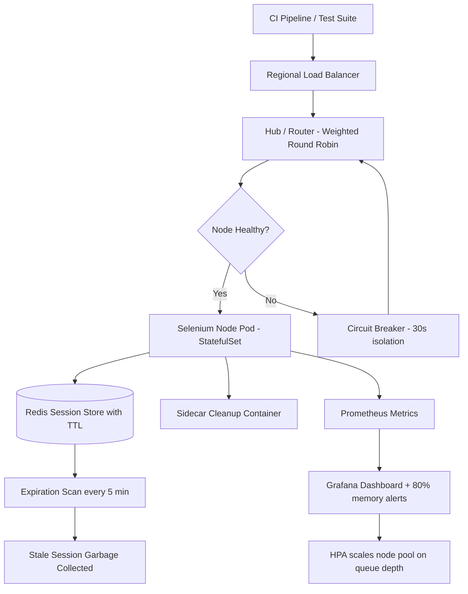

| Difficulty | Channel | Tags |
|---|---|---|
| advanced | system-design | selenium, webdriver, grid |

It was the kind of problem that quietly eats weekends: dozens of teams, hundreds of browsers, and a Selenium Grid that slowly rotted from the inside. Zalando's Engineering Productivity team watched long-lived grid nodes degrade, leak memory, and orphan containers until every team was maintaining its own fragile infrastructure — and then they open-sourced the fix that changed how thousands of teams run browser tests [1]. This is the story of how that architecture works, why disposable browser sessions beat reusable ones, and how you can design a grid that survives 10,000 concurrent sessions without leaking a single byte.

---

> ### Real-World Case — Zalando
>
> Zalando's Engineering Productivity team had to provide stable, scalable UI testing infrastructure for dozens of teams running Selenium tests, but classic long-lived Selenium Grid nodes degraded badly over time — browsers leaked memory, stale sessions and orphaned containers accumulated, and keeping nodes in sync across browser, driver, and Selenium versions was a constant operational burden. Every team effectively maintained its own fragile grid.
>
> | | |
> |---|---|
> | **Challenge** | Scale Selenium Grid across many teams while eliminating the classic failure modes: memory leaks and stale state on long-running nodes, the hub as a single point of failure, tedious node-by-node maintenance, and insufficient coverage for non-Chrome/Firefox browsers. |
> | **Solution** | They built Zalenium, a disposable and flexible container-based grid. Instead of long-lived nodes, a browser container is created from scratch for each test session and disposed of immediately after the test completes (automatic session lifecycle management). Chrome/Firefox run on local Docker nodes; capabilities they can't host (Safari, IE/Edge) are transparently redirected to cloud providers like Sauce Labs and BrowserStack. Docker operations are synchronized to prevent stale containers from lingering, video recording and live preview provide real-time monitoring, a dashboard shows grid state, and a cleanup endpoint force-destroys orphaned sessions. It also runs on Docker Swarm and Kubernetes for horizontal scaling. |
> | **Outcome** | Zalenium was open-sourced (7,000+ GitHub stars) and adopted far beyond Zalando; teams reported their Selenium suite runtime dropping from over an hour to six minutes, and the entire class of stale-node/memory-leak failures disappeared because browser state is never reused between tests. |
> | **Lesson** | The most robust way to 'prevent memory leaks' in a Selenium grid is not to tune GC, restart nodes on a schedule, or hunt leaks in Chromedriver — it's to make nodes ephemeral. If every browser is created fresh for one test and destroyed immediately after, a node physically cannot accumulate leaked memory, stale sessions, or drift, and node failure recovery becomes trivial (just spawn a new container). |

---

## Hook — It is 3am, and the grid is burning

Picture this: it is 3am, and your pager just lit up. The release train is blocked because the UI test suite — the one that takes over an hour — is red again. You SSH into a Selenium node and find 40 orphaned Chrome processes, a browser that has consumed 6GB of RAM, and a stale session error that makes no sense. Sound familiar? Many developers discover that long-lived Selenium Grid nodes are not a stable foundation — they are a slowly ticking time bomb. Browsers leak memory, drivers drift out of sync, and every minute of suite time is a minute your developers are not shipping. Now multiply that by 10,000 concurrent sessions and a 99.9% uptime promise. The stakes are not just a flaky pipeline; they are trust in the entire delivery process. So how do you build a grid that survives that kind of pressure — without staying up all night to babysit it?

## Problem — The rot that comes with reusing browsers

Here is the thing most grid setups get wrong: they treat the browser node as a reusable resource instead of a disposable one. A Chrome process starts clean, and every page you load, every ad that injects a script, every unclosed WebDriver connection leaves residue behind [2]. Over hours, memory balloons; over days, containers orphan; over weeks, the node's browser, driver, and Selenium versions drift out of sync with the rest of the fleet [3]. This leads to a classic failure spiral: nodes get marked unhealthy, sessions get replayed, replaying creates more load, and more load accelerates the rot. Therefore, the hard truth is that no amount of monitoring fixes a design that is fundamentally built to degrade. You need automatic session lifecycle management — sessions that are born, tracked, and killed on a timer — before you can even think about scale. The question is: what does that actually look like in production?

## Real-World Case — Zalando

Nobody proved this better than Zalando. Their Engineering Productivity team had to provide stable UI testing for dozens of internal teams running Selenium, but the classic long-lived grid degraded exactly the way described above: memory leaks, stale sessions, orphaned containers, and a constant battle to keep browser, driver, and Selenium versions in sync. Consequently, every team ended up running its own fragile grid — an enormous operational burden [1]. Their answer was a plot twist: stop reusing browsers entirely. Zalenium spawns a fresh, disposable Docker container for every test, so browser state is never carried between sessions [2]. The results were dramatic: teams reported their Selenium suite runtime dropping from over an hour to six minutes, and the entire class of stale-node and memory-leak failures simply disappeared [1]. The project was open-sourced, passed 7,000 GitHub stars, and was adopted far beyond Zalando [2]. Specifically, the lesson here is that disposable is not a trade-off — it is the mechanism that makes cleanup and consistency trivial.

## Deep Dive — Designing for 10,000 concurrent sessions

Building on Zalando's insight, you can now design the grid that handles 10,000 concurrent sessions with 99.9% uptime. The foundation is a hub-node pattern: a central router backed by Kubernetes StatefulSets that keep browser nodes alive across multiple availability zones [4]. Each node pod is capped at 2GB RAM and 1 CPU, and the hub uses weighted round-robin to balance sessions based on node capacity and response time. The math tells the story: at 50 sessions per node, 10,000 concurrent sessions means 200 nodes minimum, or roughly 520GB of cluster memory once you add a 30% buffer [5]. Session state lives in a Redis cluster with TTL-based expiration, connection pooling, and a five-minute expiration scan that garbage-collects stale keys [6]. Therefore, memory management becomes proactive: weekly rolling restarts, alerts at 80% memory usage, and garbage collection tuning replace the reactive reboot-everything scramble. When a node misbehaves, a circuit breaker isolates it for a 30-second recovery window instead of letting failures cascade into the whole hub [7]. But wait — it gets better. Pod Disruption Budgets guarantee at least 85% capacity even during maintenance [8], and canary deployments roll out new node versions with traffic splitting, so a zero-day driver bug can never take down the entire fleet. The counterintuitive insight? The most valuable component is not the hub, the autoscaler, or even the Redis cluster — it is the quiet cleanup process that deletes what the test forgot.

## Code Example — Your grid's lifecycle sidecar

Now for the part you can copy. The code below is a lightweight session lifecycle manager — the sidecar brain every grid should have. It checks node health, trips the circuit breaker after three consecutive failures, and reaps expired sessions by deleting them from both the Grid and Redis. Run it as a CronJob or a sidecar container on your hub.

## Lessons Learned — What this means for your grid tomorrow

Let's tie the journey together. The problem was real: long-lived browser nodes degrade, leak memory, and drift out of sync [1]. The discovery was counterintuitive: the fix is not better monitoring — it is making sessions disposable so there is nothing left to clean up. The architecture that follows is boring on purpose: Redis TTLs [6], circuit breakers [7], Pod Disruption Budgets [8], health checks [10], and autoscaling [5] are all well-trodden patterns applied in the right order. So what should you do differently tomorrow? Start by making one node disposable — run every test in a fresh container and measure the difference. Then add TTL-based session expiry before you add autoscaling, because expiry prevents the rot that autoscaling would otherwise amplify. If this feels like a lot, you are not alone — but the payoff is real: one team at Zalando went from an hour of suite time to six minutes [1]. Remember the truth that saves every grid: browsers are not pets, they are cattle. Kill them early, kill them often.

---

## Grid Architecture Flow

<strong>Original Interview Question</strong>

**Q:** Design a scalable Selenium Grid architecture to handle 10,000 concurrent test sessions with 99.9% uptime, ensuring zero memory leaks through automatic session lifecycle management, real-time monitoring, and graceful node failure recovery across multiple data centers?

**A:** Deploy Kubernetes cluster with auto-scaling node pools, Redis session store with TTL policies, Prometheus metrics for memory monitoring, circuit breakers for node isolation, and sidecar containers for session cleanup. Implement health checks, resource quotas, and rolling updates.

## Conclusion

The moral of the story: scale does not come from bigger nodes or more RAM — it comes from ruthless session lifecycle management. Zalando showed that throwing away the browser after every test eliminates an entire class of failures and cuts suite time by an order of magnitude [1]. The next time you see a flaky grid, don't tune the garbage collector and hope. Question the assumption that sessions should live at all. Make them disposable, bound them with TTLs [6], isolate the failures with circuit breakers [7], and let Kubernetes autoscale around you [5]. Then share that one insight with your team: memory leaks are a design decision — and you can decide to opt out.

---

## References

1. [Zalando incident report](https://engineering.zalando.com/posts/2017/02/zalenium-a-disposable-and-flexible-selenium-grid-infrastructure.html) — article
2. [Zalenium GitHub repository](https://github.com/zalando/zalenium) — documentation
3. [Selenium Grid documentation](https://www.selenium.dev/documentation/grid/) — documentation
4. [Kubernetes StatefulSets documentation](https://kubernetes.io/docs/concepts/workloads/controllers/statefulset/) — documentation
5. [Kubernetes Horizontal Pod Autoscaling documentation](https://kubernetes.io/docs/tasks/run-application/horizontal-pod-autoscale/) — documentation
6. [Redis EXPIRE command documentation](https://redis.io/docs/latest/commands/expire/) — documentation
7. [Circuit Breaker pattern by Martin Fowler](https://martinfowler.com/bliki/CircuitBreaker.html) — blog
8. [Kubernetes Pod Disruption Budgets documentation](https://kubernetes.io/docs/tasks/run-application/configure-pdb/) — documentation
9. [Prometheus overview documentation](https://prometheus.io/docs/introduction/overview/) — documentation
10. [W3C WebDriver specification](https://www.w3.org/TR/webdriver/) — documentation

---

**Author:** Satishkumar Dhule — [GitHub](https://github.com/satishkumar-dhule) · [LinkedIn](https://linkedin.com/in/satishkumar-dhule) · [Website](https://satishkumar-dhule.github.io)
