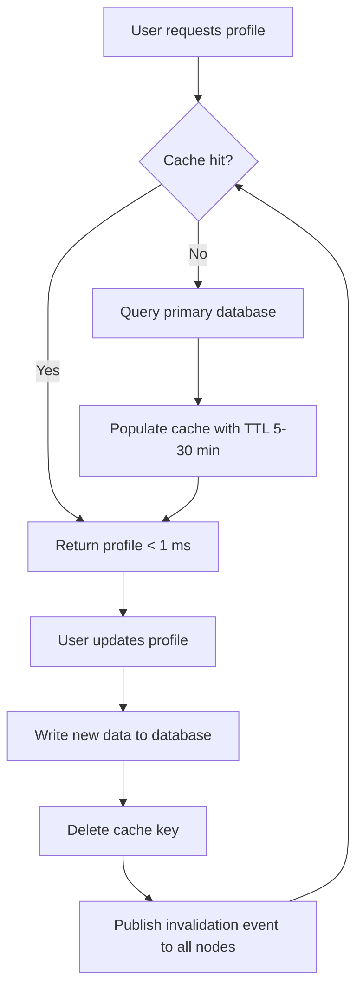

| Difficulty | Channel | Tags |
|---|---|---|
| beginner | backend | redis, memcached, cache-invalidation |

Every second, Facebook serves more than ten billion reads from a single distributed caching system [1]. That system—named TAO—powers user profiles, friend lists, and likes while sustaining a 96.4% read hit rate over petabytes of changing data. Facebook didn't stumble into that architecture by accident; it was forged in the fires of cache invalidation failures that most developers only meet after a 2 a.m. on-call page. This is the story of how the internet's largest profile service keeps its cache honest—and what that means for the profile service you are probably building right now.

---

> ### Real-World Case — Facebook
>
> Facebook serves its entire social graph — user profiles and the associations between them (friends, likes, comments) — from MySQL with Memcached as a lookaside cache, where every PHP web server runs its own cache-invalidation logic in client code. At Facebook's scale, that client-driven invalidation fragmented into a consistency liability, and cached edge lists were bloated: adding one friend invalidated an entire cached friend list of potentially millions of edges.
>
> | | |
> |---|---|
> | **Challenge** | Keep billions of cached profile objects and association lists consistent with MySQL writes across globally distributed regions, without the read/write amplification and per-client invalidation bugs of a plain key-value cache, while sustaining read-heavy traffic. |
> | **Solution** | Facebook built TAO, a graph-aware distributed cache that mediates all access to MySQL. Writes go through TAO leaders to MySQL, and the resulting changesets propagate to cache followers via the MySQL replication stream. Followers apply idempotent, version-numbered messages: 'invalidate' for objects (drop the key, repopulate on next read) and 'refill' for association lists (keep the cached prefix, re-fetch only the changed slice). This turns cache invalidation into a push-based, order-independent protocol instead of every client guessing when to delete keys. |
> | **Outcome** | TAO sustained a billion reads per second on a changing dataset of many petabytes with a 96.4% overall read hit rate and millions of writes per second (2013 paper); by 2021 the same system served over ten billion reads and tens of millions of writes per second. Writes in the same region took ~12ms, and read-after-write consistency held within a tier without any client coordination. |
> | **Lesson** | Cache invalidation logic belongs near the data, not scattered across every client — and a cache that understands the shape of your data can do things a generic key-value cache cannot. Before picking Redis vs Memcached, ask who owns invalidation and whether your data fits a flat key-value model; the moment updates touch derived structures (like profile relationship lists), TTL-based or client-managed invalidation is where consistency dies. |

---

## Hook — Picture this: the profile that wouldn't update

Picture this: your profile service just passed load testing. Latency looks great, the dashboard is green, and users are editing names, bios, and avatars without a second thought. Then a user files a bug: "I changed my display name an hour ago and it still shows the old one." You reproduce it, scratch your head, and eventually find the culprit—a cache key that was written once and never touched again.\n\nThis is the moment every developer meets cache invalidation face to face. The cache that made everything fast is now quietly serving stale, wrong data to real users. Deleting the key fixes it in seconds, but the deeper question is uncomfortable: how do you keep a cache honest when thousands of writes pour in across multiple servers? You might think, "just add a TTL and move on," and plenty of services do exactly that. But as you are about to see, the largest social network on earth learned that this problem has real teeth—and the scars to prove it.

## Problem — Speed has a hidden debt

Caching exists for one reason: the database is slow, and users are impatient. Reading a hot user profile from memory takes well under a millisecond; hitting a disk-backed database takes tens to hundreds of times longer, and under peak load that difference decides whether a page feels instant or sluggish. So you copy frequently accessed data into something fast—Memcached, Redis, or a managed cache service [3][4].\n\nBut caching introduces a debt that comes due the moment data changes. The database is the single source of truth; the cache is just a copy. Any copy can drift out of sync, and the instant it does, users see ghosts: old avatars, outdated friend lists, a name that refuses to die. Cache invalidation—the art of deciding when and how to kill those copies—is famously one of the two hard problems in computer science, right up there with naming things [2].\n\nHere is the trap most teams fall into: the naive fix is to overwrite the cache when data changes. Overwriting feels safe, but it means every server that holds a copy must learn about the update in the right order, or you end up with old writes clobbering new ones. Worse, an overwrite races with concurrent reads and can resurrect stale data. The problem is not about being fast—it is about being consistent under concurrency. And that is exactly where Facebook found itself stuck.

## Real-World Case — Facebook: when invalidation runs in client code

In 2013, Facebook revealed how it powered its entire social graph—profiles plus the edges between them (friends, likes, comments)—out of MySQL with Memcached acting as a lookaside cache [1]. Every PHP web server ran its own cache-invalidation logic directly in client code. At Facebook's scale, that client-driven invalidation fragmented into a consistency liability.\n\nThe numbers make the pain concrete. Cached edge lists were bloated: adding a single friend invalidated an entire cached friend list, which for popular users could span millions of edges [1]. The invalidation traffic itself became a bottleneck, and consistency guarantees depended on every client behaving correctly—a fragile bet across a fleet of thousands of servers.\n\nSo Facebook built TAO: a single logical cache layer that sits between the web tier and MySQL and owns invalidation for every profile and edge [1]. The results sound like a fairytale, but they are measured in numbers. TAO sustained a billion reads per second on a changing dataset of many petabytes, with a 96.4% overall read hit rate and millions of writes per second. Writes in the same region took roughly 12 ms, and read-after-write consistency held within a tier without any client coordination [1]. By 2021, the same architecture handled over ten billion reads and tens of millions of writes per second [1].\n\nThe lesson is radical: invalidation is not a client-side chore—it is a system-level responsibility. You can build the same principle into a much smaller service, and the technique that carries it is called write-through caching.

## Deep Dive — Write-through, TTLs, and the Redis vs Memcached showdown

Building on Facebook's lesson, let's zoom in on the two techniques that carry the weight: write-through caching and TTL-based expiration.\n\nWrite-through means every update goes to the database first, and the cache is then brought in line—usually by deleting the key rather than overwriting it. Deleting instead of overwriting is the plot twist most developers miss. An overwrite is an optimistic bet that the value you computed is fresh; a delete is a humble admission that you do not know. After a delete, the next read misses, fetches fresh data, and repopulates the cache atomically. That asymmetry is why the delete-on-write pattern is safer under concurrency—it eliminates the race between old writes and new reads [8].\n\nTTLs are the safety net underneath that pattern. A sensible expiration—5 to 30 minutes for user profiles is a defensible starting point—guarantees that even if an invalidation is lost, stale data eventually dies on its own [6][7]. Too-short TTLs hammer the database with cold misses; too-long ones serve stale data for hours. That trade-off is tuned with real traffic, not gut feeling.\n\nThis leads to the question every backend engineer eventually asks: Redis or Memcached? Both are in-memory caches, but they were built for different jobs, and the real trade-off is more nuanced than the marketing.\n\n| Consideration | Redis | Memcached |\n| --- | --- | --- |\n| Distributed invalidation | Built-in pub/sub: publish an event, every subscriber purges [5] | Manual: you coordinate across nodes yourself [5] |\n| Persistence | Optional snapshots / AOF; survives restarts | None; a cold restart means an empty cache [5] |\n| Data structures | Strings, hashes, lists, sets, sorted sets | Simple key-value strings only |\n| Memory overhead | Higher per entry | Lower, simpler allocation |\n| Horizontal scaling | Clustering with a bit more setup | Very simple sharding |\n| Best fit | Complex invalidation, durability, rich logic | Pure caching with minimal footprint |\n\nHere is the plot twist: "Memcached is faster" is only true for the narrowest case—simple lookups with no durability needs. For the profile service in this story, where you want distributed invalidation, structured user data, and survival through a restart, Redis is usually the better fit [5]. Many developers pick Memcached because it seems simpler, then hand-roll invalidation coordination across nodes and slowly realize they have rebuilt Redis's pub/sub by hand—minus the polish.

## Workflow — The four-stage invalidation journey

Here is how those pieces assemble into a workflow you can implement today. The journey has four stages, and the diagram below maps the entire trip from a single request to a fully consistent cluster.\n\n1. **Read:** check the cache first. Hit? Return instantly. Miss? Query the database, populate the cache with a TTL, and return.\n2. **Update:** write the new profile to the database first—the database is the source of truth.\n3. **Invalidate:** delete the cache key. Do not overwrite—delete.\n4. **Propagate:** publish an invalidation event so every other node holding a local copy purges it too. That is distributed invalidation in one line.\n\nThe feedback loop is where the magic lives: the delete makes the next read self-healing, the TTL caps the worst-case staleness, and the publish keeps every node honest without a shared lock or a coordination service.\n\n```mermaid\nflowchart TD\n    A[User requests profile] --> B{Cache hit?}\n    B -->|Yes| C[Return profile |No| D[Query primary database]\n    D --> E[Populate cache with TTL 5-30 min]\n    E --> C\n    C --> F[User updates profile]\n    F --> G[Write new data to database]\n    G --> H[Delete cache key]\n    H --> I[Publish invalidation event to all nodes]\n    I --> B\n```

## Code Example — A write-through profile cache in Python

A workflow is only convincing once it runs. Here is a minimal write-through profile cache in Python using redis-py. It implements every stage of the diagram: cache-aside reads, delete-on-update, TTLs, and pub/sub propagation. `db` stands in for your data layer—swap in your ORM or query builder.

## Lessons Learned — What to do differently tomorrow

After watching Facebook's journey and building this pattern yourself, three lessons stand out.\n\n**First, delete, don't overwrite.** Every stale-cache bug you will chase can be traced back to an overwrite that raced with a read. Deleting the key turns the next read into a fresh fetch, and you never have to guess who was right [2].\n\n**Second, invalidation is a system property, not a client chore.** Facebook paid the price for per-server invalidation logic in client code and rebuilt it as a single layer that owns the problem [1]. You do not need TAO's scale to borrow its discipline: centralize invalidation behind one function, one library, one team, and every node that joins the fleet inherits the correct behavior.\n\n**Third, TTLs are your conscience.** They are not a substitute for correct invalidation—they are the insurance policy for the day invalidation fails. And on that day, you will be grateful you set them.\n\n**Battle scars to avoid:**\n- Forgetting pub/sub on multi-node deployments, so a write on node A leaves node B serving a corpse of stale data.\n- Overwriting instead of deleting, then debugging an invisible race for hours.\n- Tuning TTLs by guesswork instead of monitoring cache hit rates and stale-read reports—track both, because hit rate alone lies when data goes stale.\n- Assuming Memcached is simpler until you are hand-writing coordination you could have had for free.\n\nThe memorable insight to share with your team: a cache is not a database you read faster—it is a copy that someone must remember to reap. Design for the reaping first, and the speed takes care of itself.

---

## Write-Through Invalidation Flow



<details>
<summary><strong>Original Interview Question</strong></summary>

**Q:** You're building a user profile service that caches frequently accessed profiles. How would you implement cache invalidation when a user updates their profile, and what trade-offs would you consider between Redis and Memcached?

**A:** Implement write-through caching with TTL-based expiration. On profile update, invalidate the cache by deleting the key and writing new data to both the database and cache. Redis offers pub/sub for automatic distributed invalidation, while Memcached requires manual coordination across nodes.

</details>

## Conclusion

The journey started with a user whose name refused to update and ended with a lesson Facebook spent billions of requests learning: a cache is a copy, and copies must be reaped. Start with cache-aside reads, add write-through updates with delete-on-write, wrap everything in a TTL, and propagate invalidations to every node. You do not need TAO's scale to borrow its discipline. Tomorrow, when you add a cache to any service, ask yourself one question: what happens when this copy goes stale? If the answer is "nothing—it self-heals," you have built it right.

---

## References

1. [Facebook incident report](https://www.usenix.org/system/files/conference/atc13/atc13-bronson.pdf) — paper
2. [Cache invalidation](https://en.wikipedia.org/wiki/Cache_invalidation) — documentation
3. [Memcached](https://en.wikipedia.org/wiki/Memcached) — documentation
4. [Redis](https://en.wikipedia.org/wiki/Redis) — documentation
5. [Redis vs. Memcached — AWS ElastiCache engine selection](https://docs.aws.amazon.com/AmazonElastiCache/latest/red-ug/SelectEngine.html) — documentation
6. [HTTP caching — MDN Web Docs](https://developer.mozilla.org/en-US/docs/Web/HTTP/Caching) — documentation
7. [HTTP Caching — RFC 7234](https://datatracker.ietf.org/doc/html/rfc7234) — documentation
8. [Web Caching Basics — DigitalOcean Community Tutorial](https://www.digitalocean.com/community/tutorials/web-caching-basics-terminology-http-headers-caching-strategies) — blog
9. [Cache (computing)](https://en.wikipedia.org/wiki/Cache_(computing)) — documentation

---

**Author:** Satishkumar Dhule — [GitHub](https://github.com/satishkumar-dhule) · [LinkedIn](https://linkedin.com/in/satishkumar-dhule) · [Website](https://satishkumar-dhule.github.io)
