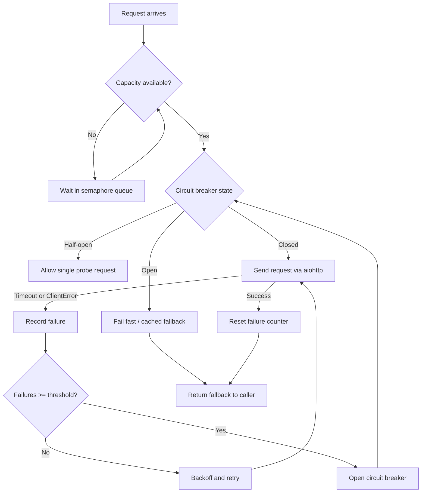

| Difficulty | Channel | Tags |
|---|---|---|
| advanced | backend | asyncio, aiohttp, concurrency |

In 2012, Netflix's API was processing more than one billion incoming calls a day, each one fanning out to roughly six internal services — and a single slow dependency could saturate every request thread in seconds, taking the entire API down with it [1]. That is exactly the scenario your async Python service faces the moment a downstream API starts choking. You can write the cleanest aiohttp code on the team, but without a connection pool that degrades gracefully, you are one slow endpoint away from a cascading outage. Here is how to build one — and what Netflix learned the hard way.

---

> ### Real-World Case — Netflix
>
> By 2012, Netflix's API processed over 1 billion incoming calls per day, fanning out to several billion outgoing calls (a 1:6 ratio) to dozens of internal subsystems, with peaks exceeding 100,000 dependency requests per second. The team discovered that a single slow or failing dependency could saturate all Tomcat request threads in seconds, taking the entire API down with cascading failures.
>
> | | |
> |---|---|
> | **Challenge** | Math showed that 30 dependencies each with 99.99% uptime still yields only 99.7% total availability = 2+ hours of downtime per month. Worse, one misconfigured HTTP client or a latent dependency (blocked threads/connections piling up) could rapidly saturate every available thread and trigger cascade failures across the whole API — the exact problem of connection pools with no graceful degradation. |
> | **Solution** | Netflix built Hystrix, which combined: per-dependency connection/thread isolation (bulkheading) using bounded thread pools and semaphores (via non-blocking tryAcquire) to cap concurrent access to each backend; aggressive network timeouts with retries (the forerunner of exponential backoff); circuit breakers that trip when a dependency's error rate exceeds ~50% in a rolling 10-second window, shedding load and failing fast; and fallbacks (custom, fail-silent, or fail-fast) so users get a degraded-but-functional experience instead of 500s while the backend recovers. |
> | **Outcome** | Hystrix reached tens of billions of thread-isolated and hundreds of billions of semaphore-isolated executions per day with a dramatic improvement in uptime and resilience. In a documented production incident, a database circuit hit an 80% error rate and 157 of 200 servers tripped their breakers — yet served cached fallbacks with minimal impact on member video views. Single-dependency failures became contained to isolated circuits instead of whole-API outages. |
> | **Lesson** | The counterintuitive insight: when a dependency starts failing, your instinct to "give it breathing room" by raising timeouts and enlarging pools is exactly backwards — at the extreme you DDOS yourself. Trip the breaker, shed load, and fail fast so the underlying system can actually recover. |

---

## Hook — When 100,000 Dependencies Hit You Per Second

The deploy looked fine. Tests passed. CI was green. And then the numbers hit: one billion incoming calls a day, a 1:6 fan-out ratio, and dependency traffic peaking past 100,000 requests per second [1]. That was Netflix's API in 2012 — the year its engineering team realized the entire system hinged on a dangerous assumption: that every one of those dozens of internal subsystems would always be fast and available. One slow dependency. One saturated thread pool. One outage to rule them all. This is the story of how they stopped that failure from spreading — and why the exact same playbook applies to the aiohttp service you are building right now.

## Problem — One Slow Dependency Is All It Takes

Here is the uncomfortable truth about async systems: asyncio lets you spawn thousands of concurrent tasks, but your downstream connections are not infinite. Every open connection to an external API ties up a socket, a memory buffer, and, on most Linux hosts, a file descriptor. Push past the ephemeral port range or the open-FD limit, and your service starts throwing connection errors at the worst possible moment. Moreover, async does not magically fix timeouts — a downstream service that accepts a TCP connection and then hangs can pin that connection open for minutes. Without explicit timeout configuration, aiohttp will happily wait far longer than any user is willing to. And here is the kicker: when the pool saturates, every new request queues up behind the dead ones. Response times balloon from 200 ms to 30 seconds, and before long your load balancer marks an unhealthy instance — exactly when your users need you most. Many developers discover this the hard way: a single slow database or an overloaded payment provider, and the entire request path collapses. For a service handling 1,000 requests per second, one saturated pool means thousands of failed requests and a very long incident post. Sound familiar?

## Real-World Case — Netflix

By 2012, the Netflix API was a fan-out machine: over one billion incoming calls per day expanding into several billion outgoing calls, spread across dozens of internal subsystems, with peaks surpassing 100,000 dependency requests per second [1]. The team's discovery was chilling. A single slow or failing dependency could saturate all of the API's Tomcat request threads within seconds, taking the entire system down through cascading failures. Not degraded. Down. Their answer was a library called Hystrix, built around the same three ideas this article covers: limiting concurrency, isolating failure, and tripping a circuit breaker when things go sideways. The results were dramatic. Hystrix grew to execute tens of billions of thread-isolated calls and hundreds of billions of semaphore-isolated calls per day [1]. The most telling number came from a documented production incident: a database circuit hit an 80% error rate, and 157 of 200 servers tripped their circuit breakers. And yet, because those breakers served cached fallbacks, member video views were barely affected [1]. Single-dependency failures went from taking down the whole API to being contained inside an isolated circuit. If a system at that scale leans on semaphores and circuit breakers, your aiohttp client can too. Here is what those ideas actually look like under the hood.

## Deep Dive — Semaphores, Backoff, and Breakers: The Resilience Trio

Building on the Netflix playbook, the resilience stack for aiohttp boils down to three interlocking mechanisms: concurrency limiting, retry with exponential backoff, and the circuit breaker. The semaphore is your concurrency governor — asyncio's Semaphore is the simplest tool for capping concurrent connections [3]. Think of it as a bouncer at a club: when the pool is full, new requests politely wait in line instead of barging in [4]. This protects both your own process and the downstream service from being overwhelmed. Next comes exponential backoff, which answers a deceptively hard question: how do you retry without making things worse? A naive retry loop can hammer an already-struggling service — the classic retry storm that amplifies outages. Exponential backoff spaces retries out with delays that grow geometrically (0.5s, 1s, 2s, 4s) and adds jitter so every client does not retry in lockstep [6]. Now for the plot twist: the circuit breaker. You might think the best way to handle a failing dependency is to retry harder. Actually, the opposite is true. After enough consecutive failures, the breaker flips from closed to open, and requests fail immediately without ever touching the network [2]. After a cooldown, it enters half-open, letting a single probe request through to test the waters. Success closes it; failure reopens it. Finally, timeouts are the unsung hero — none of this matters if you never define what failed means. aiohttp's ClientTimeout lets you cap connect, read, and total time [5], and asyncio provides timeout primitives so a hung response cannot hold the pool hostage [7]. There is a real trade-off worth internalizing: semaphore limiting protects your process and the downstream, but requests can pile up in the queue; exponential backoff prevents retry storms but adds latency to recovery; the circuit breaker protects your callers from cascades but needs tuning — trip it too eagerly and you turn a blip into a self-inflicted outage; timeouts keep your pool free of zombies, but set them too tight and slow-but-healthy networks look broken.

## Workflow — From Panic to Graceful Degradation

Now that you understand the mechanisms, here is the implementation path — the same journey Netflix took, scaled down to a single service. The diagram below maps the full request lifecycle: every request flows through the capacity check, the breaker state, and the retry loop before a fallback or an error ever reaches the caller. Step one: instrument first. Log or emit metrics for pool size, queue depth, and failure rates — you cannot tune what you cannot see. Step two: set explicit timeouts that match your SLOs, not the network's wishes. Step three: cap concurrency with a semaphore sized to your downstream's documented limits and your own file-descriptor budget. Step four: add retry with exponential backoff and jitter, capped at a sane attempt count. Step five: install the circuit breaker — open after N consecutive failures, cool down for a window, then probe with a half-open state. Step six: handle shutdown properly, closing the ClientSession and cancelling pending tasks — leaked sessions are a classic source of file-descriptor exhaustion. Step seven: practice failure. Chaos-test with a flaky mock downstream so your team knows what degraded-but-alive looks like before the real incident arrives. Each step builds on the last; skipping the semaphore makes the breaker pointless, and skipping timeouts turns the semaphore into a queue of zombies.

## Code Example — The ConnectionPoolManager, Production Edition

Putting it together, here is a production-minded version of the ConnectionPoolManager — with exponential backoff, jitter, a real circuit breaker, and clean lifecycle management. The original interview answer sketched the shape; this version fills in the details that actually survive contact with production.

## Lessons Learned — Battle Scars and What to Do Tomorrow

After the smoke clears, four lessons stand out. First, graceful degradation is a feature, not a fallback — Netflix measured the difference between a whole-API outage and a handful of isolated circuits, and the cached fallbacks kept members watching [1]. Second, connection leaks are the quiet killer: forgetting to close the session slowly drains file descriptors until the whole process breaks. Third, reuse a single ClientSession so TCP keepalive and socket pooling actually work — handshakes are expensive, and re-negotiating TLS on every request is a tax you should never pay [5]. Fourth, retry storms are a second failure waiting to happen — without jitter, all your instances retry in lockstep and turn a hiccup into an outage [6]. So here is what to do differently tomorrow: instrument your current client, add explicit timeouts, wrap it in a semaphore, and layer in a circuit breaker. Start with a per-endpoint failure budget and tune from there. The one insight worth repeating to your team: reliability is not about preventing failures — it is about making them cheap.

---

## Request Flow Through the Resilience Trio

<strong>Original Interview Question</strong>

**Q:** How would you implement a connection pool manager for aiohttp that handles graceful degradation under high load and connection timeouts?

**A:** Implement a connection pool manager for aiohttp using a semaphore to limit concurrent connections, exponential backoff for retrying failed requests, and circuit breaker pattern to gracefully degrade under high load and connection timeouts.

## Conclusion

The moral of Netflix's story is not that you need a billion-call API to care about resilience — it is that the failure modes scale down to every async service, including yours [1]. Your users will never thank you for the graceful degradation they never noticed; that is the point. Start small: add explicit timeouts, then a semaphore, then a circuit breaker, and rehearse failure with a flaky mock dependency. The next time a downstream system starts coughing, your pool will fail with a whisper instead of taking the whole API down with a scream. Share this article with your team — someone is probably debugging a timeout right now.

---

## References

1. [Netflix incident report](https://netflixtechblog.com/fault-tolerance-in-a-high-volume-distributed-system-91ab4faae74a) — article
2. [Circuit breaker design pattern](https://en.wikipedia.org/wiki/Circuit_breaker_design_pattern) — documentation
3. [Python asyncio — asynchronous I/O](https://docs.python.org/3/library/asyncio.html) — documentation
4. [Python asyncio synchronization primitives (Semaphore)](https://docs.python.org/3/library/asyncio-sync.html) — documentation
5. [aiohttp client quickstart](https://docs.aiohttp.org/en/stable/client_quickstart.html) — documentation
6. [Exponential backoff](https://en.wikipedia.org/wiki/Exponential_backoff) — documentation
7. [Python asyncio tasks and timeouts](https://docs.python.org/3/library/asyncio-task.html) — documentation
8. [aio-libs/aiohttp GitHub repository](https://github.com/aio-libs/aiohttp) — documentation

---

**Author:** Satishkumar Dhule — [GitHub](https://github.com/satishkumar-dhule) · [LinkedIn](https://linkedin.com/in/satishkumar-dhule) · [Website](https://satishkumar-dhule.github.io)
