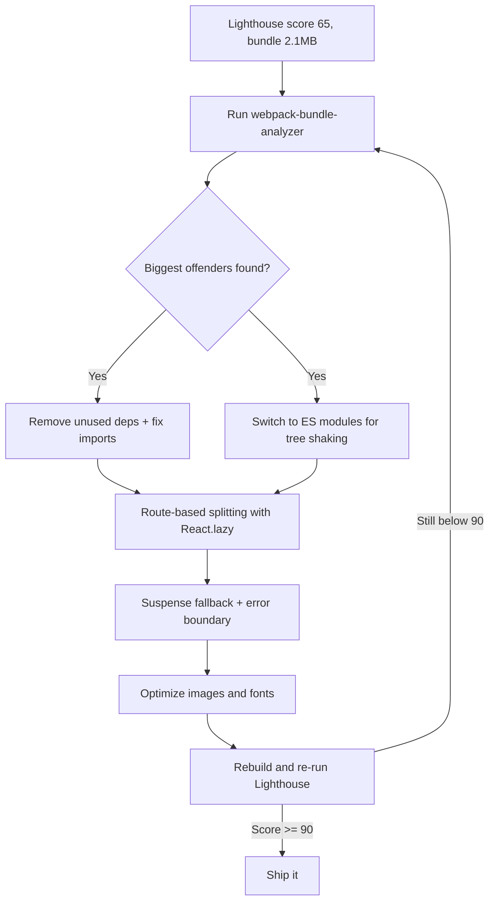

| Difficulty | Channel | Tags |
|---|---|---|
| intermediate | frontend | lighthouse, bundle, lazy-loading |

Netflix faced an uncomfortable truth: a single member-facing React page was shipping roughly 200KB of gzipped JavaScript on every initial load, and on low-end devices the time to interactivity felt glacial [1]. That pain point will resonate with any developer staring at a 2.1MB bundle, a 4.2s Time to Interactive, and a Lighthouse score stuck at 65. Netflix's engineers responded with the exact techniques this article covers — route-based code splitting, React.lazy, and Suspense — and dropped that initial-load payload from ~200KB to ~50KB, a roughly 75% reduction [1]. Here is the full story, the workflow, and the playbook you can apply to your own app this week.

---

> ### Real-World Case — Netflix
>
> A member-facing Netflix React page shipped a single ~200KB gzipped JavaScript bundle on every initial load, making Time to Interactive painfully slow — especially on mobile and low-end devices. Netflix engineers needed a systematic way to shrink what users had to download before the page became interactive.
>
> | | |
> |---|---|
> | **Challenge** | Cut a 200KB+ gzipped, single-bundle React app down to a fast initial payload, while avoiding the classic trap where naive lazy loading creates a waterfall of dozens of tiny chunk requests and actually makes navigation feel slower. |
> | **Solution** | They adopted React.lazy() with Suspense to code-split at both the route level (each page its own chunk) and the component level (heavy, less-used components and modals into dynamic import() chunks), analyzed the bundle to find what to split, kept critical first-paint UI eager, wrapped lazy boundaries in Suspense fallbacks plus error boundaries, and used webpack's prefetch so chunks the user was likely to need next loaded during idle time instead of on click. |
> | **Outcome** | The gzipped JavaScript required for the initial load dropped from roughly 200KB to about 50KB — a ~75% reduction — and the page became interactive significantly faster, without breaking navigation performance. |
> | **Lesson** | Lazy loading is not a silver bullet: it moves cost rather than eliminating it. The winning recipe was measure-first (bundle analysis), split at route/component boundaries, keep critical UI eager, and prefetch likely-next chunks — because splitting into too many tiny chunks backfires. |

---

## Hook — A Lighthouse Score of 65 Is Not a Mystery. It's a Diagnosis.

It is a Tuesday afternoon, and the Lighthouse report has just landed in your inbox. Score: 65. Bundle: 2.1MB. Time to Interactive: 4.2 seconds. The product manager has already penciled "make the app fast" into next sprint, which means the problem is now officially yours. Sound familiar? Before the panic sets in, consider this: this exact scenario played out at Netflix, one of the largest React deployments on the planet, and the fix turned out to be a repeatable engineering discipline rather than an act of heroics [1]. The stakes are real — every extra second of load time costs you users, conversions, and trust. The good news? You already own every tool you need. You just have to stop shipping the whole library to every user on every visit.

## Problem — Your Bundle Isn't a File. It's a Debt Collector.

A 2.1MB bundle does not become a 4.2-second Time to Interactive by accident. It is the slow accumulation of good intentions: a charting library pulled in for one dashboard, a date utility with seven formatting plugins, an icon set imported wholesale instead of tree-shaken. Every dependency enters the bundle as a promise, and none of them ever leave [7]. Here is the uncomfortable truth — download size is only the first act of the tragedy. After the bytes arrive, the browser must parse the JavaScript, compile it, and execute it before the page responds to a single click. On mid-range Android hardware, parsing and execution often cost more than the network transfer itself [8]. Consequently, lazy loading is not about making the network faster; it is about refusing to ship work the user does not need yet. You might think the answer is a bigger pipe or a faster CDN. It isn't. The answer is to stop sending the entire application when a single route only needs a page.

🎯 Key Point: bundle size is the upstream cause; Time to Interactive is the downstream symptom. Fix the first and the second follows.

## Real-World Case — Netflix

The story begins with a member-facing Netflix page rendered with React. Every initial visit pulled a single, monolithic JavaScript bundle of roughly 200KB gzipped [1]. On desktop broadband, that is survivable. On mobile and low-end devices, the time-to-interactive crawled, and users abandoned pages before they finished rendering. Netflix engineers needed a systematic approach — not a one-off hack — to shrink what users had to download before the page could respond [1]. Their answer combined React.lazy for per-component loading with Suspense for seamless fallbacks, layered on top of route-based splitting so only the JavaScript a specific view needed was ever fetched [1]. The results were dramatic: gzipped initial-load JavaScript dropped from roughly 200KB to about 50KB — a ~75% reduction — and the page became interactive significantly faster, all without breaking navigation performance [1]. Critically, this was not a rewrite. It was a re-architecture of how code was delivered. That distinction matters: the same transformation is available to your 2.1MB bundle today.

## Deep Dive — The Anatomy of a Fast Bundle

So what did Netflix actually change? The mental model goes like this: every module in your application either belongs on the critical path — the code required to render the first meaningful screen — or it does not. Code splitting is the act of drawing that line and enforcing it at the build level [5]. There are two main flavors, and they solve different problems. Route-based splitting loads a chunk per route, which shines when different views share little code. Component-based splitting carves out heavy widgets — charts, editors, PDF exporters — so they mount only when actually needed [2].

| Approach | Best for | Cost | Watch out for |
|---|---|---|---|
| Route-based splitting | Apps with distinct views (dashboard, analytics, settings) | One chunk request per navigation | Route boundaries can bloat the shared vendor bundle |
| Component-based splitting | Heavy widgets on otherwise light pages | Deferred parse cost only | A waterfall of tiny requests if over-split |

Here is the plot twist, though: splitting alone is not enough. If your codebase relies on default exports and barrel files, tree shaking quietly fails and unused code keeps riding along in every chunk [7]. Moreover, the bundler can only split what you explicitly mark as split — without React.lazy or a dynamic import() at the call site, webpack has no way to know which boundaries matter [6]. The second plot twist is that lazy loading has a cost too. Every lazy boundary introduces a network round trip, and too many boundaries create a waterfall of tiny requests that can actually hurt performance. The craft is in finding the boundaries that matter.

⚠️ Watch Out: split at the granularity of a feature, not a component. A lazy-loaded 2KB button costs you a round trip for zero gain.

## Workflow — From a 65 to a 90, Step by Step

Building on the deep dive, here is the workflow that turns a 65 into a 90+. It mirrors the journey Netflix took: measure, diagnose, split, verify [1]. The full picture is captured in the diagram below, which shows the optimization loop you'll run until the score lands where you want it.

The steps:

1. **Baseline.** Run Lighthouse with network and CPU throttling enabled, and record TTI plus total bundle weight. Use the same profile for every measurement, or you are comparing apples to oranges.
2. **Diagnose.** Run webpack-bundle-analyzer to reveal the largest chunks and their true composition [4]. You cannot fix what you cannot see — this is the step most teams skip.
3. **Triage.** Remove genuinely unused dependencies, migrate to ES modules, and replace barrel-file imports with direct module paths so tree shaking has a chance to work [7].
4. **Split.** Start with route-based splitting using React.lazy, since routes give you the largest, most natural boundaries. Add component-based splitting for heavy widgets afterward [2].
5. **Harden.** Wrap every Suspense boundary in an error boundary. A failed chunk without one is a white screen [3].
6. **Sweep the rest.** Lazy-load images and fonts; preload only critical resources.
7. **Re-measure.** Rebuild, re-run Lighthouse, and iterate until you clear the 90 bar. Treat the score as a health check, not a grade.

The beauty of this loop is that each pass is cheap once the tooling is in place. The first pass does the heavy lifting; subsequent passes are about keeping the bundle honest as the codebase grows.

## Code Example — React.lazy, Suspense, and the 15-Line Payload Cut

Now for the part you can copy into your codebase today. The example below shows route-based splitting with React.lazy, a Suspense fallback with a proper loading state, and an interaction-triggered dynamic import for a non-critical feature — the same pattern Netflix used to keep navigation snappy [1]. See the full code block below, then read the walkthrough.

```javascript
// 1. Route-based splitting: each route downloads its own chunk on first visit
const Dashboard = React.lazy(() => import('./Dashboard'))
const Analytics = React.lazy(() => import('./Analytics'))

// 2. Component-based splitting for heavy widgets not needed at first paint
const HeavyChart = React.lazy(() => import('./HeavyChart'))
const ExportButton = React.lazy(() => import('./ExportButton'))

// 3. Skeleton fallback shown while the chunk streams in
function PageFallback() {
  return <div className="skeleton" aria-busy="true" aria-label="Loading page" />
}

function App() {
  return (
    <Suspense fallback={<PageFallback />}>
      <Routes>
        <Route path="/dashboard" element={<Dashboard />} />
        <Route path="/analytics" element={<Analytics />} />
      </Routes>
    </Suspense>
  )
}

// 4. Interaction-triggered dynamic import: downloads only when the user clicks
function onExport() {
  import('./report').then(({ generateReport }) => generateReport())
}
```

The first block converts two routes into lazily-loaded chunks; their code stops being part of the initial bundle and only downloads when a user actually navigates there [2]. The second block does the same for heavyweight widgets, which is exactly where large charting libraries hide. The Suspense boundary is your safety net: while a chunk streams in, the skeleton renders, and the page stays responsive instead of freezing. Finally, the dynamic import in `onExport` demonstrates the nuclear option — deferring an entire module until a real user action triggers it [6]. This is the difference between shipping a feature and shipping the potential of a feature.

## Lessons Learned — What Netflix Taught the Rest of Us

So where does that leave you? Several lessons stand out, and most of them are learned the hard way. First, you might think lazy loading everything is strictly better, but actually splitting at meaningful feature boundaries beats splitting everywhere — every boundary is a round trip, and waterfalls are silent killers [10]. Second, measure with a fixed throttle profile every single time; otherwise your "improvements" are just noise. Third, an error boundary around every Suspense boundary is non-negotiable — a failed chunk without one is a white screen [3]. Fourth, and most important, bundle size is a number you must defend continuously. Add a size budget to CI and make the build fail when a PR tries to sneak 500KB of chart library back into the critical path.

If this feels overwhelming, you are not alone — the difference between a 65 and a 90 is rarely talent; it is process. Netflix achieved its 75% payload reduction not through a rewrite, but through a repeatable workflow of measuring, splitting, and re-measuring [1]. You now have that same workflow, the diagram, and the code. The only missing ingredient is the first run of webpack-bundle-analyzer on your own codebase.

## Final Thoughts — The 75% Bundle Heist

Netflix did not get faster by accident. It got faster by refusing to ship code its users had not asked for yet — and the tools that made that possible were already sitting in its build pipeline. Your situation is no different. Tomorrow morning, your first move should be a measurement, not a rewrite: run Lighthouse, run webpack-bundle-analyzer, and find the single largest chunk. Cut that one. Then repeat. A 75% reduction in initial-load JavaScript is not reserved for companies with dedicated performance teams — it is reserved for anyone willing to split, measure, and split again. That is the whole story: the bundle is the enemy, and React.lazy is the knife.

---

## Bundle Optimization Workflow



<details>
<summary><strong>Original Interview Question</strong></summary>

**Q:** You're tasked with improving a React app's Lighthouse performance score from 65 to 90+. The bundle size is 2.1MB and Time to Interactive is 4.2s. What specific steps would you take to optimize the bundle and implement lazy loading?

**A:** Implement code splitting with React.lazy() and Suspense, analyze bundle composition with webpack-bundle-analyzer to identify largest chunks, remove unused dependencies and optimize imports, add dynamic imports for heavy components and third-party libraries, implement route-based splitting for better initial load times, and utilize tree shaking with proper ES module configuration.

</details>

## Conclusion

Netflix did not get faster by accident. It got faster by refusing to ship code its users had not asked for yet — and the tools that made that possible were already sitting in its build pipeline. Your situation is no different. Tomorrow morning, your first move should be a measurement, not a rewrite: run Lighthouse, run webpack-bundle-analyzer, and find the single largest chunk. Cut that one. Then repeat. A 75% reduction in initial-load JavaScript is not reserved for companies with dedicated performance teams — it is reserved for anyone willing to split, measure, and split again. That is the whole story: the bundle is the enemy, and React.lazy is the knife.

---

## References

1. [Netflix incident report](https://netflixtechblog.com/improving-performance-with-react-lazy-and-suspense-48d8465ff62b) — blog
2. [React.lazy API reference](https://react.dev/reference/react/lazy) — documentation
3. [React Suspense API reference](https://react.dev/reference/react/Suspense) — documentation
4. [webpack-bundle-analyzer](https://github.com/webpack-contrib/webpack-bundle-analyzer) — documentation
5. [Webpack code splitting guide](https://webpack.js.org/guides/code-splitting/) — documentation
6. [MDN: dynamic import()](https://developer.mozilla.org/en-US/docs/Web/JavaScript/Reference/Operators/import) — documentation
7. [MDN: tree shaking glossary](https://developer.mozilla.org/en-US/docs/Glossary/Tree_shaking) — documentation
8. [Lighthouse: Time to Interactive](https://developer.chrome.com/docs/lighthouse/performance/interactive) — documentation
9. [Core Web Vitals](https://web.dev/vitals/) — documentation
10. [Code splitting with lazy loading](https://web.dev/articles/code-splitting-with-lazy-loading) — documentation

---

**Author:** Satishkumar Dhule — [GitHub](https://github.com/satishkumar-dhule) · [LinkedIn](https://linkedin.com/in/satishkumar-dhule) · [Website](https://satishkumar-dhule.github.io)
