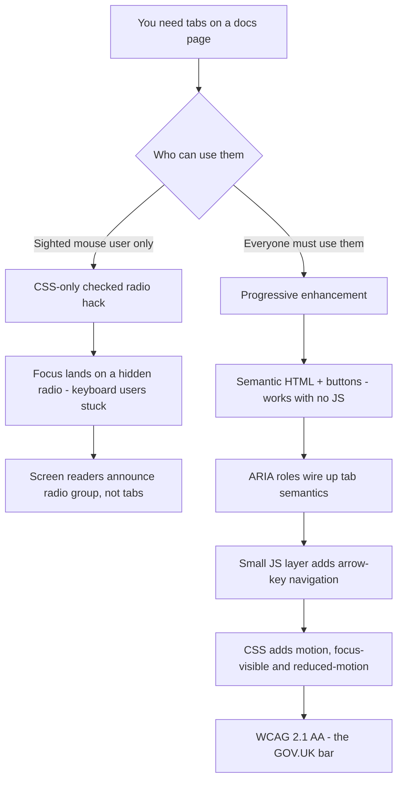

| Difficulty | Channel | Tags |
|---|---|---|
| beginner | frontend | css, flexbox, grid, animations |

The accordion looked fine. But for millions of UK citizens who rely on screen readers to pay taxes, renew passports, and claim benefits, the interaction was a dead end — the 'clever' no-JavaScript tricks were quietly destroying keyboard focus and screen-reader semantics [1]. When GOV.UK's Design System team rebuilt that accordion to meet WCAG 2.1 AA, the fix rippled across thousands of government digital teams [1]. By the end of this story, you'll understand why the CSS-only tab panel in that interview answer is a trap — and exactly how to build the version that works for everyone.

---

> ### Real-World Case — GOV.UK / UK Government Digital Service (GDS)
>
> GOV.UK is one of the world's most-used public digital services, and every UK government service must legally meet WCAG 2.1 AA while remaining usable for citizens on old browsers, assistive tech, and devices where JavaScript fails or is disabled. When GDS rebuilt its Design System's interactive components (tabs and accordions), the team discovered that the textbook 'JS-free' tricks — hidden radio/checkbox inputs driven by `:checked` — destroy keyboard focus, arrow-key navigation, and screen-reader semantics, which is the exact opposite of what their accessibility mandate requires.
>
> | | |
> |---|---|
> | **Challenge** | Build tabs/accordions for a design-system docs page and production services that must (1) meet WCAG 2.1 AA, (2) work with keyboard, screen readers, forced-colors, and 300% zoom, AND (3) still complete the user's task with zero JavaScript — while the canonical CSS-only approach (hidden radio inputs + `:checked` sibling selectors) silently breaks all keyboard and assistive-tech interaction. |
> | **Solution** | GDS takes an HTML-first progressive-enhancement approach instead of the radio-input hack: every component ships a fully functional no-JS baseline (for tabs, all panels render in order with a linked table of contents; for accordions, section labels become real buttons), and JavaScript is layered on only as an enhancement. In the 2021 accordion rebuild they consolidated three inconsistent accordion variants, converted headings into accessible buttons, fixed Firefox forced-colors/high-contrast rendering, and switched icon sizing to relative `em` units for zoom. The Service Manual now mandates progressive enhancement for all government services: 'build it so it works with HTML first'. |
> | **Outcome** | The redesigned accordion met WCAG 2.1 AA and was deployed across the GOV.UK publishing platform and the cross-government GOV.UK Design System, replacing three conflicting styles used by thousands of digital teams. Because the no-JS baseline guarantees content is never lost, every user can complete their task even while JS downloads or fails — a robustness property the CSS-only radio/checkbox hack cannot provide. |
> | **Lesson** | As GDS puts it, 'all your users are non-JS while they're downloading your JS.' The pure-CSS radio-input tab pattern this topic teaches gives you zero-JS interactivity on paper, but when you hide the inputs, you break keyboard focus, arrow-key nav, and screen-reader announcements — precisely the accessibility the question's focus-visible and reduced-motion requirements are checking for. Real production design systems (gov.uk is the benchmark) choose an HTML-first baseline with JS enhancement instead, because 'works without JS' must mean 'works', not 'visibly broken for keyboard users'. |

---

## Hook — The trick that looks like magic

Here's the scenario: a design-system docs page needs tabs, and the constraint sounds seductive — 'no JavaScript, just CSS.' Many developers reach for the radio-input trick without a second thought. You hide the inputs, wire up labels, sprinkle a `:checked` selector, and suddenly tabs switch with zero JavaScript. It feels clever. It feels lightweight. Your Lighthouse score even thanks you. But here's the thing nobody tells you in the interview answer: the moment a keyboard user presses Tab, the browser focuses a hidden radio input floating off-screen. Focus is now nowhere. Arrow keys don't move between tabs — they change which radio is selected, because a radio is a radio, not a tab. And a screen reader announces 'radio group, 3 items' instead of 'tablist, 3 tabs.' The interaction you're proudest of just became the interaction your most vulnerable users can't complete. Sound familiar? It's the plot twist of this story — and it's exactly what the GOV.UK Design System team discovered the hard way [1].

## Problem — When 'no JavaScript' becomes 'no accessibility'

The pain point is sharper than it looks. Tabs aren't a visual convenience — they're a navigation pattern with defined semantics, and those semantics live in the browser's accessibility tree, not in the pixels [2]. A CSS-only radio hack can look like tabs, but it doesn't behave like tabs: it hijacks the radio's semantics instead of replacing them. Consequently, three things break at once. First, keyboard focus: the real interactive element is a hidden input, so the visible label never receives focus — which defeats the visible focus indicator users depend on. Second, keyboard behavior: arrow keys are reserved for changing radio selection, and pure CSS has no way to re-purpose them. Third, screen-reader announcements: assistive technology announces 'radio button, checked' with no concept of a tab panel relationship, and panels hidden with `display: none` can silently vanish from the accessibility tree [8]. The stakes? If you work on any public-sector, healthcare, finance, or education product, WCAG 2.1 AA isn't a nice-to-have — in many jurisdictions, it's the law [9]. Meanwhile, the interview answer offers `:focus-visible` outlines and `prefers-reduced-motion` as if that solves everything [4][5]. Those help. They don't fix the core problem. The core problem is that the wrong element is the interactive element.

## Real-World Case — GOV.UK's accordion rebuild

That's the exact gap GOV.UK's Government Digital Service (GDS) walked into. Every UK government service must legally meet WCAG 2.1 AA while remaining usable for citizens on old browsers, assistive technology, and devices where JavaScript fails or is disabled [1]. When GDS rebuilt the Design System's interactive components — the tabs and accordions — the team discovered that the textbook 'JS-free' tricks, hidden radio and checkbox inputs driven by `:checked`, destroy keyboard focus, arrow-key navigation, and screen-reader semantics [1]. That's precisely the opposite of what the accessibility mandate requires. The impact was enormous: the redesigned accordion met WCAG 2.1 AA and was deployed across the GOV.UK publishing platform and the cross-government GOV.UK Design System, replacing three conflicting styles used by thousands of digital teams [1]. Just as importantly, the no-JavaScript baseline guarantees content is never lost — every user can complete their task even while JavaScript downloads or fails, a robustness property the CSS-only hack simply cannot provide [1]. Here's the plot twist: those teams weren't careless. They were following the same advice that interview answer hands out. Cleverness that trades accessibility for a few kilobytes is a poor trade — and the UK government has the receipts to prove it.

## Deep Dive — Anatomy of a CSS-only tab (and where it breaks)

Building on the case study, break the pattern down so you can see the trap with your own eyes. The radio hack works like this: a set of radio inputs share a `name` attribute, each followed by a `` and a panel. The `:checked` pseudo-class matches the selected input, and an adjacent-sibling combinator hides or shows the matching panel [3]. For a purely visual, mouse-driven widget, it genuinely works. But the moment you add a keyboard user, the foundation cracks — and no amount of `:focus-visible` polish patches it [4]. Here's the honest comparison, because it shapes every decision you'll make today:

| Dimension | CSS-only radio hack | ARIA tabs (progressive enhancement) |
| --- | --- | --- |
| Keyboard focus | Lands on a hidden radio, focus lost | Roving tabindex keeps focus on the active tab |
| Arrow keys | Change radio selection | Move between tabs with Left/Right, Home/End |
| Screen reader | Announces 'radio group' | Announces 'tablist', 'tab 1 of 3' |
| No-JS behavior | Panels stay hidden until you can interact | Content stays reachable, sequential flow |
| WCAG 2.1 AA | Fails keyboard and semantics | Passes when built per the APG [2] |
| JavaScript needed | No — that's the point | Yes, but only as enhancement |

🔥 Hot Take: the `:checked` technique isn't bad practice — it's good practice applied to the wrong element. It shines for styling selected states on radio cards in forms, toggle switches, and simple reveals where the semantics actually match [3]. The moment you're building a navigation component, though, you're using the wrong tool. That distinction — matching your CSS tricks to the semantics of the element — is the difference between a docs page that works and a docs page that excludes people. Meanwhile, the rest of the interview answer holds up beautifully: `aspect-ratio: 16/9` gives you a fixed image container that resists layout shift [6], CSS Grid's `repeat(2, 1fr)` delivers the desktop 2×2 with a single-column collapse on mobile [7], and `prefers-reduced-motion` respects users who genuinely get nauseated by animation [5]. Use all of it. Just pair it with the right interactive foundation — and brace yourself, because next comes the step-by-step build.

## Workflow — From 'cool hack' to 'works for everyone' in six steps

The diagram below shows the decision flow you'll walk through — from the moment you're handed 'tabs, no JavaScript' to the moment you ship something that clears the WCAG 2.1 AA bar GOV.UK set for itself [1][9]. Follow it left to right and notice the fork in the road: the cheap path down the `:checked` hack and the resilient path through progressive enhancement.

[Diagram: Accessible Tabs Decision Flow]

The resilient path has six steps, and each one builds on the last:
1. **Semantics first.** Build the panel as plain HTML — headings and buttons, no roles yet. With zero CSS and zero JavaScript, a screen reader already navigates it and a keyboard user already operates it. That's your no-JS baseline [2].
2. **Wire the ARIA.** Add `role="tablist"`, `role="tab"`, and `role="tabpanel"`, plus `aria-controls` to link each tab to its panel, and `aria-selected` to track the active one [8].
3. **Add keyboard behavior.** This is the part CSS can't do: a few lines of JavaScript implement Left/Right arrow navigation with a roving `tabindex`, so focus never escapes the tablist [2].
4. **Shape the layout.** CSS Grid renders the 2×2 desktop grid and collapses to a single column on mobile; `aspect-ratio: 16/9` locks the image containers so nothing jumps around [6][7].
5. **Animate with consent.** Wrap the staggered entrance in `prefers-reduced-motion: no-preference`, so people with motion sensitivity get a calm, instant state instead of a flashy one [5].
6. **Test the hard way.** Try the component with keyboard only, with a screen reader, and with JavaScript disabled. If the content is still reachable in all three, you've cleared the bar that GDS set for itself [1].

💡 Insight: notice the ordering. Semantics come before styling, and motion comes last — because a pretty but broken widget is worse than a plain one that works.

## Code Example — Tabs that pass the GOV.UK bar

With the workflow fresh in mind, here's the enhancement layer that turns plain buttons into a real tablist. The markup stays honest: each tab is a `` whose `aria-controls` points at its panel's id, and every panel is visible before any script runs — content is never lost [2]. The script below adds only the two things HTML and CSS cannot: arrow-key navigation and synchronized `aria-selected` state. Watch how small it is; accessibility here isn't about writing more code, it's about writing the right code.

## Lessons Learned — Three battle scars from the CSS-only trenches

So what do you take away from a story that starts with a radio hack and ends with a national accessibility mandate? Three battle scars, earned the hard way. First, match the trick to the semantics. The `:checked` pattern is a fantastic form-styling tool and a terrible navigation component [3]. The moment you're modeling a tablist, use `role="tablist"` — and the moment you're not, don't fake it. Second, the no-JS baseline is a feature, not a limitation. GDS shipped a component where content is reachable before, during, and after JavaScript loads — and that resilience is why thousands of digital teams could adopt it [1]. Third, motion is a preference, not a decoration. Wrapping your stagger animation in `prefers-reduced-motion: no-preference` isn't an afterthought; it's the difference between delighting someone and genuinely making them ill [5]. ⚠️ Watch Out for the 'it works in my browser' trap: the CSS-only tab works perfectly for you — with a mouse, on a fast connection, with JavaScript just fine. That's exactly the profile that hides the damage. Here's the memorable line to share with your team: 'If your clever hack removes semantics from the page, it's not clever — it's a liability.' The accessible version isn't more code for the same result. It's the same amount of code, pointed at the right element. So tomorrow, before you commit that radio-input tab panel, ask the question GDS asks every day: what happens when JavaScript is off, focus is invisible, and a screen reader is listening? If your answer is 'it still works,' ship it. If your answer is a shrug, go back to the diagram and start over.

---

## Accessible Tabs Decision Flow

<strong>Original Interview Question</strong>

**Q:** Build a CSS-only tab panel for a design-system docs page. Use radio inputs to switch tabs (no JavaScript). Desktop: a 2x2 grid of cards under each tab; mobile: single column. Each card has a fixed 16:9 image area, a title, and a short meta line. Add a subtle entrance animation with a stagger and keep focus-visible outlines; ensure prefers-reduced-motion is respected?

**A:** Use a set of radio inputs with a shared `name` attribute and corresponding `` elements for each tab section. The `:checked` state of each radio controls visibility of its associated panel via adjacent sibling selectors. Each panel renders a 2×2 card grid on desktop and collapses to a single column on mobile. Cards use `aspect-ratio: 16/9` for fixed image containers, with a title and meta line below.

## Conclusion

The CSS-only tab panel in the interview answer isn't wrong — it's incomplete. The visible part — grids, `aspect-ratio` image frames, staggered entrances, `focus-visible` outlines — is genuinely good practice you should keep. The hidden part — a radio masquerading as a tab — is the part that fails real people, which is exactly the failure GOV.UK's Design System team set out to fix [1]. So build the panels with real semantics, let a few lines of JavaScript handle the keyboard, and treat the no-JS state as your first-class citizen. That's the journey from clever hack to component that works for everyone — and it's a journey worth taking, because someone's tax return might depend on it.

---

## References

1. [GOV.UK / UK Government Digital Service (GDS) incident report](https://insidegovuk.blog.gov.uk/2021/10/29/how-we-made-the-gov-uk-accordion-component-more-accessible/) — article
2. [WAI-ARIA Authoring Practices Guide: Tabs Pattern](https://www.w3.org/WAI/ARIA/apg/patterns/tabs/) — documentation
3. [MDN Web Docs: The :checked CSS pseudo-class](https://developer.mozilla.org/en-US/docs/Web/CSS/:checked) — documentation
4. [MDN Web Docs: The :focus-visible CSS pseudo-class](https://developer.mozilla.org/en-US/docs/Web/CSS/:focus-visible) — documentation
5. [MDN Web Docs: prefers-reduced-motion](https://developer.mozilla.org/en-US/docs/Web/CSS/@media/prefers-reduced-motion) — documentation
6. [MDN Web Docs: aspect-ratio](https://developer.mozilla.org/en-US/docs/Web/CSS/aspect-ratio) — documentation
7. [MDN Web Docs: CSS Grid Layout](https://developer.mozilla.org/en-US/docs/Web/CSS/CSS_grid_layout) — documentation
8. [MDN Web Docs: tabpanel ARIA role](https://developer.mozilla.org/en-US/docs/Web/Accessibility/ARIA/Roles/tabpanel_role) — documentation
9. [WebAIM: WCAG 2 Checklist](https://webaim.org/standards/wcag/checklist) — documentation

---

**Author:** Satishkumar Dhule — [GitHub](https://github.com/satishkumar-dhule) · [LinkedIn](https://linkedin.com/in/satishkumar-dhule) · [Website](https://satishkumar-dhule.github.io)
