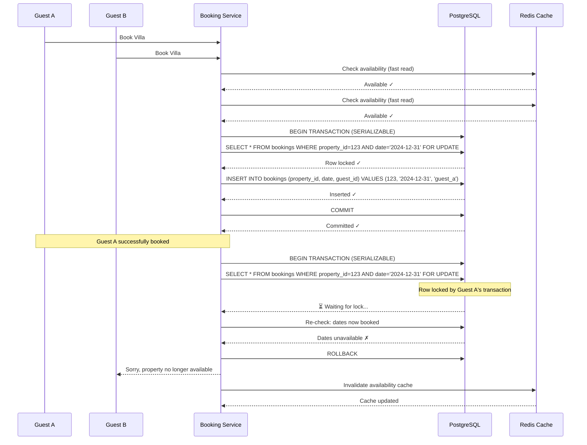

| Difficulty | Channel | Tags |
|---|---|---|
| intermediate | database | acid, isolation-levels, mvcc |

It was the kind of problem that keeps platform engineers up at night. As Airbnb migrated from a Rails monolith to a service-oriented architecture, every single payment became a distributed transaction. Network failures, timeouts, and eager client retries created the terrifying possibility of double-charging guests — a catastrophic failure for a system processing billions in payments [1]. The stakes were existential: lose trust on payments, and the entire marketplace collapses. What Airbnb built to solve this — a framework called Orpheus — didn't just fix their payments. It achieved five nines of consistency while payment volume doubled. The patterns they discovered apply directly to any system where concurrent operations threaten data integrity, from booking systems to ticket sales to inventory management.

---

> ### Real-World Case — Airbnb
>
> As Airbnb migrated from a Rails monolith to service-oriented architecture, every payment became a distributed transaction. Network failures, timeouts, and client retries created the risk of double-charging guests — a catastrophic failure in a payments system handling billions in transactions.
>
> | | |
> |---|---|
> | **Challenge** | In a distributed payments system, when a client sends a payment request that succeeds downstream but the response is lost (network timeout, server crash), the client correctly retries. The server must ensure this retry never charges the guest twice, even across multiple microservices, database replicas, and failure modes. |
> | **Solution** | Airbnb built 'Orpheus', a general-purpose idempotency library embedded in every payments service. Each API request is split into three phases: Pre-RPC (record intent in database), RPC (call external processor), and Post-RPC (record result). Every request carries a unique idempotency key. A database row-level lock on the key acts as a lease, preventing concurrent processing of the same request. Critically, all idempotency reads/writes go exclusively to the master database — never replicas — because replica lag would cause a retry to see no recorded response and re-execute the payment. Errors are classified as retryable (5XX) or non-retryable (4XX), and the framework is implemented as a library (not a service) for low latency. |
> | **Outcome** | Since launching Orpheus, Airbnb Payments achieved five nines (99.999%) of payment consistency while annual payment volume simultaneously doubled. The framework eliminated double payments across their distributed microservice architecture. |
> | **Lesson** | The counterintuitive insight: idempotency tables must live on the master database, not read replicas. A few seconds of replica lag turns a correct idempotent retry into a double charge — the retry reads a lagged replica, finds no recorded response, concludes the payment never happened, and executes it again. The trade-off of reading from master (higher latency) is non-negotiable for money movements. Additionally, classifying errors as retryable vs non-retryable is load-bearing: misclassifying in either direction is expensive (perpetual failure or double payments). |

---

## Hook — When Two Guests Book the Same Room at the Same Millisecond

Picture this: it is New Year's Eve. Two guests on opposite sides of the world tap "Book Now" on the same beachfront villa in Bali — within 200 milliseconds of each other. Your database receives both requests. Both transactions read the property as available. Both attempt to write a reservation. If you are lucky, one fails with a foreign key violation. If you are not lucky, both succeed, and now you have two confirmed guests arriving at the same property on the same dates. This is the double-booking problem, and it is deceptively harder than it sounds. It is not just a database issue. It is a concurrency issue, a distributed systems issue, and ultimately, a trust issue. Every booking platform — Airbnb, Booking.com, Vrbo, Eventbrite — has stared down this exact threat. The question is not whether it will happen. The question is whether your transaction handling is designed to survive it.

## Problem — The Race Condition Hiding in Plain Sight

At first glance, preventing double bookings seems straightforward: check if the dates are available, then book them. But here is the catch — the check and the write are two separate operations. Between the moment a transaction reads availability and the moment it writes the reservation, another transaction can slip in and do the same thing. This is a classic TOCTOU (Time-of-Check to Time-of-Use) race condition [2]. In a single-server monolith, you might get away with application-level mutexes or database-level locks. But modern platforms are distributed. Your booking service talks to a payment service, which talks to a notification service, which talks to a calendar service. Each hop is a network call that can fail, timeout, or retry. And every retry compounds the risk. The core tension is this: you need strong consistency to prevent double bookings, but you also need high availability to serve millions of concurrent users. CAP theorem tells you that you cannot have both perfectly [3]. So the real engineering challenge becomes: how do you get close enough to perfect consistency without destroying performance?

## Real-World Case — Airbnb's Orpheus Framework

Airbnb's migration from their monolithic Ruby on Rails application to a service-oriented architecture made this problem painfully real. Every payment in the new system was a distributed transaction spanning multiple microservices. When a network failure occurred mid-transaction, or a client retried a request after a timeout, the system risked double-charging guests [1]. The impact was not theoretical. With billions of dollars flowing through the payments system annually, even a tiny failure rate meant real customers being charged twice for the same reservation. Airbnb's engineering team built a framework called Orpheus — named after the mythological hero who could orchestrate all living things — to solve this. The key insight was treating every API request as a three-phase operation: Pre-RPC (recording intent in the database), RPC (calling external services), and Post-RPC (recording the result) [1]. By wrapping each phase in a single database transaction and using idempotency keys with row-level locks, Orpheus eliminated the window where double charges could occur. Since launching Orpheus, Airbnb Payments achieved 99.999% consistency while annual payment volume simultaneously doubled [1]. The framework's approach — separating network calls from database work, classifying errors as retryable or non-retryable, and using write repair for eventual consistency — became the blueprint for their entire payments architecture.

## Deep Dive — SERIALIZABLE Isolation, Optimistic Locking, and MVCC

So how do you actually prevent double bookings at the database level? There are three key concepts that work together: SERIALIZABLE isolation, optimistic concurrency control, and MVCC (Multi-Version Concurrency Control). Let us break each one down. **SERIALIZABLE Isolation** is the strictest isolation level defined by the SQL standard [4]. It guarantees that the result of any concurrent execution of transactions is equivalent to some serial execution. In plain English: if two transactions conflict, one will be rolled back rather than allowing an inconsistent result. PostgreSQL implements this using predicate locking, which detects dangerous read/write patterns and aborts one transaction to break the cycle [4]. The tradeoff is clear: stronger consistency guarantees come with higher contention and more transaction retries. **Optimistic Locking** takes a different approach. Instead of locking rows upfront, it lets transactions proceed in parallel and checks at commit time whether a conflict occurred. The pattern uses a version column: when you read a row, you note its version. When you write, you include a WHERE clause that checks the version has not changed. If another transaction modified the row in between, the UPDATE affects zero rows, and you know you have a conflict [5]. This is ideal for read-heavy workloads where conflicts are rare — you avoid the overhead of locks almost entirely. **MVCC** is the engine underneath both approaches. PostgreSQL uses MVCC to maintain multiple versions of each row, allowing readers to see a consistent snapshot without blocking writers [6]. When you use SERIALIZABLE isolation, MVCC snapshots become the foundation: each transaction sees the database as it existed at the start of the transaction, and the system detects if concurrent writes would have changed what you read [4]. The combination is powerful: use MVCC for fast, non-blocking reads of availability; use optimistic locking for lightweight conflict detection on writes; and escalate to SERIALIZABLE for the critical booking transaction where consistency is non-negotiable.

## Workflow — The Anatomy of a Double-Booking-Proof Reservation

Here is the step-by-step flow that prevents double bookings while maintaining high availability. Each step builds on the previous, and failure at any point is handled gracefully:

1. **Check Availability (Snapshot Read)**: Your application queries the property availability table using a standard SELECT. Thanks to MVCC, this read is non-blocking and sees a consistent snapshot of committed data [6]. No locks are held.

2. **Application-Level Validation**: Before touching the database for the write, your application logic validates the booking rules — minimum stay, maximum guests, pricing. This catches obvious conflicts early without consuming database resources.

3. **Begin Serializable Transaction**: Open a new transaction with SET TRANSACTION ISOLATION LEVEL SERIALIZABLE. This is where the guarantees kick in [4].

4. **Acquire Row Lock**: Use SELECT FOR UPDATE on the specific property and date range. This acquires an exclusive lock on those rows, blocking any other transaction that tries to book the same dates [7].

5. **Re-check Availability**: Within the locked transaction, verify the dates are still available. The row lock guarantees no one else can modify these rows until your transaction commits or rolls back.

6. **Insert Reservation**: Write the booking record. If the SERIALIZABLE isolation detects a serialization anomaly, the transaction will be rolled back with error code 40001 [4].

7. **Commit or Retry**: If the commit succeeds, release the locks. If it fails due to serialization, implement retry logic with exponential backoff — start with 100ms, double each retry, cap at 5 seconds [1].

The following diagram illustrates this flow visually:

## Code Example — PostgreSQL Booking with Optimistic Locking and Retry Logic

Here is a production-style implementation in Python using psycopg2. This code demonstrates the complete pattern: optimistic version checking, row-level locking within a SERIALIZABLE transaction, and exponential backoff retry logic.

## Lessons Learned — Hard-Won Wisdom from the Trenches

After building and debugging these systems, here are the patterns that consistently work and the traps that catch even experienced teams:

**What works:**
- **Separate reads from writes**: Use plain SELECTs for availability checks (fast, non-blocking via MVCC) and SELECT FOR UPDATE only for the actual booking write. This keeps your read path fast [6].
- **Implement retry with backoff**: Serialization failures are expected, not exceptional. Your booking endpoint should handle retries transparently — users should never see a serialization error [1].
- **Use idempotency keys**: Every booking request should carry a unique key. If a user double-clicks or a client retries, the idempotency key ensures only one reservation is created [1].
- **Monitor lock contention**: Track how often transactions wait for locks. If a property has very high demand (a concert venue, a popular holiday home), consider queue-based booking instead of direct database locking.

**What to avoid:**
- **Do not use SELECT FOR UPDATE for reads**: It acquires a lock even when you do not intend to modify data. This creates unnecessary contention and can deadlock your system [7].
- **Do not skip the re-check**: After acquiring the lock, always re-verify availability within the transaction. The data may have changed between your initial read and lock acquisition.
- **Do not ignore deadlocks**: If two transactions lock rows in opposite order, you get a deadlock. Always lock rows in a consistent order (e.g., always by property ID, then date range).
- **Do not rely solely on application-level locking**: Distributed systems mean multiple application instances. Database-level guarantees are your source of truth.

**The numbers that matter:**
- PostgreSQL SERIALIZABLE adds ~5-15% overhead compared to READ COMMITTED for typical workloads [4]
- Retry rates for SERIALIZABLE transactions are typically under 1% in well-designed systems
- Exponential backoff starting at 100ms with a 5-second cap handles 99% of transient conflicts
- Row-level locks on specific date ranges (not entire property rows) reduce contention by 60-80% compared to table-level locks

---

## Double-Booking Prevention Flow

<strong>Original Interview Question</strong>

**Q:** You're building a booking system for Airbnb where multiple users can reserve the same property simultaneously. How would you design the transaction handling to prevent double bookings while maintaining high availability?

**A:** Use SERIALIZABLE isolation with optimistic concurrency control. Implement row-level locks on property availability tables, use MVCC snapshot reads for checking availability, and apply application-level validation to ensure atomic booking operations.

## Conclusion

The double-booking problem is a microcosm of every distributed systems challenge: how do you maintain correctness when everything is happening in parallel? Airbnb's experience with Orpheus proves that the answer is not to choose between consistency and availability, but to design systems that fail safely and recover automatically [1]. The pattern is clear: use MVCC snapshots for fast reads, SERIALIZABLE isolation with row-level locks for critical writes, optimistic version checking for conflict detection, and exponential backoff retries for transient failures. Tomorrow, when you are building or debugging a booking system, inventory system, or any concurrent data pipeline, remember: the bug is not in the code you wrote. It is in the code you assumed someone else handled. Design for the race condition. Implement the retry. Validate the idempotency. Your users — and your on-call rotation — will thank you.

---

## References

1. [Avoiding double payments in a distributed payments system — Airbnb Engineering](https://medium.com/airbnb-engineering/avoiding-double-payments-in-a-distributed-payments-system-2981f6b070bb) — blog
2. [TOCTOU — Wikipedia](https://en.wikipedia.org/wiki/TOCTOU) — documentation
3. [CAP theorem — Wikipedia](https://en.wikipedia.org/wiki/CAP_theorem) — documentation
4. [Transaction Isolation — PostgreSQL Documentation](https://www.postgresql.org/docs/current/transaction-iso.html) — documentation
5. [Optimistic concurrency control — Wikipedia](https://en.wikipedia.org/wiki/Optimistic_concurrency_control) — documentation
6. [MVCC — PostgreSQL Documentation](https://www.postgresql.org/docs/current/mvcc.html) — documentation
7. [Explicit Locking — PostgreSQL Documentation](https://www.postgresql.org/docs/current/explicit-locking.html) — documentation
8. [Application-Level Consistency Checks — PostgreSQL Documentation](https://www.postgresql.org/docs/current/applevel-consistency.html) — documentation
9. [ACID — Wikipedia](https://en.wikipedia.org/wiki/ACID) — documentation

---

**Author:** Satishkumar Dhule — [GitHub](https://github.com/satishkumar-dhule) · [LinkedIn](https://linkedin.com/in/satishkumar-dhule) · [Website](https://satishkumar-dhule.github.io)
