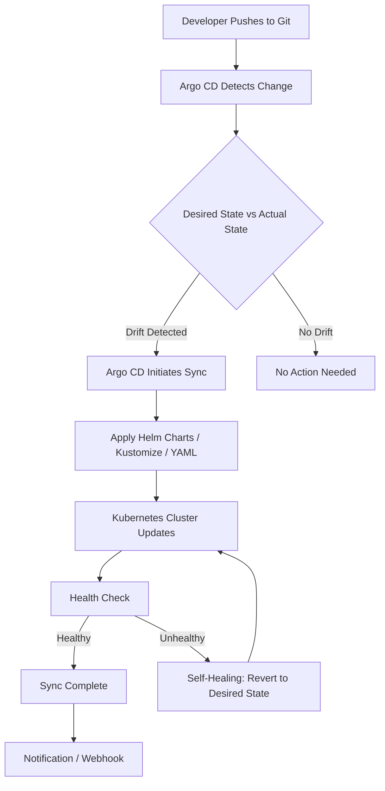

| Difficulty | Channel | Tags |
|---|---|---|
| beginner | devops | argocd, flux, declarative |

At its peak, Okta's Auth0 private cloud platform was drowning in Kubernetes clusters — scaling from roughly a dozen to over a thousand in a race to meet customer demand [1]. Their manual, VM-driven provisioning workflow was buckling under the weight. So they placed a massive bet on Argo CD and GitOps. The result? A transformative leap in scale — but also a sobering discovery: off-the-shelf Argo CD auto-sync had limits at that magnitude, forcing them to build their own custom reconciliation layer [1]. If you are deploying microservices today, this story is your roadmap — and your warning.

---

> ### Real-World Case — Okta
>
> Okta's Auth0 private cloud platform needed to scale from a dozen to over a thousand Kubernetes clusters. Their existing manual, Snowflake-configuration approach with VMs couldn't handle growing customer demand, so they bet heavily on Argo CD and GitOps — but discovered a critical limitation that forced them to build their own custom auto-sync layer.
>
> | | |
> |---|---|
> | **Challenge** | ArgoCD's built-in auto-sync feature couldn't handle their deployment model: each release was a bundle containing Terraform code, Kubernetes manifests, plugins, and custom logic. Terraform had to run before the Argo CD sync due to infrastructure dependencies, and they needed to respect customer-specific deployment windows — neither of which native auto-sync supports. At scale, the application controller also crashed under load, the UI became very slow, and application statuses became misleading. |
> | **Solution** | They implemented their own 'auto-sync' using Argo Workflows plus a control plane. One release manifest maps to one Argo application, and one Argo application represents an entire customer cluster. They built a CLI wrapper that classifies transient failures, enforces timeouts, and controls retries. For workflow conflicts at scale (workflows with 50+ steps maintained by multiple teams), they launched labeled child workflows and even built a Chrome plugin to remove the 'Terminate' button from the Argo UI to prevent it from bypassing exit hooks and breaking automation. |
> | **Outcome** | Scaled from roughly 12 clusters to over 1,000 clusters. The platform now handles service provisioning, deployments, infrastructure as code, and customer environment management across a massive private cloud footprint. The custom tooling and operational lessons contributed back to the Argo CD community through upstream bug fixes and PRs. |
> | **Lesson** | Native GitOps tools have hard limits at enterprise scale — auto-sync sounds great in theory but breaks when you have Terraform dependencies, customer deployment windows, or multi-step release bundles. The real work is building the orchestration layer around the tool, not just adopting it. Also: at scale, the application controller crashes, the UI freezes, and you end up building Chrome plugins to work around UI limitations. Adopting the technology is only part of the challenge; building the workflow experience and governance model around it is what makes large-scale GitOps practical. |

---

## Hook — The Night the Deploy Pipeline Broke

Picture this: a Friday afternoon. Your team just merged a Helm chart update for a critical microservice. You expect Argo CD to sync it within minutes. Instead, nothing happens. You check the dashboard — the sync is stuck. Manually configured kubectl patches have drifted the cluster state so far from Git that Argo CD can no longer reconcile. Sound familiar? Many developers experience this exact frustration when their GitOps pipeline silently breaks. The real-world case of Okta shows what happens at scale: when you are managing a thousand clusters, a small drift in one environment cascades into a systemic crisis. This is not a hypothetical — it is the daily reality for teams that have not fully committed to the declarative paradigm.

## Problem — When Manual Changes Become the Silent Killer

Here is the core tension: Kubernetes gives you extraordinary flexibility, but that flexibility is a double-edged sword. Every kubectl patch, every manual config edit, every Snowflake VM configuration creates a gap between what Git says your infrastructure should look like and what actually exists in your cluster [2]. This is called configuration drift, and it is one of the most insidious problems in modern DevOps. Consider a typical microservices deployment: you have dozens of services, each with their own deployment manifests, ConfigMaps, Secrets, and Ingress rules. Now multiply that across staging, production, canary, and disaster-recovery environments. The imperative approach — running kubectl commands directly — means changes happen in the cluster but never make it back to Git. Your colleagues cannot see what changed. Your rollback strategy becomes guesswork. And your audit trail? Non-existent. Declarative GitOps solves this by making Git the single source of truth. Argo CD watches your repository and continuously reconciles the desired state with reality [3]. But what happens when someone bypasses the pipeline anyway? That is exactly the problem Okta ran into at scale.

## Real-World Case — Okta's 1,000-Cluster Scaling Challenge

Okta's Auth0 private cloud needed to provision and manage Kubernetes clusters for individual enterprise customers at massive scale. Their starting point was roughly 12 clusters managed through manual processes and VMs with Snowflake configurations — each one hand-crafted and unique [1]. As customer demand exploded, this approach simply could not scale. The solution: adopt Argo CD and GitOps as the backbone of their cluster management strategy [1]. The results were dramatic. Okta scaled from approximately 12 clusters to over 1,000, with the platform now handling service provisioning, deployments, infrastructure as code, and customer environment management across their entire private cloud footprint [1]. However, the journey was not smooth. Okta discovered a critical limitation: at extreme scale, Argo CD's built-in auto-sync mechanisms did not behave as expected. The team built a custom auto-sync layer on top of Argo CD to handle the unique requirements of managing thousands of independent clusters [1]. They contributed these operational lessons back to the Argo CD community through upstream bug fixes and pull requests, strengthening the ecosystem for everyone. The takeaway is clear: GitOps works — but at scale, you need to understand its boundaries and be prepared to extend it.

## Deep Dive — Declarative vs. Imperative: The Two Philosophies

To understand why GitOps matters, you need to grasp the fundamental difference between declarative and imperative approaches to infrastructure management.

With the **declarative approach**, you define the desired end state in version-controlled YAML files, Helm charts, or Kustomize configurations [4]. Argo CD continuously monitors your Git repository and reconciles the actual cluster state against the declared desired state [3]. Every change goes through a Git commit, providing full auditability and enabling collaborative review through pull requests.

With the **imperative approach**, you execute kubectl commands — kubectl apply, kubectl patch, kubectl scale — directly against the cluster [2]. Changes happen immediately but bypass version control entirely. There is no audit trail, no peer review, and no easy rollback path.

Here is the critical nuance many developers miss: the imperative approach feels faster in the short term. You can fix a production issue in seconds. But those seconds compound into hours of debugging when configuration drift accumulates and nobody knows which manual changes are in effect.

Argo CD's self-healing feature addresses this directly: if someone makes an imperative change to the cluster, Argo CD detects the drift and automatically reverts it to match the Git-declared state [3]. Think of it as a guardian that watches over your infrastructure, silently correcting unauthorized modifications.

| Aspect | Declarative (GitOps) | Imperative (kubectl) |
|---|---|---|
| Source of Truth | Git repository | Running cluster state |
| Auditability | Full history via commits | No tracking without manual logging |
| Rollback | Git revert + auto-sync | Manual intervention required |
| Collaboration | Pull request reviews | Risk of conflicting changes |
| Drift Detection | Automatic via reconciliation | Manual or tool-dependent |
| Scalability | Excellent at scale | Degrades with complexity |

## Workflow — Setting Up Argo CD for Auto-Sync

Here is the step-by-step workflow for configuring Argo CD to automatically sync your microservices deployment from Git to Kubernetes. The following diagram illustrates the complete flow from code commit to production deployment.



**Step 1: Repository Setup.** Organize your Kubernetes manifests in a dedicated Git repository. Use Helm charts or Kustomize overlays to manage environment-specific configurations [5]. This repository becomes the single source of truth for your entire infrastructure.

**Step 2: Application CRD Configuration.** Create an Argo CD Application Custom Resource Definition that points to your Git repository. This tells Argo CD where to find the desired state and which cluster to sync to [3].

**Step 3: Enable Auto-Sync.** Configure automatic synchronization with a health check interval — typically between 1 and 5 minutes. Shorter intervals catch drift faster but increase API load; longer intervals are gentler on resources [3].

**Step 4: Enable Self-Healing.** Turn on automatic remediation. When Argo CD detects a manual change that deviates from the Git-declared state, it will revert the cluster to match your manifests [3].

**Step 5: Health Checks.** Define custom health checks for your application resources. Argo CD uses these to determine whether a sync was successful and whether the application is truly healthy [3].

## Code Example — Argo CD Application Manifest

Below is a practical Argo CD Application manifest that configures auto-sync with self-healing for a microservices deployment. This is the exact pattern you would use to replicate Okta's approach at a smaller scale.

```yaml
# argocd-application.yaml
# Argo CD Application CRD — the bridge between Git and your cluster
apiVersion: argoproj.io/v1alpha1
kind: Application
metadata:
  name: my-microservices-app  # Unique name for this application in Argo CD
  namespace: argocd            # Argo CD lives in its own namespace
  # Finalizer ensures clean removal — deletes resources when app is deleted
  finalizers:
    - resources-finalizer.argocd.argoproj.io
spec:
  # The project groups related apps — use 'default' or create custom projects
  project: default

  source:
    # Your Git repository containing Kubernetes manifests or Helm charts
    repoURL: https://github.com/your-org/microservices-deploy.git
    targetRevision: main       # Branch to watch — use tags for pinned releases
    path: overlays/production  # Directory within the repo for this environment
    # If using Helm, uncomment below:
    # helm:
    #   valueFiles:
    #     - values-production.yaml

  destination:
    # The Kubernetes cluster where your app will be deployed
    server: https://kubernetes.default.svc
    namespace: production      # Target namespace for the workload

  syncPolicy:
    # Enable automatic synchronization — no manual sync required
    automated:
      # Self-healing: automatically revert manual kubectl changes
      selfHeal: true
      # Prune: automatically remove resources deleted from Git
      prune: true
    # Sync options for retry and error handling
    retry:
      limit: 5                 # Retry up to 5 times on transient failures
      backoff:
        duration: 5s           # Initial wait between retries
        factor: 2              # Exponential backoff multiplier
        maxDuration: 3m        # Maximum total retry time
    # Sync these namespaces if they don't exist
    syncOptions:
      - CreateNamespace=true
      - PrunePropagationPolicy=foreground

  # Health checks ensure the app is truly running, not just "applied"
  ignoreDifferences:
    - group: apps
      kind: Deployment
      jsonPointers:
        - /spec/replicas  # Allow HPA to manage replica count independently
```

**Walkthrough:** The `spec.source` section tells Argo CD exactly which Git repository and path to monitor [3]. The `spec.syncPolicy.automated` block enables auto-sync with self-healing — this is the feature that prevents configuration drift [3]. Notice the `ignoreDifferences` section: this is a critical production pattern that lets Horizontal Pod Autoscalers manage replica counts without triggering constant sync conflicts. The retry logic handles transient network issues gracefully, preventing flaky deployments from failing permanently [6].

## Lessons Learned — Battle Scars from the Trenches

After examining how teams like Okta navigate GitOps at scale, here are the hard-won lessons every DevOps engineer should internalize:

**Start with a clean Git repository.** Many developers make the mistake of retroactively fitting GitOps onto an existing imperative workflow. If your current cluster state does not match any Git manifest, you are starting from a position of drift. Export your current state, commit it, and make that your baseline [7].

**Understand auto-sync intervals.** A 1-minute interval might seem aggressive, but at Okta's scale of 1,000+ clusters, even small intervals multiplied across thousands of applications create significant API pressure [1]. Start with 3 minutes and adjust based on your environment's tolerance for drift.

**Self-healing is not a silver bullet.** While Argo CD's self-healing catches most unauthorized changes, it can conflict with legitimate auto-scaling tools like HPA or VPA. Always use `ignoreDifferences` to carve out exceptions for resources managed by other controllers [6].

**Git is your audit trail — treat it that way.** Enforce branch protection rules, require pull request reviews for infrastructure changes, and use signed commits. The entire value of declarative GitOps evaporates if people can push directly to main without review [8].

**Test your manifests before deploying.** Use tools like kubeval or kubeconform to validate YAML syntax and schema compliance in CI pipelines. A malformed manifest in Git can cascade across environments [7].

**Do not ignore the disaster recovery angle.** GitOps inherently provides disaster recovery: if your cluster dies, you can rebuild the entire state from Git. But only if your manifests are complete and up-to-date. Regularly test your recovery process [4].

---

## GitOps Auto-Sync Workflow


<details>
<summary><strong>Original Interview Question</strong></summary>

**Q:** You're setting up GitOps for a microservices deployment. How would you configure ArgoCD to automatically sync changes from your Git repository to Kubernetes, and what's the difference between declarative and imperative approaches in this context?

**A:** I'd configure ArgoCD by setting up a Git repository containing Kubernetes manifests or Helm charts, creating an Application CRD that points to the Git repository, enabling auto-sync with a health check interval of 3 minutes, and implementing self-healing to automatically revert any manual changes. The declarative approach involves defining the desired state in Git through YAML manifests, Helm charts, or Kustomize configurations, where ArgoCD continuously reconciles the actual state with the desired state. In contrast, the imperative approach uses kubectl commands to make direct changes to the cluster, bypassing the Git repository as the single source of truth.

</details>

## Conclusion

Okta's journey from 12 to 1,000 Kubernetes clusters is not just a scaling success story — it is a masterclass in the power and limits of GitOps [1]. The declarative approach with Argo CD gives you auditability, self-healing, and a single source of truth that imperative kubectl commands simply cannot match [4]. But the real lesson is this: GitOps is not a set-it-and-forget-it solution. At scale, you will need to understand its boundaries, extend its capabilities, and contribute back to the community [1]. If you are currently running kubectl commands directly against production clusters, today is the day to commit to Git as your source of truth. Start with one application, enable auto-sync with self-healing, and experience the confidence that comes from knowing your infrastructure matches what your Git repository declares. The path from 12 clusters to 1,000 begins with a single commit.

---

## References

1. [How Okta Scaled from 12 to 1,000 Kubernetes Clusters with Argo CD](https://thenewstack.io/how-okta-scaled-from-12-to-1000-kubernetes-clusters-with-argo-cd/) — article
2. [kubectl Command Reference](https://kubernetes.io/docs/reference/kubectl/) — documentation
3. [Argo CD Application Specification](https://argo-cd.readthedocs.io/en/stable/operator-manual/declarative-setup/) — documentation
4. [Kubernetes Declarative Management](https://kubernetes.io/docs/concepts/overview/working-with-objects/object-management/) — documentation
5. [Kustomize Documentation](https://kustomize.io/) — documentation
6. [Argo CD Sync Options and Configuration](https://argo-cd.readthedocs.io/en/stable/user-guide/sync-options/) — documentation
7. [Getting Started with Argo CD](https://argo-cd.readthedocs.io/en/stable/getting_started/) — documentation
8. [GitOps Working Group — Principles](https://opengitops.dev/) — documentation

---

**Author:** Satishkumar Dhule — [GitHub](https://github.com/satishkumar-dhule) · [LinkedIn](https://linkedin.com/in/satishkumar-dhule) · [Website](https://satishkumar-dhule.github.io)
