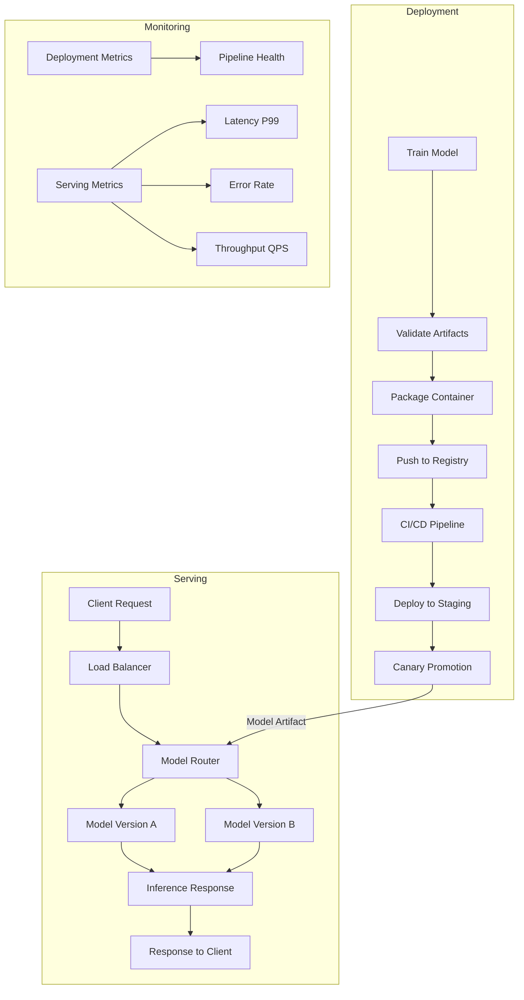

| Difficulty | Channel | Tags |
|---|---|---|
| beginner | devops | mlops, deployment |

Netflix's homepage recommendation engine serves 250 million users across hundreds of model types, handling over 1 million requests per second. Their secret weapon? A routing layer so decoupled that the Homepage service has zero knowledge of which model version or server actually answers its request [1]. This architecture didn't happen by accident. It was born from the painful realization that coupling deployment to serving creates fragility at scale.

---

> ### Real-World Case — Netflix
>
> Netflix's ML platform serves hundreds of model types across personalization, recommendations, fraud detection, and search for 250 million users. They needed to route requests to the correct model instance across multiple cluster shards while supporting A/B testing, canary deployments, and dynamic traffic splitting—all without client services needing to know which model version or server they're talking to.
>
> | | |
> |---|---|
> | **Challenge** | The core challenge was distinguishing between deployment (getting models into production infrastructure) and serving (routing requests to the right model at runtime). Standard API gateways like AWS API Gateway couldn't handle their needs: first-class integration with experimentation platforms, gRPC endpoints, domain-specific routing based on user context, and model-specific lifecycle stages like shadow mode, canaries, and rollbacks. Off-the-shelf solutions lacked the flexibility to route based on rich contextual features like device type, locale, ranking surface, or which A/B test a user belongs to. |
> | **Solution** | Netflix built Switchboard, a centralized routing service acting as the single entry point for all ML model inference traffic. It handles context-aware routing (device, locale, ranking surface), dynamic traffic splitting for canary deployments and experimentation, and model version selection. Switchboard is configured via JavaScript rules that decouple experimentation config from serving platform code, with rules published through their Gutenberg pub-sub system. Each request goes through: allocation (query experimentation platform), model selection (use A/B test rules), request routing (route to correct cluster shard VIP), and model execution (run workflow and return response). Later, they evolved to Lightbulb + Envoy to eliminate Switchboard as a single point of failure while preserving the routing abstraction. |
> | **Outcome** | The platform serves hundreds of model types and versions, handling over 1 million requests per second as of 2025. The decoupled architecture allows researchers to rapidly experiment with new hypotheses and safely release models at scale. Client services like the Homepage don't need to know which version of the ranking model they're talking to—the serving layer abstracts this completely. The evolution from Switchboard to Lightbulb resolved latency and single-point-of-failure risks while maintaining the same experimentation flexibility. |
> | **Lesson** | The key insight is that model serving (runtime inference, request routing, traffic management, A/B testing) is fundamentally different from model deployment (CI/CD pipelines, infrastructure setup, monitoring). At scale, you need a dedicated serving abstraction layer that decouples clients from model sharding and versioning details. Standard API gateways aren't built for ML-specific concerns like context-aware routing, model lifecycle management, or integration with experimentation platforms. The serving layer must handle what deployment cannot: dynamic traffic splitting, version-aware routing, and model-specific rollback strategies. |

---

## Hook — The Invisible Problem Sitting in Your ML Pipeline

Most ML teams think deployment and serving are the same thing. They are not, and conflating them is how you end up with a system where changing a model version requires coordinating three teams, a rollback takes 45 minutes, and your A/B test accidentally serves the wrong variant to 10% of your users. Here is the uncomfortable truth: deployment is everything that happens before your model is ready to receive traffic. Serving is everything that happens while it is receiving traffic. Miss this distinction, and you will build infrastructure that works in a demo but crumbles the moment you need to run two model versions simultaneously, split traffic for an experiment, or roll back a bad model in under five minutes. The Netflix engineering team learned this the hard way. Their original routing system, called Switchboard, introduced single-point-of-failure risks and latency overhead that scaled poorly with their growing model fleet.

## Problem — Deployment Is Not Serving (And Mixing Them Up Costs You)

Consider a typical ML workflow: you train a model, package it, push it through a CI/CD pipeline, and somehow it ends up serving predictions. Where exactly does deployment end and serving begin? This ambiguity causes real problems. Teams build monolithic platforms where the deployment pipeline and the serving runtime share infrastructure, configuration, and failure domains. When one breaks, both break. The core tension is this: deployment is a batch-oriented, change-driven process focused on correctness and reproducibility, while serving is a latency-sensitive, request-driven process focused on availability and throughput. Deployment answers 'is the model ready?' Serving answers 'can the model answer right now?' These are fundamentally different questions with different failure modes, different scaling axes, and different monitoring needs. Deployment scales through infrastructure provisioning (Kubernetes clusters, container images, GPU allocation). Serving scales through request routing (load balancers, model sharding, autoscaling). Confusing the two is like confusing a restaurant's supply chain with its kitchen. Both matter. Neither can substitute for the other.

## Real-World Case — Netflix's Routing Evolution

Netflix's ML platform supports personalization, recommendations, fraud detection, and search across 250 million subscribers. As their model fleet grew to hundreds of types and versions, they needed a routing layer that could direct requests to the correct model instance across multiple cluster shards while supporting A/B testing, canary deployments, and dynamic traffic splitting. Their first solution, Switchboard, handled request routing but introduced two critical problems: it became a single point of failure, and the added latency per hop was unacceptable at their scale. The engineering team rebuilt it as Lightbulb, resolving both issues while preserving the same experimentation flexibility. The key architectural insight was making routing fully decoupled from client services. Today, when the Netflix Homepage requests a ranking model, it does not specify which version, which server, or which cluster shard. The serving layer abstracts all of this, allowing researchers to rapidly experiment and safely release models without touching downstream services. This decoupled architecture handles over 1 million requests per second as of 2025, and it is the reason Netflix can run hundreds of concurrent A/B tests without the Homepage team knowing which variant a user sees [1]. The lesson is clear: separation of deployment from serving is not an academic exercise. It is what allows you to scale experimentation velocity without scaling operational risk.

## Deep Dive — The Two Worlds of ML Production Systems

Let us break down the technical divide. Deployment encompasses CI/CD pipelines, infrastructure provisioning, container orchestration, and monitoring. Technologies like Kubernetes handle the orchestration layer, while tools like MLflow and SageMaker manage experiment tracking and model registry [2][3]. The deployment pipeline ensures your model artifact (the trained weights, preprocessing steps, and configuration) moves from training to a staging environment, passes validation checks, and is available for serving. It is fundamentally about state transitions: a model moves from 'trained' to 'validated' to 'deployed.' Serving, by contrast, is the runtime system that receives inference requests and returns predictions. Frameworks like TensorFlow Serving, TorchServe, and BentoML [4][5] handle the critical runtime concerns: loading model weights into memory, batching incoming requests for GPU efficiency, routing traffic to model replicas, and managing model version switching. The scaling axes differ dramatically too. Deployment scales vertically through more powerful build infrastructure and horizontally through pipeline parallelism. Serving scales through horizontal pod replication, GPU memory management, and intelligent request batching. Here is the comparison that matters:

| Concern | Deployment | Serving |
|---------|-----------|--------|
| Latency target | Minutes to hours (pipeline stage) | Sub-100ms (per request) |
| Scaling axis | Pipeline parallelism | Request concurrency |
| Failure mode | Pipeline stall | Request timeout |
| Monitoring | Build status, artifact registry | Latency P99, error rate, throughput |
| Rollback | Re-deploy previous artifact | Traffic shift to previous model version |

The plot twist many developers miss: deployment tools like Kubernetes are actually excellent at solving serving problems too, because serving is fundamentally a container orchestration challenge. The trick is knowing which layer you are operating in at any given moment.

## Workflow — From Model Training to Serving at Scale

Here is how the full lifecycle works, from training a model to serving it in production. Think of it as two parallel tracks that converge at the serving layer:

## Code Example — A Minimal Model Serving Pipeline with BentoML

Here is a practical example of how to implement the deployment-serving boundary using BentoML, which cleanly separates model packaging from serving logic:

## Lessons Learned — What Netflix's Journey Teaches You

The separation between deployment and serving is not just architectural cleanliness. It is operational survival at scale. Here are the actionable takeaways:

- Treat deployment and serving as separate systems with separate failure domains. If your model server goes down, your CI/CD pipeline should keep working, and vice versa.
- Route at the serving layer, not the deployment layer. Netflix's biggest lesson was that routing logic belongs in the serving infrastructure, not in client services [1]. This allows you to change model versions, run experiments, and roll back without touching downstream consumers.
- Monitor differently for each. Deployment metrics focus on pipeline health (build duration, success rate, artifact registry size). Serving metrics focus on request health (latency P50/P95/P99, throughput QPS, error rate, model load time).
- Invest in model versioning early. Tools like MLflow's model registry [2] or SageMaker's model variants [3] let you track which version is serving where, enabling safe rollbacks.
- Budget for cold start optimization. The first request to a newly loaded model incurs a latency spike. Techniques like pre-loading models into GPU memory and using model warmers can reduce this from seconds to milliseconds [5].
- Start with canary deployments. Before rolling out a new model to 100% of traffic, route 1-5% to the new version and monitor error rates and latency deltas [4].

The moral of this story is deceptively simple: the hardest part of ML in production is not training the model. It is routing the right request to the right model at the right time without anyone noticing. Build your system so that deployment and serving are separate, observable, and independently scalable. Your future self, debugging at 2am, will thank you.

---

## ML Deployment vs Serving Architecture

<strong>Original Interview Question</strong>

**Q:** Explain the key differences between model serving and model deployment in ML systems, including specific technologies, scaling considerations, and real-world implementation patterns?

**A:** Deployment encompasses CI/CD pipelines, infrastructure setup, and monitoring using tools like Kubernetes, MLflow, and SageMaker. Serving focuses on runtime inference APIs with frameworks like TensorFlow Serving, TorchServe, or BentoML, handling request routing, model versioning, and autoscaling. Key trade-offs include latency vs throughput, batch vs real-time inference, and cold start optimization.

## Conclusion

Netflix didn't accidentally build one of the world's most sophisticated ML serving platforms. They learned, through operational pain, that deployment and serving are different beasts requiring different tools, different scaling strategies, and different failure handling. The separation they enforce allows hundreds of model versions to coexist, researchers to experiment freely, and the Homepage team to never worry about which model variant answers their request. Your takeaway tomorrow: audit your current ML pipeline. Where does deployment end and serving begin? If the answer is unclear, you have found your next engineering investment. Separate the concerns, instrument them independently, and watch your operational confidence grow.

---

## References

1. [Netflix State of Routing in Model Serving](https://netflixtechblog.com/state-of-routing-in-model-serving-16e22fe18741) — blog
2. [MLflow Model Registry Documentation](https://mlflow.org/docs/latest/model-registry.html) — documentation
3. [Amazon SageMaker Model Deployment](https://docs.aws.amazon.com/sagemaker/latest/dg/deploy-model.html) — documentation
4. [TorchServe Documentation](https://pytorch.org/serve/) — documentation
5. [BentoML Getting Started Guide](https://docs.bentoml.com/en/latest/getting-started/index.html) — documentation
6. [TensorFlow Serving Overview](https://www.tensorflow.org/tfx/guide/serving) — documentation
7. [Kubernetes Documentation - Deployments](https://kubernetes.io/docs/concepts/workloads/controllers/deployment/) — documentation
8. [MLOps: Continuous Delivery and Automation Pipelines in Machine Learning](https://arxiv.org/abs/2003.08358) — paper
9. [FastAPI Documentation](https://fastapi.tiangolo.com/) — documentation
10. [Google Vertex AI Model Serving](https://cloud.google.com/vertex-ai/docs/predictions/overview) — documentation

---

**Author:** Satishkumar Dhule — [GitHub](https://github.com/satishkumar-dhule) · [LinkedIn](https://linkedin.com/in/satishkumar-dhule) · [Website](https://satishkumar-dhule.github.io)
