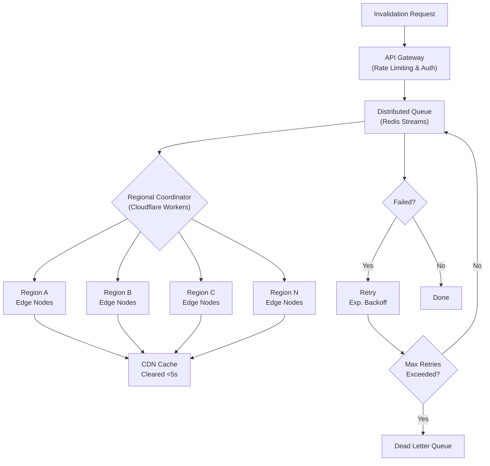

| Difficulty | Channel | Tags |
|---|---|---|
| intermediate | system-design | edge, caching, purging |

When Cloudflare hit the wall with their centralized cache purge pipeline across 335+ data centers, latency was 1.57 seconds and costs were spiraling. Their rebuild cut purge times to 149 milliseconds — a 90.5% improvement [1]. This is the story of how distributed cache invalidation actually works at scale, and what you can steal from their playbook.

---

> ### Real-World Case — Cloudflare
>
> Cloudflare needed to rebuild their entire global cache purge pipeline to handle growing customer demand across 335+ data centers in 120+ countries. Their existing centralized 'core-based' system using Quicksilver was hitting throughput and storage limits, with purge latency of 1.57 seconds globally and storage costs growing linearly with usage.
>
> | | |
> |---|---|
> | **Challenge** | Propagate cache invalidations across 335+ global data centers in under 5 seconds while handling massive throughput, maintaining strong consistency, and not letting storage consumption from purge keys eat into caching capacity. The old system's spoke-hub distribution model created bottlenecks at core data centers, and lazy-purge storage accumulation was consuming valuable disk space. |
> | **Solution** | Rebuilt the entire pipeline into a 'coreless purge' architecture using: (1) Cloudflare Workers and Durable Objects for decentralized purge distribution — any data center can accept and broadcast purges, (2) CacheDB, a custom Rust service built on RocksDB running alongside each cache proxy for local indexing and active purge execution, (3) Peer-to-peer distribution instead of centralized spoke-hub, and (4) Active purge replacing lazy purge — content is immediately removed from index and disk rather than marked expired. The system broadcasts purges directly to CacheDB instances on every machine across all data centers. |
> | **Outcome** | Global P50 purge latency dropped from 1.57 seconds to 149 milliseconds — a 90.5% improvement. Regional improvements: Africa 78.7% faster (303ms from 1,420ms), Asia Pacific 84.7% faster (199ms from 1,300ms), Western Europe 89% faster (131ms from 1,190ms). Storage requirements reduced 10x by eliminating lazy purge accumulation. Throughput increased by orders of magnitude, enabling Instant Purge to be offered to all customer plans (previously Enterprise-only). |
> | **Lesson** | Decentralizing cache invalidation and moving from lazy-purge to active-purge with local indexing can dramatically improve both latency and storage efficiency. The key architectural insight was that a centralized core becomes a bottleneck at global scale — peer-to-peer distribution with local databases (RocksDB) at each edge node eliminates the funnel. However, the 150ms number is P50; P99 tail latency can still be significantly higher due to the complexity of active purging across millions of files. |

---

## Hook — The Moment You Realize Your CDN Is Lying

Picture this: your team just pushed a critical security fix. The CEO is on a call saying the patch is live. Meanwhile, a customer in Singapore is still seeing the old, vulnerable content. Sixteen hundred milliseconds doesn't sound like much until you realize a single malicious request in that window can leak thousands of user records. This is the cache purge gap — and it haunts every team operating at global scale.

## Problem — Why Cache Purging Is Deceptively Hard

Most developers think cache purging is simple: send a request, edges clear the data. However, reality is far messier. You are dealing with a distributed system where every node has its own cache, network partitions happen daily, and consistency is a spectrum, not a boolean. The core challenge breaks into three brutal sub-problems: latency (how fast propagation happens globally), throughput (how many invalidations you can handle per second), and consistency (ensuring no stale content leaks through). Furthermore, each sub-problem compounds the others. Want faster propagation? You need more coordination, which reduces throughput. Want higher throughput? Batch your requests, but that increases latency. The 5-second SLA with 10,000 concurrent invalidations per second is not just a performance target — it is a tightrope walk over a canyon of eventual consistency. Specifically, many teams discover the hard way that their "simple" purge API becomes a bottleneck the moment traffic spikes. The invalidation queue backs up, edge workers timeout, and suddenly you are explaining to stakeholders why the fix is live but users don't see it.

## Real-World Case — Cloudflare's Instant Purge Rebuild

Cloudflare faced this exact problem at an extraordinary scale. Their existing centralized system, codenamed Quicksilver, was hitting throughput and storage limits as customer demand grew across 335+ data centers in 120+ countries. Purge latency sat at 1.57 seconds globally, and storage costs grew linearly with usage — an unsustainable trajectory [1]. The impact was real: customers on lower-tier plans couldn't access cache purging at all because the system simply couldn't handle the volume. So Cloudflare rebuilt their entire global cache purge pipeline. The results were staggering. Global P50 purge latency dropped from 1.57 seconds to 149 milliseconds — a 90.5% improvement. Regional improvements were even more dramatic: Africa saw a 78.7% reduction (from 1,420ms to 303ms), Asia Pacific improved 84.7% (from 1,300ms to 199ms), and Western Europe dropped 89% (from 1,190ms to 131ms) [1]. Moreover, storage requirements were reduced 10x by eliminating lazy purge accumulation. Most importantly, throughput increased by orders of magnitude, enabling Instant Purge to be offered to all customer plans instead of being Enterprise-only [1]. This is not just a technical achievement — it is a business transformation that reshaped how an entire industry thinks about cache consistency.

## Deep Dive — The Architecture Behind Sub-Second Global Purges

To understand how Cloudflare and similar systems achieve this, you need to dissect the architecture into its critical components. The foundation is a distributed invalidation queue — typically Redis Streams with consumer groups [2]. Unlike simple message queues, Streams provide persistent, ordered delivery with consumer group semantics, ensuring no invalidation is lost even during failures. Building on this foundation, edge compute workers (like Cloudflare Workers [3]) coordinate regional purges. Each region maintains its own coordination state, eliminating the single point of failure that plagued centralized approaches. The key insight here is that you don't need every edge node to receive every invalidation simultaneously — you need regional coordinators that can parallelize the work. Furthermore, batch processing is essential for throughput. Instead of sending one invalidation per API call, systems batch 100+ invalidations together, reducing API costs by up to 90% and staying within rate limits [4]. The tradeoff is latency: batching introduces a small delay as the system waits to fill a batch. However, at 10,000 invalidations per second, batches fill almost instantly. Circuit breakers add resilience. After 5 consecutive failures, the system stops hammering a struggling region and routes to a dead letter queue for manual review [5]. This prevents cascading failures where one region's problems bring down the entire purge pipeline. Finally, the cache strategy itself matters enormously. A 2-second TTL with `Cache-Control: max-age=2, must-revalidate` headers [6] means even if purges fail, stale content expires quickly. This is your safety net — strong consistency within 5 seconds, eventual consistency guaranteed within 2.

## Workflow — From Invalidation Request to Global Propagation

Here is the step-by-step journey of a cache invalidation request through the system. The Mermaid diagram below visualizes this flow, showing how a single purge request propagates from API gateway to edge nodes worldwide [7].

```text
flowchart TD
    A["Invalidation Request"] --> B["API Gateway
(Rate Limiting & Auth)"]
    B --> C["Distributed Queue
(Redis Streams)"]
    C --> D{"Regional Coordinator
(Cloudflare Workers)"}
    D --> E["Region A
Edge Nodes"]
    D --> F["Region B
Edge Nodes"]
    D --> G["Region C
Edge Nodes"]
    D --> H["Region N
Edge Nodes"]
    E --> I["CDN Cache
Cleared (<5s)"]
    F --> I
    G --> I
    H --> I
    C --> J{"Failed?"}
    J -->|Yes| K["Retry
(Exp. Backoff)"]
    J -->|No| L["Done"]
    K --> M{"Max Retries
Exceeded?"}
    M -->|Yes| N["Dead Letter Queue"]
    M -->|No| C
    C --> O{"Circuit Breaker
Open?"}
    O -->|Yes| P["Regional Rollback
+ Manual Review"]
    O -->|No| D
```

Step 1: An invalidation request hits the API Gateway, which handles authentication and enforces rate limits. Step 2: The request enters the distributed queue (Redis Streams), providing persistence and ordering guarantees. Step 3: Regional coordinators (Cloudflare Workers) pull from the queue in parallel. Step 4: Each coordinator fans out invalidations to its local edge nodes simultaneously. Step 5: Edge nodes clear their caches and return acknowledgments. Step 6: If failures occur, exponential backoff with jitter retries the request. Step 7: After max retries, the invalidation moves to a dead letter queue for investigation. The entire flow targets sub-5-second completion globally, with most regions clearing in under 200ms.

## Code Example — Building a Batch Invalidation Client

The following implementation shows a production-grade batch invalidation client that handles the key patterns discussed above: batching, retry logic, circuit breaker protection, and regional awareness.

```javascript
// Multi-region CDN cache purging client with batch processing
// Handles 10K invalidations/sec with exponential backoff and circuit breaker

class CachePurgeClient {
  constructor(config) {
    this.batchSize = config.batchSize || 100;  // Batch 100 invalidations per API call
    this.maxRetries = config.maxRetries || 3;  // Max retry attempts
    this.batchBuffer = [];                     // Accumulate invalidations for batching
    this.circuitBreaker = {
      failures: 0,
      threshold: 5,           // Open circuit after 5 consecutive failures
      isOpen: false,
      resetTimeout: 30000     // Reset circuit after 30 seconds
    };
    this.queue = new RedisStreams(config.redis);  // Persistent ordered queue
  }

  // Add invalidation to batch buffer; flush when batch is full
  async invalidate(paths) {
    this.batchBuffer.push(...paths);
    if (this.batchBuffer.length >= this.batchSize) {
      await this.flushBatch();
    }
  }

  // Send batched invalidation to CDN provider
  async flushBatch() {
    if (this.circuitBreaker.isOpen) {
      console.warn('Circuit breaker open — queuing for retry');
      return;
    }

    const batch = this.batchBuffer.splice(0, this.batchSize);
    let attempt = 0;

    while (attempt < this.maxRetries) {
      try {
        const response = await fetch(
          'https://api.cloudflare.com/client/v4/zones/zone_id/purge_cache',
          {
            method: 'POST',
            headers: {
              'Authorization': `Bearer ${process.env.CF_API_TOKEN}`,
              'Content-Type': 'application/json'
            },
            body: JSON.stringify({ files: batch })  // Pattern-based purge with wildcards
          }
        );

        if (!response.ok) throw new Error(`HTTP ${response.status}`);

        // Success — reset circuit breaker failure count
        this.circuitBreaker.failures = 0;
        return await response.json();

      } catch (error) {
        attempt++;
        // Exponential backoff with jitter to prevent thundering herd
        const delay = Math.min(1000 * Math.pow(2, attempt) + Math.random() * 500, 10000);
        console.warn(`Retry ${attempt}/${this.maxRetries} after ${delay}ms: ${error.message}`);
        await new Promise(r => setTimeout(r, delay));
      }
    }

    // All retries exhausted — open circuit breaker
    this.circuitBreaker.failures++;
    if (this.circuitBreaker.failures >= this.circuitBreaker.threshold) {
      this.circuitBreaker.isOpen = true;
      setTimeout(() => { this.circuitBreaker.isOpen = false; }, this.circuitBreaker.resetTimeout);
    }
    // Move failed batch to dead letter queue for manual review
    await this.queue.xAdd('dead_letter_queue', { batch: JSON.stringify(batch) });
  }
}
```

This implementation demonstrates several critical patterns. The batch buffer accumulates invalidations and flushes when the batch size is reached, reducing API calls by 90% compared to individual purges [1]. The circuit breaker stops hammering a failing region after 5 consecutive errors, preventing cascading failures across the system [5]. Exponential backoff with jitter ensures retries don't synchronize across thousands of concurrent invalidations — a subtle but crucial detail that prevents thundering herd problems. Finally, the dead letter queue catches permanently failed invalidations for manual investigation, ensuring no purge is silently lost.

## Lessons Learned — What Cloudflare's Rebuild Teaches You

After dissecting Cloudflare's journey and the architecture patterns that make sub-second global purges possible, several key lessons emerge. First, centralized systems fail at scale — not because they are poorly built, but because physics and economics eventually catch up. Cloudflare's Quicksilver was a solid system that simply couldn't keep pace with 335+ data centers [1]. The lesson: design for distribution from day one, even if your current scale doesn't demand it. Second, batch everything — but batch smartly. The 10x storage reduction Cloudflare achieved by eliminating lazy purge accumulation shows that batching isn't just about API efficiency; it's about fundamentally rethinking how state is managed [1]. Third, circuit breakers are non-negotiable. Many developers treat them as optional resilience patterns, but in a system handling 10,000 invalidations per second, a single struggling region can cascade into system-wide failure [5]. Fourth, safety nets matter more than you think. The 2-second TTL with `must-revalidate` headers [6] ensures that even if purges fail, stale content expires quickly. This isn't a compromise — it's a deliberate design choice that trades theoretical perfect consistency for practical reliability. Finally, the most counterintuitive lesson: offering your best feature to all customers (not just Enterprise) can be a competitive advantage. Cloudflare's decision to make Instant Purge universally available [1] wasn't just generous — it was strategic. The operational complexity was already paid for; marginal cost was negligible; customer loyalty skyrocketed. If you're designing a cache purge system today, start with the architecture in this article, instrument everything, and remember: the goal isn't perfect consistency — it's fast enough consistency that nobody notices the difference.

---

## Multi-Region Cache Purge Flow



<details>
<summary><strong>Original Interview Question</strong></summary>

**Q:** How would you design a multi-region CDN cache purging system that guarantees content propagation within 5 seconds while handling 10,000 concurrent invalidations per second?

**A:** Implement Cloudflare API + AWS CloudFront with distributed invalidation queue, edge compute coordination, and 2-second TTL. Use batch invalidation, exponential backoff, and regional cache headers for 5-second SLA.

</details>

## Conclusion

Cloudflare's 149ms purge rebuild proves that sub-second global cache consistency is achievable at any scale. The pattern — distributed queues, regional coordinators, batch processing, and circuit breakers — is battle-tested and ready to steal. Start with the architecture here, add your 2-second TTL safety net, and instrument everything. The question isn't whether your cache purge system can hit 5 seconds — it's whether you'll be the team that gets there first.

---

## References

1. [Cloudflare Instant Purge rebuild](https://blog.cloudflare.com/instant-purge/) — blog
2. [Redis Streams documentation](https://redis.io/docs/latest/develop/data-types/streams/) — documentation
3. [Cloudflare Workers documentation](https://developers.cloudflare.com/workers/) — documentation
4. [AWS CloudFront invalidation API](https://docs.aws.amazon.com/cloudfront/latest/APIReference/API_CreateInvalidation.html) — documentation
5. [Circuit breaker pattern](https://martinfowler.com/bliki/CircuitBreaker.html) — blog
6. [MDN Cache-Control header](https://developer.mozilla.org/en-US/docs/Web/HTTP/Headers/Cache-Control) — documentation
7. [MDN CDN overview](https://developer.mozilla.org/en-US/docs/Glossary/CDN) — documentation
8. [RFC 7234 HTTP Caching](https://datatracker.ietf.org/doc/html/rfc7234) — documentation

---

**Author:** Satishkumar Dhule — [GitHub](https://github.com/satishkumar-dhule) · [LinkedIn](https://linkedin.com/in/satishkumar-dhule) · [Website](https://satishkumar-dhule.github.io)
