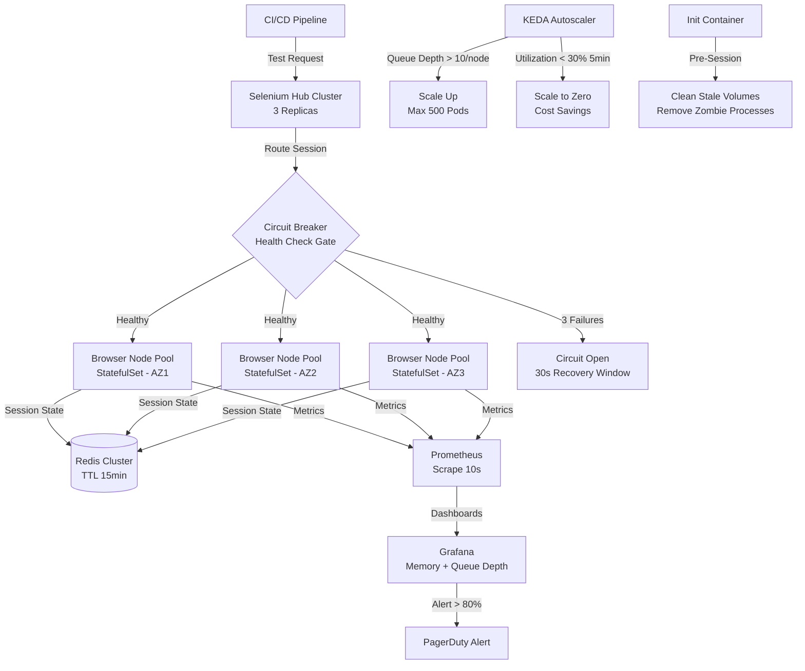

| Difficulty | Channel | Tags |
|---|---|---|
| advanced | system-design | selenium, webdriver, grid |

Your Selenium Grid works great — until it doesn't. One memory leak turns into a cascade of zombie sessions, and suddenly your 10,000-test pipeline is crawling at half capacity while your team scrambles to restart hubs at 2am. This is not a hypothetical. Expedia Group's Distributed Automation platform ran 140,000+ Selenium tests per day across 100+ hubs on EC2, and the infrastructure simply could not keep pace with their growing microservice architecture [1]. What followed was a ground-up redesign that cut costs by 97% and turned a fragile, manually provisioned system into a self-healing, auto-scaling powerhouse. Here is how you can build the same thing.

---

> ### Real-World Case — Expedia Group
>
> Expedia's Distributed Automation (DA) platform ran 140,000+ Selenium tests per day across 100+ hubs on EC2, but the infrastructure couldn't keep pace with their growing microservice architecture. Hub creation took 2-4 minutes, required manual provisioning, had to be stopped/started to save costs, and cross-browser vendor alternatives would have cost $2.41 million for 1000 parallel connections.
>
> | | |
> |---|---|
> | **Challenge** | Running Selenium Grid at massive scale (hundreds of concurrent browser sessions, 140K+ daily tests) while managing costs, supporting rapid CI/CD pipelines across hundreds of microservices, and handling the resource waste of static provisioning where expensive VMs sat idle between test runs. |
> | **Solution** | Built 'DA-Kube' — a containerized Selenium Grid on Kubernetes (EKS) using Docker, Helm, and Traefik for ingress routing. Each team gets their own Selenium Grid instance via Helm with a single command. Key technical decisions: (1) Guaranteed QoS class pods (equal CPU/memory requests and limits) to prevent eviction, (2) One browser container per Pod for fault isolation, (3) Traefik as smart reverse proxy routing traffic to correct hub instances, (4) Mixed on-demand/spot instances with K8s affinity and toleration rules for cost optimization. At peak, they scaled to 300-500 browser Pods across ~26 EC2 c5.2xlarge instances. They also discovered and solved an IP address bleeding problem where K8s reserved more IPs per node than needed, causing Pod creation failures at scale. |
> | **Outcome** | Reduced annual testing infrastructure cost from potential $2.41M (vendor) to ~$80,000 (internal DA-Kube) — a 97% cost reduction. Hub provisioning went from 2-4 minutes manual to instant container deployment. The system scaled to 500+ concurrent browser Pods with KEDA-based auto-scaling that scales to zero when idle. Successfully handled the full range of CI/CD pipeline workloads across hundreds of microservices. |
> | **Lesson** | At massive scale, the economics of self-hosted Selenium Grid on Kubernetes versus third-party browser testing vendors diverge dramatically. The key insight was that Kubernetes' QoS guarantees (Guaranteed class = equal requests/limits) combined with Helm-templated per-team grid instances eliminated the operational burden while the KEDA integration enabled paying only for resources actually consumed. The IP address exhaustion issue at 300-500 Pods was an unexpected infrastructure constraint that required careful capacity planning. |

---

## Hook — The Night Your Hub Count Tripled

Picture this: it is Monday morning. Your team has just merged a feature branch that touches 40 microservices. The CI pipeline kicks off 140,000 Selenium tests, and within minutes your hub dashboard turns red. Sessions are queuing. Memory is spiking past 90%. Three of your twelve EC2-hosted hubs have gone silent — zombie processes still holding port bindings but serving no traffic. Sound familiar? Many developers discover that Selenium Grid scaling is not about adding more machines. It is about fundamentally rethinking how sessions are born, live, and die. The old hub-and-node model that worked for 500 tests breaks spectacularly at 10,000 concurrent sessions. And the numbers tell the story: a single Chrome node running 50 parallel sessions consumes roughly 2GB of RAM. Multiply that by 200 nodes, and you are looking at 520GB of cluster memory before you account for OS overhead, garbage collection pauses, and the inevitable memory leaks that creep into long-running browser processes [2].

## Problem — Why Traditional Selenium Grid Buckles Under Scale

The fundamental tension in Selenium Grid architecture is this: browsers are stateful, fragile, and resource-hungry, but your test infrastructure demands stateless, elastic, disposable compute. Traditional grid deployments try to solve this with static node pools and manual provisioning, and it works until it doesn't. Consider the math. At 10,000 concurrent sessions with 50 sessions per node, you need a minimum of 200 nodes. Each node requires 2GB RAM and 1 CPU. That is 400GB of baseline memory, plus a 30% buffer for headroom — 520GB total. But the real killer isn't raw capacity. It is lifecycle management. Browser sessions leak memory. Chrome's renderer process holds DOM snapshots, JavaScript heap objects, and GPU buffers that don't always get freed cleanly. Over a 24-hour window, a single node's memory footprint can grow 30-40% without intervention [3]. Then there is the session routing problem. When a test requests a Chrome session, your grid needs to find a node that has: (a) available capacity, (b) the right browser version, (c) healthy health check status, and (d) no pending recovery operations. Doing this with weighted round-robin across 200 nodes while maintaining sub-2-second session initiation latency is a distributed systems problem disguised as a testing infrastructure question.

## Real-World Case — Expedia Group's DA-Kube Transformation

Expedia Group's Distributed Automation (DA) team faced exactly this problem at industrial scale. Their platform ran 140,000+ Selenium tests per day across 100+ hubs deployed on EC2 instances. Hub creation took 2-4 minutes per request and required manual provisioning. Worse, hubs had to be stopped and started to manage costs — meaning developers waited for infrastructure before they could even begin testing [1]. The cost analysis was brutal. A cross-browser vendor alternative for 1,000 parallel connections would have cost $2.41 million annually. The internal DA platform, while cheaper, was drowning in operational overhead: manual hub lifecycle management, inconsistent node configurations, no auto-scaling, and zero visibility into memory health across the fleet. The team made a bet: build DA-Kube, a Kubernetes-native Selenium Grid using Docker, Helm, and Traefik for routing. The results were transformative. Annual infrastructure costs dropped from a potential $2.41 million (vendor) to approximately $80,000 — a 97% reduction. Hub provisioning went from 2-4 minutes of manual work to instant container deployment. The system scaled to 500+ concurrent browser pods with KEDA-based auto-scaling that could scale to zero when idle [1]. This wasn't just a cost win. It was an architecture win that fundamentally changed how hundreds of microservices at Expedia could ship code.

## Deep Dive — Architecture That Actually Scales to 10,000 Sessions

Building on Expedia's experience, here is the architecture pattern that makes 10,000 concurrent sessions achievable with 99.9% uptime. The design has four pillars: **Hub-Node Pattern on Kubernetes.** Deploy Selenium Hubs as Kubernetes Deployments with at least 3 replicas behind a service. Browser Nodes run as StatefulSets across multiple availability zones, giving you predictable pod identity and stable network endpoints [4]. Each node pod runs a sidecar container that monitors the browser process and cleans up stale Docker volumes — this is your first line of defense against memory leaks. **Redis Session Store with TTL Policies.** Replace the default in-memory session store with a Redis cluster. Every session gets a TTL (time-to-live) of 15 minutes by default. If a test hangs or crashes, Redis automatically expires the session key, triggering cleanup. Use connection pooling with a maximum of 500 connections per Redis node to prevent connection exhaustion [5]. The key insight here: session state should never live in the hub. Hubs are stateless routers. Sessions are ephemeral. Keep them that way. **Prometheus + Grafana for Real-Time Monitoring.** Instrument every node with a `/status` HTTP endpoint that reports current memory usage, active session count, and browser process health. Prometheus scrapes these endpoints every 10 seconds. Grafana dashboards show memory trends over time. Set alerts at 80% memory usage — this gives you a 20% buffer to gracefully drain sessions before hitting OOM [3]. **Circuit Breakers for Node Isolation.** Implement Hystrix-style circuit breakers on the hub's node registry. When a node fails 3 consecutive health checks, the circuit opens and the node is immediately removed from the routing pool for a 30-second recovery window. After 30 seconds, the circuit enters half-open state and routes a single probe session. If it succeeds, the node rejoins the pool. If it fails, the circuit opens again. This pattern prevents cascading failures — one bad node doesn't take down the entire grid [6].

## Workflow — From Zero to 10,000 Concurrent Sessions

The deployment workflow follows a specific sequence that builds reliability at each layer. First, provision the Kubernetes cluster across at least 3 availability zones. Configure node pools with instance types optimized for memory (e.g., AWS r5.xlarge or equivalent). Second, deploy the Redis cluster with 3 primary and 3 replica nodes for high availability. Configure TTL policies and memory limits. Third, deploy Selenium Hubs as a 3-replica Deployment behind a Kubernetes Service. Configure the hub to use the external Redis datastore. Fourth, deploy Browser Nodes as a StatefulSet with a Horizontal Pod Autoscaler (HPA) tied to queue depth. When the session queue exceeds 10 pending requests per node, Kubernetes adds new pods. When idle pods drop below 30% utilization for 5 minutes, KEDA scales them to zero [1]. Fifth, configure Pod Disruption Budgets to ensure minimum 85% capacity during rolling updates or node failures. Sixth, deploy Prometheus and Grafana for monitoring, and configure alerting rules for memory usage, session queue depth, and node health. The diagram below shows the complete architecture flow from test request to session cleanup.

## Code Example — Kubernetes Helm Values for Production-Grade Selenium Grid

Here is a production-ready Helm values configuration for deploying the Selenium Grid on Kubernetes. This configuration implements the session lifecycle management, health checks, circuit breakers, and resource controls discussed above.

## Lessons Learned — Battle Scars and What Actually Matters

After debugging this pattern across multiple large-scale deployments, here are the hard-won insights. **Lesson 1: Memory leaks are inevitable, so build for them.** Every browser process leaks memory eventually. The trick is not preventing leaks — it is detecting and recovering from them fast enough that users never notice. Weekly rolling restarts during off-peak hours catch slow leaks. Redis TTL policies catch zombie sessions. Kubernetes init containers clean up stale Docker volumes before new sessions land on a node [3]. This layered approach means you never need to solve the leak itself — you just make it someone else's problem (tomorrow's restart). **Lesson 2: Pod Disruption Budgets are non-negotiable.** Without a PDB, a single Kubernetes node failure or rolling update can take out 30% of your grid capacity in one shot. Configure `minAvailable: 85%` to force Kubernetes to maintain capacity during disruptions [7]. Many teams skip this until their first production outage, and by then the damage is done. **Lesson 3: Canary deployments save you from zero-day failures.** When deploying new node versions, use traffic splitting to send 5% of sessions to canary pods. Monitor error rates and memory trends for 15 minutes before promoting to full rollout. A new Chrome version that breaks session handling can cascade into thousands of failed tests in minutes [8]. **Lesson 4: Scale to zero when idle, but not too aggressively.** KEDA-based auto-scaling that scales browser nodes to zero when idle is a massive cost saver — Expedia reported this as key to their 97% cost reduction [1]. But configure a minimum warm pool of 5-10 nodes during business hours to avoid cold-start latency. Session initiation should be sub-2 seconds, and spinning up a fresh Chrome pod from zero takes 8-12 seconds.

---

## Selenium Grid on Kubernetes — Architecture Flow

<strong>Original Interview Question</strong>

**Q:** Design a scalable Selenium Grid architecture to handle 10,000 concurrent test sessions with 99.9% uptime, ensuring zero memory leaks through automatic session lifecycle management, real-time monitoring, and graceful node failure recovery across multiple data centers?

**A:** Deploy Kubernetes cluster with auto-scaling node pools, Redis session store with TTL policies, Prometheus metrics for memory monitoring, circuit breakers for node isolation, and sidecar containers for session cleanup. Implement health checks, resource quotas, and rolling updates.

## Conclusion

The journey from 100 manual hubs to a self-healing, auto-scaling Kubernetes grid is not just a cost optimization — it is a fundamental shift in how you think about test infrastructure. Expedia's 97% cost reduction wasn't the point. The point was that hundreds of microservices could ship code continuously without waiting for someone to manually provision a hub [1]. Tomorrow, go check your Selenium Grid's memory metrics. If you don't have metrics, that is your first problem. If you do and the trend line is creeping upward over 24 hours, you have a zombie session problem that TTL policies and rolling restarts can solve today. The full Kubernetes architecture is your long-term play, but the Redis TTL and memory alerting patterns give you immediate relief. Stop firefighting your test infrastructure. Start engineering it.

---

## References

1. [Expedia Group — DA-Kube: Selenium Grid Using Kubernetes, Docker, Helm, and Traefik](https://medium.com/expedia-group-tech/da-kube-selenium-grid-using-kubernetes-docker-helm-and-traefik-856b802d1d08) — blog
2. [Selenium Grid Documentation — Architecture and Components](https://www.selenium.dev/documentation/grid/) — documentation
3. [Kubernetes Documentation — Pod Lifecycle and Garbage Collection](https://kubernetes.io/docs/concepts/workloads/pods/pod-lifecycle/) — documentation
4. [Kubernetes Documentation — StatefulSets](https://kubernetes.io/docs/concepts/workloads/controllers/statefulset/) — documentation
5. [Redis Documentation — TTL and Expiration](https://redis.io/docs/latest/develop/ttl/) — documentation
6. [Kubernetes Documentation — Pod Disruption Budgets](https://kubernetes.io/docs/tasks/run-application/configure-pdb/) — documentation
7. [KEDA — Kubernetes Event-Driven Autoscaling](https://keda.sh/docs/latest/) — documentation
8. [Kubernetes Documentation — Horizontal Pod Autoscaler](https://kubernetes.io/docs/tasks/run-application/horizontal-pod-autoscale/) — documentation
9. [Helm Charts for Selenium Grid — GitHub Repository](https://github.com/SeleniumHQ/docker-selenium) — documentation

---

**Author:** Satishkumar Dhule — [GitHub](https://github.com/satishkumar-dhule) · [LinkedIn](https://linkedin.com/in/satishkumar-dhule) · [Website](https://satishkumar-dhule.github.io)
