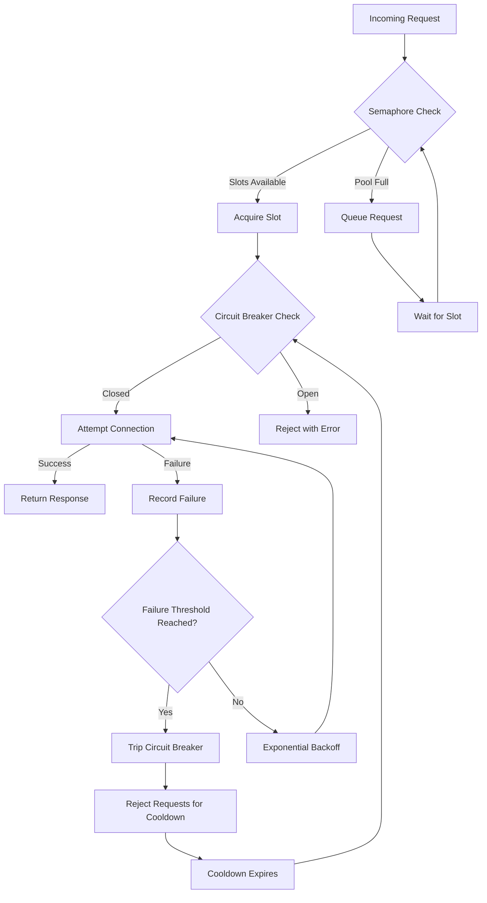

| Difficulty | Channel | Tags |
|---|---|---|
| advanced | backend | asyncio, aiohttp, concurrency |

Netflix's Zuul API gateway was drowning. The addition of mTLS security across three AWS regions had turned every connection into a heavyweight negotiation — thousands of TCP handshakes per second hammering backend origin servers. The result? A staggering 10x reduction in peak connections and millions of wasted TLS handshakes. If you think connection pool management is a "set it and forget it" task, Netflix's engineers would like a word [1].

---

> ### Real-World Case — Netflix
>
> Netflix's Zuul API gateway handled millions of connections to backend origin servers. When they added mTLS (mutual TLS) for security, connection establishment overhead became massive. Each connection was no longer 'free'—they were creating and tearing down thousands of TCP connections per second, causing severe performance degradation across all three AWS regions.
>
> | | |
> |---|---|
> | **Challenge** | With mTLS enabled, every new connection required a full TLS handshake, which is computationally expensive. Zuul's architecture assumed connections were cheap to create, so it wasn't reusing them aggressively enough. The result was 'connection churn'—constant creation and destruction of connections that overwhelmed CPU and increased tail latencies for streaming playback, Netflix's most critical workload. |
> | **Solution** | Netflix implemented three key strategies: (1) HTTP/2 multiplexing to send multiple requests over a single TCP connection, eliminating the need for separate connections per request; (2) a Google-inspired subsetting algorithm where each Zuul event loop connects to only 25-50 nodes out of hundreds in an origin cluster, rather than all nodes; and (3) persistent connection pools with aggressive keepalive to avoid re-establishing connections. |
> | **Outcome** | 10x reduction in peak connections across all three AWS regions. On their largest origin clusters (streaming playback), this translated to 13 million fewer connections at peak. Connection churn dropped to near-zero, and tail latencies improved significantly because requests no longer waited for TLS handshakes. |
> | **Lesson** | Connection pooling isn't just about limiting concurrency—it's about understanding the true cost of connection establishment. When you add mTLS or other handshake-heavy protocols, the economics of connection management change completely. Subsetting (connecting to a fraction of backends) combined with multiplexing (sending more over fewer connections) can yield order-of-magnitude improvements. |

---

## Hook — The Hidden Tax Every Connection Carries

Picture this: your async Python service is humming along, proxying requests to downstream APIs, and everything looks fine — until the latency dashboard starts climbing. Connections are timing out. Retries pile up. Suddenly, a single slow dependency is dragging your entire system into the mud. The culprit isn't your code logic. It's connection management — the invisible infrastructure layer most developers treat as someone else's problem. The truth is, every connection has a cost: memory buffers, file descriptors, TCP overhead, and in the case of TLS, a full cryptographic handshake. Multiply that by thousands of concurrent requests and you get the kind of churn that can crater a production system.

## Problem — Why Connection Pools Fail Under Pressure

At its core, the challenge is deceptively simple: how do you let many concurrent requests share a limited set of connections without letting one greedy consumer starve everyone else? When you build an async HTTP client with aiohttp, the default behavior gives you a session — and that session will happily open as many connections as you ask it to. That sounds fine until you realize that unbounded concurrency means unbounded resource consumption. Your downstream service can only handle 200 concurrent connections, but your service is trying to open 2,000. The result is a cascade: connections fail, your code retries, which opens more connections, which causes more failures. This is the classic thundering herd problem, and it is devastatingly common. Consider the tradeoffs you face:

## Real-World Case — Netflix and the Zuul Connection Churn Crisis

Netflix's engineering team documented exactly this scenario with their Zuul 2 API gateway, which handled millions of connections to backend origin servers across three AWS regions [1]. When they introduced mutual TLS (mTLS) for enhanced security, each connection establishment became significantly more expensive — a full cryptographic handshake replaced what had been simpler connection reuse. The impact was severe: peak connections dropped by 10x across all regions, and on their largest origin clusters handling streaming playback, this translated to 13 million fewer connections at peak. Connection churn — the constant creation and teardown of connections — had become the bottleneck. The fix wasn't throwing more hardware at the problem. Netflix engineers implemented aggressive connection keepalive, tuned timeout parameters, and built sophisticated connection pool management that prioritized reuse over fresh connections. The result was near-zero connection churn and dramatically improved tail latencies because requests no longer waited for TLS handshakes. This is not a hypothetical concern. Connection management directly determines whether your service survives real production load.

## Deep Dive — The Three Pillars of Graceful Degradation

Building on the Netflix case, the technical solution rests on three patterns working in concert: semaphores, circuit breakers, and exponential backoff. Each addresses a different failure mode, and removing any one of them leaves a hole in your defense. First, semaphore-based limiting is the most direct tool. By capping concurrent connections, you prevent resource exhaustion. A semaphore is essentially a counter: you set a maximum, and every request decrements the counter before proceeding. When it hits zero, subsequent requests queue. This is your traffic cop, ensuring no single burst overwhelms the pool [2]. Second, the circuit breaker pattern addresses the upstream problem — what happens when the downstream service itself is failing? Without a circuit breaker, every failed request still consumes a connection slot and a timeout window. A circuit breaker tracks recent failures and, when a threshold is crossed, short-circuits new requests entirely for a cooldown period. This gives the failing service time to recover without your client hammering it. Many developers overlook this until they see retry storms destroying their error budgets. Third, exponential backoff with jitter handles retries gracefully. Rather than immediately retrying a failed connection (which contributes to thundering herds), you introduce exponentially increasing delays — 1 second, then 2, then 4, up to a maximum. Adding jitter (randomness) prevents synchronized retries across multiple client instances. The combination of these three patterns creates what Netflix-style systems call graceful degradation: under normal load, everything proceeds at full speed; under stress, the system sheds load intelligently rather than collapsing catastrophically [3].

## Workflow — Anatomy of a Resilient Request

Here is how a single request flows through a production-grade connection pool manager:

## Code Example — Building the Pool Manager

Let's walk through the implementation. Below is a production-grade connection pool manager that combines all three patterns:

## Lessons Learned — The Battle Scars That Matter

After building and debugging connection pool managers in production, here are the hard-won insights that separate reliable systems from ones that collapse under load: Connection leaks are silent killers. If you open a session and forget to close it in a finally block or async context manager, you leak file descriptors and memory. On a busy service, this can exhaust the OS limit within hours. Always use async context managers for sessions, and always register cleanup handlers for application shutdown [7]. SSL context validation is not optional. Skipping SSL verification in development is fine, but in production, expired certificates or misconfigured CA bundles will cause mysterious timeouts that look like network issues. Explicitly configure your SSL context and validate it during startup warmup. Timeout configuration needs three layers: total timeout (the absolute maximum time for a request), connect timeout (how long to wait for TCP handshake), and read timeout (how long to wait for a response after connection is established). Many developers set only the total timeout and discover too late that a single slow read can hold a connection for the entire duration. The circuit breaker threshold is a tuning exercise, not a constant. The default of 5 failures before tripping may be too aggressive for services that occasionally return errors, or too lenient for services where every failure indicates an outage. Monitor your circuit breaker state in production and adjust thresholds based on actual failure patterns. Connection warmup prevents cold start latency. During application startup, proactively open a few connections to your downstream services. This ensures your first real request doesn't pay the full TCP + TLS handshake cost. Netflix's engineers explicitly call this out as a best practice for high-traffic services [1].

---

## Connection Pool Request Lifecycle

<strong>Original Interview Question</strong>

**Q:** How would you implement a connection pool manager for aiohttp that handles graceful degradation under high load and connection timeouts?

**A:** Implement a connection pool manager for aiohttp using a semaphore to limit concurrent connections, exponential backoff for retrying failed requests, and circuit breaker pattern to gracefully degrade under high load and connection timeouts.

## Conclusion

Netflix spent engineering hours solving a problem that began with assuming connections were free. The lesson is clear: connection pool management is not plumbing — it is architecture. By combining semaphores for concurrency control, circuit breakers for failure isolation, and exponential backoff for retry discipline, you build a system that degrades gracefully instead of collapsing catastrophically. Start tomorrow by auditing your current connection handling: Are you limiting concurrency? Do you have circuit breakers on your critical downstream paths? Are your retries actually helping, or are they contributing to thundering herds? The answers might surprise you — and fixing them might save your next on-call shift.

---

## References

1. [Netflix engineering blog: Curbing connection churn in Zuul](https://netflixtechblog.com/curbing-connection-churn-in-zuul-2feb273a3598) — blog
2. [Python asyncio Semaphore documentation](https://docs.python.org/3/library/asyncio-sync.html#asyncio.Semaphore) — documentation
3. [Circuit breaker pattern — Martin Fowler's foundational description](https://martinfowler.com/bliki/CircuitBreaker.html) — blog
4. [aiohttp ClientSession documentation](https://docs.aiohttp.org/en/stable/client_advanced.html) — documentation
5. [MDN: HTTP connection management and keepalive](https://developer.mozilla.org/en-US/docs/Web/HTTP/Connection_management_in_HTTP_1.x) — documentation
6. [Wikipedia: Exponential backoff algorithm](https://en.wikipedia.org/wiki/Exponential_backoff) — documentation
7. [aiohttp best practices for production deployments](https://docs.aiohttp.org/en/stable/http_request_lifecycle.html) — documentation
8. [AWS: Managing TCP connections in high-performance applications](https://docs.aws.amazon.com/AWSEC2/latest/UserGuide/tutorial-tuning-instance-network.html) — documentation

---

**Author:** Satishkumar Dhule — [GitHub](https://github.com/satishkumar-dhule) · [LinkedIn](https://linkedin.com/in/satishkumar-dhule) · [Website](https://satishkumar-dhule.github.io)
