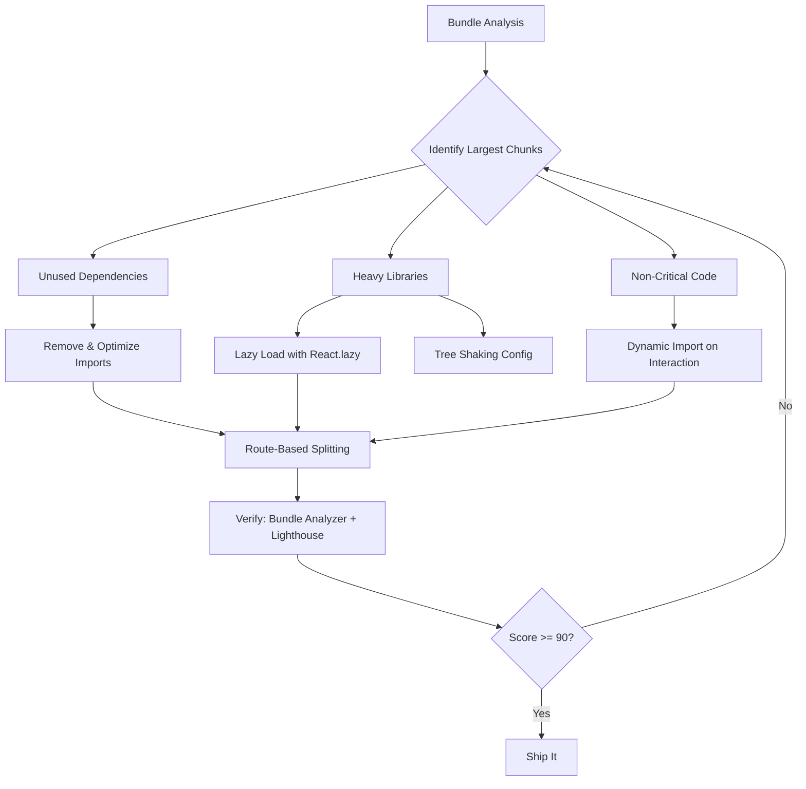

| Difficulty | Channel | Tags |
|---|---|---|
| intermediate | frontend | lighthouse, bundle, lazy-loading |

Picture this: a Wix engineer ships a tiny progress bar widget — a sidebar notification that should barely make a ripple in the codebase. Instead, the analytics team flags a massive performance regression. The bundle for this "small feature" balloons to 190KB, tanking page load times across the platform [1]. A single animation dependency, lottie-web, weighs in at 61.45KB, and its companion JSON file adds another 26KB. That's nearly 100KB — for a tooltip animation. If you've ever shipped a feature that quietly destroyed your performance metrics, this story will feel painfully familiar.

---

> ### Real-World Case — Wix
>
> A Wix engineer released a new progress bar feature that was only supposed to be a small sidebar widget. The analytics team reported that page load times had increased significantly. Upon investigation, the bundle for this small feature had bloated to 190KB — mostly because a single animation dependency (lottie-web at 61.45KB) plus its 26KB animation JSON file consumed over half the bundle, along with other unnecessary dependencies.
>
> | | |
> |---|---|
> | **Challenge** | The engineer needed to reduce a 190KB bundle for a small sidebar progress bar feature down to an acceptable size. The bundle included lottie-web for a 'happy moment' celebration animation, third-party dependencies, and code that was only conditionally needed (the progress bar shouldn't render at all for non-admin users or after setup steps were completed). |
> | **Solution** | First, the engineer used Webpack Bundle Analyzer to identify the problematic dependencies — discovering that lottie-web and the animation file accounted for ~94KB alone. They then implemented React.lazy/Suspense to code-split the celebration component, deferring it until the user actually completed all steps. This alone cut the bundle to 96KB (50% reduction). But they went further: analyzing the product requirements, they realized the entire progress bar was unnecessary for non-admin users and should be hidden after setup completion. A three-way split reduced the initial bundle to just 38KB. As a bonus learning, the engineer discovered that React.lazy caused a tooltip positioning bug — the tooltip's position was calculated before the lazy content loaded, so the engineer switched to a manual dynamic import pattern (awaiting the import before setting tooltip state) to fix the race condition. |
> | **Outcome** | Bundle size reduced from 190KB to 38KB — an 80% reduction. The initial bundle was reduced by 50% on the first optimization pass alone, then further reduced to just 38KB with product-driven architectural splitting. Page load time returned to acceptable levels, and the analytics team confirmed the performance regression was resolved. |
> | **Lesson** | The key insight is that 'the product defines the architecture' — understanding what users actually need to see and interact with at initial render is what determines what can be split and deferred. Additionally, the case demonstrates that code splitting isn't just about technical tooling; it requires product-level thinking about conditional rendering and user flows. The tooltip positioning bug also serves as a cautionary tale: lazy loading can introduce subtle DOM timing issues that require careful handling. |

---

## Hook — One Deploy, 190KB of Regret

Everyone has been there — you ship what feels like a minor feature, and then the monitoring dashboards light up red. The Wix incident is a masterclass in how quickly bundle debt accumulates [1]. A progress bar that updates via WebSockets, shows a celebratory animation, and hides itself once the user finishes setup. Sounds harmless. But beneath the surface, lottie-web (61.45KB), a 26KB animation JSON, and a handful of transitive dependencies consumed over half the feature's total 190KB bundle [1]. The lesson is brutal and simple: every dependency you import is a promise to your users that it's worth the bytes. When that promise breaks, your Lighthouse score pays the price.

## Problem — The Silent Killer of Frontend Performance

Modern React applications face a paradox: the ecosystem makes it trivially easy to add functionality, but every `npm install` quietly inflates your critical rendering path. Consider the numbers: a 2.1MB bundle with a 4.2-second Time to Interactive means your users stare at a blank screen for over four seconds on a mid-range device [3]. For every additional 100KB of JavaScript, the main thread is blocked for roughly 50-100ms during parse and execution [6]. On a 3G connection — still the reality for billions of users — that same 100KB translates to over a second of additional network latency [4].

The core problem is threefold. First, bundlers ship everything in one monolithic file by default, forcing users to download code they may never execute. Second, tree shaking is not magic — it requires proper ES module configuration and sideEffects annotations to actually work [5]. Third, developers often conflate bundle size with feature complexity, when the real culprit is usually dependency weight. That Wix progress bar wasn't complex. It was bloated.

## Real-World Case — Wix's 190KB Progress Bar

The Wix incident is one of the cleanest documented cases of bundle bloat in modern frontend engineering [1]. Here's the timeline:

1. A Wix engineer released a new sidebar progress bar — a widget that tracks setup steps via WebSockets and shows a celebratory "happy moment" animation upon completion [1].
2. The analytics team flagged that page load times had spiked across affected routes [1].
3. Chrome DevTools revealed the culprit: the feature's bundle weighed 190KB [1].
4. Webpack Bundle Analyzer pinpointed the source — lottie-web at 61.45KB plus a 26KB animation JSON, consuming over half the total [1].
5. After applying React.lazy/Suspense code splitting, the bundle dropped to 96KB — a 50% reduction on the first pass [1].
6. By then leveraging product-driven architectural decisions (hiding the progress bar for non-admin users and completed setups), the team achieved a final 38KB bundle — an 80% total reduction [1].

The key insight wasn't just technical. The product defined the architecture. The team asked: "Who actually sees this component, and when?" That question alone unlocked the final 60% of savings.

## Deep Dive — Code Splitting, Tree Shaking, and the Dependency Trap

Understanding the full optimization picture requires distinguishing between three complementary strategies:

**Code Splitting** divides your bundle into smaller chunks that load on demand. Webpack's built-in support for dynamic `import()` makes this straightforward — when the bundler encounters `import('./HeavyChart')`, it automatically creates a separate chunk for that module [5]. React.lazy wraps this pattern in a component-friendly API, deferring loading until the component is first rendered [7].

**Tree Shaking** eliminates dead code at build time, but only works reliably with ES module syntax (not CommonJS) and requires that packages mark themselves as side-effect-free via `sideEffects: false` in their package.json [5]. Many popular libraries — moment.js being a notorious example — still ship with side effects that defeat tree shaking entirely [1].

**The Dependency Trap** is the most insidious problem. Tools like Bundlephobia and the Import Cost VS Code extension reveal the true cost of your imports before they reach production [1]. Importing a single function from lodash pulls in the entire 70KB library unless you use path-specific imports like `import uniqueId from 'lodash/uniqueId'` [1].

| Strategy | When to Use | Tradeoff |
|----------|-------------|----------|
| Route-based splitting | Different pages/routes | Easy to implement, coarse-grained |
| Component-based splitting | Heavy features (charts, editors) | More granular, requires Suspense boundaries |
| Dynamic imports | Non-critical features (tooltips, modals) | Manual orchestration, async complexity |
| Tree shaking | Unused utility functions | Requires ES modules, package cooperation |

The real power comes from combining all four. Route-based splitting reduces initial load. Component-based splitting handles heavy features within routes. Dynamic imports defer non-critical UI. Tree shaking removes the dead weight that survives all other strategies.

## Workflow — The Optimization Playbook

Here's the systematic approach to turning a 2.1MB bundle into something your users deserve:



**Step 1: Analyze.** Run `webpack-bundle-analyzer` to visualize every module's contribution [8]. Sort by size. The top 5 modules typically account for 80%+ of your bundle.

**Step 2: Audit Dependencies.** Cross-reference your largest chunks against Bundlephobia. Every dependency over 10KB deserves scrutiny. Ask: "Can I replace this? Do I need the full package?"

**Step 3: Implement Route-Based Splitting.** Wrap each route in `React.lazy()`. This alone typically reduces initial load by 30-50% for multi-page applications.

**Step 4: Add Component-Level Splitting.** Identify heavy features (charts, rich text editors, animation libraries) and split them behind user interactions.

**Step 5: Configure Tree Shaking.** Ensure your bundler is in production mode, your packages use ES modules, and `sideEffects` is properly configured.

**Step 6: Measure and Iterate.** Run Lighthouse after every change. The feedback loop is your best friend.

## Code Example — Implementing Lazy Loading the Right Way

Here's a production-ready pattern that combines route-based splitting with error boundaries for resilience:

```javascript
import React, { Suspense, lazy } from 'react';
import { BrowserRouter, Routes, Route } from 'react-router-dom';

// Route-based code splitting — each route becomes its own chunk
const Dashboard = lazy(() => import('./pages/Dashboard'));  // ~45KB
const Analytics = lazy(() => import('./pages/Analytics'));  // ~120KB (includes chart lib)
const Settings = lazy(() => import('./pages/Settings'));    // ~12KB

// Component-level splitting for heavy features
const HeavyChart = lazy(() => import('./components/HeavyChart'));  // ~85KB
const RichTextEditor = lazy(() => import('./components/Editor'));  // ~200KB

// Error boundary for graceful degradation
class ErrorBoundary extends React.Component {
  state = { hasError: false };
  static getDerivedStateFromError() {
    return { hasError: true };
  }
  render() {
    if (this.state.hasError) {
      return <div role="alert">Something went wrong. Please refresh.</div>;
    }
    return this.props.children;
  }
}

// Loading fallback with accessibility
function LoadingSpinner() {
  return (
    <div role="status" aria-label="Loading">
      <p>Loading...</p>
    </div>
  );
}

export default function App() {
  return (
    <BrowserRouter>
      <ErrorBoundary>
        <Suspense fallback={<LoadingSpinner />}>
          <Routes>
            <Route path="/dashboard" element={<Dashboard />} />
            <Route path="/analytics" element={<Analytics />} />
            <Route path="/settings" element={<Settings />} />
          </Routes>
        </Suspense>
      </ErrorBoundary>
    </BrowserRouter>
  );
}
```

The key design decisions here:

1. **Lazy declarations live outside components.** Declaring `lazy()` inside a component causes state to reset on every re-render [7]. Always declare them at module scope.
2. **Error boundaries wrap Suspense.** If a chunk fails to load (network error, timeout), the user sees a helpful message instead of a white screen.
3. **The Suspense fallback includes `role="status"`.** This ensures screen readers announce the loading state, maintaining accessibility [7].
4. **Routes are the primary split point.** Each route's entire dependency tree — including its unique libraries — loads only when the user navigates there.

For the Wix-style case (a feature that should only load on specific user states), you can combine dynamic imports with async logic:

```javascript
// Only load the happy-moment animation when actually needed
async function showCelebration(tooltipRef) {
  const { SidebarHappyMoment } = await import('./SidebarHappyMoment');
  // Tooltip opens AFTER component is ready — avoids positioning bugs
  tooltipRef.current.open({
    content: <SidebarHappyMoment onComplete={() => tooltipRef.current.close()} />
  });
}
```

This pattern mirrors the Wix team's final solution — fetching the component first, then triggering the UI interaction, which eliminated the tooltip positioning bug that React.lazy introduced [1].

## Lessons Learned — What to Do Tomorrow Morning

The Wix story and the broader bundle optimization landscape converge on a handful of truths:

1. **Analyze before you optimize.** Running `webpack-bundle-analyzer` before every optimization pass prevents you from spending hours on modules that contribute 0.1% to your total [8]. Data beats intuition.

2. **The product defines the architecture.** The Wix team's breakthrough came not from a new tool but from asking a product question: "Who sees this, and when?" [1]. Technical optimization without product context is cargo-culting.

3. **Dependencies are the #1 bundle killer.** Your own code rarely balloons a bundle. It's the 61KB animation library for a tooltip animation you forgot about. Audit every import with Bundlephobia.

4. **Combine strategies, don't pick favorites.** Code splitting, tree shaking, dynamic imports, and route-based splitting are not alternatives — they're complementary layers. Each catches what the others miss.

5. **Measure continuously.** A Lighthouse score of 65 can become 90+ with systematic work, but regressions ship just as easily as fixes. Add bundle size checks to your CI pipeline.

If there's one thing to take away, it's this: every byte in your bundle is a byte your user has to download, parse, and execute. Treat your bundle like a product — measure it, question it, and never stop trimming the fat.

---

## Bundle Optimization Workflow


<details>
<summary><strong>Original Interview Question</strong></summary>

**Q:** You're tasked with improving a React app's Lighthouse performance score from 65 to 90+. The bundle size is 2.1MB and Time to Interactive is 4.2s. What specific steps would you take to optimize the bundle and implement lazy loading?

**A:** Implement code splitting with React.lazy() and Suspense, analyze bundle composition with webpack-bundle-analyzer to identify largest chunks, remove unused dependencies and optimize imports, add dynamic imports for heavy components and third-party libraries, implement route-based splitting for better initial load times, and utilize tree shaking with proper ES module configuration.

</details>

## Conclusion

The journey from a 65 Lighthouse score to 90+ is not about learning a single trick — it's about adopting a mindset. Every dependency is a conscious choice. Every import is a contract with your users. The Wix team proved that a small feature doesn't have to carry a 190KB burden when you analyze your bundle, split strategically, and let the product define what loads when [1]. Start tomorrow by running webpack-bundle-analyzer on your own bundle. Sort by size. Ask yourself: "What is this dependency doing here, and does it earn its weight?" That single question will transform how you think about frontend performance.

---

## References

1. [Wix Engineering: Trim the Fat From Your Bundles Using Webpack Analyzer & React Lazy/Suspense](https://www.wix.engineering/post/trim-the-fat-from-your-bundles-using-webpack-analyzer-react-lazy-suspense) — blog
2. [React Documentation: lazy](https://react.dev/reference/react/lazy) — documentation
3. [MDN Web Docs: Web Performance](https://developer.mozilla.org/en-US/docs/Web/Performance) — documentation
4. [MDN Web Docs: import — Dynamic Imports](https://developer.mozilla.org/en-US/docs/Web/JavaScript/Reference/Statements/import#dynamic_imports) — documentation
5. [webpack Documentation: Code Splitting](https://webpack.js.org/guides/code-splitting/) — documentation
6. [MDN Web Docs: Lazy Loading](https://developer.mozilla.org/en-US/docs/Web/Performance/Lazy_loading) — documentation
7. [React Documentation: Suspense](https://react.dev/reference/react/Suspense) — documentation
8. [webpack-bundle-analyzer GitHub Repository](https://github.com/webpack-contrib/webpack-bundle-analyzer) — documentation

---

**Author:** Satishkumar Dhule — [GitHub](https://github.com/satishkumar-dhule) · [LinkedIn](https://linkedin.com/in/satishkumar-dhule) · [Website](https://satishkumar-dhule.github.io)
