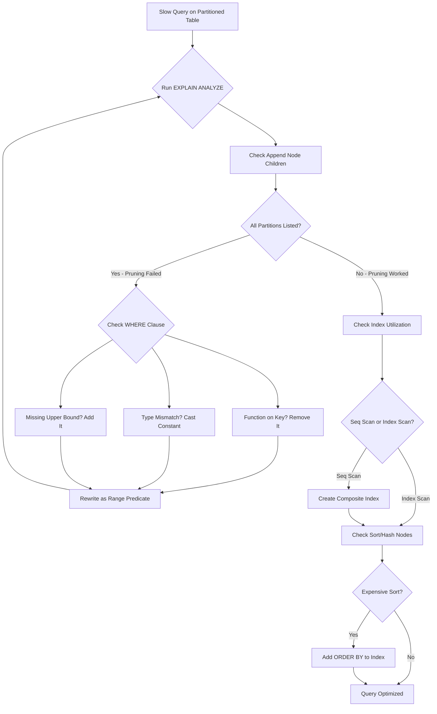

| Difficulty | Channel | Tags |
|---|---|---|
| intermediate | database | explain, query-plan, partitioning |

Imagine staring at a dashboard where p99 response times are bleeding past 4 seconds, IOPS alarms are firing daily, and your PostgreSQL RDS bill keeps climbing. That is exactly what CoinGecko's engineering team faced with their 1TB+ `prices` table — and their first instinct to fix it made things worse, not better [1]. The twist? Partitioning, the seemingly obvious solution, initially caused a query to scan every single partition, spiking IOPS and CPU even higher. The lesson is deceptively simple: partitioning only works when your queries know how to talk to it. If you have ever thrown indexes or partitions at a slow query and watched it stay slow, this story is for you.

---

> ### Real-World Case — CoinGecko
>
> CoinGecko's PostgreSQL RDS database had a `prices` table storing hourly crypto price data that grew to 1TB+ over 8+ years. Average query time exceeded 30 seconds, IOPS constantly breached thresholds causing Apdex degradation and replica lag, and increasing IOPS to 24K was just a band-aid.
>
> | | |
> |---|---|
> | **Challenge** | A single unpartitioned PostgreSQL table with billions of rows serving price lookups across multiple applications. Queries used a JSONB column with keys based on supported currencies, making traditional indexing impractical. The table was so degraded that even warming up cache took 10 hours, and copying one day's worth of data initially timed out after 15 minutes. |
> | **Solution** | Implemented monthly range partitioning on the timestamp column. Created a new partitioned table and copied 1TB of data using Foreign Data Wrappers (FDW) to read from a warm standby rather than hammering production. Used `pg_prewarm` to warm all partition caches on both primary and replicas. Implemented dual-write triggers during cutover. After switching, discovered a critical regression: a query without an upper date limit scanned ALL partitions — worse than the unpartitioned table. Fixed by adding bounded date ranges to all queries. |
> | **Outcome** | p99 response time dropped from 4.13s to 578ms (86% reduction). IOPS reduced by 20% across the fleet (multiplied across replicas for significant cost savings). Replica lag eliminated entirely. The key twist: partitioning initially made one query WORSE because it lacked date bounds, proving that partition pruning only works when queries properly constrain the partition key. |
> | **Lesson** | Partition pruning is the single biggest win, but it's a double-edged sword — queries without proper date bounds will scan ALL partitions and can be slower than the original unpartitioned table. Every query MUST include bounded date ranges on the partition key. Also, always warm up partition caches before switching production traffic, and test with production-like data (their dry run revealed the FDW approach was necessary when direct copying timed out). |

---

## Hook — When Your Database Becomes the Bottleneck

Picture this: your PostgreSQL table holds 100 million rows of time-series data, it is partitioned by date, and you added indexes that should make everything fly. You run a query filtering on a specific date range, and... it is still agonizingly slow. Sound familiar? This is not a hypothetical — CoinGecko lived it. Their `prices` table storing hourly crypto data ballooned past 1TB over eight years. Average query time exceeded 30 seconds, IOPS constantly breached thresholds, and Apdex scores were cratering [1]. They increased IOPS to 24,000 — a band-aid that cost real money and still did not solve the problem. The p99 response time sat at a brutal 4.13 seconds. Every spike in traffic meant replica lag, degraded user experience, and a looming threat to their SLOs and SLAs. The question was not whether they needed a fix. It was whether the fix they chose would actually work.

## Problem — The Partitioning Paradox

Here is the thing about partitioning: it feels like a silver bullet. Split a massive table into smaller pieces, let PostgreSQL scan only the relevant ones, and watch the performance numbers drop. But partitioning introduces a contract between your schema and your queries. That contract is called partition pruning — the planner's ability to skip partitions that cannot possibly contain matching rows [2]. When partition pruning works, it is magical. When it does not, you have just added complexity for nothing — or worse, made things slower. Consider the failure modes. Your query wraps the partition key in a function like `date_trunc('month', event_date)`, and suddenly the planner cannot match it against partition bounds. Your WHERE clause uses a type that does not match the partition column, forcing an implicit cast. Or — as CoinGecko discovered — a query with `created_at > ?` but no upper bound scans every future partition, including empty ones [1]. Many developers think that once a table is partitioned, the database will automatically be faster. That is not how it works. Partition pruning is not delivered by the DDL. It is earned by every WHERE clause you write [3].

## Real-World Case — CoinGecko's 1TB Partitioning Gamble

CoinGecko's journey is a masterclass in what happens when you combine ambition with humility. Their `prices` table stored hourly cryptocurrency price data across 8+ years, growing to over 1TB. The symptoms were severe: queries averaging 30+ seconds, IOPS constantly breaching thresholds, Apdex degradation, and replica lag threatening their SLOs [1]. They chose range partitioning by month because almost all queries included a timestamp range in the WHERE clause, and they typically needed only 3-4 months of data at a time. The plan was elegant — but execution was brutal. Their first surprise: they could not simply convert the existing table. They had to create a new partitioned table and copy data over. The original table was so degraded that copying a single day's worth of data took over 15 minutes — versus 2-3 minutes in their dry run. Their workaround? They provisioned a separate production-grade database, prewarmed it, set up Foreign Data Wrappers to read from it, and wrote to the partitioned table on production. This bought them two to three extra days of delay, but avoided catastrophic IOPS consumption [1]. The second surprise came on go-live day. One query, structured as `created_at > ?` without an upper bound, performed worse after partitioning because it scanned all partitions — including empty future ones. Removing those extra partitions fixed it, but the lesson was clear: partitioning without proper query constraints can be detrimental [1]. The final numbers told the story: p99 response time dropped from 4.13s to 578ms (86% reduction), IOPS reduced by 20% fleet-wide (multiplied across replicas for significant savings), and replica lag disappeared entirely [1].

## Deep Dive — Reading the EXPLAIN Plan Like a Detective

When a partitioned query is still slow, the EXPLAIN plan is your crime scene. The key question is: did partition pruning actually happen? There are two flavors, and they leave different clues. Plan-time pruning is the cheapest form. When the WHERE clause uses literal constants that the planner can compare against partition bounds, eliminated partitions never appear in the plan at all — the Append node simply has fewer children [2]. If you run EXPLAIN on a query for January data and see a single Seq Scan on `prices_2024_01`, pruning worked beautifully. Runtime pruning is more nuanced. When values come from parameters, subqueries, or nested loop joins, the plan keeps all candidate subplans but skips irrelevant ones during execution. The telltale sign? Look for `Subplans Removed: N` in the EXPLAIN ANALYZE output [3]. If that number is missing and you see every partition with non-zero row counts, pruning failed silently. Here is what to check in order. First, look at the Append node children — are all partitions listed, or just the ones you expect? Second, check for sequential scans on partitions that should be skipped. Third, watch for expensive sorts or hash aggregates that indicate the planner chose a bad plan. Fourth, verify that Index Scans are being used instead of Seq Scans within individual partitions. The tricky part? Functions wrapping the partition key silently kill pruning. `date_trunc('month', order_date) = '2024-01-01'` looks innocent but defeats the planner entirely [3]. Rewrite it as `order_date >= '2024-01-01' AND order_date < '2024-02-01'` and watch 99 subplans disappear. Even type mismatches matter — casting the column instead of the constant forces an implicit cast that obscures the predicate from the partition bounds [3].

## Workflow — The Partition Optimization Playbook

Follow this diagnostic sequence when a partitioned query underperforms. Each step builds on the previous one, forming a systematic elimination process.

**Step 1: Baseline the plan.** Run `EXPLAIN (ANALYZE, BUFFERS, FORMAT TEXT)` with your actual query. Count the Append node children. If every partition appears with actual rows > 0, pruning is not happening.

**Step 2: Verify partition pruning.** Look for `Subplans Removed: N` — present means runtime pruning worked. Absent with many executed children means every partition was scanned. If neither signal exists and no Append node is present, plan-time pruning collapsed everything into a single partition (ideal).

**Step 3: Rewrite predicates.** Convert function-wrapped keys into range predicates. Cast constants instead of columns. Replace OR conditions spanning non-key columns with UNION ALL across specific partitions.

**Step 4: Check index utilization.** Within each pruned partition, verify the plan uses Index Scan or Bitmap Index Scan instead of Seq Scan. Create composite indexes on `(partition_key, filtered_columns)` to cover your WHERE clause.

**Step 5: Evaluate sort and hash operations.** Look for Sort or HashAggregate nodes with high cost. Consider adding ORDER BY columns to your composite index to eliminate sort operations.

**Step 6: Test with prepared statements.** Use `PREPARE` and `EXPLAIN ANALYZE EXECUTE` to check if generic plan caching is defeating pruning. Force custom plans when needed.

This workflow transforms debugging from guesswork into a repeatable diagnostic process.

## Code Example — From Slow to Blazing Fast

Here is a practical walkthrough showing the optimization in action. The scenario mirrors CoinGecko's challenge: a partitioned `events` table where a date-range query is still scanning too many partitions.

## Lessons Learned — What Actually Moves the Needle

After walking through CoinGecko's journey and the mechanics of partition pruning, here are the battle-tested lessons that matter.

**Partitioning is not a performance feature by itself.** It is a data organization strategy that enables performance — but only when queries cooperate. A query that lacks date bounds will scan every partition and perform worse than the original unpartitioned table [1].

**Always run EXPLAIN ANALYZE, not just EXPLAIN.** Runtime pruning leaves clues only in the ANALYZE output. The `Subplans Removed` line is your proof that pruning worked. Without it, you are guessing [3].

**Composite indexes are your second optimization layer.** Partition pruning decides WHICH partitions to read. Composite indexes on (partition_key, filtered_columns) decide HOW FAST each partition is read [4].

**Warm up your partitions.** CoinGecko's dry run revealed that a cold partitioned table performs terribly — it took 10 hours to prewarm the original table versus 3 hours for the partitioned version [1]. New partitions have no cache. Plan for it.

**Block deployments during major migrations.** CoinGecko's biggest post-mortem lesson: they did not block deployments on go-live day, and two unrelated deployments masked the impact of their partitioning changes [1]. A simple freeze would have saved days of debugging.

**Test with production-scale data.** Their dry run with an identical production database revealed critical insights: 6,000 IOPS spike during copy, 3+ days for full data migration, and the Foreign Data Wrapper workaround that saved them on go-live day [1].

The one thing to take away: when your partitioned query is slow, do not reach for more indexes first. Open the EXPLAIN plan and ask whether pruning is actually happening. That single diagnostic step will save you more time than any other optimization.

---

## Partition Optimization Diagnostic Flow

<strong>Original Interview Question</strong>

**Q:** You have a PostgreSQL table with 100M rows partitioned by date. A query filtering on a specific date range is still slow. What would you check in the EXPLAIN plan and how would you optimize it?

**A:** Check partition pruning effectiveness, index utilization patterns, and expensive sort operations. Create composite indexes on (date, filtered_columns) and evaluate clustering strategies for optimal data access.

## Conclusion

CoinGecko's story proves that partitioning is not a set-and-forget optimization. It is a partnership between your schema and your queries. The queries that lack proper date bounds will scan every partition and perform worse than the original unpartitioned table — that is not a theoretical risk, it happened in production at scale. The diagnostic workflow is simple: run EXPLAIN ANALYZE, check whether pruning happened, rewrite predicates that defeat it, then layer composite indexes for within-partition speed. If you take one thing from this: before adding another index or bumping IOPS, open the EXPLAIN plan and count the Append node children. That single number tells you whether partitioning is working for you or against you. The fix is rarely more infrastructure — it is usually better SQL.

---

## References

1. [CoinGecko incident report](https://amree.dev/2025/06/13/scaling-postgresql-performance-with-table-partitioning) — blog
2. [PostgreSQL 18 Documentation: Table Partitioning](https://www.postgresql.org/docs/current/ddl-partitioning.html) — documentation
3. [Partition Pruning Isn't Magic — Here's When It Actually Works](https://philipmcclarence.com/partition-pruning-isn-t-magic-here-s-when-it-actually-works/) — blog
4. [PostgreSQL 18 Documentation: Using EXPLAIN](https://www.postgresql.org/docs/18/using-explain.html) — documentation
5. [EDB: Partition Pruning During Execution](https://www.enterprisedb.com/postgres-tutorials/partition-pruning-during-executionpartition-pruning-during-execution) — documentation
6. [Partition Pruning Analysis: Reading Partitioned Plans](https://www.database-execution-plan.com/reading-interpreting-query-plans/partition-pruning-analysis/) — blog
7. [PostgreSQL 18 Documentation: EXPLAIN Command](https://www.postgresql.org/docs/18/sql-explain.html) — documentation
8. [Rockdata: Partition Pruning During Execution Tutorial](https://www.rockdata.net/tutorial/understand-partition-pruning-during-execution/) — blog

---

**Author:** Satishkumar Dhule — [GitHub](https://github.com/satishkumar-dhule) · [LinkedIn](https://linkedin.com/in/satishkumar-dhule) · [Website](https://satishkumar-dhule.github.io)
