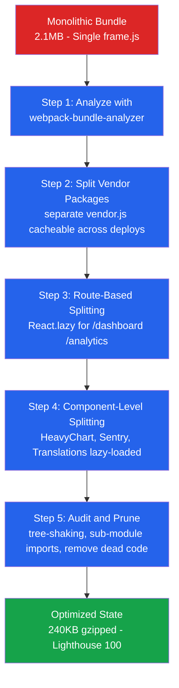

| Difficulty | Channel | Tags |
|---|---|---|
| intermediate | frontend | lighthouse, bundle, lazy-loading |

Picture this: your React app scores a 65 on Lighthouse. Time to Interactive? 4.2 seconds. Bundle size? A bloated 2.1MB of JavaScript your users never asked for. Now picture Intercom — whose Messenger widget lives on thousands of third-party websites — watching their bundle balloon to nearly 600KB of gzipped JavaScript [1]. Every kilobyte they shipped directly impacted their customers' page speed and Google search rankings. The fix? A systematic teardown of everything they assumed was necessary. The result was a 65% bundle reduction and a perfect Lighthouse score. The lesson for you: your bundle isn't just your problem — it's everyone downstream who has to bear the cost.

---

> ### Real-World Case — Intercom
>
> Intercom's Messenger widget—embedded on thousands of customer websites—had grown to nearly 600KB of gzipped JavaScript as features accumulated over the years. Since the Messenger loads on third-party sites, its bundle size directly impacts their customers' page speed and Google search rankings, making this a critical business problem.
>
> | | |
> |---|---|
> | **Challenge** | The Messenger was served as a single monolithic JavaScript file containing all application code, vendor libraries (React, Redux, Lodash), and compiled Sass stylesheets. With continuous daily deployments adding features, the bundle kept growing, causing slow load times especially on mobile (up to 14 seconds on slow 3G). |
> | **Solution** | They used webpack-bundle-analyzer to visualize the bundle and identify bloat, then applied four key optimizations: (1) Split vendor packages into a separate bundle using webpack's splitChunks so node_modules (~40% of bundle) could be cached independently across deployments; (2) Split the Messenger component by routes using Loadable, loading the main Messenger code only when users hover over the launcher; (3) Migrated CSS from Sass to Emotion (CSS-in-JS) so styles could be code-split and only loaded when the Messenger opens; (4) Optimized individual vendor packages—replaced Underscore throttle with Lodash's, switched from full `css` package to `css/lib/parse` (122KB→10KB), and used dynamic imports for translations (only loading the active locale instead of all 60KB). |
> | **Outcome** | Bundle reduced from ~600KB to 240KB gzipped (60% reduction). Lighthouse score improved from 59 to 100. On mobile, savings of 400KB shaved off up to 5 seconds on fast 3G and up to 11 seconds on slow 3G. Visitors who never open the Messenger no longer download any of its code. |
> | **Lesson** | The biggest wins came from splitting vendor bundles (enabling browser caching across deployments) and route-based code splitting (deferring the Messenger UI until user interaction). But the most counterintuitive finding was that refactoring CSS to CSS-in-JS actually reduced total bundle size by enabling style code-splitting—something impossible with traditional Sass files. Small dependency optimizations (like importing `css/lib/parse` instead of the whole `css` package) also added up significantly. |

---

## Hook — 4.2 Seconds Is an Eternity on Mobile

Here is a stat that should keep you up at night: if your Time to Interactive exceeds 3 seconds, 53% of mobile visitors will abandon your site [3]. At 4.2 seconds with a 2.1MB bundle, you are not just slow — you are actively pushing users away. And the worst part? Most of that JavaScript isn't even needed on initial load. Heavy chart libraries, analytics SDKs, feature-flag tooling, admin-only dashboards — all of it arrives in a single monolithic payload before a user can even scroll. The browser parses it, compiles it, executes it, and only then does the page become interactive. By then, the user is gone. This is the tension every frontend team faces: features pile up, bundles grow, and the Lighthouse score becomes the canary in the coal mine.

## Problem — The Silent Tax of a Monolithic Bundle

The core problem is deceptively simple but shockingly common. When a React app ships as a single JavaScript file — what Intercom historically called `frame.js` — every user downloads everything on every page load [1]. The 40% vendor chunk? Re-downloaded on every new deploy even though React, Redux, and Lodash rarely change. The 2000+ line Sass stylesheet? Downloaded and parsed even when the user never opens the messenger. The Sentry error tracker that fires once in a blue moon? Sitting in the bundle from byte one. This monolithic approach creates a cascading failure across the performance chain. According to MDN's browser rendering model, the browser must download, parse, compile, and execute JavaScript before the main thread becomes available for user interactions [3]. The larger the bundle, the longer that main thread is blocked, the worse Time to Interactive gets, and the lower your Lighthouse score drops. For a 2.1MB bundle, you are looking at roughly 4.2 seconds of blocked main thread on average connections. On slow 3G — still a reality for a significant portion of global internet users — that figure can balloon past 11 seconds [1]. The business impact compounds: bounce rates spike, conversions drop, and for companies like Intercom whose product IS the JavaScript, customer satisfaction tanks across their entire install base.

## Real-World Case — How Intercom Reclaimed 600KB of Bundle Bloat

Intercom's Messenger widget was embedded on thousands of customer websites as a React.js app with many components, third-party libraries, and stylesheets [1]. Over years of shipping features daily, the bundle had grown from 400KB to nearly 600KB of gzipped JavaScript. Since the Messenger loads on third-party sites, its size directly impacted their customers' Core Web Vitals and Google search rankings — a business problem that affected thousands of businesses simultaneously. Their investigation revealed three main culprits: `node_modules` (vendor libraries), `app` code (React components), and stylesheets. They applied a four-pronged optimization strategy: (1) splitting vendor packages into a separate cached bundle using webpack's `splitChunks` configuration, (2) code-splitting the application by routes using a modified Loadable component with preloading on launcher hover, (3) migrating from Sass to CSS-in-JS with Emotion to statically link styles to components for bundle splitting support, and (4) ruthlessly auditing vendor dependencies — replacing full Lodash imports with tree-shaken subsets (25KB to 11.7KB), moving Sentry to lazy-loading (saving 25KB), removing the PSL package by offloading logic to the server (saving 36KB), and dynamically importing only the active locale instead of all translations (saving 55KB) [1]. The results were dramatic: 600KB reduced to 240KB gzipped, a 60% reduction. Lighthouse score jumped from 59 to 100. On mobile, savings of 400KB shaved up to 5 seconds off fast 3G load times and up to 11 seconds on slow 3G. Visitors who never opened the Messenger no longer downloaded any of its code at all.

## Deep Dive — Understanding the Performance Chain You Are Breaking

To understand why these optimizations matter, you need to grasp how browsers actually work. When a browser receives JavaScript, it goes through a critical rendering path: download → parse → compile → execute → layout → paint → compositing [3]. At every stage, a larger bundle means more work, more blocking, and more time before the user can interact. Let us break down the specific mechanisms at play:

**Tree Shaking and Dead Code Elimination** — Webpack's tree shaking relies on ES module static analysis [4]. When you write `import { throttle } from 'lodash'`, webpack can only shake off unused exports if the import is a named import from an ES module. Importing an entire library from CommonJS (`const _ = require('lodash')`) defeats this entirely. Intercom's switch to `babel-plugin-lodash` and direct sub-path imports like `CSS/lib/parse` instead of `CSS` enabled webpack to strip unused code [1]. The `sideEffects` flag in `package.json` is the key signal that tells webpack a module can be safely tree-shaken — without it, webpack must include the entire module.

**Code Splitting vs. Lazy Loading** — These are related but distinct concepts. Code splitting is the build-time act of splitting one bundle into multiple chunks. Lazy loading is the runtime strategy of deferring when those chunks are fetched. React.lazy() combines both: it tells webpack to create a separate chunk and React to only fetch it when the component is needed [5]. Route-based splitting is the coarsest granularity — you split `/dashboard` from `/analytics` — while component-based splitting is finer, isolating a `HeavyChart` widget that only a subset of users interact with [6].

**Caching and Invalidation** — Intercom's vendor splitting was not just about size reduction; it was about caching strategy. Since vendor packages change rarely but the app bundle changes on every deploy, separating them means the browser caches `vendor.js` across deploys. Returning visitors only re-download the smaller `frame.js` [1]. This is a force multiplier: the initial load AND every subsequent load improve.

**The CSS Tax** — Intercom's Sass stylesheet had over 4,000 rules that browsers downloaded and parsed on every load, even when most rules were irrelevant to the current view [1]. CSS-in-JS with Emotion solves this by statically linking styles to components, enabling styles to be split alongside code. This is not about performance philosophy — it is about the browser parsing overhead of unused CSS rules that block rendering [3].

## Workflow — The 5-Step Bundle Optimization Pipeline

Here is the systematic workflow to take your app from bloated to lean. Each step builds on the previous one — skip a step and you miss compounding gains.

**Step 1: Analyze the Bundle** — Install `webpack-bundle-analyzer` and generate a treemap visualization. Identify the three largest categories: vendor libraries, application code, and styles. This is your map. You cannot optimize what you cannot see.

**Step 2: Split Vendor Packages** — Configure webpack `splitChunks` to separate `node_modules` into a dedicated bundle. Mark vendor code as cacheable across deploys.

**Step 3: Code Split by Route** — Wrap each route component in `React.lazy()` with a `Suspense` boundary. Add a loading state and error boundary. This gives you route-level granularity instantly.

**Step 4: Code Split by Component** — Identify heavy components (charts, editors, maps) and non-critical features (analytics, error tracking, A/B testing). Wrap them in `React.lazy()` too. Consider preloading on hover or intersection for zero-latency UX.

**Step 5: Audit and Prune** — Replace full library imports with targeted sub-module imports. Check every dependency for `sideEffects` configuration. Remove or lazy-load anything that is not needed on initial render.

## Code Example — Implementing Route and Component Lazy Loading

Here is a production-grade implementation pattern for code splitting a React app, incorporating error boundaries, loading states, and preloading strategies inspired by Intercom's approach [1][5][6]:

## Lessons Learned — What Intercom's 65% Reduction Teaches You

The journey from 600KB to 240KB reveals several principles that apply to any React app, regardless of scale.

**Start with the analyzer, not assumptions.** Many developers guess at what is bloating their bundle. Intercom's team opened webpack-bundle-analyzer and immediately saw that node_modules comprised 40% of the bundle, Sass stylesheets were half of the app chunk, and several libraries were imported in their entirety [1]. Data beats intuition every time.

**Vendor splitting is free performance.** This is the lowest-effort, highest-impact optimization you can make. Configure webpack `splitChunks`, separate your vendor bundle, and returning visitors instantly benefit from caching. Intercom deployed dozens of times per day — every deploy triggered a re-download of the full bundle. After splitting, only the app chunk needed re-fetching [1].

**The lazy-load-on-hover trick is underrated.** Intercom preloaded the Messenger bundle the moment a user hovered over the launcher, eliminating the latency cost of code splitting without sacrificing the size reduction [1]. This pattern works anywhere you have a predictable user intent signal: hover, focus, or viewport intersection.

**Audit vendor imports ruthlessly.** Intercom removed Underscore (duplicating Lodash's throttle), switched from importing all of `CSS` to just `CSS/lib/parse` (10KB to 1.7KB), moved PSL's domain logic to the server, and dynamically imported only the active locale from their translations package [1]. Each change was small, but the compound effect was massive.

**CSS-in-JS is not just a styling choice.** When your styles are co-located with components, the bundler can split them together. Intercom's Sass stylesheet with 4,000+ rules was downloaded and parsed by every visitor regardless of what they needed [1]. CSS-in-JS eliminates this waste at the architectural level.

**Do not stop at one optimization pass.** Intercom's bundle is a living system — new features are added daily. Without ongoing discipline (bundle size budgets, CI checks, continued tree-shaking vigilance), the bloat will return. Make bundle health part of your team's definition of done [1].

---

## Bundle Optimization Pipeline

<strong>Original Interview Question</strong>

**Q:** You're tasked with improving a React app's Lighthouse performance score from 65 to 90+. The bundle size is 2.1MB and Time to Interactive is 4.2s. What specific steps would you take to optimize the bundle and implement lazy loading?

**A:** Implement code splitting with React.lazy() and Suspense, analyze bundle composition with webpack-bundle-analyzer to identify largest chunks, remove unused dependencies and optimize imports, add dynamic imports for heavy components and third-party libraries, implement route-based splitting for better initial load times, and utilize tree shaking with proper ES module configuration.

## Conclusion

Intercom went from 59 to 100 on Lighthouse by treating bundle size as a first-class engineering problem, not a performance afterthought. The 5-step pipeline — analyze, split vendors, code split by route, split by component, and prune dead code — is not a one-time fix. It is a discipline. Every new dependency is potential bloat. Every import is a decision between eager loading and lazy loading. Every style is either co-located with its component or dumped into a global stylesheet that blocks rendering. Start tomorrow by running `webpack-bundle-analyzer` on your own app. You will likely find the same pattern Intercom did: a handful of oversized vendor imports, a few rarely-used features loaded on every page, and a stylesheet that grows unchecked. Fix those three things and you will be shocked how far a Lighthouse score can climb.

---

## References

1. [Reducing the Intercom Messenger bundle size by 65%](https://www.intercom.com/blog/reducing-intercom-messenger-bundle-size/) — blog
2. [React.lazy API Reference](https://react.dev/reference/react/lazy) — documentation
3. [Populating the page: how browsers work — MDN Web Docs](https://developer.mozilla.org/en-US/docs/Web/Performance/Guides/How_browsers_work) — documentation
4. [import — JavaScript | MDN Web Docs](https://developer.mozilla.org/en-US/docs/Web/JavaScript/Reference/Statements/import) — documentation
5. [Code-Splitting — React Documentation](https://react.dev/learn/code-splitting) — documentation
6. [Lazy Loading — MDN Web Docs](https://developer.mozilla.org/en-US/docs/Web/Performance/Guides/Lazy_loading) — documentation
7. [webpack-bundle-analyzer GitHub Repository](https://github.com/webpack-contrib/webpack-bundle-analyzer) — documentation
8. [Tree Shaking — webpack Documentation](https://webpack.js.org/guides/tree-shaking/) — documentation
9. [SplitChunksPlugin — webpack Documentation](https://webpack.js.org/plugins/split-chunks-plugin/) — documentation

---

**Author:** Satishkumar Dhule — [GitHub](https://github.com/satishkumar-dhule) · [LinkedIn](https://linkedin.com/in/satishkumar-dhule) · [Website](https://satishkumar-dhule.github.io)
