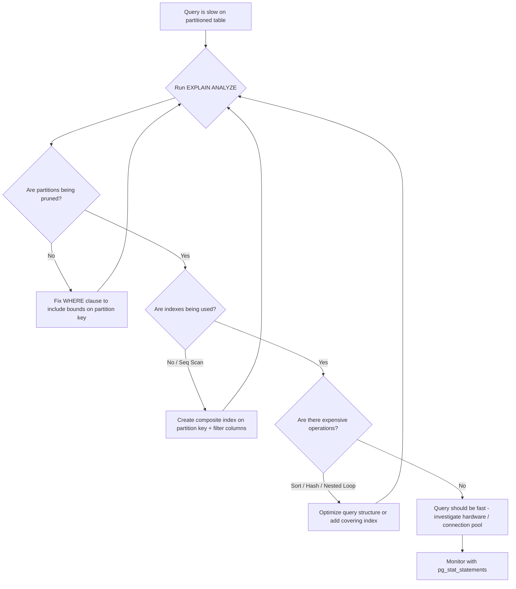

| Difficulty | Channel | Tags |
|---|---|---|
| intermediate | database | explain, query-plan, partitioning |

Picture this: your PostgreSQL table has 100 million rows, it's partitioned by date, and you've done everything "right." Yet a simple date-range query still crawls. Sound familiar? You're not alone — CoinGecko hit this exact wall with a 1TB crypto price table, watching p99 latencies balloon past 4 seconds before discovering that partitioning can actually make things worse if you're not careful [1]. The devil isn't just in the details; it's in the EXPLAIN plan.

---

> ### Real-World Case — CoinGecko
>
> CoinGecko's engineering team had a PostgreSQL table storing 8+ years of hourly crypto price data that grew to over 1TB. The table was becoming a production bottleneck: average query times exceeded 30 seconds, IOPS was maxed out at 24K with daily breach alerts, Apdex scores were dropping, and the daily revenue report took 14 seconds on a 18GB index scan across 500M rows.
>
> | | |
> |---|---|
> | **Challenge** | A single unpartitioned table storing hourly price data for 8+ years became too large to query efficiently. Indexes couldn't solve the problem due to a JSONB column with varying keys across applications. IOPS was being consumed so heavily that replica lag and request queues were degrading the API's responsiveness. |
> | **Solution** | They implemented PostgreSQL range partitioning by month, creating separate physical partitions for each month of data. They used Foreign Data Wrappers to prewarm the partitioned table from a separate host to avoid production IOPS impact during migration. After migration, queries pruned to only the relevant monthly partitions instead of scanning the entire 1TB table. |
> | **Outcome** | p99 response time dropped from 4.13s to 578ms (86% reduction). IOPS usage decreased by 20%, multiplied across multiple replicas. However, they discovered a critical regression: one query structured as `created_at > ?` without an upper date limit scanned ALL partitions including empty future ones, performing WORSE than on the unpartitioned table. Fixing the query by adding an upper bound restored performance. |
> | **Lesson** | Partition pruning only works when the query provides clean, complete predicates on the partition key. A query with only a lower bound (`created_at > X`) forces scanning every partition including empty future ones — the partitioned table can perform worse than a non-partitioned one. You must provide both upper and lower bounds for effective pruning. |

---

## The Hidden Trap Lurking in Your Partitioned Table

Everyone tells you partitioning is the silver bullet for large tables. And they're right — up to a point. The real danger emerges when you partition a table and assume the database will automatically skip irrelevant partitions during every query. It doesn't always work that way. A partitioned table without proper index strategy, without understanding partition pruning, and without careful query design can perform worse than the original monolithic table. The stakes are real: if your daily revenue report takes 14 seconds and your IOPS are maxed at 24,000 with breach alerts firing every day, you're not optimizing — you're firefighting.

## The Problem — Why Partitioned Tables Still Run Slow

Here's the core tension. You partitioned your table by date because that's what the docs recommend for time-series data. But now queries filtering on a specific date range are still slow. The reasons are almost always the same: partition pruning isn't happening (PostgreSQL is scanning all partitions anyway), indexes are missing or misaligned with your query patterns, or the planner is choosing sequential scans because the optimizer thinks it's cheaper. Many developers discover that creating a partitioned table is the easy part — making it actually performant requires understanding how the planner interacts with partitions at a deeper level. The uncomfortable truth: partitioning trades one set of problems (large table scans) for another (partition management overhead, index proliferation, query regression) if you're not intentional about it [2].

## Real-World Case — CoinGecko's 1TB Wake-Up Call

CoinGecko, the cryptocurrency data aggregator, found themselves in exactly this nightmare. Their PostgreSQL table storing 8+ years of hourly crypto price data had ballooned to over 1TB. Average query times exceeded 30 seconds, IOPS was maxed out at 24K with daily breach alerts, and Apdex scores were tanking. Their daily revenue report — a query scanning 500M rows across an 18GB index — took 14 seconds on its own [1].

The team implemented table partitioning and saw dramatic improvements: p99 response time dropped from 4.13s to 578ms (an 86% reduction), and IOPS usage decreased by 20% across multiple replicas [1]. But here's where the story gets interesting — they discovered a critical regression. One query structured as `created_at > ?` without an upper date limit was scanning ALL partitions, including empty future ones, performing worse than on the unpartitioned table. The fix? Adding an upper bound to the date range restored performance [1].

This isn't a CoinGecko-specific problem. It's a trap that catches teams at every scale. Partition pruning only works when PostgreSQL can determine which partitions to skip, and that requires your queries to provide enough information for the planner to make that decision.

## Deep Dive — Partition Pruning, Indexes, and the EXPLAIN Plan

To diagnose slow queries on partitioned tables, you need to become fluent in reading EXPLAIN plans. Let's break down the three culprits that almost always explain why a partitioned query is still slow.

**Partition Pruning** is the mechanism by which PostgreSQL skips partitions that don't match your query's filter. For pruning to work, your WHERE clause must reference the partition key directly. A query like `WHERE event_date BETWEEN '2024-01-01' AND '2024-01-31'` will prune effectively. But `WHERE event_date > '2024-01-01'` without an upper bound — like CoinGecko discovered — forces the planner to scan every partition, including future empty ones [1][3].

**Index Utilization** matters per-partition. Each partition has its own indexes. If you created a single-column index on `event_date` but your query filters on `(event_date, status)`, PostgreSQL may still fall back to a sequential scan within each partition because the index doesn't cover your filter. This is why composite indexes on `(date, filtered_columns)` are critical — they allow the planner to use index-only scans instead of heap fetches [4].

**Expensive Operations** often hide in plain sight. Sort operations, hash aggregates, and nested loops can dominate query cost even when partition pruning is working perfectly. The EXPLAIN (ANALYZE, BUFFERS) output will show these as nodes with disproportionate cost or actual time. For example, a hash aggregate processing 500M rows after pruning will still be slow if the intermediate result set is large.

The key insight: partitioning reduces the data volume, but it doesn't eliminate the need for proper indexing or query design. You still need to optimize within each partition.

## Workflow — The 5-Step Diagnosis for Slow Partitioned Queries

When a query on a partitioned table is slower than expected, follow this systematic workflow:

Step 1: Run `EXPLAIN (ANALYZE, BUFFERS)` on your slow query. This gives you actual execution times, buffer usage, and row estimates — not just the planner's guesses.

Step 2: Check partition pruning. In the plan output, look for "Subplans Removed" or verify that only relevant partitions appear as scan nodes. If all partitions show up, your WHERE clause isn't pruning effectively.

Step 3: Verify index usage. Each partition scan should show "Index Scan" or "Index Only Scan." If you see "Seq Scan," the index isn't matching your query pattern.

Step 4: Look for expensive operations. Sort nodes with large row counts, hash aggregates over massive inputs, and nested loops with high iteration counts are red flags.

Step 5: Iterate. After each change — new index, query rewrite, or configuration tweak — re-run EXPLAIN ANALYZE to verify the improvement. Optimization is iterative, not one-shot.

## Code Example — Diagnosing and Fixing the Slow Query

Let's walk through the actual SQL you'd run to diagnose and fix a slow partitioned query. This example mirrors the CoinGecko scenario: a large events table partitioned by `event_date`, with queries filtering on date range and status.

## Lessons Learned — What to Do Differently Tomorrow

The CoinGecko story and the broader pattern of slow partitioned queries teach several lessons that apply to any team managing large PostgreSQL tables:

**1. Partition Pruning Is Fragile.** It requires your queries to provide complete bounds on the partition key. An open-ended `>` query is a regression waiting to happen. Always use `BETWEEN` or explicit upper and lower bounds [1][3].

**2. Composite Indexes Are Non-Negotiable.** A single-column index on your partition key won't save you if your queries filter on additional columns. Create composite indexes that match your actual query patterns — `(date, status)`, not just `(date)` [4][5].

**3. EXPLAIN ANALYZE Is Your Best Friend.** Don't guess. Run `EXPLAIN (ANALYZE, BUFFERS)` on every slow query. The actual execution plan tells you exactly what PostgreSQL did — not what you think it did [2].

**4. Partitioning Is Not a Set-and-Forget Strategy.** As your data grows and query patterns evolve, you need to revisit indexes, review partition sizes, and monitor for regressions. The team at CoinGecko discovered this the hard way when their unbounded query performed worse than on the unpartitioned table [1].

**5. Benchmark Before and After.** The 86% latency reduction CoinGecko achieved didn't happen by accident — it came from measuring, iterating, and validating each change [1]. If you're not measuring, you're not optimizing.

The bottom line: partitioning by date is a powerful tool, but it's a starting point, not a finish line. Pair it with composite indexes, bounded queries, and continuous monitoring, and your 100M-row table will behave like it has 1M rows.

---

## Slow Partitioned Query Diagnosis Workflow

<strong>Original Interview Question</strong>

**Q:** You have a PostgreSQL table with 100M rows partitioned by date. A query filtering on a specific date range is still slow. What would you check in the EXPLAIN plan and how would you optimize it?

**A:** Check partition pruning effectiveness, index utilization patterns, and expensive sort operations. Create composite indexes on (date, filtered_columns) and evaluate clustering strategies for optimal data access.

## Conclusion

The next time a query on your partitioned table is slow, resist the urge to throw more hardware at it. Open the EXPLAIN plan. Check whether pruning is happening. Verify your indexes match your query patterns. And above all, make sure your queries provide complete bounds on the partition key — one open-ended `>` can undo everything partitioning gave you. CoinGecko proved that the right diagnosis can cut p99 latency by 86% [1]. Your 100M-row table deserves the same treatment. Start with EXPLAIN ANALYZE today.

---

## References

1. [Scaling PostgreSQL Performance with Table Partitioning — CoinGecko Engineering](https://amree.dev/2025/06/13/scaling-postgresql-performance-with-table-partitioning/) — blog
2. [PostgreSQL Documentation: Using EXPLAIN](https://www.postgresql.org/docs/current/using-explain.html) — documentation
3. [PostgreSQL Documentation: Partitioning](https://www.postgresql.org/docs/current/ddl-partitioning.html) — documentation
4. [PostgreSQL Documentation: Indexes](https://www.postgresql.org/docs/current/indexes.html) — documentation
5. [The Range Type and Range partitioning in PostgreSQL](https://www.postgresql.org/docs/current/rangetypes.html) — documentation
6. [pg_repack — Reorganize PostgreSQL tables online](https://github.com/reorg/pg_repack) — documentation
7. [pg_stat_statements — Track execution statistics of all SQL queries](https://www.postgresql.org/docs/current/pgstatstatements.html) — documentation
8. [CREATE INDEX — PostgreSQL Documentation](https://www.postgresql.org/docs/current/sql-createindex.html) — documentation

---

**Author:** Satishkumar Dhule — [GitHub](https://github.com/satishkumar-dhule) · [LinkedIn](https://linkedin.com/in/satishkumar-dhule) · [Website](https://satishkumar-dhule.github.io)
