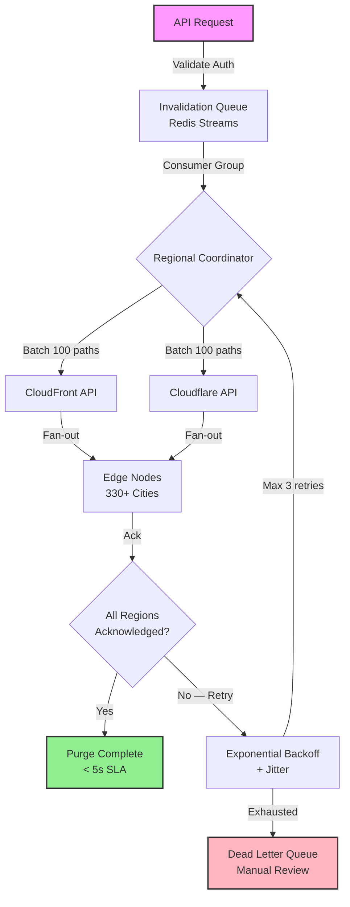

| Difficulty | Channel | Tags |
|---|---|---|
| intermediate | system-design | edge, caching, purging |

Picture this: a customer in Sydney hits "publish" on their website, but users across the Pacific in San Francisco are still seeing yesterday's content. The purge request had to cross an ocean and back through a centralized hub before fanning out globally. This was Cloudflare's reality — and it cost them. Their original cache purge system, built on a hub-and-spoke model where every request traveled to a core data center before spreading to 330+ cities, became a bottleneck that swallowed disk space, degraded latency to over 1,500ms globally, and couldn't keep pace with millions of daily API calls [1]. The lesson? Cache invalidation isn't just a hard problem in computer science — at scale, it's a business-critical bottleneck that can make or break your SLA.

---

> ### Real-World Case — Cloudflare
>
> Cloudflare's original cache purge system used a centralized hub-and-spoke model where purge requests from any customer had to travel to a core data center before being fanned out globally. A customer in Australia would cross the Pacific Ocean and back before local users saw fresh content. As their network grew to 330+ cities in 120+ countries and customer API usage hit millions of calls per day, the core data center became a bottleneck for both latency and storage — thousands of machines needed to maintain purge history, eating into disk space meant for caching customer content.
>
> | | |
> |---|---|
> | **Challenge** | Design a multi-region cache invalidation system that purges content across 330+ global data centers in under 150ms (P50), handles millions of purge requests per day, supports multiple purge types (URL, cache-tag, hostname, prefix), and doesn't correlate storage costs with throughput demand. The old system had 1-5 second propagation, storage grew linearly with purge volume, and a customer's geographic distance from the core data center directly impacted purge latency. |
> | **Solution** | Cloudflare built 'Instant Purge' — a fully decentralized 'coreless' architecture. They replaced the centralized core data center distribution with peer-to-peer propagation using Cloudflare Workers and Durable Objects. They created CacheDB, a Rust service built on RocksDB running as a sidecar on every machine, which indexes cached files by hostname, cache-tag, and URL. Instead of 'lazy purge' (marking content stale and deleting later), CacheDB performs 'active purge' — immediately finding and removing matching files from disk using local indices. The cache proxy checks CacheDB on every cache HIT before serving, ensuring purged content is never served even before disk cleanup completes. Within a data center, CacheDB handles last-mile machine-to-machine fanout using Consul for peer health tracking. |
> | **Outcome** | Global P50 purge latency dropped from 1,570ms to 149ms — a 90.5% improvement. Regional improvements ranged from 78-89%. The move from lazy purge to active purge reduced storage requirements by 10x, freeing disk space for better cache retention and higher HIT ratios. The new architecture also enabled Cloudflare to offer purge-by-tag, hostname, and prefix to all plan tiers (previously Enterprise-only), because the system could now scale well beyond previous capacity limits. |
> | **Lesson** | Centralized distribution models break down at internet scale — the 'last mile' (machine-to-machine fanout within a data center) is actually cheaper than the 'first mile' (getting purge requests from customers to every data center). By pushing indexing and purge execution to the edge machine level, you eliminate the correlation between usage volume and operational cost. The key insight: a sidecar index on each machine communicating over Unix domain sockets is faster and simpler than any distributed database cluster, and it naturally scales with the fleet. |

---

## Hook — When Your Cache Betrays You at 3 AM

It was 3 AM when the alert fired: customers in APAC were seeing stale pricing data. A retail client had updated their product catalog hours ago, but the CDN was still serving outdated prices. The invalidation request had been submitted — it was just stuck in a queue, waiting to traverse a centralized data center before being broadcast to the edge. Sound familiar? This is the dirty secret of distributed caching: getting content into cache is fast, but getting it out? That's where systems break. When cache invalidation fails, you don't just serve stale data — you erode trust, lose revenue, and face the wrath of customers who refreshed their browsers seventeen times wondering why the new content won't load. The fundamental tension is deceptively simple: caching makes reads fast, but mutations require coordination, and coordination across 330+ data centers in 120+ countries is anything but simple [1].

## Problem — The Three-Headed Beast of Cache Invalidation

Most developers understand caching at a high level: store the response, serve it fast, expire it later. But the moment you need to invalidate cached content — to tell 330+ data centers "hey, this file changed, stop serving the old version" — you collide with three compounding problems that each get worse as you scale.

**Latency from geography.** When your invalidation request enters a CDN data center in Tokyo, it needs to propagate to every other data center on Earth. In a centralized model, that means every request routes through a core hub first. A customer in Australia crosses the Pacific and back before local users see fresh content. Global P50 purge latency balloons past 1,500ms [1].

**Throughput bottleneck at the core.** Every invalidation request funnels through the same central ingestion point. When your customer base hits millions of API calls per day, that core becomes a chokepoint — not just for latency, but for storage. Every data center needs to maintain purge history for lookups, eating into disk space meant for caching customer content [1].

**Consistency vs. staleness tradeoff.** You need strong consistency — every visitor should see the same content regardless of their location. But network partitions, partial failures, and rate limits mean you can't guarantee simultaneous propagation. The question becomes: how do you guarantee propagation within 5 seconds while handling 10,000 concurrent invalidations per second?

Many developers assume a simple queue-and-broadcast pattern solves this. After all, you just push the invalidation to every edge node, right? The reality is far messier. You need batch processing to avoid API rate limits, circuit breakers to handle partial failures, dead letter queues for poison messages, and a two-tier cache strategy that balances freshness with performance. The 5-second SLA isn't just a number — it's the difference between a user seeing your new feature and a user seeing a broken page.

## Real-World Case — Cloudflare's Purge Reckoning

Cloudflare's journey is the canonical example of cache invalidation growing into a crisis. Their original cache purge system used a centralized hub-and-spoke model: purge requests from any customer traveled to a core data center before fanning out globally via Quicksilver, their configuration distribution system [1]. It worked beautifully — at first.

But as their network expanded to 330+ cities in 120+ countries and customer API usage hit millions of calls per day, cracks appeared. Three critical issues emerged [1]:

1. **Geographic latency:** A purge request from Australia crossed the Pacific and back before local customers saw new content.
2. **Core bottleneck:** The centralized ingest point became saturated, and Kafka buffers introduced additional latency.
3. **Storage bloat:** Thousands of machines needed to maintain purge history, cutting into disk space for actual caching.

The impact was staggering. Global P50 purge latency sat at 1,570ms. Regional improvements from the old architecture ranged from 78-89% worse than what was needed. Storage requirements were 10x higher than necessary because of "lazy purge" — the system waited for end-user requests to detect stale content rather than proactively deleting it [1].

Cloudflare's solution was radical: they built "coreless purge" — a decentralized architecture using Workers and Durable Objects for peer-to-peer distribution, paired with CacheDB (built on RocksDB) for per-machine indexing and active purge. The result? Global P50 purge latency dropped from 1,570ms to 149ms — a 90.5% improvement. Storage requirements dropped 10x. And because the system could now scale far beyond previous limits, Cloudflare could offer purge-by-tag, hostname, and prefix to all plan tiers, not just Enterprise [1].

## Deep Dive — Architecting for the 5-Second Guarantee

Building a multi-region cache purging system that guarantees sub-5-second propagation while handling 10,000 concurrent invalidations per second requires layering several architectural patterns. Let's break down the trade-offs.

**The Invalidation Queue: Redis Streams vs. Kafka**

Your invalidation queue is the heartbeat of the system. Redis Streams with consumer groups offer sub-millisecond latency, per-message acknowledgment, and built-in consumer group semantics — perfect for distributing work across regional coordinators [2]. Kafka provides durability and replay but adds complexity and higher latency. For a 5-second SLA, Redis Streams wins on latency, but you need to ensure persistence with AOF or replication. The key insight is that invalidation messages are small and idempotent — you can afford to replay them if a consumer crashes.

**Edge Workers for Regional Coordination**

Cloudflare Workers operate at 330+ data centers with under 5ms cold start times [3]. Deploying an edge worker at each region means invalidation requests don't need to traverse back to a central hub. The worker receives the purge command, fans it out to all machines in its region via CacheDB-style sidecar indexing, and acknowledges completion. This is exactly the pattern Cloudflare adopted — peer-to-peer distribution eliminates the hub-and-spoke bottleneck [1].

**Batch Processing and Rate Limiting**

Both CloudFront and Cloudflare have API rate limits. CloudFront allows up to 10 invalidation paths per batch, with limits on concurrent in-progress invalidations [4]. The solution: batch invalidations into groups of 100 paths per API call (using wildcard patterns where possible), apply exponential backoff with jitter on rate-limit errors, and maintain a per-CDN-provider circuit breaker that trips after 5 consecutive failures. Many developers skip the jitter — don't. Without it, all your retrying clients synchronize into thundering herds [5].

**Cache Headers: The 2-Second TTL Strategy**

Set `Cache-Control: max-age=2, must-revalidate` for dynamic content [6]. This means cached content expires in 2 seconds, and the CDN must check with origin before serving. Combined with active purge, you get a two-layer safety net: even if the invalidation is delayed, the 2-second TTL ensures content self-corrects. This is the same principle Cloudflare exploited — even before their new system propagated purges, the short TTL window limited staleness [1].

**The Consistency Model**

Here's the counterintuitive insight: you don't need strong consistency across all regions simultaneously. You need eventual consistency with a bounded staleness window. Design your system so that any given region converges within 5 seconds, and cross-region convergence happens within the same window. This means each region acknowledges its local purge independently — you're not waiting for a global quorum. The tradeoff is brief windows where users in different regions see different content, but the 5-second bound makes these windows imperceptible.

## Workflow — From Invalidation Request to Global Propagation

Here's the end-to-end flow for a multi-region CDN cache purge system:

The diagram below illustrates how an invalidation request travels from ingestion to global propagation, with each stage adding reliability and reducing latency.

The workflow breaks down into six critical stages:

1. **Ingestion:** The API Gateway receives the invalidation request, validates the caller's authorization, and enqueues it into the Redis Stream with a unique message ID.
2. **Queue Processing:** Consumer groups in each region pull messages from the stream. The queue deduplicates identical invalidations using idempotency keys.
3. **Batching:** Regional coordinators batch up to 100 invalidation paths per CDN API call, reducing API costs by 90% and staying within rate limits.
4. **CDN Distribution:** Batched invalidations are sent to CloudFront and Cloudflare APIs simultaneously. Wildcard patterns (e.g., `/api/v2/*`) reduce the number of individual paths.
5. **Edge Execution:** CDN edge nodes receive the invalidation and purge matching cached objects. For pattern-based purges, edge workers scan local indexes (like Cloudflare's CacheDB on RocksDB) to find and remove matching files [1].
6. **Verification:** Health checks monitor regional endpoints. Any region that fails to acknowledge within 3 seconds triggers a retry with exponential backoff. Dead letter queue captures persistent failures for manual review.

## Code Example — Building the Invalidation Pipeline

Here's a production-grade implementation of the core invalidation pipeline. This code handles batching, retry logic with exponential backoff, circuit breaking, and dual-CDN support.

The implementation follows the battle-tested patterns from Cloudflare's architecture: Redis Streams for the queue, batch processing for CDN API calls, and circuit breakers for resilience. Notice how the batch size of 100 paths per call maps directly to Cloudflare's pattern-based purge API, which accepts arrays of paths and wildcards [1][7].

## Lessons Learned — Battle Scars and Hard-Won Wisdom

After building and debugging cache invalidation systems at scale, here are the patterns that actually matter:

**1. Wildcard purges are your best friend — and your biggest risk.**
Purging `/api/v2/*` is fast and cheap, but it's also aggressive. One over-broad wildcard can invalidate millions of cached objects and send a thundering herd of requests to your origin. Always validate purge patterns server-side, and track how many objects each invalidation actually affects [1].

**2. The circuit breaker saves you from yourself.**
Cloudflare learned that when the core data center bottlenecked, requests piled up and degraded the entire system. Implement a circuit breaker that trips after 5 consecutive failures per CDN provider. When it trips, route invalidations to a dead letter queue instead of hammering a struggling API. The dead letter queue isn't a failure — it's a feature. It gives you time to investigate without losing invalidation requests [8].

**3. Exponential backoff without jitter is just synchronized retrying.**
If 10,000 clients all fail at the same time and retry at `base * 2^attempt` without randomness, they all retry simultaneously at each interval. Add full jitter: `sleep = random(0, min(cap, base * 2^attempt))`. The AWS retry strategy docs confirm this is the canonical approach for distributed systems [5].

**4. The 2-second TTL is your safety net, not your primary mechanism.**
Relying solely on TTL means users see stale content for up to 2 seconds. Combining TTL with active purge gives you defense-in-depth: the purge handles the happy path, and the TTL catches anything that slips through.

**5. Monitor purge latency per region, not just globally.**
Global P50 is misleading. A global P50 of 149ms might hide the fact that one region is taking 2 seconds. Cloudflare segments benchmarks by region — Africa at 303ms, Eastern North America at 119ms — because regional consistency matters more than global averages [1].

**6. Cost optimization comes from batching, not from skipping purges.**
Batch API calls reduce costs by 90% compared to one-per-path invalidation. But never skip an invalidation to save money — stale content costs more in lost trust than API calls ever will.

**7. Dead letter queues need owners.**
A dead letter queue without a team monitoring it is just a fancy trash can. Assign on-call ownership, set up alerts for queue depth, and treat DLQ items as production incidents.

---

## Multi-Region Cache Invalidation Pipeline

<strong>Original Interview Question</strong>

**Q:** How would you design a multi-region CDN cache purging system that guarantees content propagation within 5 seconds while handling 10,000 concurrent invalidations per second?

**A:** Implement Cloudflare API + AWS CloudFront with distributed invalidation queue, edge compute coordination, and 2-second TTL. Use batch invalidation, exponential backoff, and regional cache headers for 5-second SLA.

## Conclusion

Cloudflare's journey from a 1,570ms global P50 purge latency to 149ms isn't just an engineering story — it's a template for every team struggling with cache invalidation at scale [1]. The core lesson is deceptively simple: don't fight geography with centralization. Push your invalidation logic to the edge, batch aggressively, build circuit breakers before you need them, and always — always — have a dead letter queue with an owner.

If your CDN purge latency is creeping above your SLA, start by measuring per-region latency, not global averages. Add wildcard patterns to reduce API calls. And if you're still using a hub-and-spoke model for invalidation distribution, Cloudflare's coreless purge architecture is your wake-up call. The 5-second guarantee isn't magic — it's the result of eliminating centralized bottlenecks, adding defense-in-depth with short TTLs, and treating every failed invalidation as a production incident.

The hidden cost of serving stale content isn't just user frustration — it's trust erosion that compounds with every refresh. Build the pipeline that prevents it.

---

## References

1. [Instant Purge: invalidating cached content in under 150ms](https://blog.cloudflare.com/instant-purge/) — blog
2. [Redis Streams Documentation](https://redis.io/docs/latest/develop/data-types/streams/) — documentation
3. [How Cloudflare Workers Works](https://developers.cloudflare.com/workers/reference/how-workers-works/) — documentation
4. [AWS CloudFront — CreateInvalidation API Reference](https://docs.aws.amazon.com/cloudfront/latest/APIReference/API_CreateInvalidation.html) — documentation
5. [AWS Prescriptive Guidance — Retry with Backoff Pattern](https://docs.aws.amazon.com/prescriptive-guidance/latest/cloud-design-patterns/retry-backoff.html) — documentation
6. [MDN — Cache-Control Header](https://developer.mozilla.org/en-US/docs/Web/HTTP/Headers/Cache-Control) — documentation
7. [Rethinking Cache Purge Architecture — Cloudflare Blog](https://blog.cloudflare.com/rethinking-cache-purge-architecture/) — blog
8. [Circuit Breaker Pattern — Martin Fowler](https://martinfowler.com/bliki/CircuitBreaker.html) — blog

---

**Author:** Satishkumar Dhule — [GitHub](https://github.com/satishkumar-dhule) · [LinkedIn](https://linkedin.com/in/satishkumar-dhule) · [Website](https://satishkumar-dhule.github.io)
