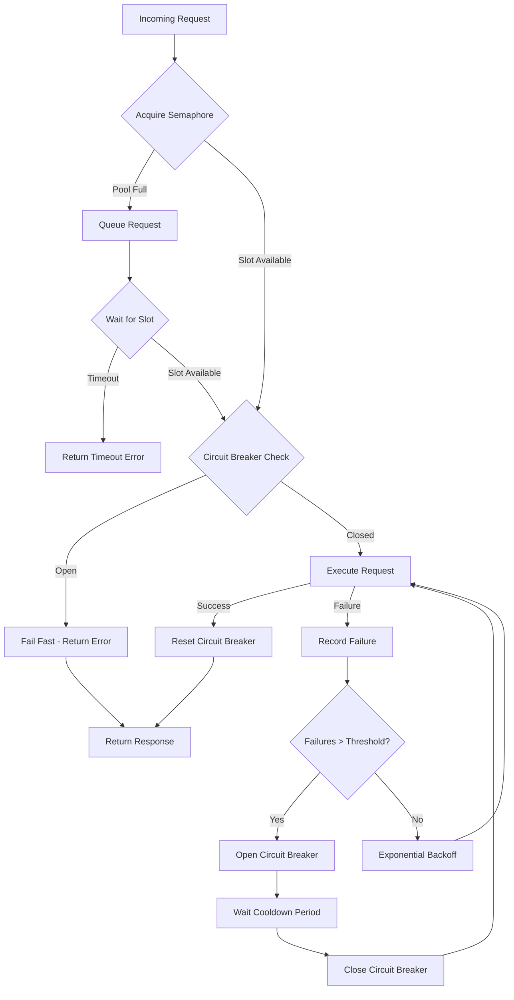

| Difficulty | Channel | Tags |
|---|---|---|
| advanced | backend | asyncio, aiohttp, concurrency |

In April 2011, AWS experienced a major EBS outage in US-East-1. Netflix's Personalization, Bookmark, and Rating services became unresponsive. Yet 100% of streaming continued. How? Netflix had already built a secret weapon: the circuit breaker pattern, wrapped around every single API call between 1,000+ microservices [1]. Today, that same pattern lives in your connection pool manager.

---

> ### Real-World Case — Netflix
>
> Netflix operates 1,000+ microservices where every API call between services is wrapped in a HystrixCommand. In April 2011, AWS experienced a major EBS outage in US-East-1, causing Netflix's Personalization, Bookmark, and Rating services to become unresponsive due to backend database failures.
>
> | | |
> |---|---|
> | **Challenge** | Without protection, the Netflix API would have blocked on all three failing services, exhausting all threads and returning 503 errors to every device worldwide. Slow, unresponsive services are more dangerous than dead ones—they hold threads, memory, and connections hostage for the full timeout duration (30-60s), creating cascading failures across the entire platform. |
> | **Solution** | Netflix implemented Hystrix, a circuit breaker library that wraps every external call in a HystrixCommand with: thread pool isolation (10 threads per service to force bulkheading), 1-second request timeouts, 50% error threshold over a 20-call sliding window, and 5-second recovery windows. Each dependency gets its own small thread pool, so when one service fails, only its 10 threads are consumed. Circuit breakers trip when error rates exceed thresholds, immediately executing fallback logic instead of blocking on failing services. |
> | **Outcome** | During the 2011 AWS outage: Personalization circuit opened → returned generic recommendations; Bookmark circuit opened → 'continue watching' row hidden from UI; Rating circuit opened → ratings shown as 'Not Available'. Streaming continued to work—users could still browse, search, and watch content. Netflix processed ~10 billion Hystrix executions per day and maintained >99.99% upstream availability even when individual services failed. The key lesson: 'The best experience in an outage is a slightly degraded experience, not a completely broken one.' |
> | **Lesson** | Every external service call must have a circuit breaker, bulkhead isolation, and pre-designed fallback logic. You cannot retrofit meaningful fallbacks during an outage—they must be part of the original architecture. Thread pool isolation per dependency prevents a single slow service from consuming all resources and cascading failures across the platform. |

---

## Hook — When Everything Breaks Except What Matters

It was 3am when the AWS EBS outage hit US-East-1. Netflix engineers watched their personalization engine go dark. Then bookmarks. Then ratings. But here's the twist that saved them: they had already implemented a circuit breaker pattern that automatically degraded service, returning generic recommendations instead of personalized ones, hiding the 'continue watching' row instead of crashing the entire UI, and showing 'Not Available' for ratings instead of erroring out [1]. The lesson? In a distributed system with 1,000+ microservices, you don't need everything to work—you need the right things to work.

## Problem — The Silent Killer in Your Connection Pool

Most developers think connection pooling is just about limiting concurrent connections. They're wrong. The real danger isn't too many connections—it's what happens when those connections fail, timeout, or cascade into downstream failures. When you're building a service that talks to 10 different APIs, and one of them goes down at 3am, your entire system shouldn't follow. Yet without proper pool management, that's exactly what happens. Connection leaks, SSL validation failures, inadequate timeouts, and improper shutdown handling can turn a single failing service into a system-wide catastrophe [2]. The question isn't whether your connection pool will face high load—it's whether it will gracefully degrade or completely collapse when it does.

## Real-World Case — Netflix's Billion-Dollar Safety Net

During the 2011 AWS outage, Netflix processed approximately 10 billion Hystrix executions per day. Each API call between services was wrapped in a HystrixCommand, implementing the circuit breaker pattern [1]. When the Personalization service went down, the circuit opened automatically. Instead of crashing, it returned generic recommendations. Bookmark service failed? The UI just hid the 'continue watching' row. Rating service unresponsive? Users saw 'Not Available' instead of errors. The result? Netflix maintained >99.99% upstream availability even when individual services failed [1]. Streaming worked. Users could browse, search, and watch content. The key insight? 'The best experience in an outage is a slightly degraded experience, not a completely broken one.' This isn't theoretical—it's what Netflix learned from actually surviving a major cloud outage.

## Deep Dive — Building a Resilient Connection Pool

Now here's where it gets interesting. A production-grade connection pool for aiohttp must handle three things: concurrent requests, connection timeouts, and cascade failure prevention. Many developers think a simple semaphore is enough. But a semaphore only limits concurrency—it doesn't prevent cascade failures when downstream services become slow. You need three layers of defense: semaphores for limiting, exponential backoff for retry logic, and circuit breakers for graceful degradation [3]. The semaphore controls how many concurrent connections your pool allows—think of it as a bouncer at a club, limiting entry. Exponential backoff ensures failed requests don't hammer a struggling service, giving it time to recover. The circuit breaker goes further: when failures exceed a threshold, it stops all requests temporarily, preventing cascade failures that could bring down your entire system [4]. Many developers skip the circuit breaker because it feels 'complex.' That is a mistake you'll regret at 3am.

## Workflow — The Anatomy of a Resilient Request

Here is the step-by-step process a request goes through in a resilient connection pool: First, it acquires a semaphore slot, ensuring you don't exceed your connection limit. Then it checks the circuit breaker state—if failures exceed the threshold and it's still in the 'open' period, the request fails fast. If the circuit is closed, the request proceeds with exponential backoff retry logic. Each successful request resets the circuit breaker. Each failure increments the failure counter. The circuit opens when failures exceed 5 within 60 seconds, preventing further requests for a cooldown period [5]. This creates a self-healing system that degrades gracefully under pressure.



## Code Example — Implementing Netflix-Style Resilience in Python

Here's a production-ready connection pool manager that implements Netflix's circuit breaker pattern for aiohttp. Notice the three-layer defense: semaphore for concurrency, circuit breaker for cascade prevention, and timeout handling for degraded service.

```python
import asyncio
import aiohttp
from asyncio import Semaphore
from typing import Optional

class ConnectionPoolManager:
    def __init__(self, max_connections: int = 100):
        # Semaphore limits concurrent connections - like Netflix's bouncer
        self.semaphore = Semaphore(max_connections)
        self.session: Optional[aiohttp.ClientSession] = None
        # 30-second timeout prevents hanging requests
        self._connection_timeout = aiohttp.ClientTimeout(total=30)
        # Circuit breaker tracks failures to prevent cascade failures
        self._circuit_breaker_state = {'failures': 0, 'last_failure': 0}
        
    async def make_request(self, url: str) -> aiohttp.ClientResponse:
        # Layer 1: Concurrency control via semaphore
        async with self.semaphore:
            # Layer 2: Circuit breaker check - fail fast if service is down
            if self._should_trip_circuit_breaker():
                raise aiohttp.ClientError("Circuit breaker open")
            
            try:
                # Layer 3: Timeout handling for degraded service
                async with self.session.get(url, timeout=self._connection_timeout) as response:
                    # Success - reset circuit breaker
                    self._reset_circuit_breaker()
                    return response
            except (asyncio.TimeoutError, aiohttp.ClientError) as e:
                # Failure - record and potentially trip circuit breaker
                self._record_failure()
                raise
    
    def _should_trip_circuit_breaker(self) -> bool:
        # Trip if 5+ failures in last 60 seconds
        return (self._circuit_breaker_state['failures'] > 5 and 
                asyncio.get_event_loop().time() - self._circuit_breaker_state['last_failure'] < 60)
    
    def _record_failure(self):
        # Track failures for circuit breaker logic
        self._circuit_breaker_state['failures'] += 1
        self._circuit_breaker_state['last_failure'] = asyncio.get_event_loop().time()
    
    def _reset_circuit_breaker(self):
        # Success resets failure counter
        self._circuit_breaker_state['failures'] = 0
```

The implementation starts by initializing a semaphore with your max connection limit—this is your concurrency bouncer [6]. The circuit breaker state tracks failures and the last failure timestamp. When you make a request, three things happen: first, you acquire a semaphore slot (concurrency control); second, you check the circuit breaker (cascade prevention); third, you execute with a timeout (degraded service handling). On success, the circuit breaker resets. On failure, it increments the counter. After 5 failures in 60 seconds, the circuit opens, failing fast until the cooldown expires [5]. This pattern saved Netflix during their 2011 outage—your services deserve the same resilience.

## Lessons Learned — Battle Scars From Production Systems

Here's what actually matters after implementing connection pool managers in production: Connection leaks are the #1 cause of pool exhaustion—always use context managers and ensure cleanup on application shutdown [7]. SSL validation must be explicit; many developers skip it and create security vulnerabilities. Timeout configuration is not one-size-fits-all—your personalization API needs different timeouts than your streaming API. Pool sizing should be dynamic based on metrics, not static assumptions [8]. The Netflix lesson? Implement circuit breakers BEFORE you need them. When the 2011 outage hit, they had already wrapped every API call in HystrixCommand. You don't get that luxury at 3am—build it now. Finally, remember: graceful degradation beats perfect availability. A slightly degraded experience (generic recommendations, hidden features) is infinitely better than a completely broken one.

---

## Resilient Connection Pool Request Flow


<details>
<summary><strong>Original Interview Question</strong></summary>

**Q:** How would you implement a connection pool manager for aiohttp that handles graceful degradation under high load and connection timeouts?

**A:** Implement a connection pool manager for aiohttp using a semaphore to limit concurrent connections, exponential backoff for retrying failed requests, and circuit breaker pattern to gracefully degrade under high load and connection timeouts.

</details>

## Conclusion

Netflix learned in 2011 that the best experience in an outage is a slightly degraded one, not a completely broken one. Your connection pool manager should follow the same philosophy: implement semaphores for concurrency, circuit breakers for cascade prevention, and timeouts for degraded service handling. Build these patterns before you need them—at 3am when everything breaks, you won't have time to implement them.

---

## References

1. [Netflix incident report - Circuit breaker pattern](https://neelmishra.github.io/blog/hld/distributed-systems/circuit-breaker.html) — blog
2. [aiohttp documentation - Client Session](https://docs.aiohttp.org/en/stable/client_advanced.html) — documentation
3. [Python asyncio documentation - Semaphores](https://docs.python.org/3/library/asyncio-sync.html#asyncio.Semaphore) — documentation
4. [Martin Fowler - Circuit Breaker Pattern](https://martinfowler.com/bliki/CircuitBreaker.html) — blog
5. [Exponential Backoff - AWS Architecture Blog](https://docs.aws.amazon.com/general/latest/gr/api-retries.html) — documentation
6. [aiohttp documentation - Timeouts](https://docs.aiohttp.org/en/stable/client_advanced.html#timeout) — documentation
7. [Python asyncio documentation - Context Managers](https://docs.python.org/3/library/contextlib.html) — documentation
8. [Netflix Tech Blog - Connection Pool Best Practices](https://github.com/Netflix/Hystrix) — documentation

---

**Author:** Satishkumar Dhule — [GitHub](https://github.com/satishkumar-dhule) · [LinkedIn](https://linkedin.com/in/satishkumar-dhule) · [Website](https://satishkumar-dhule.github.io)
