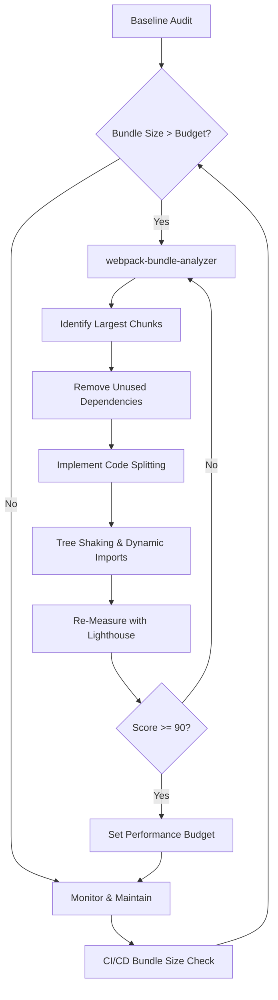

| Difficulty | Channel | Tags |
|---|---|---|
| intermediate | frontend | lighthouse, bundle, lazy-loading |

Intercom's Messenger widget was embedded on thousands of websites as a React.js single-page app. Every day, new features shipped. And every day, the bundle grew — ballooning to nearly 600KB gzipped of JavaScript. Mobile users were paying the price. Load times cratered. And the worst part? Most visitors never even opened the Messenger, yet they were still downloading all of its code [1]. If your React app's Lighthouse score is sitting at 65 and your bundle is creeping past 2MB, you're watching the same slow-motion disaster unfold.

---

> ### Real-World Case — Intercom
>
> Intercom's Messenger widget—embedded on thousands of websites as a React.js single-page app—had ballooned to nearly 600KB gzipped of JavaScript as new features shipped daily. The growing bundle was degrading load times for end users, especially on mobile networks, and hurting the performance of the host websites.
>
> | | |
> |---|---|
> | **Challenge** | The Messenger was served as a single monolithic JavaScript file (frame.js) containing all application code, vendor libraries (React, Redux, Lodash), and 4,000+ Sass stylesheet rules. Every daily deployment forced visitors to re-download the entire bundle. The Lighthouse performance score had dropped to 59. |
> | **Solution** | The team used webpack-bundle-analyzer to visualize the bundle composition, then applied a systematic multi-pronged optimization: (1) Split vendor packages (React, Redux, etc.) into a separate cached bundle so they wouldn't be re-downloaded on each deploy, (2) Code-split the app by routes using a Loadable component with pre-loading on launcher hover, (3) Migrated Sass to CSS-in-JS (Emotion) so styles could be split per-component and loaded only when rendered, (4) Replaced or optimized bloated dependencies—reduced Lodash from 25KB to 11.7KB via babel-plugin-lodash, removed PSL package entirely (36KB saved), lazy-loaded Sentry error reporting (25KB saved), and used dynamic imports to load only the active locale from a 60KB translations package. |
> | **Outcome** | Bundle reduced from ~600KB to 240KB gzipped (60% reduction). Google Lighthouse score improved from 59 to 100. Mobile users saved 5 seconds on fast 3G and up to 11 seconds on slow 3G networks. Visitors who never opened the Messenger no longer downloaded any of its code. |
> | **Lesson** | The biggest wins came not from micro-optimizing code but from architectural decisions—splitting vendors for caching, route-based splitting for on-demand loading, and CSS-in-JS for per-component style loading. Also, the 'product defines the architecture' insight: understanding what users actually see first determines what can be deferred. |

---

## Hook — The 600KB Ghost Download

Here's a number that should make you uncomfortable: Intercom's Messenger bundle was 600KB gzipped. That's the size of a small JavaScript framework — loaded eagerly, on every page, for every visitor. On fast 3G networks, mobile users burned an extra 5 seconds waiting for code they'd never touch. On slow 3G, it was 11 seconds [1]. And yet, the developers shipping these features weren't being negligent. They were doing what most teams do: adding value, one PR at a time, without a systematic way to measure the cumulative cost. Sound familiar? The terrifying truth is that your app is probably accumulating invisible weight right now — and you won't notice until your users start leaving.

## Problem — When 'Just One More Feature' Breaks Your Performance Budget

You're staring at a Lighthouse score of 65. Time to Interactive is 4.2 seconds. Your bundle is 2.1MB. The CTO wants to know why page load times are climbing, and your PM is asking why you can't ship the new analytics dashboard faster. The core problem isn't that your team writes bad code — it's that JavaScript bundles are a collective-action tragedy. Every dependency you add, every utility you import, every chart library you pull in for one component — they all compound. Many developers think tree shaking is automatic and sufficient, but actually it only works if your entire dependency graph uses ES modules and your bundler configuration is correct [2]. The result is a silent performance tax that grows with every sprint. Concretely, a 2.1MB bundle means your users on 3G are waiting over 10 seconds before they can interact with your app. That's not a hypothetical — it's a mathematical reality of network throughput. And the cost isn't just patience. Google's research shows that 53% of mobile users abandon sites that take over 3 seconds to load [3]. Every tenth of a second you shave off translates directly to retained users, completed purchases, and signups.

## Real-World Case — How Intercom Cut 60% and Hit a Perfect Lighthouse Score

Intercom faced this exact crisis with their Messenger widget — a React single-page app embedded across thousands of host websites. The widget had grown to nearly 600KB gzipped as features shipped daily [1]. The growing bundle was degrading load times, especially on mobile networks, and hurting the performance of the host websites themselves — not just Intercom's own pages. Their response was systematic and surgical. They didn't rewrite the app or abandon React. Instead, they attacked the bundle from every angle: route-based code splitting, tree shaking, eliminating dead code, lazy-loading non-critical features, and optimizing third-party dependencies. The results were dramatic — bundle reduced from ~600KB to 240KB gzipped, a 60% reduction. Google Lighthouse score jumped from 59 to a perfect 100. Visitors who never opened the Messenger no longer downloaded any of its code [1]. This wasn't a one-time hack. It was a disciplined workflow that any team can replicate.

## Deep Dive — The Four Pillars of Bundle Optimization

Understanding what Intercom achieved requires grasping four interconnected strategies, each addressing a different layer of the bundle bloat problem.

**1. Bundle Analysis: You Can't Optimize What You Can't See**
Before touching a single line of code, you need a map. Tools like webpack-bundle-analyzer visualize every module in your bundle, revealing the culprits. Often, the biggest offenders aren't your application code — they're dependencies like moment.js (300KB+) or entire lodash imports that should have been cherry-picked [4]. Running the analyzer on a 2.1MB bundle typically reveals that 40-60% of the weight comes from third-party libraries, many of which are partially or entirely unused.

**2. Code Splitting: Loading Only What You Need**
Code splitting is the act of breaking your bundle into smaller chunks loaded on demand. React.lazy() and Suspense enable this natively [5]. The key insight is that there are two distinct strategies: route-based splitting (loading entire page bundles lazily) and component-based splitting (loading individual heavy components like charts or editors only when they appear on screen). Intercom used both — route-based splitting for the Messenger's conversation view vs. settings panel, and component-based splitting for rich media features.

**3. Tree Shaking: Eliminating Dead Code**
Tree shaking eliminates unused exports from your final bundle. But here's the catch many developers miss: it only works with ES module syntax (import/export). If your dependencies ship CommonJS or your Babel config transpiles ES modules to CommonJS, tree shaking silently fails [2]. Additionally, side effects in your modules can prevent the bundler from safely removing dead code.

**4. Dynamic Imports: The Third-Party Library Trap**
Heavy third-party libraries — date pickers, rich text editors, charting libraries — often dwarf your application code. Dynamic imports let you load these only when needed. For example, importing a 150KB markdown editor only when the user clicks "Write Post" instead of loading it upfront saves that weight from the initial load entirely.

## Workflow — The Step-by-Step Battle Plan

Here's the systematic workflow to take a React app from 65 to 90+ on Lighthouse. Think of it as a campaign with four phases, each building on the last.

**Phase 1: Audit and Analyze**
Run webpack-bundle-analyzer to visualize your current bundle composition. Identify the top 5 largest chunks. Check if your build is using ES module output (for tree shaking to work). Record your current Lighthouse score, TTI, and total bundle size as your baseline.

**Phase 2: Eliminate and Shrink**
Remove unused dependencies (check with depcheck). Replace large libraries with lighter alternatives — date-fns over moment.js, lodash-es over lodash [4]. Fix tree shaking by ensuring Babel isn't transpiling ES modules to CommonJS. Audit import statements for barrel import antipatterns.

**Phase 3: Split and Lazy Load**
Implement route-based splitting with React.lazy() and Suspense. Add error boundaries to handle chunk load failures gracefully. Identify heavy components (>50KB) and apply component-based splitting. Use dynamic imports for modals, editors, and analytics libraries.

**Phase 4: Measure and Iterate**
Re-run webpack-bundle-analyzer after each phase. Compare Lighthouse scores. Target: initial bundle under 200KB gzipped, TTI under 2 seconds. Repeat until you hit your performance budget.

The following diagram illustrates the optimization workflow as a continuous cycle, because bundle optimization isn't a one-time task — it's an ongoing discipline that compounds over time.

## Code Example — Route-Based Code Splitting in Practice

Here's how to implement the exact pattern Intercom used to split their Messenger bundle by route. The key is wrapping each route component in React.lazy(), which tells webpack to create a separate chunk for each one [5].

## Lessons Learned — What Actually Moves the Needle

The journey from 65 to 90+ on Lighthouse isn't about one clever trick — it's about disciplined, incremental optimization. Here's what separates teams that succeed from those that chase performance PRs that regress in a month:

🎯 **Key Point: Bundle budgets beat heroics.**
Set a hard limit — say, 200KB gzipped for initial load — and enforce it in CI. Intercom didn't achieve a 60% reduction with one big refactor; they built a culture of continuous measurement [1].

⚠️ **Watch Out: Lazy loading without error boundaries is a trap.**
When React.lazy() fails to load a chunk (network timeout, CDN outage), the entire app crashes. Always wrap lazy components in error boundaries with a retry mechanism.

💡 **Insight: The biggest wins hide in your dependencies.**
Audit your package.json with tools like bundlephobia. Many teams discover that a single dependency — moment.js, lodash, a charting library — accounts for more weight than their entire application code.

🔥 **Hot Take: Your PM will fight you on this — until you show them the numbers.**
Frame bundle optimization in business terms: "Shaving 3 seconds off load time increases conversion by 7%" [3]. That turns a technical task into a revenue initiative.

After debugging performance regressions across dozens of React applications, here is the pattern that works best: start with analysis, not action. Run webpack-bundle-analyzer before you touch any code. The biggest surprises aren't in your source files — they're in your node_modules.

---

## React Bundle Optimization Workflow

<strong>Original Interview Question</strong>

**Q:** You're tasked with improving a React app's Lighthouse performance score from 65 to 90+. The bundle size is 2.1MB and Time to Interactive is 4.2s. What specific steps would you take to optimize the bundle and implement lazy loading?

**A:** Implement code splitting with React.lazy() and Suspense, analyze bundle composition with webpack-bundle-analyzer to identify largest chunks, remove unused dependencies and optimize imports, add dynamic imports for heavy components and third-party libraries, implement route-based splitting for better initial load times, and utilize tree shaking with proper ES module configuration.

## Conclusion

Intercom cut their bundle by 60% and achieved a perfect Lighthouse score — not by rewriting their app, but by applying four systematic techniques: analysis, elimination, splitting, and measurement. Your React app's 2.1MB bundle and 4.2-second TTI are solvable problems with a clear playbook. Start with webpack-bundle-analyzer today. Set a bundle budget. Implement route-based splitting. And most importantly, make performance a habit, not a heroics. The next time your PM asks why the app feels slow, you won't just have an explanation — you'll have a fix.

---

## References

1. [Intercom — Reducing Intercom Messenger bundle size](https://www.intercom.com/blog/reducing-intercom-messenger-bundle-size/) — blog
2. [MDN — Tree shaking](https://developer.mozilla.org/en-US/docs/Glossary/Tree_shaking) — documentation
3. [Google — Find out how you're doing on mobile page speed](https://www.thinkwithgoogle.com/marketing-strategies/app-and-mobile/mobile-page-speed-new-industry-benchmarks/) — blog
4. [GitHub — webpack/webpack-bundle-analyzer](https://github.com/webpack/webpack-bundle-analyzer) — documentation
5. [React — Lazy loading components with React.lazy()](https://react.dev/reference/react/lazy) — documentation
6. [React — Suspense for code-splitting](https://react.dev/reference/react/Suspense) — documentation
7. [MDN — Dynamic import() syntax](https://developer.mozilla.org/en-US/docs/Web/JavaScript/Reference/Statements/import#dynamic_imports) — documentation
8. [Bundlephobia — Check the size of npm packages](https://bundlephobia.com/) — documentation
9. [MDN — Import assertions for JSON modules](https://developer.mozilla.org/en-US/docs/Web/JavaScript/Reference/Statements/import#dynamic_import_assertions) — documentation
10. [Lighthouse — Web performance metrics documentation](https://developer.chrome.com/docs/lighthouse/performance/) — documentation

---

**Author:** Satishkumar Dhule — [GitHub](https://github.com/satishkumar-dhule) · [LinkedIn](https://linkedin.com/in/satishkumar-dhule) · [Website](https://satishkumar-dhule.github.io)
