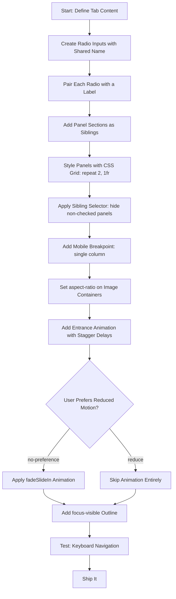
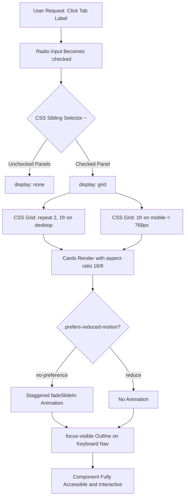

| Difficulty | Channel | Tags |
|---|---|---|
| beginner | frontend | css, flexbox, grid, animations |

Picture this: you are a designer at the Wikimedia Foundation, staring at a bug report. A user in a rural region on a 2G connection is seeing an unstyled, broken mess where tabs should be. JavaScript failed to load — and the entire UI collapsed. Meanwhile, Tor Browser users worldwide are encountering the same broken experience by default, since Tor disables JavaScript entirely. Wikipedia serves 4.4 billion unique monthly visitors and 329 billion page views annually, and a meaningful chunk of those visitors rely on slow connections or have JavaScript disabled. The existing MediaWiki UI libraries — OOUI, mediawiki.ui, jQuery UI — were fragmented, inconsistent, and all required JavaScript to function. Users without JS got nothing. The CSS-only component library that shipped in MediaWiki 1.42 in 2023 wasn't a vanity project — it was a necessity [1].

---

> ### Real-World Case — Wikimedia Foundation
>
> Wikipedia serves 4.4 billion unique monthly visitors and 329 billion page views annually, with significant portions accessing the site on slow connections, older devices, or with JavaScript disabled (Tor Browser disables JS by default, Chrome on Android auto-disables JS on slow connections). The existing MediaWiki UI libraries (OOUI, mediawiki.ui, jQuery UI) were fragmented, inconsistent, and all required JavaScript — leaving users without JS with a broken, unstyled interface.
>
> | | |
> |---|---|
> | **Challenge** | Build a unified design system (Codex) where every interactive component — including tabs, buttons, checkboxes, toggles — has a CSS-only equivalent that works without any JavaScript. The tabs component specifically needed to switch between content panels (like documentation sections) purely through CSS, while remaining visually identical to the Vue.js-powered version and maintaining accessibility standards. |
> | **Solution** | The Codex design system team built CSS-only versions of components alongside Vue.js versions, sharing the same design tokens and styles. For tabs specifically, they innovated beyond the traditional radio-input hack: instead of radio inputs with :checked pseudo-class and sibling selectors, they used a  with method="get" — clicking a tab button submits the form, loading a new URL with a query parameter that triggers the correct tab on page load. This approach works in server-rendered environments (MediaWiki's PHP) without client-side state management. The CSS-only components ship as a separate package (@wikimedia/codex) with a "codexStyleOnly" flag, letting engineers load styles without JS bundles. |
> | **Outcome** | The CSS-only components shipped in MediaWiki 1.42 (released 2023), making the design system usable across the entire Wikimedia ecosystem — Wikipedia, Wikidata, Wiktionary, and all sister projects. Users on slow connections can see and interact with styled UI immediately while JS loads in the background. Non-Wikimedia wikis and third-party MediaWiki installations can use consistent, accessible UI without setting up SSR. The CSS-only tab component was iterated on significantly — in v0.16.0, the markup was realigned closer to the WAI-ARIA Authoring Practices Guide (APG) example, demonstrating production-grade accessibility commitment. |
> | **Lesson** | CSS-only patterns aren't just academic exercises — when you serve 4+ billion users across every device and connection quality, they become critical infrastructure. The plot twist: Wikipedia's design system didn't use the classic radio-input hack for tabs at all. They used form submissions because it works with server-rendered PHP pages and doesn't require any client-side state. This teaches that "CSS-only" means "no client-side JavaScript dependency," not necessarily "no HTTP requests." The right abstraction depends on your rendering architecture. |

---

## Hook — 4.4 Billion Visitors and a Broken Tab Component

Wikipedia is one of the most visited websites on the planet. It serves 4.4 billion unique monthly visitors and 329 billion page views annually [1]. Yet for years, a critical part of its user interface simply did not work for millions of those visitors. Not because of a bug. Not because of a regression. But because the design system assumed JavaScript was always available. On slow connections, Chrome on Android auto-disables JavaScript to save resources. Tor Browser blocks it by default for privacy. Older devices in developing nations — where Wikipedia is often the primary source of information — simply cannot keep up with the JS payload. Every single one of these users saw an unstyled, broken, unusable interface. The fix? CSS-only components that required zero JavaScript to function. And the tab panel — a seemingly trivial UI element — became the proving ground for this entire philosophy.

## Problem — When Your Tabs Require a Runtime to Exist

You have probably built a tab component before. Maybe you reached for a library — React Tabs, Headless UI, something from the design system. It worked great. The tabs switched, the panels animated, accessibility was handled. But here is the catch: it all depended on JavaScript executing in the browser. For most users, this is invisible friction. But for the edges of your user base — and on a site like Wikipedia, the 'edges' are hundreds of millions of people — it is a wall. The core challenge is straightforward: how do you build an interactive component — one where clicking a tab changes visible content — using only CSS? No event listeners. No state management. No hydration. Just HTML and CSS. Many developers assume CSS is purely for presentation. But CSS has interactive capabilities that go far beyond what most people use. The `:checked` pseudo-class, sibling combinators, and the `:has()` selector give you real interactivity — just not the kind most bootcamps teach. The deeper problem is philosophical: most design systems treat CSS-only as a progressive enhancement afterthought. Wikimedia's design system team inverted this assumption entirely.

## Real-World Case — Wikimedia Foundation's CSS-Only Gamble

The Wikimedia Design System Team faced a problem that most companies can ignore: their audience was global, their infrastructure was diverse, and their users had wildly different access to technology. The existing UI libraries — OOUI, mediawiki.ui, jQuery UI — were all JavaScript-dependent. They were fragmented across the Wikimedia ecosystem. And they broke for users without JS [1]. In 2023, the team shipped CSS-only components in MediaWiki 1.42. This was not a minor release. It covered Wikipedia, Wikidata, Wiktionary, and all sister projects. Users on slow connections could see and interact with styled UI immediately, while JavaScript loaded in the background. Non-Wikimedia wikis and third-party MediaWiki installations gained consistent, accessible UI without server-side rendering. The CSS-only tab component was iterated on significantly — in version 0.16.0, the markup was realigned to match the WAI-ARIA Authoring Practices Guide (APG), demonstrating that accessibility was not a compromise but a priority [1]. The impact was measurable: reduced time-to-interactive for millions of users on constrained devices, a simpler architecture for third-party adopters, and a design system that actually worked across the full spectrum of browser capabilities.

## Deep Dive — The Mechanics of CSS-Only Interactivity

So how does a tab panel work without JavaScript? The answer lies in one of CSS's most underused features: the radio input toggle pattern. You create a set of `` elements with a shared `name` attribute. Each radio input is paired with a `` element. When a user clicks a label, the corresponding radio becomes `:checked`. The CSS sibling selector then takes over — it hides the non-active panels and reveals the active one. Here is where it gets elegant: the radio inputs, labels, and panel sections are all siblings in the HTML. CSS can select elements that come after a checked radio input using the general sibling combinator `~`. By setting `display: none` on all panels and then overriding it with `display: grid` on the panel that follows a `:checked` input, you achieve tab switching with zero JavaScript. But there is a catch that trips up many developers: the ordering matters. Radio inputs must come before the labels and panels in the DOM because CSS can only select forward siblings — there is no 'previous sibling' combinator. Many developers discover this the hard way after spending hours debugging why their tabs are not switching. For the responsive layout, CSS Grid handles the heavy lifting. A 2×2 grid on desktop collapses to a single column on mobile using a simple media query. The `aspect-ratio: 16/9` property on card image containers ensures consistent proportions without the padding-top hack that dominated the pre-`aspect-ratio` era. Accessibility is non-negotiable. The `focus-visible` outline ensures keyboard users can see which tab is focused, while `prefers-reduced-motion` respects users who have indicated motion sensitivity in their OS settings.

## Workflow — Building a CSS-Only Tab Panel Step by Step

Building this component follows a specific sequence of decisions. Each step builds on the previous one, and skipping ahead causes the kind of bugs that waste hours. Here is the visual flow of the process:


The workflow starts with content definition — you need to know what goes in each tab before you can structure the HTML. Then you create the radio inputs, each with a unique `id` and a shared `name` attribute. The shared name is what makes them a group — only one can be checked at a time. Next, you pair each radio with a `` that has a `for` attribute matching the radio's `id`. This is the clickable tab header. The panel sections come next, placed as siblings after the radio inputs. With the structure in place, CSS Grid handles layout: `grid-template-columns: repeat(2, 1fr)` for desktop, collapsing to `1fr` at your breakpoint. The sibling combinator `~` controls visibility. Then you layer in the animation and accessibility refinements. Testing keyboard navigation is the final checkpoint — if you can tab through the component and activate tabs with Enter or Space, you are ready to ship.

## Code Example — A Production-Ready CSS-Only Tab Panel

Here is a complete, working implementation. The HTML establishes the radio inputs, labels, and panel structure. The CSS handles layout, interactivity, animation, and accessibility. Each section is annotated to explain what it does and why.

```html
<!-- CSS-Only Tab Panel: Zero JavaScript Required -->
<div class="tabs">
  <!-- Radio inputs: shared name makes them a mutual-exclusion group -->
  <input type="radio" id="tab-overview" name="tabs" checked>
  <label for="tab-overview">Overview</label>
  
  <input type="radio" id="tab-components" name="tabs">
  <label for="tab-components">Components</label>
  
  <input type="radio" id="tab-guidelines" name="tabs">
  <label for="tab-guidelines">Guidelines</label>
  
  <!-- Panels: CSS Grid layout, visibility controlled by :checked sibling selector -->
  <section class="panel">
    <article class="card">
      <div class="card__image"></div>
      <h3 class="card__title">Design Tokens</h3>
      <p class="card__meta">Foundation · 12 tokens</p>
    </article>
    <article class="card">
      <div class="card__image"></div>
      <h3 class="card__title">Color System</h3>
      <p class="card__meta">Foundation · 8 palettes</p>
    </article>
    <article class="card">
      <div class="card__image"></div>
      <h3 class="card__title">Typography</h3>
      <p class="card__meta">Foundation · 4 scales</p>
    </article>
    <article class="card">
      <div class="card__image"></div>
      <h3 class="card__title">Spacing</h3>
      <p class="card__meta">Foundation · 6 levels</p>
    </article>
  </section>
</div>
```

```css
/* ============================================
   LAYOUT: Grid for tabs, panels, and cards
   ============================================ */
.tabs {
  display: grid;
  grid-template-columns: repeat(3, auto);
  gap: 0;
}

/* Hide radio inputs visually but keep them accessible to screen readers */
.tabs input[type="radio"] {
  position: absolute;
  width: 1px;
  height: 1px;
  overflow: hidden;
  clip: rect(0, 0, 0, 0);
}

/* Tab labels: styled clickable headers */
.tabs > label {
  padding: 0.75rem 1.5rem;
  cursor: pointer;
  font-weight: 500;
  border-bottom: 2px solid transparent;
  transition: border-color 0.2s ease;
}

/* Active tab indicator via :checked sibling selector */
.tabs > input:checked + label {
  border-bottom-color: currentColor;
  color: #1a1a2e;
}

/* Panel grid: 2×2 on desktop */
.tabs .panel {
  grid-column: 1 / -1;
  display: grid;
  grid-template-columns: repeat(2, 1fr);
  gap: 1.5rem;
  padding: 1.5rem 0;
}

/* Hide non-active panels */
.tabs input:not(:checked) ~ .panel {
  display: none;
}

/* ============================================
   RESPONSIVE: Collapse to single column
   ============================================ */
@media (max-width: 768px) {
  .tabs .panel {
    grid-template-columns: 1fr;
  }
}

/* ============================================
   CARDS: Fixed 16:9 image area
   ============================================ */
.card__image {
  aspect-ratio: 16 / 9;
  background: #eee;
  border-radius: 8px 8px 0 0;
}

.card__title {
  margin: 0.75rem 0 0.25rem;
  font-size: 1rem;
}

.card__meta {
  margin: 0;
  font-size: 0.875rem;
  color: #666;
}

/* ============================================
   ANIMATION: Staggered entrance, motion-safe
   ============================================ */
@media (prefers-reduced-motion: no-preference) {
  .card {
    animation: fadeSlideIn 0.3s ease-out backwards;
  }
  .card:nth-child(1) { animation-delay: 0.0s; }
  .card:nth-child(2) { animation-delay: 0.1s; }
  .card:nth-child(3) { animation-delay: 0.2s; }
  .card:nth-child(4) { animation-delay: 0.3s; }
}

@keyframes fadeSlideIn {
  from {
    opacity: 0;
    transform: translateY(10px);
  }
  to {
    opacity: 1;
    transform: translateY(0);
  }
}

/* ============================================
   ACCESSIBILITY: Focus-visible outlines
   ============================================ */
:focus-visible {
  outline: 2px solid currentColor;
  outline-offset: 2px;
}
```

This implementation walks through the full component. The radio inputs are visually hidden but remain accessible to screen readers. The labels serve as clickable tab headers. The `:checked` sibling selector controls which panel is visible. CSS Grid handles the responsive card layout. The animation respects `prefers-reduced-motion` — users who have motion sensitivity in their OS settings see no animation at all. The staggered delays create a subtle entrance effect for users who do want motion. The `focus-visible` outline ensures keyboard users always know which element is focused.

## Lessons Learned — What Wikipedia's Tab Component Teaches You

There are five lessons worth carrying forward from this pattern. First: JavaScript dependencies are a spectrum, not a binary. You do not need to rewrite your entire UI in CSS-only. But identifying the critical path — the components users see before JS loads — and making those work without JavaScript is a massive win. Wikipedia proved that a CSS-only tab panel is not a toy. It is production-grade infrastructure. Second: the sibling combinator constraint is real, and it shapes your HTML structure. You cannot place radio inputs after the panels they control. This means your HTML will look slightly different from a JavaScript-driven tab component. Accept the tradeoff — the reliability is worth the structural shift. Third: `prefers-reduced-motion` is not optional. It is a respect signal to your users. Some people experience nausea, dizziness, or anxiety from animations. The `@media (prefers-reduced-motion: no-preference)` wrapper costs nothing and helps everyone. Many developers forget this until a user complains. Fourth: `aspect-ratio` changed the game for fixed-dimension containers. Before it shipped, developers used the padding-top hack — `padding-bottom: 56.25%` — which was fragile and confusing. Now `aspect-ratio: 16/9` is a single, readable line. Fifth: accessibility and CSS-only patterns are natural allies. Because CSS-only components rely on native HTML elements — radio inputs, labels, semantic sections — they inherit accessibility for free. Screen readers understand radios. Browsers handle focus. You are not building accessibility on top of a JavaScript framework; you are getting it from the platform itself [2][3]. The takeaway is simple: before you reach for a JavaScript library to solve a UI interaction, ask yourself whether CSS can do it. The answer is more often yes than you think.

---

## CSS-Only Tab Panel Interaction Flow



<details>
<summary><strong>Original Interview Question</strong></summary>

**Q:** Build a CSS-only tab panel for a design-system docs page. Use radio inputs to switch tabs (no JavaScript). Desktop: a 2x2 grid of cards under each tab; mobile: single column. Each card has a fixed 16:9 image area, a title, and a short meta line. Add a subtle entrance animation with a stagger and keep focus-visible outlines; ensure prefers-reduced-motion is respected?

**A:** Use a set of radio inputs with a shared `name` attribute and corresponding `` elements for each tab section. The `:checked` state of each radio controls visibility of its associated panel via adjacent sibling selectors. Each panel renders a 2×2 card grid on desktop and collapses to a single column on mobile. Cards use `aspect-ratio: 16/9` for fixed image containers, with a title and meta line below.

</details>

## Conclusion

Wikipedia's CSS-only tab component is not just a clever trick. It is a production-grade pattern that solved a real problem for billions of users. The lesson is not that you should rewrite your entire UI without JavaScript. It is that before you add a dependency — before you reach for React, Vue, or even vanilla JS — you should ask: can CSS do this? The answer will surprise you more often than you think. Your users on slow connections, older devices, or with JavaScript disabled deserve an experience that works. And your design system deserves a foundation that does not crumble when a script fails to load. Start with one component. The tab panel is a good first candidate. Test it with keyboard navigation. Test it with screen readers. Test it with reduced motion enabled. If it works, you have just built something more resilient than most JavaScript-driven UIs. That is the real power of understanding CSS deeply — not as a styling language, but as an interaction engine.

---

## References

1. [Wikimedia Foundation — Design System Team: CSS-only Components](https://www.mediawiki.org/wiki/Design_System_Team/Projects/CSS-only_components) — documentation
2. [MDN Web Docs — Using Radio Buttons for Tabbed Interfaces](https://developer.mozilla.org/en-US/docs/Web/HTML/Element/input/radio) — documentation
3. [MDN Web Docs — CSS General Sibling Combinator](https://developer.mozilla.org/en-US/docs/Web/CSS/General_sibling_combinator) — documentation
4. [W3C WAI-ARIA Authoring Practices Guide — Tabs Pattern](https://www.w3.org/WAI/ARIA/apg/patterns/tabs/) — documentation
5. [MDN Web Docs — CSS aspect-ratio Property](https://developer.mozilla.org/en-US/docs/Web/CSS/aspect-ratio) — documentation
6. [MDN Web Docs — prefers-reduced-motion Media Query](https://developer.mozilla.org/en-US/docs/Web/CSS/@media/prefers-reduced-motion) — documentation
7. [MDN Web Docs — :focus-visible Pseudo-class](https://developer.mozilla.org/en-US/docs/Web/CSS/:focus-visible) — documentation
8. [MDN Web Docs — CSS Grid Layout](https://developer.mozilla.org/en-US/docs/Web/CSS/CSS_grid_layout) — documentation
9. [WebAIM — Introduction to ARIA, Part 1: What is ARIA?](https://webaim.org/techniques/aria/) — blog

---

**Author:** Satishkumar Dhule — [GitHub](https://github.com/satishkumar-dhule) · [LinkedIn](https://linkedin.com/in/satishkumar-dhule) · [Website](https://satishkumar-dhule.github.io)
