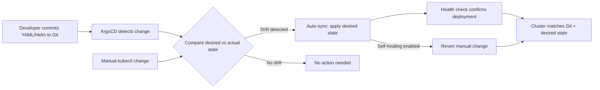

| Difficulty | Channel | Tags |
|---|---|---|
| beginner | devops | argocd, flux, declarative |

Imagine managing 10,400 deployment pipelines across hundreds of teams, thousands of services, and realizing that roughly 80% of what you're deploying is dead weight — stale, abandoned, duplicated services nobody even remembers creating. That's exactly the nightmare Adobe uncovered when they decided to modernize their software delivery platform. Their journey from a legacy system called Moonbeam to a Kubernetes-native GitOps platform called Flex didn't just fix deployments — it forced a reckoning with years of accumulated technical debt [1]. If you've ever stared at a cluster wondering which services are actually alive, this story is for you.

---

> ### Real-World Case — Adobe
>
> Adobe needed to modernize its software delivery platform, migrating from a legacy internal platform called Moonbeam (CaaS) to a new GitOps-based platform called Flex, built on Kubernetes and the Argo Project ecosystem. The migration touched 10,400 pipelines across hundreds of teams and thousands of services.
>
> | | |
> |---|---|
> | **Challenge** | Adobe's legacy deployment model had become increasingly difficult to scale, secure, and operate reliably. Teams used varying deployment methodologies, creating inconsistency. The platform needed to support governed, auditable software delivery at enterprise scale while maintaining security, compliance, and self-service for thousands of developers. |
> | **Solution** | Adobe built Flex, a GitOps delivery platform operationalizing Argo CD, Argo Workflows, Argo Events, and Argo Rollouts together as a cohesive system — not as isolated tools but as integrated building blocks. They established Git as the single source of truth, adopted declarative infrastructure and application definitions, and used automated reconciliation to continuously align running environments with approved state. The platform also integrated onboarding, service registration, secrets management, change workflows, and deployment guardrails for secure self-service. |
> | **Outcome** | Flex now manages over 6,000 services across nearly 50,000 environments, including ~19,000 production environments supporting 3,300+ production services. The migration eliminated persistent deployment pain points, reduced manual intervention, and prevented configuration drift. Most surprisingly, the migration became a forcing function to audit service inventory — Adobe retired roughly 80% of previously identified services (stale, abandoned, duplicated), which alone contributed meaningfully to cost savings. |
> | **Lesson** | Large-scale GitOps adoption is not just about deploying with modern tooling — it's about building the workflow experience and governance model around the technology. Adopting Argo CD was only part of the challenge; the real win came from operationalizing multiple CNCF technologies together as an enterprise delivery platform with lifecycle controls. The unexpected discovery was that a platform migration doubles as a technical debt cleanup opportunity. |

---

## Hook — The Deployment That Broke Everything

Picture this: it's Friday afternoon, a team pushes what they think is a minor config change, and within minutes production starts behaving in ways nobody predicted. Sound familiar? The root cause wasn't the change itself — it was configuration drift. Someone had manually patched a deployment three weeks ago, nobody documented it, and the next automated rollout collided with that invisible modification. This scenario plays out in organizations of every size, and it's the exact pain point that drives teams toward GitOps. But here's the thing most developers miss: GitOps isn't just about automation. It's about creating a single source of truth so powerful that it can expose years of organizational rot — exactly as it did at Adobe.

## Problem — The Invisible Tax of Imperative Deployments

When teams manage Kubernetes clusters imperatively — running kubectl apply, kubectl scale, kubectl delete by hand — they're essentially building sandcastles. Every manual command is a change that exists only in the cluster's memory. There's no audit trail, no version history, and crucially, no single document that describes what the cluster should actually look like. This creates what's known as configuration drift: the gap between what you think is deployed and what's actually running. As clusters grow from a handful of services to hundreds, this drift compounds. One team patches a resource limit here, another scales a replica count there, and soon enough nobody can answer the simplest question: 'What does production actually look like?' The imperative approach also makes rollbacks a nightmare. When something breaks at 2am, you're not just fixing a bug — you're reverse-engineering a series of undocumented manual changes. Teams lose hours, sometimes days, piecing together what changed and why. And the bigger the organization gets, the worse it becomes. Every new hire who learns 'just kubectl it' adds another potential crack in the foundation.

## Real-World Case — Adobe's Great Migration

Adobe's experience with this problem was operating at a scale that most engineers can barely fathom. Their legacy deployment platform, Moonbeam (CaaS), had served them for years, but it couldn't keep up with the demands of modern cloud-native development. Pipelines were brittle, manual interventions were constant, and configuration drift between environments was a persistent headache. So they built Flex — a new GitOps-based platform built on Kubernetes and the Argo Project ecosystem [1]. The migration touched 10,400 pipelines across hundreds of teams and thousands of services. The results were staggering: Flex now manages over 6,000 services across nearly 50,000 environments, including approximately 19,000 production environments supporting 3,300+ production services [1]. But here's the plot twist that nobody expected. The migration process itself became a forcing function for a massive service inventory audit. Adobe discovered that roughly 80% of previously identified services were stale, abandoned, or duplicated — and retiring them alone contributed meaningfully to cost savings [1]. The moral? Sometimes the tool you adopt to fix deployments ends up fixing something much bigger: your understanding of what you actually have. This is the hidden power of declarative infrastructure — when your desired state is written down in Git, the gap between what you think you have and what you actually have becomes impossible to ignore.

## Deep Dive — Declarative vs. Imperative: The Two Worlds

At its core, the difference between declarative and imperative approaches comes down to a philosophical question: do you want to describe what you want, or describe how to get there?

**The Imperative Way**
The imperative approach is what most developers encounter first. You run commands like:
- kubectl create deployment nginx --image=nginx:1.25
- kubectl scale deployment nginx --replicas=3
- kubectl set resources deployment nginx --limits=cpu=500m

Each command is a direct instruction to the cluster. It works, it's immediate, and it feels intuitive. But here's the catch: the cluster becomes a black box. Your commands disappear into it, and unless you're meticulously logging every action, nobody knows the full current state. There's no document you can hand to a new team member and say 'this is production.'

**The Declarative Way**
The declarative approach flips this on its head. Instead of telling the cluster what to do, you describe what the end result should look like. You write YAML manifests, Helm charts, or Kustomize configurations that define the desired state, commit them to Git, and let a tool like ArgoCD do the heavy lifting of making reality match your declaration [2].

Here's where it gets powerful:
- **Version control becomes your audit trail.** Every change is a Git commit with a message, an author, and a timestamp.
- **Rollbacks are trivial.** Something broke? Revert the commit. ArgoCD notices and reconciles.
- **Configuration drift is impossible** (or at least, immediately visible). ArgoCD continuously compares the desired state in Git with the actual state in the cluster [3].
- **Collaboration is natural.** Teams use pull requests, code reviews, and branch strategies — the same workflows they already know.

But let's be honest about the tradeoffs. The declarative approach has a steeper learning curve. Writing Helm charts or Kustomize overlays requires more upfront investment than running a kubectl command. And there are times when imperative changes are genuinely useful — debugging, emergency hotfixes, exploring what's possible. The key insight is that those imperative moments should be the exception, not the norm, and any manual change should be reconciled back to Git as quickly as possible.

💡 **Insight:** ArgoCD's self-healing feature is what makes this philosophy enforceable. When enabled, any manual change to the cluster gets automatically reverted to match the Git-defined desired state. It's like having a guardian angel for your infrastructure — except this angel actually shows up on time.

## Workflow — How ArgoCD Bridges Git and Kubernetes

Here's how the GitOps workflow actually operates in practice. Think of it as a continuous conversation between your Git repository and your Kubernetes cluster, mediated by ArgoCD.

**Step 1: Define Your Desired State**
You store Kubernetes manifests, Helm charts, or Kustomize configurations in a Git repository. This repo is your single source of truth — the canonical description of what your infrastructure should look like [2].

**Step 2: Create an Application CRD**
ArgoCD uses a Kubernetes Custom Resource called Application to bridge your Git repo and your target cluster. This CRD specifies the source repo, the target namespace, the sync policy, and health check parameters [3].

**Step 3: Enable Auto-Sync**
With auto-sync enabled, ArgoCD polls your Git repository at a configurable interval (typically every 3 minutes) and compares the desired state with the actual cluster state. If there's a difference, it reconciles automatically [3].

**Step 4: Activate Self-Healing**
This is the safety net. If someone manually changes a deployment — say, scaling replicas from 3 to 5 directly via kubectl — ArgoCD detects the drift and reverts it back to the Git-defined state. No human intervention required.

**Step 5: Monitor and Audit**
ArgoCD provides a visual dashboard showing sync status, health status, and drift history. Every sync operation is logged, giving you a complete audit trail.

The following diagram illustrates this continuous reconciliation loop:



## Code Example — ArgoCD Application Configuration

Here's a production-ready ArgoCD Application manifest that demonstrates auto-sync, self-healing, and health check configuration for a microservices deployment:

```yaml
# argocd-application.yaml
# This Application CRD tells ArgoCD to watch a Git repo
# and keep a Kubernetes namespace in sync with it.
apiVersion: argoproj.io/v1alpha1
kind: Application
metadata:
  name: my-microservices-app
  namespace: argocd  # ArgoCD's own namespace
spec:
  # The project scopes which repos/clusters this app can access
  project: default

  source:
    # Point to your Git repo containing K8s manifests or Helm charts
    repoURL: https://github.com/your-org/k8s-manifests.git
    targetRevision: main  # Track the main branch
    path: overlays/production  # Subdirectory with environment-specific configs
    # If using Helm instead of raw manifests, uncomment:
    # helm:
    #   releaseName: my-app
    #   valueFiles:
    #     - values-production.yaml

  destination:
    # Where to deploy — the target cluster and namespace
    server: https://kubernetes.default.svc  # In-cluster deployment
    namespace: production

  syncPolicy:
    automated:
      # Auto-sync when Git changes are detected
      prune: true         # Remove resources deleted from Git
      selfHeal: true      # Revert any manual kubectl changes
      allowEmpty: false   # Prevent syncing to an empty manifest set
    syncOptions:
      - CreateNamespace=true
      - PrunePropagationPolicy=foreground
      - PruneLast=true    # Delete old resources after new ones are healthy
    retry:
      limit: 5            # Retry up to 5 times on transient failures
      backoff:
        duration: 5s      # Initial retry delay
        factor: 2         # Exponential backoff multiplier
        maxDuration: 3m   # Stop retrying after 3 minutes

  # Health checks — ArgoCD monitors these to determine sync success
  ignoreDifferences:
    # Sometimes controllers modify fields ArgoCD manages.
    # Tell ArgoCD to ignore these expected changes.
    - group: apps
      kind: Deployment
      jsonPointers:
        - /spec/replicas  # HPA manages replicas, not ArgoCD
```

**Walking through the configuration:**

The `source` block is where you point ArgoCD at your Git repository. The `path` field lets you organize environments as subdirectories — a common pattern where `overlays/production`, `overlays/staging`, and `overlays/dev` each contain environment-specific Kustomize overlays or Helm values [4].

The `destination` tells ArgoCD where to apply these manifests. Using `https://kubernetes.default.svc` deploys to the same cluster ArgoCD runs on, but you can point to any cluster ArgoCD has been granted access to [3].

The `syncPolicy.automated` section is the heart of GitOps automation. `prune: true` ensures that if you delete a manifest from Git, the corresponding Kubernetes resource gets cleaned up. `selfHeal: true` is the critical safeguard — it reverts any manual changes made outside of Git, keeping your cluster in lockstep with your repository [3].

The `ignoreDifferences` section solves a real-world headache: controllers like Horizontal Pod Autoscalers (HPAs) modify fields that ArgoCD also manages. Without this, ArgoCD would constantly try to fight the HPA over replica counts, creating a never-ending sync loop [5].

The `retry` block handles transient failures — network blips, API server hiccups, that sort of thing. With exponential backoff, it won't hammer the API server, but it won't give up on the first failure either.

## Lessons Learned — What Actually Matters

After seeing teams adopt and sometimes struggle with GitOps, here are the patterns that separate success from frustration:

🎯 **Start with one service, not the whole platform.** Adobe's migration touched 10,400 pipelines, but they didn't flip a switch overnight. Pick a non-critical service, set up ArgoCD, and prove the workflow works before scaling [1].

⚠️ **Watch Out: Self-healing can surprise your team.** If developers are used to manually scaling deployments for testing or debugging, self-healing will revert their changes. Communicate this clearly before enabling it — or you'll spend hours debugging why 'my kubectl change keeps disappearing.'

🔥 **The audit is the real win.** Like Adobe discovered, the biggest value of GitOps isn't the automation — it's the visibility. When everything is declared in Git, you can finally see what you actually have. That 80% service reduction at Adobe wasn't a side effect; it was the most valuable outcome [1].

💡 **Ignore differences strategically.** Controllers like HPAs,cert-manager, and operators will modify fields in your resources. Fighting them with ArgoCD creates noisy, pointless sync loops. Learn to use `ignoreDifferences` early [5].

Here's one last thing to consider: GitOps with ArgoCD isn't just a deployment strategy — it's an organizational clarity tool. When your desired state lives in Git, it becomes the single document that every team can read, understand, and contribute to. That clarity compounds over time, reducing incidents, accelerating onboarding, and — as Adobe proved — revealing the ghosts in your infrastructure you never knew existed.

---

## ArgoCD GitOps Reconciliation Loop


<details>
<summary><strong>Original Interview Question</strong></summary>

**Q:** You're setting up GitOps for a microservices deployment. How would you configure ArgoCD to automatically sync changes from your Git repository to Kubernetes, and what's the difference between declarative and imperative approaches in this context?

**A:** I'd configure ArgoCD by setting up a Git repository containing Kubernetes manifests or Helm charts, creating an Application CRD that points to the Git repository, enabling auto-sync with a health check interval of 3 minutes, and implementing self-healing to automatically revert any manual changes. The declarative approach involves defining the desired state in Git through YAML manifests, Helm charts, or Kustomize configurations, where ArgoCD continuously reconciles the actual state with the desired state. In contrast, the imperative approach uses kubectl commands to make direct changes to the cluster, bypassing the Git repository as the single source of truth.

</details>

## Conclusion

Adobe's story is a masterclass in what happens when you commit to declarative infrastructure at scale. They didn't just deploy faster — they discovered that 80% of their services were zombies, and retiring them saved real money. The lesson isn't that you need ArgoCD specifically. It's that when your desired state lives in Git and a tool continuously reconciles reality with that declaration, you gain something far more valuable than automation: you gain clarity. Start with one service. Enable auto-sync. Turn on self-healing. And pay attention to what the gap between Git and your cluster reveals — because that gap is where the real problems (and the real savings) live.

---

## References

1. [Adobe incident report](https://www.cncf.io/case-studies/adobe/) — article
2. [GitOps - Kubernetes documentation](https://kubernetes.io/docs/concepts/configuration/overview/) — documentation
3. [ArgoCD Application CRD documentation](https://argo-cd.readthedocs.io/en/stable/operator-manual/declarative-setup/) — documentation
4. [Kustomize - Kubernetes native configuration management](https://kustomize.io/) — documentation
5. [ArgoCD sync options and ignore differences](https://argo-cd.readthedocs.io/en/stable/user-guide/sync-options/) — documentation
6. [OpenGitOps - CNCF project](https://opengitops.dev/) — documentation
7. [Argo Project GitHub repository](https://github.com/argoproj/argo-cd) — documentation
8. [GitOps patterns and best practices - Weaveworks](https://www.weave.works/technologies/gitops/) — blog
9. [Horizontal Pod Autoscaler - Kubernetes documentation](https://kubernetes.io/docs/tasks/run-application/horizontal-pod-autoscale/) — documentation

---

**Author:** Satishkumar Dhule — [GitHub](https://github.com/satishkumar-dhule) · [LinkedIn](https://linkedin.com/in/satishkumar-dhule) · [Website](https://satishkumar-dhule.github.io)
