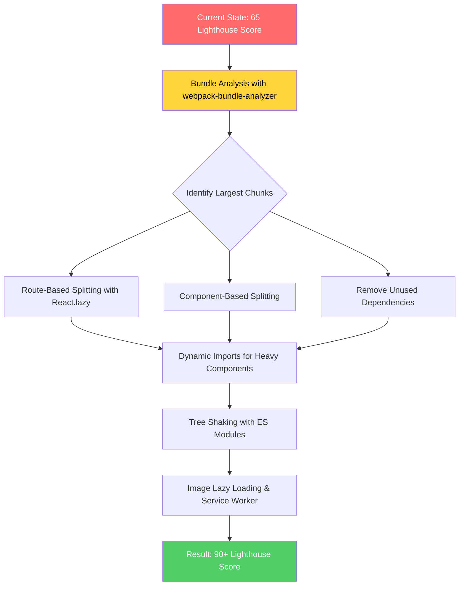

| Difficulty | Channel | Tags |
|---|---|---|
| intermediate | frontend | lighthouse, bundle, lazy-loading |

Imagine waiting seven seconds for a login form to load. Not a complex dashboard, not a data-heavy analytics tool — a login form with a language switcher. That was Netflix's reality on simulated 3G connections, where their sign-up landing page shipped ~300kB of unnecessary client-side JavaScript to users who just wanted to create an account [1]. The kicker? The page was already server-rendered. React was loaded twice. Here is what Netflix learned, and the exact playbook you can use to slash your bundle size and push your Lighthouse score past 90.

---

> ### Real-World Case — Netflix
>
> Netflix's sign-up landing page was taking 7 seconds to load on simulated 3G connections. The page was server-rendered with React but then shipped ~300kB of client-side JavaScript (React + Lodash + app code) just for a relatively simple landing page with a login form and language switcher. Users on slower connections were staring at a loading spinner while hundreds of kilobytes of unnecessary JS downloaded and executed.
>
> | | |
> |---|---|
> | **Challenge** | The logged-out homepage had a Time-to-Interactive of 7 seconds on 3G. The team needed to dramatically reduce the JS payload without rebuilding their entire React SSR architecture, while still preserving the ability to use React for the complex sign-up flow that came after the landing page. |
> | **Solution** | Netflix took a counterintuitive approach: they removed client-side React entirely from the landing page. They kept React for server-side rendering (to generate the HTML), but replaced all client-side React code with ~300 lines of vanilla JavaScript handling just the language switcher and click interactions. The key insight was that the landing page's interactivity was so simple (a form, a link, a language toggle) that a full React runtime was overkill. They then used XHR prefetching (95% success rate) and browser `` to pre-load the React bundle for the next page while the user was on the landing page, so React was ready when needed for the sign-up flow. |
> | **Outcome** | Time-to-Interactive dropped by over 50% on the logged-out homepage. The JavaScript payload was reduced by ~200kB. Prefetching React for subsequent pages reduced TTI by 30% for the sign-up flow. Users clicked the sign-up button at a greater rate after the optimization. The React bundle was still loaded and used for the full SPA sign-up experience — they didn't abandon React, they just deferred it. |
> | **Lesson** | The biggest performance wins often come from not shipping code you don't need yet. Netflix proved that server-rendering React to HTML and then NOT loading React client-side for the first interaction is a valid and powerful pattern. The lesson: audit whether your first-paint screen actually needs a framework's client-side runtime, and if it doesn't, defer it aggressively. |

---

## Hook — 7 Seconds for a Login Form

Picture this: a user taps a Netflix ad on their phone over a patchy café Wi-Fi connection. Seven seconds later, they are still staring at a loading spinner. Not because the server is slow. Not because the API is down. But because the browser is choking on 300kB of JavaScript that renders a form and a dropdown. Netflix estimated that for every second of additional load time, the probability of a user abandoning the sign-up flow increased measurably. That is not a theoretical cost — it is lost revenue, compounding across millions of sign-ups worldwide. Now picture your app. If your Lighthouse score is sitting at 65 and your bundle weighs in at 2.1MB with a Time to Interactive of 4.2 seconds, you are in the same territory Netflix was — except your users might not be as patient.

## Problem — The Silent Revenue Killer

Here is the uncomfortable truth: performance is not a feature. It is a prerequisite. Google's research shows that 53% of mobile users abandon sites that take over three seconds to load [2]. Your 4.2-second TTI is not just a number on a dashboard — it is a funnel leak. Every tenth of a second of delay compounds into measurable drops in engagement, conversion, and retention. The root cause in most React applications is deceptively simple: you are shipping code your users do not need yet. A 2.1MB bundle means the browser must download, parse, and execute hundreds of thousands of lines of JavaScript before your app becomes interactive. And here is the part that trips up even experienced developers — tree shaking alone will not save you. Many developers discover that removing an unused import does nothing if the bundler cannot determine the import is dead code [3]. The problem is systemic, not surgical. It touches your build configuration, your dependency tree, your component architecture, and your deployment strategy all at once.

## Real-World Case — Netflix's Deferred React Strategy

Netflix's engineering team published a case study revealing that their logged-out homepage — the very first impression for new users — was shipping React, Lodash, and application code as a monolithic client-side bundle [1]. The page was already server-rendered with React on the server, but the client still received the full React runtime to hydrate a relatively simple landing page. The impact was stark: on simulated 3G, Time to Interactive was over 7 seconds. The fix was elegant in its simplicity. Netflix deferred loading React on the client side for the logged-out homepage. Instead of abandoning React entirely, they loaded it lazily — only after the user interacted with the page or navigated to the sign-up flow. The JavaScript payload dropped by ~200kB. TTI fell by over 50%. Prefetching React for subsequent pages reduced TTI by an additional 30% for the sign-up experience. And the business metric that mattered most? Users clicked the sign-up button at a greater rate [1]. This case study illustrates a principle that every frontend team should internalize: you do not have to ship everything to everyone, all the time. Sometimes the most powerful optimization is knowing what to defer.

## Deep Dive — Anatomy of a Bloated Bundle

Before you reach for `React.lazy()` and call it a day, you need to understand why your bundle is 2.1MB in the first place. The root cause is almost always the same: dependencies accumulate silently, and bundlers are not as smart as you think. Start with analysis. `webpack-bundle-analyzer` visualizes exactly what is inside your bundle — every module, every dependency, every kilobyte [4]. Many developers are shocked to discover that a single icon library, a date formatting utility, or a CSS-in-JS runtime can add 50-100kB to their output. Here is the critical distinction that separates intermediate developers from senior engineers: route-based splitting vs. component-based splitting. Route-based splitting is the low-hanging fruit. Your user does not need the Analytics page code when they land on the Dashboard. React.lazy() defers the import until the route is navigated to, which means the initial load only contains what the user actually sees [5]. Component-based splitting goes deeper. That 3D chart library, the rich text editor, or the payment form modal — these can all be lazily imported as separate chunks. The browser loads them only when the user triggers the interaction. But there is a plot twist many teams miss: lazy loading is only effective if your chunks are meaningful. If your route-based split creates a 50kB chunk and a 200kB chunk, you have not solved the problem — you have just moved it. The real insight is that splitting must be paired with analysis. You need to know what is large, then decide whether to split, remove, or replace it [6].

## Workflow — The Six-Step Bundle Optimization Playbook

Here is the systematic approach that turns a 65 Lighthouse score into a 90+. Each step builds on the previous one, and skipping any step leaves performance gains on the table.

## Code Example — Route-Based Lazy Loading in Production

Here is a production-ready implementation of route-based code splitting with error boundaries, prefetching, and Suspense configuration.

## Lessons Learned — What Teams Get Wrong

The biggest mistake teams make is treating lazy loading as a silver bullet. After working through dozens of bundle optimization projects, here are the patterns that separate successful optimizations from disappointing ones.

---

## Bundle Optimization Workflow

<strong>Original Interview Question</strong>

**Q:** You're tasked with improving a React app's Lighthouse performance score from 65 to 90+. The bundle size is 2.1MB and Time to Interactive is 4.2s. What specific steps would you take to optimize the bundle and implement lazy loading?

**A:** Implement code splitting with React.lazy() and Suspense, analyze bundle composition with webpack-bundle-analyzer to identify largest chunks, remove unused dependencies and optimize imports, add dynamic imports for heavy components and third-party libraries, implement route-based splitting for better initial load times, and utilize tree shaking with proper ES module configuration.

## Conclusion

Netflix proved that deferring 200kB of JavaScript increased sign-up rates on a page that was already server-rendered [1]. Your app likely has the same opportunity — not by shipping less code overall, but by shipping the right code at the right time. Start with bundle analysis this week. Identify the three largest chunks. Split the two that correspond to routes you know users visit second. The Lighthouse score will tell the story. But the real metric is what happens after: users who never waited will never know how fast your app became. They will just know it felt right.

---

## References

1. [Netflix Web Performance Case Study](https://medium.com/dev-channel/a-netflix-web-performance-case-study-c0bcde26a9d9) — article
2. [Mobile Page Speed Benchmarks](https://www.thinkwithgoogle.com/marketing-strategies/app-and-mobile/mobile-page-speed-new-industry-benchmarks/) — blog
3. [Tree Shaking — MDN Web Docs](https://developer.mozilla.org/en-US/docs/Glossary/Tree_shaking) — documentation
4. [webpack-bundle-analyzer GitHub Repository](https://github.com/webpack-contrib/webpack-bundle-analyzer) — documentation
5. [React lazy() API Documentation](https://react.dev/reference/react/lazy) — documentation
6. [Code Splitting — Webpack Documentation](https://webpack.js.org/guides/code-splitting/) — documentation
7. [Suspense for Data Fetching — React Documentation](https://react.dev/reference/react/Suspense) — documentation
8. [Web Vitals — Google Developers](https://web.dev/articles/vitals) — documentation

---

**Author:** Satishkumar Dhule — [GitHub](https://github.com/satishkumar-dhule) · [LinkedIn](https://linkedin.com/in/satishkumar-dhule) · [Website](https://satishkumar-dhule.github.io)
