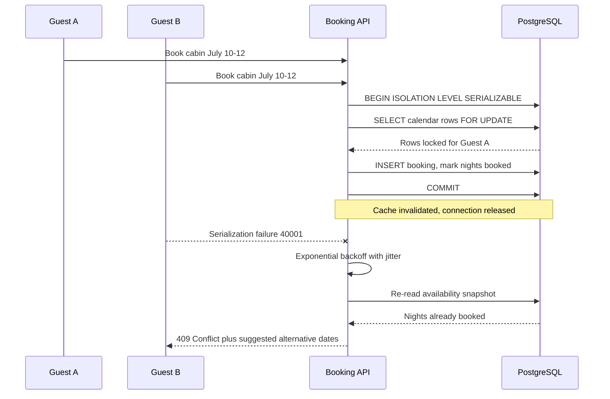

| Difficulty | Channel | Tags |
|---|---|---|
| intermediate | database | acid, isolation-levels, mvcc |

It is Black Friday 2025, and Shopify merchants are pulling in a record $5.1 million in sales per minute [1]. Somewhere in that flood, two shoppers tap Buy on the very last unit of a flash-sale item at the same millisecond — and only one of them should walk away with it. This is the exact same problem Airbnb faces when two guests try to reserve the same cabin for the same weekend, and the difference between a clean win and an angry refund email comes down to how the database transaction is designed. The story of how Shopify survived that night offers a masterclass in concurrency control, complete with a plot twist nobody saw coming.

---

> ### Real-World Case — Shopify
>
> Shopify's oversell protection system had to guarantee two concurrent buyers could never purchase the same last unit — the e-commerce equivalent of Airbnb's double-booking problem. For years this ran on Redis, but reservations lived in a separate system from the MySQL inventory ledger, so reserve and claim operations couldn't share an ACID transaction. On Black Friday 2025, merchants hit a record $5.1 million in sales per minute at peak, and every one of those transactions touched inventory.
>
> | | |
> |---|---|
> | **Challenge** | Prevent two concurrent checkouts from claiming the same inventory unit while keeping reservation holds and the inventory ledger atomically consistent. Their first MySQL attempt — one row per item with a quantity counter — failed because thousands of flash-sale checkouts collapsed onto a single InnoDB row lock, serializing all buyers. Redis solved throughput but introduced split-brain failure modes: payment succeeds but inventory isn't claimed (oversell), or vice versa. |
> | **Solution** | They rebuilt reservations directly in MySQL using one row per sellable unit instead of one row per item, combined with MySQL 8's SELECT ... FOR UPDATE SKIP LOCKED so concurrent buyers claim different rows without waiting. They capped pools at 1,000 rows per item/location with background replenishment, moved filter columns into a composite primary key to cut two row locks per reservation down to one, and made their first-ever use of a non-default isolation level — switching these transactions from REPEATABLE READ to READ COMMITTED to eliminate gap (supremum) locks that deadlocked replenishment. They also enforced consistent lock ordering across reserve/claim paths to kill circular-wait deadlocks, then migrated via dual-write shadow mode with a kill switch back to Redis. |
> | **Outcome** | Survived Black Friday 2025 peak traffic ($5.1M sales/minute, 11% above prior year) with writer CPU under 50% and reader CPU under 16% during high-volume flash sales. The checkout-path cleanup alone removed 50% of reads and 33% of transactions on the primary database. Zero oversells reported as the payoff. The surprise: after weeks optimizing queries and locks, the real ceiling was database connection hold time in unrelated checkout code — found only after adding per-caller connection attribution tags parsed by ProxySQL. |
> | **Lesson** | Your existing relational database can often handle concurrency-control workloads you assume require specialized infrastructure like Redis or Kafka — if you design the locking correctly (SKIP LOCKED, lock ordering, isolation level choice). And when performance numbers don't add up (low CPU but high queuing), the bottleneck is usually in the plumbing — connection management, not the engine you're measuring. |

---

## Hook — Two Shoppers, One Last Unit, $5.1 Million Per Minute

Picture the moment: Black Friday, peak traffic, and a merchant's inventory counter sits at exactly one unit remaining. Two buyers hit checkout within milliseconds of each other. If the system is lucky, one sees "sold out." If it is unlucky, both get confirmation emails — and someone has to call a customer and un-sell a product they already paid for.

This is not a hypothetical edge case. During Black Friday 2025, Shopify processed a record $5.1 million in sales per minute at peak — 11% above the prior year — and every single one of those transactions touched inventory [1]. Multiply that tiny race window by millions of checkouts, and overselling stops being a bug report and becomes a brand-damaging incident.

Here is the uncomfortable part: most developers assume the fix is obvious. Wrap it in a transaction, done. But as Shopify's engineers discovered after weeks of optimization, the true bottleneck was hiding somewhere completely unexpected — in unrelated checkout code, measured only after they added per-caller connection attribution tags parsed by ProxySQL [1].

So how do systems like Airbnb and Shopify guarantee that a scarce resource — a cabin night, a last sneaker — can never be claimed twice, without turning the database into a traffic jam? That journey starts with understanding why the naive solution fails spectacularly.

## Problem — The Double-Booking Race Condition

At its core, double booking is a textbook race condition on a shared resource. The dangerous pattern is called read-modify-write: check availability, decide it is free, then write the booking. Between the read and the write, another request can slip through the gap and make the same decision based on stale data.

Sound familiar? Every developer who has built a booking flow has probably written this bug at least once:

- **Read**: SELECT availability for July 10–12 → returns "open"
- **Decide**: application logic concludes the dates are free
- **Write**: INSERT booking, UPDATE calendar

Two requests executing these three steps concurrently can both pass the read phase before either reaches the write phase. Both bookings succeed. The property is now double-booked, and the damage surfaces days later when a guest arrives to find strangers in their rental.

The stakes scale brutally. For Airbnb, a double booking means refunds, relocations, and trust erosion. For e-commerce, overselling means canceling paid orders. Databases solved this class of problem decades ago through ACID guarantees — atomicity, consistency, isolation, and durability [2] — but here is the catch: the default isolation level in most databases (READ COMMITTED) does **not** prevent this race. It prevents dirty reads, not lost updates or phantom writes [4].

Many developers discover this the hard way, in production, at the worst possible time. The question then becomes: which isolation level, which locking strategy, and how much throughput are those choices willing to sacrifice? Before answering, it helps to see how a company operating at internet-breaking scale made these exact trade-offs.

## Real-World Case — Shopify

Shopify's oversell protection system had one non-negotiable job: two concurrent buyers could never purchase the same last unit. For years, reservations lived in Redis while the authoritative inventory ledger lived in MySQL — meaning reserve and claim operations could not share a single ACID transaction across the two systems [1].

That architectural split created exactly the kind of gap this article has been describing: state changes that needed to happen together could fail independently. Ahead of Black Friday 2025, the team consolidated reservation handling so reserve and claim paths could operate transactionally against the ledger, then optimized aggressively for the peak.

The results were quantified and dramatic:

- **$5.1 million in sales per minute** at peak — 11% above the previous year
- **Writer CPU under 50%, reader CPU under 16%** during high-volume flash sales
- **Zero oversells reported** as the payoff
- Checkout-path cleanup alone removed **50% of reads and 33% of transactions** on the primary database

But here is the plot twist worth remembering: after weeks spent optimizing queries and locks, the real ceiling turned out to be **database connection hold time in unrelated checkout code**. The team only found it after adding per-caller connection attribution tags that ProxySQL could parse [1]. The lesson generalizes far beyond inventory: the thing throttling a system is often not the thing being optimized.

With the war story established, the next question is technical: what are the actual mechanisms — isolation levels, MVCC, locks — that make such guarantees possible, and what do they cost?

## Deep Dive — Isolation Levels, MVCC, and the Art of the Lock

Building on Shopify's experience, the design space for preventing double bookings boils down to three strategies, each with a distinct personality.

**Strategy 1: Pessimistic locking.** Lock the rows first, ask questions later. In PostgreSQL, `SELECT ... FOR UPDATE` grabs row-level locks on the availability calendar rows covering the requested dates; any competing transaction blocks until the first commits or rolls back [8]. This descends from classical two-phase locking, the scheme behind traditional serial execution guarantees [7]. It is simple to reason about, but hot properties become lock contention hotspots — exactly why Shopify monitored contention and built circuit breakers for popular listings.

**Strategy 2: Optimistic concurrency control.** Assume conflicts are rare. Read freely, attach a version number, and validate at write time: if the version changed underneath, abort and retry [6]. No locks held while thinking, which means excellent read throughput — but under heavy contention, retry storms can amplify load precisely when the system is weakest.

**Strategy 3: Serializable isolation.** The strongest guarantee: the database ensures outcomes are equivalent to some serial execution order [5]. Modern engines achieve this cheaply-ish through multiversion concurrency control (MVCC), where readers get consistent snapshots without blocking writers, and writers detect serialization conflicts at commit time [3].

| Approach | Contention behavior | Throughput under low conflict | Throughput under high conflict | Best fit |
|---|---|---|---|---|
| Pessimistic (FOR UPDATE) | Blocks competitors | Moderate | Degrades via queuing | Short, predictable critical sections |
| Optimistic (version column) | Aborts and retries | Excellent | Retry storm risk | Low-conflict resources |
| SERIALIZABLE (MVCC/SI) | Aborts on conflict detection | Very good | Abort rate rises | Correctness-critical booking flows |

💡 Insight: production systems rarely pick just one. A pragmatic stack uses MVCC snapshot reads for browsing availability (fast, no locks), SERIALIZABLE or FOR UPDATE for the narrow booking commit, and optimistic version checks as a belt-and-suspenders validation layer.

⚠️ Watch Out: raising the isolation level globally punishes every query in the workload. Scope SERIALIZABLE to the booking transaction only, and keep its critical section short — hold locks for milliseconds, not seconds.

🔥 Hot Take: "just put it in Redis" is not a concurrency strategy if the reservation store and the ledger cannot share a transaction — that was the exact architectural flaw Shopify engineered away before Black Friday [1].

Knowing the theory, though, raises a practical question: what does the end-to-end flow look like when a real user clicks "Book now"?

## Workflow — From Click to Committed Row

This leads directly to the operational playbook. A robust booking pipeline follows seven steps, each designed to shrink the race window or recover from losing it:

1. **Snapshot read for UX**: serve availability from replicas or cache so browsing stays fast and lock-free.
2. **Begin a SERIALIZABLE transaction**: scoped tightly around the booking decision, nothing else.
3. **Lock or validate the date range**: `SELECT ... FOR UPDATE` on the calendar rows, or a version check for the optimistic variant [8].
4. **Application-level validation**: confirm every night in the range is genuinely open — defense in depth beyond what the database enforces.
5. **Write atomically**: insert the booking and update the calendar in the same transaction; bump version columns.
6. **Handle failure gracefully**: on a serialization failure (SQLSTATE 40001) or deadlock (40P01), retry with exponential backoff and jitter rather than hammering the database [9].
7. **Invalidate caches and release fast**: bust the availability cache on success, and return the connection immediately — Shopify's ProxySQL attribution work proved connection hold time matters as much as query time [1].

The sequence diagram below traces the happy path for Guest A and the conflict-retry path for Guest B, showing exactly where the database arbitrates the race:

sequenceDiagram
    participant A as Guest A
    participant B as Guest B
    participant API as Booking API
    participant DB as PostgreSQL
    A->>API: Book cabin July 10-12
    B->>API: Book cabin July 10-12
    API->>DB: BEGIN ISOLATION LEVEL SERIALIZABLE
    API->>DB: SELECT calendar rows FOR UPDATE
    DB-->>API: Rows locked for Guest A
    API->>DB: INSERT booking, mark nights booked
    API->>DB: COMMIT
    Note over API,DB: Cache invalidated, connection released
    B--xAPI: Serialization failure 40001
    API->>API: Exponential backoff with jitter
    API->>DB: Re-read availability snapshot
    DB-->>API: Nights already booked
    API-->>B: 409 Conflict plus suggested alternative dates

Notice what Guest B experiences: not a hang, not a silent corruption — a fast, honest conflict response with alternatives. That is the transformation from fragile to trustworthy. Next, the code that makes this concrete.

## Code Example — A Retry-Safe Booking Transaction in TypeScript

The implementation below captures the entire workflow in a single function: serializable isolation, row-level locking over the requested date range, application-level validation, automatic retry with jittered exponential backoff, and disciplined connection release — the detail that ultimately mattered to Shopify [1].

Every line maps to a step from the workflow section, and the error codes 40001 and 40P01 are the PostgreSQL signals that a concurrent writer won the race [8]:

- The `FOR UPDATE` clause converts the availability check into a lock acquisition, closing the read-modify-write gap
- The night-count validation catches partial-range gaps that a naive existence check would miss
- The retry loop distinguishes *conflict* errors (retryable) from *real* errors (fail loudly)
- Jittered backoff prevents synchronized retry storms when many waiters lose simultaneously [9]
- `client.release()` in `finally` guarantees connections return to the pool even on failure — the exact class of leak ProxySQL attribution exposed at Shopify

Teams running managed databases instead of raw PostgreSQL can express the same guarantee with native transactional APIs — for example, DynamoDB's transactional writes provide all-or-nothing semantics across multiple items [10] — but the pattern of short critical section plus bounded retry remains identical.

## Lessons Learned — Battle Scars and Takeaways

Tying the whole journey together, from the two-buyers-one-unit opening scene to Shopify's Black Friday triumph, several durable truths emerge:

**What works:**

- ✅ **Shrink the critical section**: SERIALIZABLE isolation or `FOR UPDATE` only around the booking commit — never around payment calls, emails, or third-party APIs
- ✅ **Layer defenses**: database isolation + application-level validation + optimistic version columns catch different failure modes
- ✅ **Retry with backoff and jitter**: treat SQLSTATE 40001 as normal weather, not an exception [9]
- ✅ **Separate read and write paths**: cached/replica reads for browsing, strict transactions for committing

**Battle scars — mistakes seen repeatedly in production:**

- ⚠️ Holding a transaction open across an HTTP call to a payment provider, turning row locks into system-wide stalls
- ⚠️ Trusting READ COMMITTED to prevent double booking — it will not [4]
- ⚠️ Retrying without jitter, synchronizing hundreds of failed requests into a self-inflicted DDoS
- ⚠️ Optimizing queries for weeks while the actual ceiling was connection hold time elsewhere — measure per-caller before tuning per-query [1]

🎯 Key Point: correctness at scale is an architecture property, not a flag. Shopify achieved zero oversells at $5.1M/minute not because of one clever setting, but because reserve and claim finally shared one ACID transaction, the checkout path shed 50% of its reads, and instrumentation existed to find the *real* bottleneck [1].

The memorable insight to share with a team: **the bottleneck is rarely where the effort is going** — instrument attribution first, then optimize. Tomorrow's action item is small: find the longest-held database connection in the hottest code path and ask what would happen if two users hit it in the same millisecond. The answer is either peace of mind or next quarter's incident report.

---

## Concurrent Booking Race — Conflict and Retry Flow

<strong>Original Interview Question</strong>

**Q:** You're building a booking system for Airbnb where multiple users can reserve the same property simultaneously. How would you design the transaction handling to prevent double bookings while maintaining high availability?

**A:** Use SERIALIZABLE isolation with optimistic concurrency control. Implement row-level locks on property availability tables, use MVCC snapshot reads for checking availability, and apply application-level validation to ensure atomic booking operations.

## Conclusion

The journey circles back to where it started: two shoppers, one last unit, and $5.1 million per minute riding on a few lines of transaction logic. The takeaway is that preventing double bookings is not about choosing the strongest isolation level everywhere — it is about layering MVCC snapshot reads for speed, a short SERIALIZABLE or FOR UPDATE critical section for correctness, optimistic version checks for defense in depth, and jittered retries for resilience. And Shopify's plot twist deserves permanent space in every engineer's mental model: after weeks of query tuning, the real ceiling was connection hold time in unrelated code, visible only through per-caller attribution. So this week, pick the hottest write path in the system, measure how long each connection is actually held, and ask what happens if two requests collide in the same millisecond. Fix that gap before Black Friday finds it first.

---

## References

1. [Shopify incident report](https://shopify.engineering/scaling-inventory-reservations) — blog
2. [ACID (Atomicity, Consistency, Isolation, Durability)](https://en.wikipedia.org/wiki/ACID) — documentation
3. [Multiversion Concurrency Control (MVCC)](https://en.wikipedia.org/wiki/Multiversion_concurrency_control) — documentation
4. [Isolation (database systems) and Isolation Levels](https://en.wikipedia.org/wiki/Isolation_(database_systems)) — documentation
5. [Serializability](https://en.wikipedia.org/wiki/Serializability) — documentation
6. [Optimistic Concurrency Control](https://en.wikipedia.org/wiki/Optimistic_concurrency_control) — documentation
7. [Two-Phase Locking](https://en.wikipedia.org/wiki/Two-phase_locking) — documentation
8. [PostgreSQL — Open Source Database (row-level locking engine)](https://github.com/postgres/postgres) — documentation
9. [Exponential Backoff](https://en.wikipedia.org/wiki/Exponential_backoff) — documentation
10. [Amazon DynamoDB Transactions](https://docs.aws.amazon.com/amazondynamodb/latest/developerguide/transactions.html) — documentation

---

**Author:** Satishkumar Dhule — [GitHub](https://github.com/satishkumar-dhule) · [LinkedIn](https://linkedin.com/in/satishkumar-dhule) · [Website](https://satishkumar-dhule.github.io)
