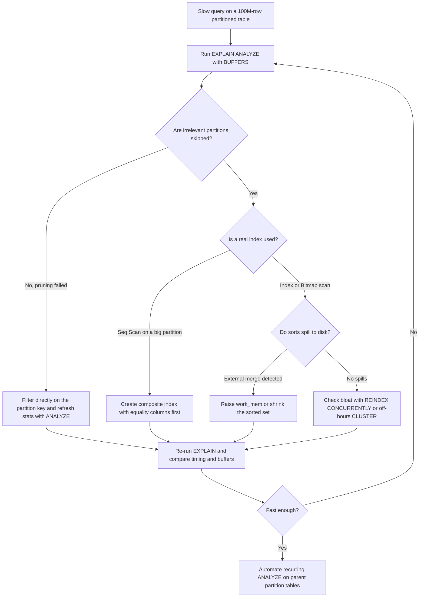

| Difficulty | Channel | Tags |
|---|---|---|
| intermediate | database | explain, query-plan, partitioning |

Hatchet, a YC-backed durable task queue built entirely on Postgres, ingests hundreds of millions of tasks per day. When their single 200-million-row table started drowning under 24/7 chunked DELETE jobs, the team did everything right: they migrated to daily time-based range partitions, load-tested the rollout, shipped it — and production queries got progressively slower anyway. The entire incident was resolved by one manual command and a tiny PR [1]. This is the story of why partitioned tables can quietly mislead their own query planner, and how to catch them in the act.

---

> ### Real-World Case — Hatchet
>
> Hatchet, a YC-backed durable task queue built entirely on Postgres, stores hundreds of millions of tasks per day. At ~200 million rows in a single table, index bloat and 24/7 chunked DELETE jobs forced them to migrate to daily time-based range partitions. The rollout passed load tests — then production queries started getting progressively slower.
>
> | | |
> |---|---|
> | **Challenge** | After partitioning, JOIN-heavy queries on compound primary keys degraded up to 10x (from a few milliseconds to >20ms), causing massive spikes of active sessions and CPU under moderate load. Partition pruning didn't help, and they couldn't reproduce it locally until they built a 14-partition, 1M-rows-per-partition repro. |
> | **Solution** | They ran EXPLAIN ANALYZE on the repro and discovered the planner's row estimate was off by a factor of 6,100,000x — the planner was choosing terrible join/scan strategies because its statistics were wrong. Postgres expert Laurenz Albe (Cybertec) pointed them to an easily-missed docs footnote: autovacuum never runs ANALYZE on partitioned *parent* tables, so the parent had stale or empty statistics even though every child partition was analyzed. Manually running ANALYZE on the parent table immediately fixed all query plans. |
> | **Outcome** | One manual ANALYZE command resolved the entire incident; all rollout issues were fixed via a small PR that periodically analyzes parent partition tables. Queries returned from >20ms back to low milliseconds, CPU and session spikes disappeared, and the lesson is now baked into their codebase as a recurring AnalyzeTaskTables job. |
> | **Lesson** | Partitioning a table doesn't guarantee fast queries — you must verify what the planner actually believes. In EXPLAIN ANALYZE, compare estimated vs actual rows first: wildly wrong estimates mean stale statistics, not bad indexes. Critically, autovacuum does NOT analyze partitioned parents, so time-partitioned tables need manual/scheduled ANALYZE whenever data distribution shifts — a trap almost every team hits once. |

---

## Hook — The Migration That Passed Every Test Except Reality

Picture the scene: weeks of planning, a flawless load-test environment, green checkmarks across the CI pipeline. The old monolithic table — bloated, painful to delete from, groaning at ~200 million rows — is finally replaced by clean daily range partitions. Rollout day feels like a victory lap.

Then reality files a complaint.

Within days of hitting production, queries start creeping upward. Latency climbs past 20 milliseconds, CPU spikes appear out of nowhere, session counts swell, and the dashboards that looked so calm during testing start flashing amber. Nothing changed in application code. The schema is arguably better. Yet the database is slower than before the "improvement."

Sound familiar? Many teams have lived some version of this nightmare: a change that is correct on paper degrades performance in ways no staging environment predicted. The uncomfortable truth is that the culprit usually is not the migration itself — it is something the migration silently broke underneath the database's ability to reason about its own data.

Before touching a single index, there is a question worth sitting with: how does Postgres actually decide whether a partitioned query should be fast? The answer is where the investigation begins.

## Problem — 100 Million Rows and a Date Filter That Refuses to Cooperate

Here is the classic setup: a table with 100 million rows, partitioned by date, and a query filtering on a specific date range that is still painfully slow. On paper, partitioning should shine here — the planner ought to skip every partition outside the range and touch only a sliver of data. So why is the query crawling?

You might assume partitioning is a performance switch you flip once and enjoy forever. In practice, it behaves more like a contract with fine print. The speedup only materializes when three conditions hold simultaneously:

- **Partition pruning actually fires** — the WHERE clause must match the partition key closely enough for the planner to discard irrelevant partitions at plan time or execution time.
- **Indexes inside the surviving partitions get used** — each partition carries its own indexes, and a bad plan can still choose a sequential scan over tens of millions of rows.
- **No hidden monsters in the plan** — expensive sorts, hash aggregates spilling to disk, and bloated indexes can dominate runtime even when pruning works perfectly.

Break any one of these and the partitioning benefit evaporates. Worse, the failure modes are invisible from the outside: the query returns correct results, just slowly, while CPU quietly burns money in the background.

The stakes scale brutally. At 100 million rows, a single unnecessary sequential scan during peak traffic can saturate I/O, stall connection pools, and cascade into outages across every service sharing the database. The diagnostic trail exists — it lives inside the EXPLAIN plan. Knowing which of the three suspects to hunt first separates a five-minute fix from a five-day firefight.

## Real-World Case — Hatchet's Post-Slowdown Autopsy

This is not a hypothetical horror story. Hatchet, a durable task queue built entirely on Postgres, runs workloads most engineers only see in stress-test fantasies: hundreds of millions of tasks per day. Their original architecture stored everything in one massive table, and at roughly 200 million rows the pain became structural — index bloat ballooned storage, and round-the-clock chunked DELETE jobs (the standard trick for purging old rows without locking) consumed resources around the clock [1].

Their solution was textbook: migrate to daily time-based range partitions, so retention becomes a near-instant DETACH instead of a marathon of deletes. They validated the rollout with load tests. Everything passed.

Then came the plot twist. Production queries began getting progressively slower — latency pushed beyond 20 milliseconds, CPU spiked, and session counts climbed. The partitioning strategy was sound; the data layout was better; nothing in the application had changed.

The root cause turned out to be almost embarrassingly small: **stale statistics**. After the migration, the planner's statistical picture of the new partitions was outdated, so it kept making confidently wrong decisions about join orders and access paths. A single manual `ANALYZE` command resolved the entire incident, snapping queries back to low milliseconds and making the CPU and session spikes vanish [1].

The permanent fix was equally humble: a small PR introducing a recurring `AnalyzeTaskTables` job that periodically analyzes the parent partition tables, now baked into their open-source codebase [10]. One command, one cron-style safety net — and a fleet-wide performance regression disappeared.

## Deep Dive — Reading the Tea Leaves of an EXPLAIN Plan

Building on Hatchet's experience, the lesson generalizes: when a partitioned query misbehaves, the EXPLAIN plan is the interrogation room, and three suspects always get interviewed first.

**Suspect #1: Failed partition pruning.** Run `EXPLAIN (ANALYZE, BUFFERS)` and inspect the plan shape [2]. A healthy pruned query shows an Append node touching only the few partitions inside your date range [3]. If the plan lists every daily partition — or worse, shows a Seq Scan across all of them — pruning failed. Common culprits: functions wrapped around the partition key (`WHERE date_trunc('day', event_date) = ...` defeats pruning instantly), implicit type casts, or filters on non-key columns that the planner cannot correlate with partition boundaries.

💡 **Insight:** Postgres can also prune at *execution* time using parameterized values. A plan that looks unpruned at compile time may still prune per-execution — check the actual runtime output, not just the static plan.

**Suspect #2: Index avoidance.** Inside surviving partitions, look at the access method. A Seq Scan on a 100-million-row partition is a confession. An Index Scan or Bitmap Heap Scan is usually healthy — but check the `Buffers` line: `shared hit` means cache, `shared read` means disk. High read counts on a "fast" query predict tomorrow's slowdown when the cache evicts you [2].

⚠️ **Watch Out:** Here is the counterintuitive part. The instinctive composite index `(event_date, status)` is often suboptimal when `status` is an equality filter and `event_date` is a range. Postgres multicolumn indexes work left-to-right, so equality columns should come first: `(status, event_date)` lets the engine seek directly into the matching statuses *and* the date range [5]. Column order is not cosmetic — it is the difference between scanning a slice and scanning a slab [9].

**Suspect #3: Expensive sorts and spills.** Scan the plan for Sort nodes. `Sort Method: quicksort Memory: xxkB` is fine; `Sort Method: external merge Disk: xxMB` means the sort spilled to disk because `work_mem` was too small — a silent latency multiplier. Hash joins and hash aggregates print similar warnings via `Batches:` counts.

And beneath all three suspects lurks the one that got Hatchet: **statistics**. The planner is a probability engine running on `pg_statistic`, and every row estimate, selectivity guess, and join decision flows from those numbers [4]. Autovacuum triggers ANALYZE based on tuple-change thresholds, but freshly created partitions, bulk loads, and migrations routinely outrun it [7]. When estimates are stale, even perfect indexes and perfect pruning produce terrible plans.

🔥 **Hot Take:** Partitioning is primarily a *data lifecycle* tool — instant retention drops, smaller maintenance units, contained bloat. Query speedup via pruning is a bonus that must be earned with fresh statistics and prune-friendly predicates, never assumed.

| Plan symptom | Likely cause | First move |
|---|---|---|
| Append touches all partitions | Pruning defeated by expression or cast | Filter directly on the partition key |
| Seq Scan on a large partition | Missing/unusable index | Composite index, equality columns first |
| `shared read` dominates Buffers | Cold cache or bloated index | Investigate bloat; consider REINDEX/CLUSTER [6] |
| `external merge` sort | `work_mem` too small for the sort | Raise work_mem or reduce sorted rows |
| Rows estimate wildly ≠ actual | Stale statistics | Run ANALYZE, then re-check [4] |

## Workflow — The Five-Step Diagnosis Loop

Knowing the suspects is half the game; the other half is interrogating them in the right order. The flowchart below captures the loop that turns mystery slowdowns into mechanical fixes:

*(See the Slow Query Diagnosis Loop diagram — it maps each symptom to its cheapest fix and loops back until the query is genuinely fast.)*

The process unfolds in five deliberate steps:

1. **Reproduce with truth serum.** Run the query under `EXPLAIN (ANALYZE, BUFFERS)`. Never diagnose from `EXPLAIN` alone — without ANALYZE, the plan is a prediction, not a measurement, and predictions can be confidently wrong [2].
2. **Interrogate pruning.** Count the partitions in the Append node versus the partitions your date range logically requires. Any excess is wasted I/O.
3. **Interrogate access paths and buffers.** Flag any Seq Scan on a large partition, and compare `shared hit` against `shared read` to separate CPU problems from I/O problems.
4. **Interrogate memory.** Hunt for external-merge sorts and multi-batch hashes — these are configuration problems wearing a query-plan costume.
5. **Apply the cheapest sufficient fix, then re-measure.** Refresh statistics first (it costs seconds), add indexes second (costs minutes with `CONCURRENTLY`), reach for CLUSTER or `work_mem` changes last. Re-run step 1 and diff timing *and* buffers — faster wall-clock with worse buffer counts is a false win.

Consequently, the loop ends not with a fast query but with an automated guardrail: schedule recurring ANALYZE on parent partition tables, exactly as Hatchet did, so the next statistics gap becomes a non-event instead of an incident [1].

🎯 **Key Point:** The order matters because fixes escalate in cost and risk. ANALYZE is free; a bad index slows every write forever.

## Code Example — Diagnosing and Fixing the Slow Range Query

The script below operationalizes the workflow against the exact scenario from the problem statement — a date-range query on a partitioned `events` table filtered by `status`. Notice the sequence: measure first, refresh statistics second, and only then touch indexes:

```bash
#!/usr/bin/env bash
set -euo pipefail
DB="${DB:-app_db}"

# Step 1: capture the REAL execution, not the planner's guess
psql -d "$DB" -P pager=off -c "
EXPLAIN (ANALYZE, BUFFERS)
SELECT * FROM events
WHERE event_date BETWEEN '2024-01-01' AND '2024-01-31'
  AND status = 'completed';"

# Step 2: audit how stale the planner's row estimates really are
psql -d "$DB" -c "
SELECT relname,
       n_live_tup   AS estimated_rows,
       last_analyze AS last_stats_refresh
FROM pg_stat_user_tables
WHERE relname LIKE 'events%'
ORDER BY 1;"

# Step 3: refresh statistics on parent + partitions (Hatchet's fix)
psql -d "$DB" -c "ANALYZE events;"

# Step 4: only now consider a new index — built online, never blocking writes
psql -d "$DB" -c "
CREATE INDEX CONCURRENTLY IF NOT EXISTS idx_events_status_date
ON events (status, event_date);"

# Step 5: re-run Step 1 and diff both timing AND buffer counts
```

Line-by-line, the design decisions become clear. Step 1 combines `ANALYZE` (actual timings) with `BUFFERS` (cache behavior) — together they expose all three suspects in a single output [2]. Step 2 queries `pg_stat_user_tables`: a `last_analyze` timestamp from weeks ago next to millions of live tuples is the smoking gun Hatchet found [4]. Step 3 is deliberately cheap and comes before any schema change, because stale statistics invalidate even perfect indexes. Step 4 uses `CREATE INDEX CONCURRENTLY` so production writes continue during the build, and orders columns `(status, event_date)` — equality predicate first, range predicate second — so the index descends straight into the relevant slice [5]. Step 5 closes the loop: an optimization that improves timing while inflating disk reads is not done yet.

## Lessons Learned — Battle Scars from the Partitioning Trenches

Every war story leaves scars worth studying. Hatchet's incident and the broader pattern distill into a handful of hard-won rules:

- **Partitioning is a lifecycle feature first, a performance feature second.** Its guaranteed wins are instant retention drops and contained bloat; query speedups arrive only through earned pruning [3].
- **Migrations reset the planner's brain.** Schema changes, bulk loads, and new partitions all demand immediate ANALYZE — autovacuum's thresholds were never designed for that burst [7].
- **Composite index column order is a correctness issue for performance.** Equality columns first, range column last; otherwise the index degenerates into a partial scan [5].
- **`EXPLAIN` without `ANALYZE` is astrology.** Estimates lie gracefully; measurements do not [2].
- **Buffers are the honest witness.** Wall-clock improvements that come with exploding `shared read` counts are borrowing against tomorrow's outage.
- **Automate the boring fix.** A recurring ANALYZE job on parent tables costs one small PR and prevents an entire class of incidents [1].

If this feels overwhelming, you are not alone — query planning sits at the intersection of statistics, caching, and heuristics, and everyone gets burned by it eventually. The good news: the diagnostic loop above compresses days of guessing into minutes of structured reading.

So what should change tomorrow morning? Pick your slowest production query and run it through `EXPLAIN (ANALYZE, BUFFERS)` today, before the next incident chooses the timing for you. Then check when your largest partitioned tables were last analyzed — if the answer is "unknown," you have already found your first bug.

The one-line insight worth repeating to any team that will listen: **Postgres can only ever be as smart as its statistics are fresh.**

---

## Slow Query Diagnosis Loop



<details>
<summary><strong>Original Interview Question</strong></summary>

**Q:** You have a PostgreSQL table with 100M rows partitioned by date. A query filtering on a specific date range is still slow. What would you check in the EXPLAIN plan and how would you optimize it?

**A:** Check partition pruning effectiveness, index utilization patterns, and expensive sort operations. Create composite indexes on (date, filtered_columns) and evaluate clustering strategies for optimal data access.

</details>

## Conclusion

Hatchet's story circles back to a deceptively simple moral: the database was never broken — its map of reality was. Partitioning delivered every promised structural benefit, yet without fresh statistics the planner navigated 200 million rows with an outdated atlas, and one ANALYZE command redrawn the map instantly. Tomorrow, do two things: run your slowest production query through EXPLAIN (ANALYZE, BUFFERS) and read the plan like a detective — pruning, access path, buffers, sorts — then check when your biggest partitioned tables were last analyzed. If the timestamp is a mystery, schedule a recurring ANALYZE today; it is the smallest PR that will ever prevent your next major incident. And carry this one-liner to your next standup: Postgres can only ever be as smart as its statistics are fresh.

---

## References

1. [Hatchet incident report](https://hatchet.run/blog/postgres-partitioning) — article
2. [PostgreSQL Documentation: EXPLAIN](https://www.postgresql.org/docs/current/sql-explain.html) — documentation
3. [PostgreSQL Documentation: Declarative Partitioning](https://www.postgresql.org/docs/current/ddl-partitioning.html) — documentation
4. [PostgreSQL Documentation: Planner Statistics](https://www.postgresql.org/docs/current/planner-stats.html) — documentation
5. [PostgreSQL Documentation: Multicolumn Indexes](https://www.postgresql.org/docs/current/indexes-multicolumn.html) — documentation
6. [PostgreSQL Documentation: CLUSTER](https://www.postgresql.org/docs/current/sql-cluster.html) — documentation
7. [PostgreSQL Documentation: Routine Vacuuming and Autovacuum](https://www.postgresql.org/docs/current/routine-vacuuming.html) — documentation
8. [Query Plan — Wikipedia](https://en.wikipedia.org/wiki/Query_plan) — documentation
9. [Database Index — Wikipedia](https://en.wikipedia.org/wiki/Database_index) — documentation
10. [Hatchet — Open-source task queue on GitHub](https://github.com/hatchet-dev/hatchet) — documentation

---

**Author:** Satishkumar Dhule — [GitHub](https://github.com/satishkumar-dhule) · [LinkedIn](https://linkedin.com/in/satishkumar-dhule) · [Website](https://satishkumar-dhule.github.io)
