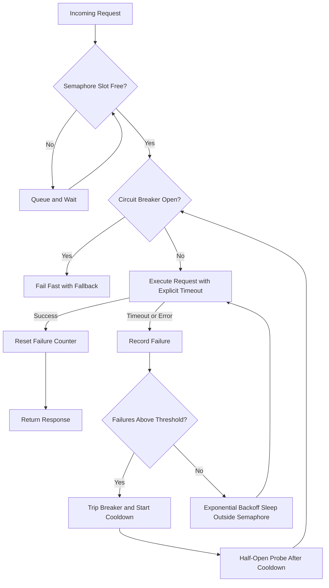

| Difficulty | Channel | Tags |
|---|---|---|
| advanced | backend | asyncio, aiohttp, concurrency |

In 2012, Netflix engineers watched a single slow dependency bring their entire streaming API to its knees — over one billion daily calls fanning out six-to-one into backend services, saturating every Tomcat request thread within seconds [1]. That nightmare sounds reserved for companies with armies of on-call engineers, yet the identical failure mode hides inside every unbounded aiohttp client shipping to production today. The fix is not more servers or longer timeouts; it is a connection pool manager that knows when to push forward, when to back off, and when to slam the door shut. Here is how to build one.

---

> ### Real-World Case — Netflix
>
> After migrating to AWS microservices, Netflix's API received over 1 billion incoming calls per day, fanning out 1:6 into several billion outgoing calls across dozens of backend dependencies, peaking above 100k dependency requests per second. In 2012, a single slow dependency could saturate every Tomcat request thread within seconds and take down the entire streaming API.
>
> | | |
> |---|---|
> | **Challenge** | Prevent cascading failures from slow or failing downstream services while keeping the API responsive: unbounded concurrent connections, missing timeouts, and retries against a struggling service would amplify load exactly when the system was most fragile. |
> | **Solution** | Netflix built Hystrix (evolved from their DependencyCommand work), combining exactly the primitives from this topic: semaphore-based concurrency limits via non-blocking tryAcquire, aggressive network timeouts with bounded retries, per-dependency bulkhead isolation, and circuit breakers that trip on ~50% error rate in a 10-second window and reject requests until health checks recover. Every failure path routes through graceful-degradation fallbacks instead of piling up requests. |
> | **Outcome** | Hystrix executed tens of billions of thread-isolated and hundreds of billions of semaphore-isolated calls per day at Netflix, with a 'dramatic improvement in uptime and resilience.' Netflix's own math showed why it mattered: 30 dependencies at 99.99% uptime each would still mean 2+ hours of downtime per month without fault isolation. The library became the industry-standard reference implementation of the circuit breaker pattern. |
> | **Lesson** | Concurrency limiting, timeouts, retries, and circuit breakers must be combined as layered defenses — no single technique suffices. The counterintuitive twist: Netflix even protected its fallback functions with semaphores, because a buggy fallback making network calls could itself take down the app. Fail fast and shed load rather than letting requests queue up against a dying dependency. |

---

## Hook — A Billion Calls a Day, and One Slow Service Was All It Took

Run the numbers for a moment. Netflix's API received over one billion incoming calls per day after its migration to AWS microservices, and each call fanned out 1:6 into several billion outgoing calls across dozens of backend dependencies — peaking above 100,000 dependency requests per second [1]. Now picture the plot twist: the outage that followed was not caused by a crash, a bad deploy, or a database melting down. It was caused by *slowness*. One dependency got sluggish, and within seconds every worker thread was parked, waiting politely on a socket that would never answer.

This is the part that unsettles experienced engineers: **slow is the new down**. A dead service fails fast, alerts fire, traffic reroutes. A slow service does something far worse — it quietly consumes every resource you own while everything looks technically fine. Sound familiar? Anyone who has stared at a wall of pending connections at 2am knows this feeling intimately.

The question that haunted Netflix's engineers in 2012 deserves an honest answer from every team running async Python today: what happens to *your* service when a dependency gets slow — not dead, just slow?

## Problem — Your Connection Pool Is a Load-Bearing Wall Nobody Inspects

Here is the uncomfortable truth about most aiohttp deployments: the connection pool receives less scrutiny than a CSS file. Developers spin up a `ClientSession`, fire off coroutines, and assume the event loop will sort out the rest. Many teams discover the hard way that the event loop is a cooperative scheduler, not a bodyguard — it will happily schedule ten thousand concurrent requests against a dependency that can only handle fifty.

The failure sequence reads like a horror story told in three acts. Act one: a downstream dependency slows from 50ms to 5 seconds. Act two: in-flight requests pile up, connections accumulate, memory climbs, and the event loop spends its budget managing thousands of half-dead sockets. Act three: healthy dependencies start timing out too, because your service no longer has capacity to talk to anyone. This is a textbook cascading failure, and retries without backoff make it worse by triggering the thundering herd problem, where synchronized retry waves hammer a recovering service back into the ground [6].

The stakes are brutally quantifiable. Netflix's own math showed that thirty dependencies at 99.99% uptime each still produce over two hours of expected downtime per month without fault isolation [1]. Individual excellence does not add up to system reliability — multiplication is unforgiving. So how did the company serving a billion daily calls solve this? With a pattern so effective it became an industry standard.

## Real-World Case — Netflix and the Birth of Hystrix

Facing billions of fan-out calls across dozens of dependencies, Netflix built Hystrix, a fault-tolerance library that wrapped every outgoing call in defensive armor [2]. The results were staggering: at peak, Hystrix executed tens of billions of thread-isolated calls and hundreds of billions of semaphore-isolated calls per day, delivering what Netflix described as a dramatic improvement in uptime and resilience [1].

And here comes the plot twist worth tattooing on your next architecture doc: Netflix used **two** isolation strategies, and the cheaper one — semaphore-based isolation — handled roughly ten times the volume of thread-based isolation. Why? Threads are expensive. Each one carries memory overhead and context-switching cost, while a semaphore is just a counter with a waiting queue. Netflix needed real thread pools for especially risky calls, but for the vast majority of traffic, a humble counting mechanism provided the same protection at a fraction of the price [1][2].

This is where Python developers should feel a surge of optimism. What Netflix engineered with Java thread pools in 2012, modern asyncio delivers natively: cooperative scheduling means one event loop can juggle tens of thousands of connections, and `asyncio.Semaphore` gives you the exact isolation primitive that carried hundreds of billions of calls per day [5][8]. The circuit breaker concept itself predates Hystrix as a hardware metaphor — stop sending current through a fried wire — and translates cleanly into software as three states: closed, open, and half-open [3].

Three ingredients, then: a semaphore to cap concurrency, exponential backoff to retry intelligently, and a circuit breaker to fail fast. The next question is how these pieces fit together under real load.

## Deep Dive — Three Defense Layers: Semaphores, Backoff, and the Circuit Breaker

Building on the Netflix blueprint, a production-grade aiohttp pool manager stacks three independent defense layers, each catching what the previous one cannot.

**Layer 1: The semaphore — your bouncer at the door.** An `asyncio.Semaphore(max_connections)` guarantees that no more than N coroutines hold outbound connections simultaneously [5][8]. Everyone else queues. This protects both directions at once: your event loop keeps capacity for healthy dependencies, and the struggling downstream gets breathing room to recover. Crucially, a semaphore is cooperative and nearly free — no OS threads, no context switches.

**Layer 2: Exponential backoff — retrying like an adult.** When a request fails, retrying immediately is the digital equivalent of repeatedly pressing a stuck elevator button. Exponential backoff doubles the delay after each attempt — 0.25s, 0.5s, 1s — giving the downstream service exponentially more recovery time with each failure [4]. Add jitter (randomness) to those delays, otherwise a thousand clients that failed together will retry together, recreating the thundering herd you were trying to survive [6].

**Layer 3: The circuit breaker — knowing when to stop.** Track consecutive failures. Cross a threshold, and the breaker *trips*: subsequent calls fail instantly without touching the network. After a cooldown period, the breaker enters half-open state and lets a single probe request through to test the waters [3]. Fail-fast errors are a feature — they free your resources and send a clear signal upstream.

| Strategy | Normal load | When a dependency slows | Blast radius |
|---|---|---|---|
| No limits | Fast, simple | Event loop starves; everything times out | Entire service |
| Naive retries | Fast | Synchronized retries amplify load 3–10x | You + downstream |
| Semaphore + backoff + breaker | Fast | Excess calls fail fast; recovery is automatic | One dependency |

💡 **Insight:** Layer the defenses in this order deliberately — the semaphore caps damage, backoff buys recovery time, and the breaker cuts losses entirely. Remove any layer and the failure mode from Section 2 returns.

⚠️ **Watch Out:** Never sleep during a backoff delay while holding the semaphore. Doing so converts a downstream slowdown into a self-inflicted outage, because queued callers stay blocked behind a coroutine that is doing absolutely nothing.

🔥 **Hot Take:** Timeout values are a product decision disguised as a technical detail. Choosing a 30-second total timeout means choosing to let users stare at spinners for half a minute before failing — and choosing to hold a connection slot hostage the whole time.

## Workflow — The Life of a Request Inside a Battle-Hardened Pool

Theory earns its keep when it becomes muscle memory, so trace a single request through the full pipeline. The flowchart below maps every decision point, and each step corresponds to a concrete mechanism in the implementation that follows.

1. **Arrival and queuing.** The request hits the semaphore gate. If all slots are taken, it waits in line — bounded, visible, and unable to harm anything.
2. **Circuit check.** Before spending any network resources, the breaker state gets inspected. An open circuit rejects the call immediately with a fast, explicit error.
3. **Execution under a deadline.** The request runs with an explicit timeout (`connect` and `total`), because a request without a deadline is a resource leak with extra steps.
4. **Success path.** The response returns and the failure counter resets to zero — success heals the breaker.
5. **Failure path.** Timeouts and client errors increment the failure counter. Below threshold, the request retries after an exponentially growing, jittered delay — crucially, *outside* the semaphore so the slot frees up during the wait.
6. **Tripping point.** Cross the failure threshold and the breaker opens, timestamped with a monotonic clock. Every subsequent call fails in microseconds.
7. **Recovery probe.** After the cooldown elapses, the breaker goes half-open and lets exactly one probe request through. Success closes the circuit; failure restarts the cooldown.

Notice what this workflow guarantees: at no point can a single slow dependency consume unbounded resources, and at no point does the system keep paying full price for a dependency that has stopped earning it. Consequently, degradation becomes graceful by construction rather than heroic by debugging.

## Code Example — A Production-Grade ConnectionPoolManager in ~90 Lines

Everything above condenses into a single class. The implementation below favors real production patterns over toy examples: lazy session creation bound to the running event loop, an explicit `TCPConnector` with DNS caching, keepalive reuse to cut TCP handshake overhead per HTTP/1.1 semantics [7], monotonic-clock bookkeeping for the breaker, and backoff sleeps that happen *outside* the semaphore. The full walkthrough follows the code.

## Lessons Learned — Battle Scars From the Trenches

Every pattern in this article exists because someone shipped its absence to production first. These are the scars that show up again and again in async Python codebases:

- **Unclosed sessions leak sockets.** A `ClientSession` never explicitly closed holds connections until process exit. Wire `close()` into application shutdown — always [9].
- **`asyncio.get_event_loop()` is a trap.** It is deprecated in application code and behaves differently across Python versions; use `time.monotonic()` for elapsed-time bookkeeping instead [8].
- **Defaults will betray you.** Without an explicit `ClientTimeout`, requests can hang indefinitely; without connector tuning, DNS lookups repeat constantly. Set both deliberately [9].
- **Backoff without jitter is a coordinated attack on yourself.** Synchronized retries recreate the thundering herd at scale — randomize the delays [4][6].
- **Disabling SSL verification "temporarily" becomes permanent.** Proper certificate handling costs nothing at runtime; skipped validation costs everything during an incident [10].
- **Holding a semaphore slot while sleeping starves your own service.** Release the slot before any non-I/O waiting.

🎯 **Key Point:** Instrument all three layers. Semaphore wait time, retry counts, and breaker state transitions are exactly the metrics that turn a mysterious 2am outage into a five-minute diagnosis.

If this feels like a lot to absorb, remember that Netflix did not build Hystrix in a sprint — it emerged from repeated, expensive incidents [1][2]. Teams adopting this stack tomorrow can start small: wrap the highest-fan-out client in a semaphore, add backoff to its retries, and put a breaker in front of the flakiest dependency. Measure, tune the thresholds, expand coverage.

The one insight worth sharing at standup: **design for the slow dependency, not just the dead one — slowness is contagious, failure is not.** A dead service gets routed around in seconds; a slow one will eat your entire architecture unless something stands in its way. Be the something.

---

## Graceful Degradation Request Flow

<strong>Original Interview Question</strong>

**Q:** How would you implement a connection pool manager for aiohttp that handles graceful degradation under high load and connection timeouts?

**A:** Implement a connection pool manager for aiohttp using a semaphore to limit concurrent connections, exponential backoff for retrying failed requests, and circuit breaker pattern to gracefully degrade under high load and connection timeouts.

## Conclusion

The journey circles back to where it started: in 2012, Netflix proved that a billion-call architecture survives not by being stronger, but by being smarter about failure — capping concurrency with semaphores, retrying with exponential patience, and cutting losses with circuit breakers [1]. The same three layers fit into roughly ninety lines of aiohttp code, and the payoff is identical in kind if not in scale: failures that stay contained instead of contagious. Tomorrow, take three concrete steps — wrap your highest-fan-out HTTP client in a semaphore, replace any bare retry loop with jittered exponential backoff, and put a circuit breaker in front of your flakiest dependency. Then instrument all three, because unobserved resilience is just optimism with extra syntax. The memorable takeaway for the next team meeting: slowness is more dangerous than failure, because failure announces itself while slowness quietly eats your architecture. Build for the slow dependency — everything else is easy.

---

## References

1. [Netflix incident report](https://netflixtechblog.com/fault-tolerance-in-a-high-volume-distributed-system-91ab4faae74a) — article
2. [Hystrix: A Latency and Fault Tolerance Library for Distributed Systems](https://github.com/Netflix/Hystrix) — documentation
3. [Circuit Breaker Design Pattern](https://en.wikipedia.org/wiki/Circuit_breaker_design_pattern) — documentation
4. [Exponential Backoff](https://en.wikipedia.org/wiki/Exponential_backoff) — documentation
5. [Semaphore (Programming)](https://en.wikipedia.org/wiki/Semaphore_(programming)) — documentation
6. [Thundering Herd Problem](https://en.wikipedia.org/wiki/Thundering_herd_problem) — documentation
7. [RFC 7230: Hypertext Transfer Protocol (HTTP/1.1) — Message Syntax and Routing](https://datatracker.ietf.org/doc/html/rfc7230) — documentation
8. [asyncio — Asynchronous I/O (Python Documentation)](https://docs.python.org/3/library/asyncio.html) — documentation
9. [aiohttp — Async HTTP Client/Server Framework for asyncio](https://github.com/aio-libs/aiohttp) — documentation
10. [ssl — TLS/SSL Wrapper for Socket Objects (Python Documentation)](https://docs.python.org/3/library/ssl.html) — documentation

---

**Author:** Satishkumar Dhule — [GitHub](https://github.com/satishkumar-dhule) · [LinkedIn](https://linkedin.com/in/satishkumar-dhule) · [Website](https://satishkumar-dhule.github.io)
