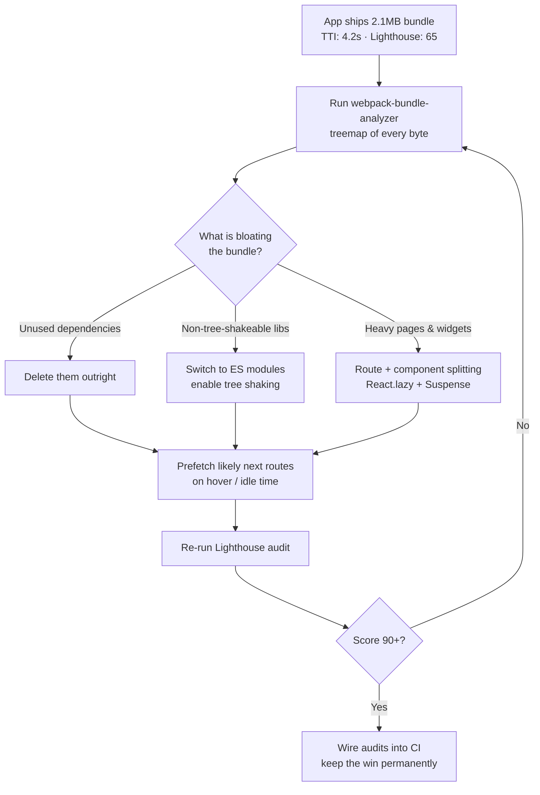

| Difficulty | Channel | Tags |
|---|---|---|
| intermediate | frontend | lighthouse, bundle, lazy-loading |

In 2017, Netflix engineers faced an awkward truth: their logged-out homepage — essentially a background image and a signup button — carried roughly 300kB of JavaScript and took about seven seconds to become interactive on a simulated 3G connection [1]. The fix was not smarter code; it was dramatically less of it. That story is the perfect warm-up for a scenario nearly every frontend developer eventually faces: a Lighthouse score stuck at 65, a 2.1MB bundle, and a Time to Interactive of 4.2 seconds. Here is the playbook for turning those numbers around, built on the same principles that rescued Netflix.

---

> ### Real-World Case — Netflix
>
> In 2017, Netflix's logged-out desktop homepage shipped ~300kB of JavaScript (React at just 45kB plus utility libraries like Lodash and hydration state) and took about 7 seconds to become interactive on a simulated 3G connection — far too slow for what is essentially a static landing page with a signup button.
>
> | | |
> |---|---|
> | **Challenge** | Reduce Time-to-Interactive on the signup landing page, especially for users on low-end devices and slow networks in growth markets, without breaking the single-page-app signup flow that followed. |
> | **Solution** | Engineers used Chrome DevTools and Lighthouse to audit the page, then literally disabled JavaScript to see which UI elements actually needed client-side interactivity. They found almost nothing did: click handlers and a language switcher were rewritten in plain vanilla JavaScript (~300 lines), while React was kept on the server for rendering. Crucially, they also used the time users spend on the landing page to prefetch the HTML, CSS, and React bundles for the next step of the signup flow via  and XHR prefetching. |
> | **Outcome** | Client-side JavaScript dropped by over 200kB, loading and Time-to-Interactive improved by more than 50%, and prefetching cut TTI by an additional 30% for subsequent navigations. Faster interactivity measurably increased sign-up button clicks. |
> | **Lesson** | The counterintuitive twist: Netflix didn't abandon React — they realized the rendering logic was complex but the interaction logic was trivial, so shipping the full framework to the client was pure overhead. Audit what your page actually needs to be interactive before optimizing; sometimes deleting code beats adding lazy-loading infrastructure, and server-side rendering plus strategic prefetching gives you both fast first paint and a rich SPA afterward. |

---

## Hook — Seven Seconds to Click a Single Button

Picture the absurdity: one of the world's most sophisticated streaming companies ships a landing page whose only job is moving a cursor toward a signup button… and it takes seven seconds before that button responds on a 3G connection [1]. The culprit was about 300kB of JavaScript — React at roughly 45kB, plus utility libraries like Lodash and hydration state — almost none of which was doing anything useful at that moment. The page was, functionally, a poster. Yet it behaved like an application.

If Netflix can accidentally ship 300kB of ballast on its front door, imagine what hides inside a typical 2.1MB application bundle. Sound familiar? Then the next section is going to feel uncomfortably personal.

## Problem — The Lighthouse Score of 65 Everyone Ignores Until Launch Week

Here is the classic mid-stage React app: 2.1MB of JavaScript, a Time to Interactive of 4.2 seconds, and a Lighthouse performance score sulking in the 60s [7]. Nothing is technically broken — tests pass, features ship — yet every user on a mid-range phone pays a silent tax on every single load.

The costs compound quietly. Search rankings suffer because page speed feeds into visibility signals. Conversion drops because users tap a page that looks ready but freezes under their finger. And the cruelest part: because the pain is smeared across millions of small moments instead of exploding in one dramatic outage, teams deprioritize it for quarters.

Many developers assume fixing this requires a heroic rewrite or weeks of micro-optimization. It almost never does. It requires measuring precisely, deleting aggressively, and deferring everything nonessential — which is precisely the lesson Netflix learned the hard way.

## Real-World Case — Netflix Deletes Its Way to a 50% Faster Landing Page

The plot twist worth framing on a wall: Netflix did not speed up its landing page by optimizing React. It got faster by removing React entirely from the logged-out experience.

In 2017, the team rebuilt the desktop homepage as plain server-rendered HTML and CSS, cutting client-side JavaScript by more than 200kB — React accounted for about 45kB of the original payload, with utility libraries like Lodash making up much of the remainder [1]. Loading and Time-to-Interactive improved by over 50% on 3G connections.

Then came act two. For users who continued toward signup, the team added prefetch hints so the browser would download the next page's resources during idle time — shaving an additional 30% off Time-to-Interactive for subsequent navigations [1][9]. Faster interactivity translated directly into measurably more clicks on the signup button.

The lesson generalizes beautifully: the fastest code is the code never sent, and the second-fastest is the code already sitting in cache.

## Deep Dive — Anatomy of a 2.1MB Bundle

So where does a 2.1MB bundle actually come from? Rarely from application logic. Autopsies of bloated bundles almost always reveal the same suspects: dependencies imported wholesale (importing all of Lodash to use two functions), libraries duplicated at multiple versions deep in the dependency tree, locale files nobody requested, and CommonJS modules that defeat tree shaking — the build-time optimization that strips dead exports from production code [5].

The countermeasure toolbox has three main tools. First, dynamic imports: the import() syntax tells the bundler to emit a separate chunk that is fetched only on demand [3]. Second, route-based splitting, where each page ships only its own code. Third, component-based splitting for heavy widgets like charts and editors. Here is the real tradeoff:

| Strategy | Best for | The real tradeoff |
|---|---|---|
| Route-based | Most apps; predictable chunk boundaries | Brief fallback on first visit per route |
| Component-based | Heavy, rarely-used widgets (charts, editors) | More chunks means more requests; easy to overdo |
| Prefetching | Predictable next navigations | Wasted bytes when predictions miss |

💡 Insight: route-based splitting is the highest-leverage move for most applications, because navigation is the one moment users naturally expect a short pause.

⚠️ Watch Out: React.lazy expects a default export and must render inside a Suspense boundary, or React throws immediately [2][6].

But which tool comes first? That is where a disciplined workflow beats intuition every time.

## Workflow — The Measure-Delete-Split-Verify Loop

Optimization without measurement is superstition, so this process always begins with data. The flowchart below captures the full loop — and notice the feedback arrow: this is a cycle, not a checklist.

1. **Measure the damage.** Run webpack-bundle-analyzer to generate a treemap of exactly what occupies the 2.1MB [4]. Gut feelings about "what is big" are wrong surprisingly often.
2. **Delete ruthlessly.** Remove unused dependencies, swap multipurpose libraries for native APIs, and adopt ES module entry points like lodash-es so tree shaking can finally prune dead code [5].
3. **Split by route.** Convert page components to React.lazy(() => import(...)) so the initial load carries only the landing route [2].
4. **Defer heavy components.** Give charts, editors, and modals their own lazy chunks with Suspense fallbacks [6], and lazy-load below-the-fold media per MDN's guidance [8].
5. **Verify and iterate.** Re-run Lighthouse, compare TTI and bundle size against a written performance budget, and loop back to step one if the score is still shy of 90 [7].

🎯 Key Point: teams that treat this as a one-time cleanup watch the bundle creep right back. Teams that wire the audit into CI keep the wins permanently.

## Code Example — Route Splitting With a Hover-Prefetch Head Start

Building on the workflow, here is the core implementation: route-level splitting with React.lazy, wrapped in Suspense, plus the same prefetching trick Netflix used — triggered by a hover instead of idle time. The fully annotated version appears in the codeExample section below, but the highlights deserve a closer look.

Each lazy() call instructs the bundler to emit a separate chunk that downloads only on first navigation [2]. The onMouseEnter handler fires roughly 300 milliseconds before a typical click, handing the network a head start most users never consciously notice [3]. The navigation feels instant even though code is technically being fetched — exactly the illusion Netflix engineered with idle-time prefetching [1].

⚠️ Watch Out: lazy chunks can fail to load — flaky connections, stale deployments after a release. Without an error boundary around the lazy component, one failed chunk download takes down the entire route tree. Add one before this pattern touches production.

## Lessons Learned — Subtract Before You Optimize

Every performance war story ends with the same uncomfortable moral, and Netflix's is no exception [1]. Here is what the journey teaches:

- **Deleting beats optimizing.** Removing 200kB of unneeded JavaScript outperformed any amount of clever tuning. Audit dependencies before tweaking them.
- **Measure first, always.** Bundle treemaps routinely surprise veterans — the biggest chunk is rarely the suspected one [4].
- **Ship less upfront.** Route-based splitting aligns payload with intent: users download code for the page they asked for, nothing more [2][8].
- **Prefetch predicted paths.** Hover- or idle-triggered prefetching turns cold navigations warm and cut Netflix's follow-up TTI by 30% [1][9].
- **Guard the gaps.** Suspense fallbacks and error boundaries are not optional extras; they separate graceful degradation from a white screen [6].

Battle scars from the trenches: forgetting the sideEffects flag in package.json silently disables tree shaking [5]; lazy-loading everything produces dozens of tiny chunks and a request waterfall worse than the original monolith; and skipping the error boundary turns a single 404 into a full crash.

If this feels overwhelming, start small: run the analyzer today, find the single largest unnecessary dependency, and delete or defer it. That is how a 65 becomes a 90 — one deliberate subtraction at a time.

---

## Bundle Optimization Loop

<strong>Original Interview Question</strong>

**Q:** You're tasked with improving a React app's Lighthouse performance score from 65 to 90+. The bundle size is 2.1MB and Time to Interactive is 4.2s. What specific steps would you take to optimize the bundle and implement lazy loading?

**A:** Implement code splitting with React.lazy() and Suspense, analyze bundle composition with webpack-bundle-analyzer to identify largest chunks, remove unused dependencies and optimize imports, add dynamic imports for heavy components and third-party libraries, implement route-based splitting for better initial load times, and utilize tree shaking with proper ES module configuration.

## Conclusion

Netflix's homepage did not get faster because engineers wrote better JavaScript — it got faster because they shipped dramatically less of it [1]. That is the transferable insight: performance work is primarily subtraction, then deferral, and only lastly micro-optimization. Tomorrow morning, run webpack-bundle-analyzer on the current project, identify the largest chunk serving no first-paint purpose, and split or delete it [4]. Then wire Lighthouse into CI so the score can never quietly rot again [7]. The takeaway worth repeating in the next team meeting: the fastest code is the code never sent — and the second-fastest is already sitting in cache, prefetched while the user decides.

---

## References

1. [Netflix incident report](https://medium.com/dev-channel/a-netflix-web-performance-case-study-c0bcde26a9d9) — blog
2. [React.lazy — React Official Documentation](https://react.dev/reference/react/lazy) — documentation
3. [import() — Dynamic Imports | MDN](https://developer.mozilla.org/en-US/docs/Web/JavaScript/Reference/Operators/import) — documentation
4. [webpack-bundle-analyzer](https://github.com/webpack-contrib/webpack-bundle-analyzer) — documentation
5. [Tree shaking — Wikipedia](https://en.wikipedia.org/wiki/Tree_shaking) — documentation
6. [Suspense — React Official Documentation](https://react.dev/reference/react/Suspense) — documentation
7. [Lighthouse — Automated Web Auditing Tool](https://github.com/GoogleChrome/lighthouse) — documentation
8. [Lazy Loading — Web Performance | MDN](https://developer.mozilla.org/en-US/docs/Web/Performance/Guides/Lazy_loading) — documentation
9. [HTTP Caching | MDN](https://developer.mozilla.org/en-US/docs/Web/HTTP/Caching) — documentation

---

**Author:** Satishkumar Dhule — [GitHub](https://github.com/satishkumar-dhule) · [LinkedIn](https://linkedin.com/in/satishkumar-dhule) · [Website](https://satishkumar-dhule.github.io)
