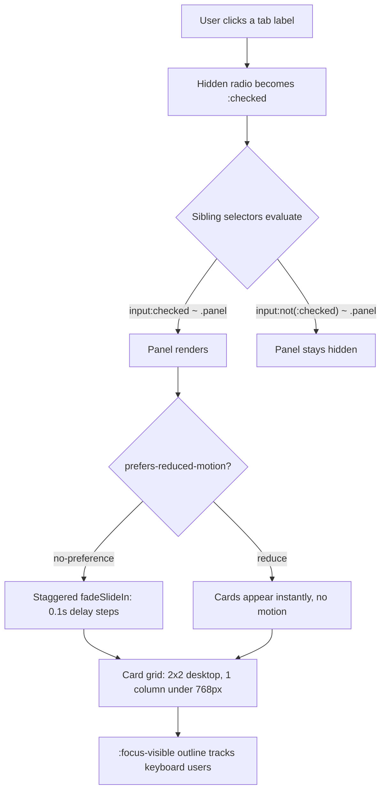

| Difficulty | Channel | Tags |
|---|---|---|
| beginner | frontend | css, flexbox, grid, animations |

In September 2013, Apple launched iOS 7, and within days its support forums filled with something unexpected: users reporting nausea, headaches, and vertigo so severe that some left work sick or downgraded their brand-new software just to feel normal again [1]. The culprit was not a crash or a security hole — it was animation. Zoom effects and parallax layers, shipped everywhere with no off switch, turned a celebrated redesign into a physical health problem for thousands of people. That incident quietly reshaped how modern interfaces handle motion, and it is exactly the lens through which a deceptively simple interview question deserves to be answered: can you build a fully interactive, animated, responsive tab panel with zero JavaScript?

---

> ### Real-World Case — Apple
>
> In September 2013, Apple launched iOS 7 with pervasive zoom and parallax animations. Within days, users with vestibular disorders flooded Apple's support forums reporting nausea, headaches, and vertigo so severe that some left work sick or downgraded back to iOS 6 — and support lines told them there was no way to disable the effects.
>
> | | |
> |---|---|
> | **Challenge** | Designers wanted fluid, spatial motion everywhere, but large-scale on-screen movement physically sickens a significant share of users — vestibular disorders affect up to ~69 million people in the US alone — and there was no user-facing way to opt out of the animations. |
> | **Solution** | Apple shipped an enhanced 'Reduce Motion' toggle in iOS 7.0.3 (October 2013), replacing zooms with simple cross-fades. Apple's WebKit team then brought that OS-level idea to the web as the prefers-reduced-motion CSS media feature (Safari 10.1, 2017), letting stylesheets detect the user's setting and disable or swap animations — exactly what wrapping entrance animations in @media (prefers-reduced-motion: no-preference) does today. |
> | **Outcome** | Motion sickness complaints were addressed within roughly a month of launch; the pattern became a cross-browser standard supported in all major engines, was codified as W3C WCAG technique C39, and even MDN now warns readers before displaying animation examples. Respecting prefers-reduced-motion is a default requirement in modern UI work. |
> | **Lesson** | Animation isn't just aesthetic polish — it can be a medical accessibility issue. Ship decorative motion (staggered entrances, slides) behind prefers-reduced-motion from day one rather than retrofitting after users get hurt; opacity/color changes are safe triggers, while large-scale movement across the viewport is not. |

---

## Hook — The Day a Software Update Made People Physically Ill

Picture the scene: September 2013, launch week for iOS 7. Millions of users install the flattest, most animated version of iOS ever shipped. Within days, Apple's support communities are flooding with posts that read less like bug reports and more like medical accounts — dizziness, headaches, nausea. Some users say the parallax wallpaper alone makes them ill. Others report leaving work sick after scrolling through the new zooming transitions.

The worst part? When affected users called support lines, they were told there was no way to disable the effects [1]. No setting. No escape hatch. People downgraded back to iOS 6 — voluntarily giving up new features to stop feeling sick.

Here is why this matters to you as a developer: nothing about those animations was technically broken. They were smooth, GPU-accelerated, and beautiful. They failed for a reason most code reviews never check — they ignored human biology. And the fix that eventually emerged from this mess now sits in every CSS file you will touch today. Sound familiar? It should, because the same trap is waiting in every `transition` and `@keyframes` block you ship.

## Problem — Interactive UI Without JavaScript, Without Hurting Anyone

Building on that failure, consider a task that looks trivial on the surface: a design-system docs page needs a tabbed component browser. Click a tab, see a 2×2 grid of component cards. Shrink the viewport, collapse to one column. Add a subtle entrance animation because, well, polish sells design systems. Oh — and do it without a single line of JavaScript.

Many developers discover quickly that this constraint is not about being anti-JavaScript. Docs pages have real reasons to stay dependency-free: faster loads, fewer hydration bugs, and a guarantee that examples work even when scripts fail. But removing JavaScript removes your usual tools for state, visibility toggling, and event handling.

Consequently, three hard requirements emerge:

- **State management** — which tab is active must live somewhere the browser already understands
- **Responsive layout** — a 2×2 card grid on desktop, single column on mobile, with image areas locked to 16:9
- **Human safety** — entrance animations must respect users whose nervous systems reject motion, and keyboard users must never lose their place

That last point is not edge-case paranoia. Vestibular disorders — the inner-ear systems governing balance and spatial orientation — affect a substantial share of the population, and motion-triggered nausea is one of its most common symptoms [8]. You might think animation preferences are aesthetic nitpicking, but actually, for millions of users they are the difference between using your product and physically cannot use your product.

So how does a team ship delightful motion without repeating Apple's mistake? The answer starts with a documented disaster.

## Real-World Case — Apple's iOS 7 Motion Sickness Backlash

The iOS 7 incident deserves a closer look because it is one of the rare cases where accessibility pressure produced a permanent platform standard.

**What happened:** iOS 7 introduced system-wide zoom transitions, a parallax home-screen effect, and animated app-opening sequences. Within days of the September 2013 launch, users with vestibular disorders reported severe symptoms — nausea, headaches, vertigo intense enough that some left work sick. Support channels confirmed there was no way to turn the effects off, and a wave of users downgraded to iOS 6 [1].

**How it resolved:** Under mounting pressure, Apple shipped a **Reduce Motion** setting roughly a month after launch. That was the immediate patch. The long-term consequence matters far more: the idea that operating systems and browsers should expose a motion preference became a cross-browser standard. `prefers-reduced-motion` is now supported in every major engine, codified as W3C WCAG technique C39, and even MDN displays warnings before showing animation examples in its documentation [2].

**The quantified impact:** a one-month emergency patch cycle, a public support backlog, measurable user downgrades, and — ultimately — a permanent change to how the entire web platform treats animation defaults.

🔥 **Hot take:** Apple did not fail at animation. Apple failed at *consent*. The animations were gorgeous; the missing part was letting users opt out. Every entrance animation you ship without a reduced-motion escape hatch repeats a smaller version of exactly that mistake.

This leads directly to the technical question: how do you build interaction and motion in pure CSS while keeping that consent door wide open?

## Deep Dive — Radios, Siblings, and the Browser's Free State Machine

However strange it sounds, the cleanest JavaScript-free tab implementation uses form controls nobody submits: radio buttons.

**The core mechanism:** give every tab's hidden radio input the same `name` attribute, and the browser enforces mutual exclusivity for free — checking one automatically unchecks the others [3]. That is a native, zero-dependency state machine. The `:checked` pseudo-class then becomes your observable state, and CSS sibling combinators turn it into visibility rules [4].

There is one structural rule that trips up nearly everyone: **DOM order is destiny**. The inputs, labels, and panels must share one parent, with each input appearing *before* its panel, because `~` only selects subsequent siblings. Put the panel above its radio and the selector silently matches nothing — no error, no warning, just a tab that never opens.

Here is how the main approaches really compare:

| Approach | JS needed | Keyboard support | The real trade-off |
|---|---|---|---|
| Radio-input tabs | None | Native Tab + Space/arrow keys | DOM order constraints; panels are not true ARIA tabs |
| JS tab widget | Required | Full control incl. roving tabindex | Bundle cost, hydration risk, more states to test |
| `` accordion | None | Native | No mutual exclusivity; visually weaker as tabs |

💡 **Insight:** the radio pattern is not a hack in the pejorative sense — it is standards-based progressive enhancement. Its honest limitation is semantics: screen readers announce radios, not `role="tablist"`. For a docs page demo, that trade-off is usually acceptable; for a primary app navigation, a JS-enhanced ARIA tablist earns its bytes.

For the card layout itself, two modern properties do the heavy lifting. `aspect-ratio: 16 / 9` locks every image container to the same shape regardless of card width, eliminating the classic jump when images load [5]. CSS Grid with `repeat(2, 1fr)` produces the desktop 2×2 arrangement, collapsing to `1fr` under 768px [7].

And the animation layer? Two subtle details separate professionals from tutorials. First, `:focus-visible` draws outlines only for keyboard navigation, so mouse users get a clean interface while Tab-key users always know where they are [6]. Second, gating with `@media (prefers-reduced-motion: no-preference)` — rather than detecting `reduce` and undoing styles — means motion is an *opt-in enhancement*, which is precisely the consent model Apple's incident taught the industry [2].

But knowing the pieces is not the same as assembling them in the right order. That is where the workflow comes in.

## Workflow — Assembling the Pattern Step by Step

The full flow — from a user clicking a label to cards animating in (or politely not animating) — is traced in the flowchart below. Notice how every branch terminates in the same responsive grid; motion preference changes *how* cards arrive, never *whether* they arrive.

Working through it as a build sequence:

1. **Structure first.** Inside one `.tabs` container, place each hidden radio input, its ``, then its `` — in that exact order, because sibling selectors only look forward [4].
2. **Wire the state.** Share one `name="tabs"` across all radios so the browser enforces single-selection natively [3].
3. **Toggle visibility.** `input:not(:checked) ~ .panel { display: none; }` hides inactive panels; the checked sibling renders.
4. **Lay out the cards.** Grid with `repeat(2, 1fr)` and a generous gap; a max-width media query drops to one column below 768px [7].
5. **Lock the media boxes.** `aspect-ratio: 16 / 9` on each image container keeps rows aligned before any real artwork loads [5].
6. **Add motion behind a consent gate.** Wrap the staggered `fadeSlideIn` animation in `prefers-reduced-motion: no-preference`, with 0.1s delays stepping through cards two through four [2].
7. **Protect keyboard users.** Style `:focus-visible` explicitly — never remove outlines globally [6].
8. **Test the matrix.** Keyboard only, OS reduced-motion enabled, and a 320px viewport. Three passes, five minutes, zero excuses.

⚠️ **Watch out:** elements rendered from `display: none` start their animations fresh when revealed — which conveniently replays the entrance stagger on every tab switch. But forget the `backwards` animation-fill value and cards briefly flash at full opacity before the keyframe applies. One keyword, whole different impression.

With the sequence clear, the complete implementation fits in one compact snippet.

## Code Example — The Complete Pattern, Annotated

The snippet below packages the entire pattern — markup plus styles — exactly as a design-system docs page would mount a live, self-contained demo. The HTML establishes the sibling chain; the CSS implements every decision from the workflow above. Key lines are commented inline, and the walkthrough beneath explains why each piece earns its place.

🎯 **Key point:** notice there is no event listener anywhere. State lives in the radio group, presentation reacts to it declaratively, and the browser does the rest.

## Lessons Learned — Battle Scars and Tomorrow's Checklist

Every developer who has shipped this pattern has collected the same scars. Here is the greatest-hits album of mistakes, so you can skip the bruises:

- **Broken sibling order.** Placing a panel before its radio makes `~` match nothing — silently. Always keep the chain input → label → panel.
- **Missing shared `name`.** Without it, multiple tabs appear open simultaneously and the pattern dissolves into confusion.
- **Ungated animation.** Shipping `@keyframes` outside a `prefers-reduced-motion` guard is the exact failure mode Apple normalized in 2013 — and the fix took a decade to become standard practice [2].
- **Deleted focus outlines.** `outline: none` without a `:focus-visible` replacement erases keyboard users from your interface [6].
- **Mouse-only QA.** If the tab panel cannot be operated with Tab, Space, and arrow keys alone, it is not done.

Moreover, the deeper lessons generalize far beyond tabs:

- **Declarative state scales down beautifully.** The browser's native radio exclusivity replaced an entire state-management layer with one attribute [3].
- **Modern CSS properties remove old hacks.** `aspect-ratio` killed padding-top ratio tricks [5]; Grid killed float-based faux grids [7].
- **Motion is seasoning, not sauce.** A 0.3s ease-out with 0.1s stagger reads as polish; anything longer reads as latency.

Therefore, here is the concrete plan for tomorrow: audit one animated component you own and ask two questions — *can it be operated by keyboard alone*, and *does it respect the OS motion setting*? Fix whichever answer is no. Then try rebuilding one small interactive widget without JavaScript; the discipline of letting the platform carry state will sharpen every line of JS you write afterward.

And remember where this started: a company at the peak of its design power shipped beautiful motion, made real people sick, and spent a month patching the damage. The lasting insight is worth sharing with any team — **great interfaces are not the ones with the most impressive animation; they are the ones that never make the user ask for an off switch.**

---

## CSS-Only Tab Switching Flow

<strong>Original Interview Question</strong>

**Q:** Build a CSS-only tab panel for a design-system docs page. Use radio inputs to switch tabs (no JavaScript). Desktop: a 2x2 grid of cards under each tab; mobile: single column. Each card has a fixed 16:9 image area, a title, and a short meta line. Add a subtle entrance animation with a stagger and keep focus-visible outlines; ensure prefers-reduced-motion is respected?

**A:** Use a set of radio inputs with a shared `name` attribute and corresponding `` elements for each tab section. The `:checked` state of each radio controls visibility of its associated panel via adjacent sibling selectors. Each panel renders a 2×2 card grid on desktop and collapses to a single column on mobile. Cards use `aspect-ratio: 16/9` for fixed image containers, with a title and meta line below.

## Conclusion

The journey circles back to one launch-day disaster: Apple shipped beautiful motion without an off switch, users got sick, and the industry spent the following decade building consent into the platform itself. The CSS-only tab panel embodies that lesson in miniature — interactivity from native form semantics, layout from Grid and aspect-ratio, keyboard trust from :focus-visible, and animation that politely asks before playing. Tomorrow, audit one animated component for keyboard access and reduced-motion support, then try rebuilding a small widget with zero JavaScript. The takeaway worth repeating in your next standup: great interfaces are not the ones with the flashiest animation — they are the ones that never make anyone beg for an off switch.

---

## References

1. [Apple incident report](https://webkit.org/blog/7551/responsive-design-for-motion/) — article
2. [MDN: prefers-reduced-motion](https://developer.mozilla.org/en-US/docs/Web/CSS/@media/prefers-reduced-motion) — documentation
3. [MDN: :checked pseudo-class](https://developer.mozilla.org/en-US/docs/Web/CSS/:checked) — documentation
4. [MDN: Subsequent-sibling combinator](https://developer.mozilla.org/en-US/docs/Web/CSS/Subsequent-sibling_combinator) — documentation
5. [MDN: aspect-ratio](https://developer.mozilla.org/en-US/docs/Web/CSS/aspect-ratio) — documentation
6. [MDN: :focus-visible](https://developer.mozilla.org/en-US/docs/Web/CSS/:focus-visible) — documentation
7. [MDN: Basic concepts of CSS Grid Layout](https://developer.mozilla.org/en-US/docs/Web/CSS/CSS_grid_layout/Basic_concepts_of_grid_layout) — documentation
8. [Wikipedia: Motion sickness](https://en.wikipedia.org/wiki/Motion_sickness) — documentation
9. [Wikipedia: Web Content Accessibility Guidelines](https://en.wikipedia.org/wiki/Web_Content_Accessibility_Guidelines) — documentation
10. [MDN: Using CSS animations](https://developer.mozilla.org/en-US/docs/Web/CSS/CSS_animations/Using_CSS_animations) — documentation

---

**Author:** Satishkumar Dhule — [GitHub](https://github.com/satishkumar-dhule) · [LinkedIn](https://linkedin.com/in/satishkumar-dhule) · [Website](https://satishkumar-dhule.github.io)
