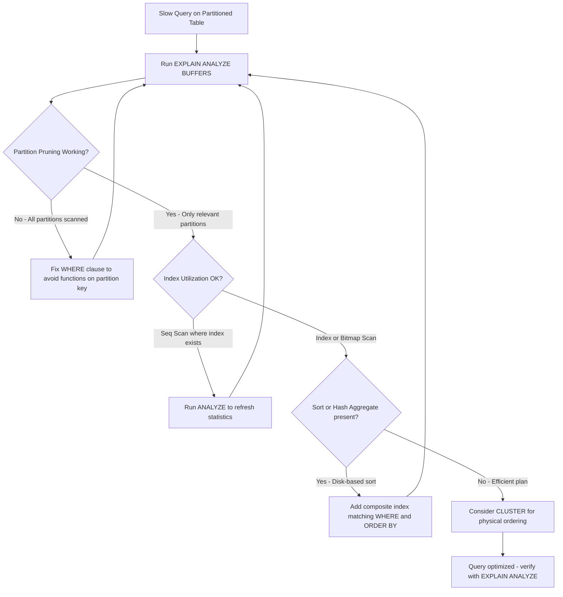

| Difficulty | Channel | Tags |
|---|---|---|
| intermediate | database | explain, query-plan, partitioning |

Capital One's Consumer Identity platform ingests massive volumes of customer data every single day for fraud prevention. Their PostgreSQL tables ballooned to hundreds of millions of rows, and every query needed to return results within milliseconds to catch fraudulent transactions before they cleared [1]. A date-range query on a poorly optimized partitioned table would scan unnecessary data, blow past latency budgets, and potentially let fraud slip through undetected. The lesson? Partitioning your table is only half the battle. If you do not know how to read what EXPLAIN is telling you, you are flying blind with a 100M-row table and a prayer.

---

> ### Real-World Case — Capital One
>
> Capital One's Consumer Identity platform ingests massive volumes of customer data daily for fraud prevention. Their PostgreSQL tables grew to hundreds of millions of rows, and queries needed to return customer data within milliseconds to meet strict fraud detection SLAs. A date-range query on an unpartitioned or poorly-optimized partitioned table would scan unnecessary data, blow past latency budgets, and potentially allow fraudulent transactions to slip through.
>
> | | |
> |---|---|
> | **Challenge** | Maintaining sub-millisecond query response times on PostgreSQL tables with hundreds of millions of rows, while archiving several terabytes of data per day, without causing table locks that block reads/writes and violate fraud prevention SLAs. They also needed to handle seasonal traffic spikes (holidays) without query performance degradation. |
> | **Solution** | Capital One implemented a temporal partitioning strategy with three key techniques: (1) Hash-based temporal partitioning to evenly distribute data volume across partitions, eliminating seasonal skew so that holiday traffic doesn't create hot partitions. (2) Partition detachment instead of DELETE for archiving — detaching partitions avoids table locks and the costly vacuum overhead that bulk deletes introduce. (3) A counterintuitive decision: they deliberately do NOT vacuum partitions, because they detach and drop them before dead tuples accumulate, making vacuum unnecessary entirely. They also adopted pg_partman to automate partition lifecycle management. |
> | **Outcome** | Recent customer data served within milliseconds 99.9% of the time, meeting fraud prevention SLAs. Query execution times remain consistent year-round despite seasonal traffic variation. Daily archiving of several terabytes operates without impacting live query performance. The hash-on-timestamp approach ensures no single partition becomes a bottleneck during peak periods. |
> | **Lesson** | The most counterintuitive insight: sometimes the best optimization is to stop doing something everyone assumes is necessary. Capital One discovered that not vacuuming partitions — by detaching and dropping them before dead tuples accumulate — is faster and safer than running VACUUM on massive tables. This eliminated the table locks that vacuum imposes, which was critical for maintaining their 99.9% millisecond-latency SLA. Additionally, hashing timestamps (not just using raw timestamps) prevents the holiday-traffic skew problem that naive temporal partitioning creates. |

---

## Hook — A 3AM Pager and a Query That Should Not Be Slow

It is 3AM when the pager goes off. The on-call dashboard shows a fraud detection query that normally completes in 12ms is now taking 4.7 seconds. The table is partitioned by date — you did that part right — yet somehow PostgreSQL is still touching partitions it should never even look at. Sound familiar? Many developers discover that partitioning a table does not automatically make queries fast. Partitioning is an architectural decision, not a magic switch. And if you cannot read an EXPLAIN plan, you are debugging blind. The difference between a 12ms query and a 4.7s query on a partitioned table almost always comes down to three things: partition pruning, index utilization, and sort operations. Understanding these is not optional for anyone working with large PostgreSQL datasets.

## Problem — Why Partitioned Tables Still Get Slow

Here is the thing though: partitioning a table is necessary but not sufficient. PostgreSQL supports range, list, and hash partitioning [2], and each strategy has its own failure modes. When you partition a 100M-row table by date, you might expect the planner to skip old partitions entirely. But partition pruning — the optimization that eliminates partitions from the query plan — only works when your WHERE clause plays nicely with the partition bounds [2]. If your query uses a function on the partition key, or if the planner cannot prove a partition contains no matching rows, pruning fails silently. Every partition gets scanned. Your fancy partitioning strategy becomes a liability instead of an asset.

Moreover, even when pruning works, index utilization on each partition matters enormously. A query that filters on date AND status needs a composite index covering both columns. Without it, PostgreSQL may choose a sequential scan within each pruned partition — scanning millions of rows when it should be touching thousands. The planner estimates are based on table statistics, and if those statistics are stale, the planner picks the wrong plan entirely. Developers working with large partitioned tables face a triple threat: failed partition pruning, missing composite indexes, and expensive sort or hash aggregate operations that blow memory and spill to disk.

## Real-World Case — Capital One's Fraud Detection Pipeline

Capital One's Consumer Identity platform faces exactly this challenge at scale. Their PostgreSQL tables store hundreds of millions of rows of customer identity data used for real-time fraud prevention. Every query must return within milliseconds to meet strict SLAs — a fraud detection response that takes seconds instead of milliseconds could mean a fraudulent transaction clears before it is flagged [1].

The impact of getting this wrong is concrete: recent customer data must be served within milliseconds 99.9% of the time to meet fraud prevention SLAs. Query execution times must remain consistent year-round despite seasonal traffic variation — think Black Friday, tax season, holiday shopping. Daily archiving of several terabytes must operate without impacting live query performance. Capital One's solution involved hash-on-timestamp partitioning to ensure no single partition becomes a bottleneck during peak periods [1]. But the partitioning strategy alone was not enough. They needed to verify that partition pruning was effective, that composite indexes covered their most common query patterns, and that the planner was not choosing sequential scans when index scans were available. This is exactly the workflow every developer with a large partitioned PostgreSQL table should follow.

## Deep Dive — Reading the EXPLAIN Plan Like a Senior Engineer

When you run EXPLAIN on a partitioned table, PostgreSQL reveals exactly what the planner intends to do. But reading it is an art that requires experience to master [3]. Let us break down the three things that matter most for partitioned tables.

**Partition Pruning: Is It Actually Working?**

The first thing to check is whether PostgreSQL is scanning all your partitions or just the relevant ones. With partition pruning enabled (the default since PostgreSQL 11), the planner examines each partition's bounds and excludes partitions that cannot contain matching rows [2]. If you see an Append node that lists every single partition in your EXPLAIN output, pruning has failed. This often happens when your WHERE clause uses a function on the partition key — for example, WHERE DATE_TRUNC('month', event_date) = '2024-01-01'. The planner cannot prove which partitions match because the function obscures the column value. The fix is to rewrite your query to compare the raw column directly against constant values.

**Index Utilization: Scan vs. Index Scan vs. Bitmap**

Next, look at whether each partition uses a sequential scan, index scan, or bitmap index scan [3]. A Seq Scan on a partition means PostgreSQL is reading every row. If you have an index on that partition, a Seq Scan is a red flag — it usually means the planner thinks the index is not selective enough, or your statistics are stale. Run ANALYZE on the table to refresh them. A Bitmap Heap Scan with a Recheck Cond is common for range queries and is often the right choice. An Index Scan is ideal for highly selective lookups. The key insight: each partition should use the most efficient scan type for its data distribution.

**Sort and Aggregate Operations: The Hidden Cost**

Finally, look for Sort nodes and Hash Aggregate nodes. A Sort operation that uses external disk (Disk-based sort) instead of memory (Quicksort or Mergesort in-memory) is a sign you need a better index. If your query has ORDER BY or GROUP BY clauses, a composite index that matches the sort order eliminates the Sort node entirely. For example, an index on (event_date, status) allows PostgreSQL to return results already sorted by date without an extra sort step. The cost difference between an in-memory sort and a disk-based sort on millions of rows can be 10x or more.

## Workflow — The Step-by-Step Diagnostic Process

When faced with a slow query on a partitioned table, follow this systematic diagnostic workflow. The diagram below illustrates the decision process from initial EXPLAIN output to final optimization.

The process starts with running EXPLAIN (ANALYZE, BUFFERS) on your slow query. First, check whether partition pruning is working — if all partitions appear in the plan, the planner is not pruning. Next, examine the scan type on each partition that remains after pruning. If you see sequential scans where indexes exist, investigate statistics staleness or planner cost parameters. If sorts or hash aggregates appear, evaluate whether a composite index could eliminate them. Finally, consider clustering your partition data to match your most common access pattern.

This workflow is iterative. After applying each optimization, re-run EXPLAIN (ANALYZE, BUFFERS) to verify the plan actually improved. The numbers in the EXPLAIN output — actual time, rows, buffers — are your ground truth. Never assume an optimization helped without measuring it.

## Code Example — From Diagnosis to Optimization

The following code walks through a complete diagnosis and optimization of a slow date-range query on a 100M-row partitioned events table. It demonstrates how to read EXPLAIN output, identify the problem, and apply targeted fixes.

The first block runs the slow query with EXPLAIN (ANALYZE, BUFFERS) to capture the actual execution plan. The ANALYZE option actually runs the query and shows real timing data, while BUFFERS reveals how many pages were read from disk versus served from cache [3]. The second block adds a composite index that covers both the date filter and the status filter, eliminating the need for a separate index lookup. The third block uses CLUSTER to physically reorder rows on disk to match the index, which dramatically improves cache hit rates for range queries.

## Lessons Learned — What to Do Differently Tomorrow

After working through many slow-query postmortems on partitioned tables, here are the patterns that consistently matter.

**Always check partition pruning first.** It is the single biggest performance lever for partitioned tables. If pruning is not working, you are scanning orders of magnitude more data than necessary [2].

**Composite indexes are not optional.** A single-column index on event_date is not enough if your queries also filter on status. Create composite indexes that match your actual WHERE clause patterns. The index on (event_date, status) covers both columns in a single B-tree traversal [4].

**Refresh statistics regularly.** Stale pg_statistic data causes the planner to make wrong decisions. Schedule ANALYZE (or use autovacuum with appropriate settings) to keep statistics current.

**Watch for disk-based sorts.** If EXPLAIN ANALYZE shows Sort Method: external merge Disk, you need either a better index or more work_mem. In-memory sorts are orders of magnitude faster.

**Consider CLUSTER for read-heavy tables.** CLUSTER physically reorders rows on disk to match an index. This improves sequential read performance because related rows are stored on the same or adjacent pages [5]. However, CLUSTER takes an ACCESS EXCLUSIVE lock, so plan it during maintenance windows.

**Do not over-partition.** PostgreSQL handles up to a few thousand partitions well, but more than that increases planning time significantly [2]. Each partition adds metadata overhead that accumulates across sessions.

The most important takeaway: partitioning is an architecture, not a one-time setup. Your partition strategy, indexes, and statistics all need to evolve together as your data grows and query patterns change. The teams that get this right — like Capital One — achieve consistent sub-second performance at massive scale. The teams that do not end up debugging 3AM pages with a 4.7-second query and no idea why.

---

## Partitioned Table Query Optimization Workflow

<strong>Original Interview Question</strong>

**Q:** You have a PostgreSQL table with 100M rows partitioned by date. A query filtering on a specific date range is still slow. What would you check in the EXPLAIN plan and how would you optimize it?

**A:** Check partition pruning effectiveness, index utilization patterns, and expensive sort operations. Create composite indexes on (date, filtered_columns) and evaluate clustering strategies for optimal data access.

## Conclusion

Partitioning a PostgreSQL table is not a set-it-and-forget-it decision. Capital One learned that even with hash-on-timestamp partitioning handling hundreds of millions of rows, the difference between a 12ms query and a 4.7s query comes down to reading the EXPLAIN plan correctly [1]. Tomorrow, start by running EXPLAIN (ANALYZE, BUFFERS) on your slowest query. Check whether partition pruning is actually happening. Look at the scan types on each partition. And if you see a sequential scan where an index exists, your statistics are stale. The teams that master this diagnostic loop achieve consistent sub-second performance at massive scale. The rest keep getting paged at 3AM.

---

## References

1. [Capital One: PostgreSQL Partitioning Tips](https://www.capitalone.com/tech/software-engineering/postgresql-partitioning-tips/) — blog
2. [PostgreSQL Documentation: Table Partitioning](https://www.postgresql.org/docs/current/ddl-partitioning.html) — documentation
3. [PostgreSQL Documentation: Using EXPLAIN](https://www.postgresql.org/docs/current/using-explain.html) — documentation
4. [Use The Index, Luke: Anatomy of an SQL Index](https://use-the-index-luke.com/sql/anatomy) — blog
5. [PostgreSQL Documentation: CLUSTER Command](https://www.postgresql.org/docs/current/sql-cluster.html) — documentation
6. [PostgreSQL Documentation: Multicolumn Indexes](https://www.postgresql.org/docs/current/indexes-multicolumn.html) — documentation
7. [PostgreSQL Documentation: Planner Cost Constants](https://www.postgresql.org/docs/current/runtime-config-query.html) — documentation
8. [Wikipedia: B-tree Data Structure](https://en.wikipedia.org/wiki/B-tree) — documentation

---

**Author:** Satishkumar Dhule — [GitHub](https://github.com/satishkumar-dhule) · [LinkedIn](https://linkedin.com/in/satishkumar-dhule) · [Website](https://satishkumar-dhule.github.io)
