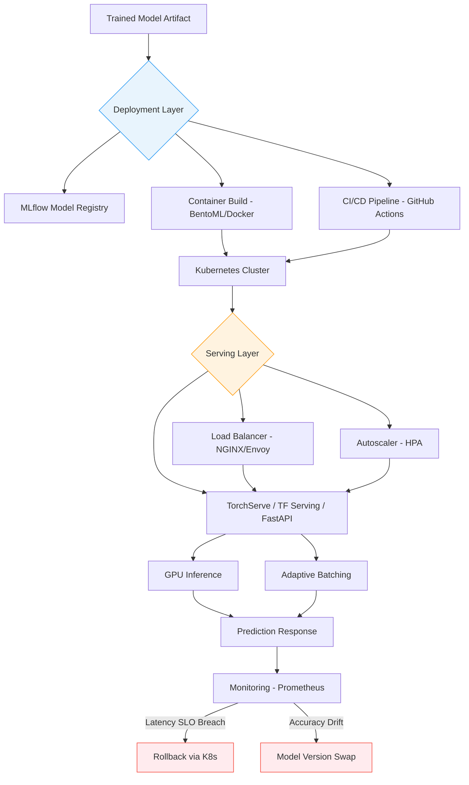

| Difficulty | Channel | Tags |
|---|---|---|
| beginner | devops | mlops, deployment |

When Netflix needed to serve ML predictions to 250M+ users at over one million requests per second, their custom routing layer called Switchboard was adding 10-20ms of latency per request — an eternity at that scale [1]. The culprit? Serialization overhead in a system handling hundreds of simultaneous model types for personalization, search, thumbnails, and payments. Their solution, replacing Switchboard with Lightbulb+Envoy, didn't just fix a performance problem — it revealed a fundamental confusion that trips up even experienced ML engineers: the difference between model deployment and model serving. Get these two concepts conflated, and your system will crumble under load. Get them right, and you'll build infrastructure that scales gracefully to millions of users.

---

> ### Real-World Case — Netflix
>
> Netflix needed to serve ML predictions to 250M+ users at over 1 million requests per second across hundreds of simultaneous model types — personalization, search, thumbnails, payments — all through a single unified serving platform. Their initial custom routing solution (Switchboard) added 10-20ms of latency per request due to serialization overhead, which was unacceptable for latency-sensitive use cases.
>
> | | |
> |---|---|
> | **Challenge** | Building a centralized ML serving infrastructure that routes the right request to the right model version on the right cluster shard, while supporting real-time A/B testing, instant rollback, shadow mode testing, and keeping tail latency below user-noticeable thresholds at extreme scale. The routing layer needed to handle hundreds of model types simultaneously without becoming a single point of failure or a latency bottleneck. |
> | **Solution** | Netflix built Switchboard as a custom proxy layer handling all ML traffic routing, then evolved to Lightbulb + Envoy when Switchboard's 10-20ms latency overhead became untenable. The key architectural insight was decoupling routing metadata (Lightbulb resolves request context to a routing key) from actual request forwarding (Envoy handles the high-performance proxying). This preserved the routing intelligence while eliminating the serialization bottleneck — large payloads no longer needed to be deserialized and re-serialized at the routing layer. For LLM serving, they adopted vLLM + Triton with model caching on Amazon FSx to eliminate cold-start latency, and discovered a CPU-bound logits processing bottleneck under realistic concurrency that was invisible in single-request benchmarks. |
> | **Outcome** | Successfully serving 1M+ requests per second across 250M+ users with hundreds of model versions. The Lightbulb+Envoy architecture eliminated the 10-20ms routing overhead while preserving all routing capabilities. Their LLM serving infrastructure achieved stable production performance after rewriting custom logits processors from Python to C++ to bypass GIL limitations, keeping logits processing time flat as batch size grew. |
> | **Lesson** | The serving layer (runtime inference APIs, routing, model loading) is fundamentally different from the deployment layer (CI/CD, infrastructure, monitoring) — and the hard problems emerge at their intersection. Netflix's journey shows that routing infrastructure that works at small scale (Switchboard) can become the bottleneck at 1M QPS, and the solution is often architectural decomposition rather than optimization. The critical insight: separate routing metadata resolution from request proxying. Also, concurrency bottlenecks (like Python's GIL in logits processing) only surface under realistic production load, never in single-request benchmarks. |

---

## Hook — The Deploy Button That Fooled an Entire Industry

Here is a question that catches seasoned engineers off guard: What is the difference between deploying a model and serving a model? Many developers treat the "Deploy" button in their ML platform as the finish line. Model trained? Push to production. Done. But then the pager goes off at 2am. Latency spikes. A/B test traffic is leaking between model versions. Cold starts are eating your SLO budget. The deploy was fine. The serving was broken. This confusion costs teams weeks of debugging because they are optimizing the wrong layer. Understanding the distinction is not academic — it is the difference between a system that handles 10K queries per second gracefully and one that collapses at 500.

## Problem — Why Two Concepts Masquerade as One

The core challenge is that deployment and serving overlap so heavily in tooling and vocabulary that they blur into a single mental model. Deployment encompasses CI/CD pipelines, infrastructure provisioning with tools like Kubernetes and Terraform, model registry management through MLflow or SageMaker, and monitoring with rollback strategies. Serving, on the other hand, is the runtime layer: inference APIs built on frameworks like FastAPI or gRPC, request routing through load balancers like NGINX or Envoy, model loading and versioning at the server level, and response optimization for latency and throughput. Here is the thing though — when you launch a model, deployment is what gets it onto a cluster. Serving is what keeps it alive, responsive, and correct under real traffic. One is a logistics problem. The other is a real-time systems problem. Many developers discover this distinction only after a production incident forces them to separate the two layers in their architecture. The consequences of conflating them are real: misconfigured autoscaling that spins up pods but cannot route traffic, model version rollbacks that deploy new containers but leave stale models cached in serving workers, and monitoring that tracks CPU utilization but misses inference latency degradation.

## Real-World Case — Netflix's Routing Overhead Nightmare

Netflix's model serving infrastructure is one of the most complex in the industry. They run hundreds of simultaneous ML models — personalization engines, search ranking, thumbnail generation, payment fraud detection — all serving a global user base of over 250 million subscribers [1]. Their initial approach used a custom routing layer called Switchboard to direct inference requests to the correct model server. The problem was latency. Switchboard added 10-20ms of overhead per request due to serialization costs — a penalty paid on every single one of their one million+ requests per second [1]. For latency-sensitive use cases like real-time personalization, this overhead was unacceptable. The fix? Netflix replaced Switchboard with Lightbulb, a lightweight routing layer built on top of Envoy, the high-performance edge and service proxy [1]. The result was a complete elimination of routing overhead while preserving all routing capabilities. But the story does not end there. Netflix also discovered that their LLM serving infrastructure had a Python GIL bottleneck in custom logits processors. As batch sizes grew, logits processing time scaled linearly because Python's Global Interpreter Lock prevented true parallelism. Their solution: rewriting logits processors from Python to C++, keeping processing time flat regardless of batch size [1]. This case study illustrates both sides of the deployment-vs-serving distinction perfectly. The deployment infrastructure — Kubernetes clusters, container orchestration — was working fine. It was the serving layer — routing, inference optimization, runtime processing — that needed surgical intervention.

## Deep Dive — Deployment vs Serving: The Technical Breakdown

Let us break this down with precision.

**Deployment is the supply chain.** It answers: How does a trained model artifact get from a data scientist's experiment to a running container in production? Deployment tools handle model packaging (Docker, BentoML), infrastructure provisioning (Kubernetes, Terraform, AWS SageMaker [4]), CI/CD pipelines (GitHub Actions, Jenkins), model registry and versioning (MLflow [3], Vertex AI), monitoring setup, and rollback mechanisms. The key metrics for deployment are deployment frequency, lead time for changes, mean time to recovery, and change failure rate.

**Serving is the runtime.** It answers: How does a live inference request get processed and returned with sub-100ms latency? Serving frameworks handle model loading into memory, request parsing and validation, inference execution on CPU/GPU, response serialization, request batching for throughput optimization, adaptive batching based on wait time and batch size, model versioning at the server level, canary deployments and A/B testing via traffic splitting, and health checks. The key metrics for serving are p50/p99 latency, throughput (QPS), error rate, GPU utilization, and cold start time.

Consider this comparison:

| Aspect | Deployment | Serving |
|---|---|---|
| **Scope** | Infrastructure + pipeline | Runtime inference |
| **Tools** | Kubernetes, Terraform, MLflow | TorchServe [2], TensorFlow Serving [5], BentoML [6] |
| **Failure mode** | Failed deploy, infra drift | Latency spike, OOM, stale model |
| **Scaling trigger** | Traffic forecast | Real-time QPS |
| **Latency concern** | Deploy duration | Inference p99 |
| **Versioning** | Git + registry | Server-side model swap |

The plot twist? The best serving frameworks blur the line by packaging deployment concerns into the serving layer. BentoML, for example, handles both adaptive batching (serving) and Docker image generation (deployment) in a single workflow. TorchServe bundles model archiving with inference handlers. This convergence is powerful but dangerous — it tempts teams to skip dedicated deployment infrastructure, only to discover they cannot roll back a bad model when the serving framework is the single point of truth.

## Workflow — From Training to Production-Grade Serving

Here is the typical workflow that separates deployment concerns from serving concerns, illustrated in the diagram below:

The process follows these steps:
1. **Train and package** — A data scientist trains a model and exports it in a framework-specific format (SavedModel, TorchScript, ONNX). MLflow [3] tracks experiments and versions the artifact.
2. **Build serving container** — Using BentoML or a custom Dockerfile, package the model with its inference code, dependencies, and a serving framework entry point.
3. **Deploy to cluster** — Push the container image to a registry. A Kubernetes Deployment manifest (or Terraform module) provisions the infrastructure. Horizontal Pod Autoscaling [7] is configured for GPU-based scaling.
4. **Configure serving layer** — The serving framework (TorchServe, TF Serving, or a FastAPI wrapper) loads the model, configures batching, sets health check endpoints, and registers with a load balancer.
5. **Route traffic** — NGINX or Envoy routes inference requests to healthy serving pods. Canary routing sends 5% of traffic to the new model version.
6. **Monitor and iterate** — Prometheus scrapes serving metrics (latency, throughput, error rate). If p99 latency exceeds the SLO, rollback via Kubernetes rollout undo.

The key insight is that steps 1-3 are deployment concerns, while steps 4-6 are serving concerns. Mixing them leads to fragile systems where a change in model format breaks the load balancer, or a traffic spike overwhelms a serving pod that was scaled for deployment throughput, not inference throughput.

## Code Example — A Production-Ready Serving Endpoint with BentoML

Here is a practical example showing how BentoML separates serving logic from deployment concerns while keeping both in a clean, maintainable structure:

```python
import bentoml
import numpy as np
from bentoml.io import JSON, NumpyNdarray

# --- Serving Layer: Model Loading and Inference ---
# This decorator registers a BentoML service with adaptive batching enabled.
# The max_batch_size and max_batch_wait configure the batching scheduler,
# which accumulates requests for up to 50ms or until 32 requests arrive.
@bentoml.service(
    resources={"gpu": 1, "memory": "4Gi"},
    traffic={"timeout": 30},
    batching={
        "max_batch_size": 32,
        "max_batch_wait_ms": 50,
    },
)
class ModelServer:
    # Model is loaded once at service startup, not per-request.
    # This eliminates cold start latency for subsequent requests.
    def __init__(self):
        # Load a pre-trained model from the BentoML model store.
        # In production, this would reference a versioned model artifact.
        self.model = bentoml.sklearn.get("iris_classifier:latest").to_runner()
        self.model.init_local()

    # The inference API — this is what the load balancer routes to.
    # Input validation happens automatically via the NumpyNdarray type hint.
    @bentoml.api(input=NumpyNdarray(), output=JSON())
    def predict(self, input_data: np.ndarray) -> dict:
        # Run inference on the pre-loaded model.
        # The batching scheduler may group this call with other concurrent requests.
        predictions = self.model.predict.run(input_data)
        return {
            "predictions": predictions.tolist(),
            "model_version": "iris_classifier:latest",
        }

    # Health check endpoint — critical for load balancer integration.
    # Kubernetes liveness and readiness probes hit this endpoint.
    @bentoml.api(input=NumpyNdarray(), output=JSON())
    def health(self) -> dict:
        return {"status": "healthy"}

# --- Deployment Layer: Packaging ---
# When you run `bentoml build`, BentoML generates a Docker image with:
# - The model artifact baked into the image
# - All Python dependencies pinned in a lockfile
# - An optimized inference server (Uvicorn + FastAPI)
# - Health check and readiness endpoints configured
# This separates the "how to run inference" from "how to deploy to production."
```

The code walks through two distinct layers. First, the serving layer: the `ModelServer` class loads a model once at startup, configures adaptive batching (grouping up to 32 requests within a 50ms window for GPU efficiency), and exposes a predict endpoint that the load balancer routes to. Second, the deployment layer: `bentoml build` packages everything into a versioned, reproducible container image with pinned dependencies and an optimized inference server. The separation is deliberate. A data scientist can modify the `predict` method without touching infrastructure code. A platform engineer can adjust resource allocation or batching parameters without understanding the model's internals. And if something goes wrong, rollback is surgical: either redeploy the container (deployment rollback) or swap the model version in the model store (serving rollback) — or both, but independently.

## Lessons Learned — Battle Scars from the Trenches

After analyzing production ML systems at scale, here are the hard-won lessons:

**1. Cold starts will betray you.** Every serving framework has a model loading cost. TensorFlow Serving's warmup feature [5] and BentoML's pre-loading strategy exist for a reason. If your autoscaler scales from zero, the first request after a scale-up event will hit cold start latency. Netflix solved this with warm pools of pre-initialized pods [1]. You should too.

**2. Batch vs real-time is a strategic choice, not a technical one.** If your use case allows 1-5 second latency, batch inference through tools like Apache Spark on SageMaker [4] is dramatically cheaper than real-time GPU serving. The mistake many teams make is building real-time serving infrastructure for batch-tolerant workloads.

**3. Versioning must work at both layers.** MLflow [3] versions the trained artifact. TorchServe [2] and TF Serving [5] version the loaded model. If these two versioning systems are not synchronized, you will deploy v3 of a model while serving v2 — and your monitoring will show v3 metrics that do not match reality.

**4. Horizontal scaling for ML is not like web scaling.** Kubernetes HPA [7] works great for stateless web services. ML serving pods are stateful — they hold loaded models in GPU memory. Scaling from 2 to 20 pods means loading the model 10 times, which costs GPU memory and startup time. Consider vertical scaling (bigger GPUs) alongside horizontal scaling (more pods).

**5. The monitoring gap is where incidents live.** Deploy monitoring tracks pipeline health. Serving monitoring tracks user-facing latency and accuracy. Most teams have the former but not the latter. Track inference p99 latency, prediction distribution drift, and GPU utilization as first-class serving metrics — not just deployment metrics.

The one takeaway to share with your team tomorrow: deployment is a logistics problem you solve once. Serving is a real-time systems problem you solve continuously. Invest accordingly.

---

## ML Model Deployment vs Serving Architecture



<details>
<summary><strong>Original Interview Question</strong></summary>

**Q:** Explain the key differences between model serving and model deployment in ML systems, including specific technologies, scaling considerations, and real-world implementation patterns?

**A:** Deployment encompasses CI/CD pipelines, infrastructure setup, and monitoring using tools like Kubernetes, MLflow, and SageMaker. Serving focuses on runtime inference APIs with frameworks like TensorFlow Serving, TorchServe, or BentoML, handling request routing, model versioning, and autoscaling. Key trade-offs include latency vs throughput, batch vs real-time inference, and cold start optimization.

</details>

## Conclusion

The Netflix story is not just about fixing a latency bug — it is about recognizing that deployment and serving are fundamentally different engineering problems that happen to share the same infrastructure. Deployment is a logistics pipeline you optimize for reliability and repeatable... Serving is a real-time systems layer you optimize for latency, throughput, and correctness under load. The teams that thrive in production ML are the ones that treat these as separate concerns with separate tooling, separate metrics, and separate ownership — while keeping them loosely coupled enough to evolve independently. If you take one thing from this: audit your current ML stack and ask, which layer would break if we doubled our QPS tomorrow? If the answer is ambiguous, you have a deployment-serving entanglement problem. Fix that first.

---

## References

1. [Netflix: State of Routing in Model Serving](https://netflixtechblog.com/state-of-routing-in-model-serving-16e22fe18741) — blog
2. [TorchServe Documentation](https://docs.pytorch.org/serve/index.html) — documentation
3. [MLflow Serving Documentation](https://mlflow.org/docs/latest/ml/deployment) — documentation
4. [AWS SageMaker Deployment Guide](https://docs.aws.amazon.com/sagemaker/latest/dg/deploy-model.html) — documentation
5. [TensorFlow Serving GitHub Repository](https://github.com/tensorflow/serving) — documentation
6. [BentoML Documentation](https://docs.bentoml.com/en/latest/index.html) — documentation
7. [Kubernetes Horizontal Pod Autoscaling](https://kubernetes.io/docs/concepts/workloads/autoscaling/horizontal-pod-autoscale/) — documentation
8. [Kubernetes Horizontal Pod Autoscaler Walkthrough](https://kubernetes.io/docs/tasks/run-application/horizontal-pod-autoscale-walkthrough/) — documentation

---

**Author:** Satishkumar Dhule — [GitHub](https://github.com/satishkumar-dhule) · [LinkedIn](https://linkedin.com/in/satishkumar-dhule) · [Website](https://satishkumar-dhule.github.io)
