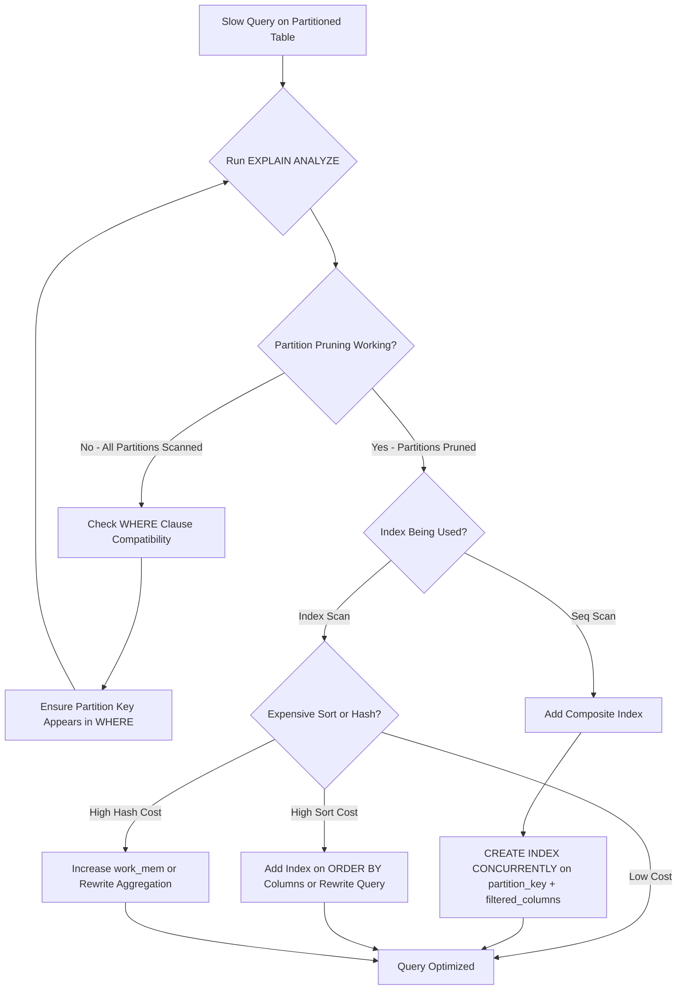

| Difficulty | Channel | Tags |
|---|---|---|
| intermediate | database | explain, query-plan, partitioning |

It was a Tuesday morning when Capital One's Consumer Identity platform — the system responsible for millions of customers' data lookups — started missing its latency targets. The database had 100 million rows, partitioned by date exactly as the textbooks recommend. Yet queries filtering on specific date ranges were crawling. The team eventually achieved sub-millisecond response times for 99.9% of lookups [1]. But the path there involved a fix that would make most DBAs flinch. Here is the full story of what went wrong, what they discovered, and what you can steal from their playbook.

---

> ### Real-World Case — Capital One
>
> Capital One's Consumer Identity platform handles massive volumes of customer data daily, partitioned by date across PostgreSQL tables. Despite partitioning being in place, they faced the exact challenge described — queries filtering on date ranges still had performance issues because partitioning alone doesn't solve everything. The team needed to ensure millisecond response times (99.9% of the time) for their millions of customers' recent data while archiving several terabytes daily.
>
> | | |
> |---|---|
> | **Challenge** | With tables partitioned by timestamp, Capital One discovered that naive partitioning strategies still left performance on the table. They needed to ensure partition pruning actually worked (including handling timezone edge cases like Arizona's DST behavior), optimize the data lifecycle (archiving 90+ day old data), and avoid expensive operations like vacuuming that lock tables and block reads/writes during peak traffic. |
> | **Solution** | Capital One implemented three counterintuitive partitioning strategies: (1) Always use timestamptz with UTC to avoid timezone-related partition pruning failures — they hit a real bug where Arizona customers' data was logged incorrectly twice annually due to DST. (2) Instead of DELETE + VACUUM to remove old data, they detach partitions — bulk deletes and vacuum commands place locks that prevent reads/writes, causing unacceptable downtime. (3) They deliberately stopped vacuuming partitioned tables entirely — the cost of vacuuming (table locks blocking customer-facing queries) outweighed the bloat cleanup benefits, since they only keep 90 days of hot data anyway. |
> | **Outcome** | The strategy enabled sub-millisecond query response times for 99.9% of customer data lookups. By detaching rather than deleting old partitions, they eliminated lock contention that was causing real customer experience degradation. The decision to skip vacuuming — counterintuitive for any DBA — was validated at scale: the bloat from unvacuumed tuples was acceptable compared to the operational cost of table locks during peak traffic. Query execution times remained consistent year-round despite seasonal traffic spikes (holidays) because a hash function on timestamps distributes data evenly across partitions. |
> | **Lesson** | Partition pruning is necessary but not sufficient — you must also verify that your partition key design actually enables pruning (timezone handling matters!), and sometimes the 'best practice' answer (vacuum regularly) is wrong at scale. The real optimization is minimizing lock contention on customer-facing queries, even if it means living with some table bloat. As they put it: 'removing the bloat caused by unused tuples in our database tables is so expensive that we just leave them in.' |

---

## The Hidden Cost of "It's Already Partitioned"

You set up table partitioning. The docs said it would make queries faster. You partitioned by date, added a few indexes, and shipped it. Weeks later, a query like SELECT * FROM events WHERE event_date BETWEEN '2024-01-01' AND '2024-01-31' AND status = 'completed' is still taking seconds on a 100 million row table. Sound familiar? This is one of the most common traps in database performance work: assuming that partitioning is a magic bullet. It is not. Partitioning solves one problem — reducing the amount of data scanned — but it leaves plenty of other performance killers untouched [2]. The real question is not whether you partitioned, but whether your EXPLAIN plan is actually using the partition structure, the indexes, and the query planner the way you think it is.

## The Problem: Why Partitioning Alone Does Not Fix Slow Queries

When a query on a partitioned table runs slowly, the root cause almost always falls into one of four buckets. First, partition pruning may not be working. PostgreSQL can only prune partitions if the planner can statically determine which partitions match your WHERE clause [3]. If you are using non-deterministic functions, loose type casting, or joins that obscure the partition key, the planner will scan every partition — defeating the entire purpose. Second, indexes may not cover your query. A single-column index on event_date will not help when you also filter on status. Third, the planner may be choosing a sequential scan over an index scan if it thinks the data set is large enough to warrant it. Fourth, expensive sorts or hash aggregates can silently dominate query time even when the scan itself is fast. Each of these failure modes has a distinct fingerprint in the EXPLAIN plan. The problem is that most developers never look at the plan closely enough.

## Real-World Case — Capital One

Capital One's Consumer Identity platform handles massive volumes of customer data daily, partitioned by date across PostgreSQL tables [1]. Despite partitioning being in place, the team faced exactly the challenge described above. Their goal was millisecond response times — 99.9% of the time — for millions of customers' recent data, while archiving several terabytes daily. The strategy that worked involved three key insights. First, they used timestamptz columns to eliminate time-zone ambiguities that were causing data to land in wrong partitions — a problem they had actually encountered with Arizona's lack of Daylight Savings [1]. Second, rather than deleting old partitions (which triggers vacuuming and table locks), they detached partitions — a much less costly operation that avoided lock contention during peak traffic [1]. Third — and this is the plot twist — they deliberately chose not to vacuum their tables. The bloat from unused tuples was acceptable compared to the operational cost of table locks during peak customer traffic [1]. A hash function on timestamps ensured partitions were roughly equal in size, so query execution times remained consistent year-round even through holiday spikes.

## Deep Dive — Reading the EXPLAIN Plan Like a Detective

To debug a slow partitioned query, you need to read the EXPLAIN plan the way a detective reads a crime scene. Start with partition pruning: look for how many partitions the planner actually visits. If you see every partition listed in the plan, pruning is not working [3]. Next, check whether the planner is using an index scan or a sequential scan. An index scan reads only the matching rows; a sequential scan reads every row in the partition. On a partition with millions of rows, this difference is enormous. Then look for sort operations. If you see a Sort node with a high cost, the planner may be sorting results in memory or spilling to disk. Finally, check for hash aggregates — these can be efficient for grouping, but if the hash table does not fit in memory, performance degrades sharply. The key insight is that EXPLAIN ANALYZE is your best friend here. EXPLAIN without ANALYZE only shows the planner's estimates. EXPLAIN ANALYZE executes the query and shows actual row counts and timing, which reveals when the planner's estimates are wildly wrong [4].

## Workflow — The 5-Step Diagnostic Process

When you encounter a slow query on a partitioned table, follow this workflow: First, run EXPLAIN (ANALYZE, BUFFERS) to get the actual execution plan. Second, verify partition pruning by checking how many partitions appear in the plan. If all partitions appear, investigate why the planner cannot narrow the scope. Third, check index usage — look for Index Scan or Index Only Scan nodes. If you see Seq Scan, the index is either missing or not being chosen. Fourth, identify expensive operations like sorts, hash joins, or nested loops. Fifth, create composite indexes that cover your most common WHERE clauses. The Mermaid diagram below visualizes this diagnostic flow.

## Code Example — From Diagnosis to Optimization

Here is the practical workflow in SQL. Start by examining the current plan, then build the index and verify the improvement.

## Lessons Learned — What to Do Differently Tomorrow

After walking through Capital One's experience and the diagnostic process, the takeaways crystallize. Partitioning is a powerful tool, but it is not a complete solution. You still need to ensure partition pruning works, indexes cover your queries, and the planner is choosing efficient execution strategies. Composite indexes on (partition_key, filtered_columns) are almost always worth the investment for date-range queries. And the most counterintuitive lesson of all: sometimes doing less — like skipping vacuum on tables where recent data is all that matters — is the right engineering tradeoff. The bloat from old tuples becomes irrelevant if those tuples are in partitions you will detach anyway. Tomorrow, start by running EXPLAIN ANALYZE on your slowest partitioned query. Check for pruning, index usage, and sort costs. Build a composite index if one is missing. You may be surprised how much performance was hiding in plain sight.

---

## Partitioned Query Diagnostic Flow

<strong>Original Interview Question</strong>

**Q:** You have a PostgreSQL table with 100M rows partitioned by date. A query filtering on a specific date range is still slow. What would you check in the EXPLAIN plan and how would you optimize it?

**A:** Check partition pruning effectiveness, index utilization patterns, and expensive sort operations. Create composite indexes on (date, filtered_columns) and evaluate clustering strategies for optimal data access.

## Conclusion

The next time you have a slow query on a partitioned PostgreSQL table, do not blame the partitioning strategy itself. Instead, open the EXPLAIN plan and start asking questions. Is pruning working? Are indexes covering your WHERE clause? Are sorts or hashes eating your budget? Capital One's experience shows that even at massive scale — millions of customers, terabytes archived daily — the fundamentals of reading execution plans and building the right indexes are what separate sub-millisecond lookups from multi-second drags. The counterintuitive lesson: sometimes the best optimization is to do less. Detach instead of delete. Skip vacuum when bloat is irrelevant. And always, always read the plan before reaching for more hardware.

---

## References

1. [Capital One — PostgreSQL Partitioning: 3 Strategies Capital One Leverages](https://www.capitalone.com/tech/software-engineering/postgresql-partitioning-tips) — blog
2. [PostgreSQL Documentation — Table Partitioning](https://www.postgresql.org/docs/current/ddl-partitioning.html) — documentation
3. [PostgreSQL Documentation — Partition Pruning](https://www.postgresql.org/docs/current/ddl-partitioning.html#DDL-PARTITION-PRUNING) — documentation
4. [PostgreSQL Documentation — Using EXPLAIN](https://www.postgresql.org/docs/current/using-explain.html) — documentation
5. [PostgreSQL Documentation — Index Types (B-tree)](https://www.postgresql.org/docs/current/indexes-types.html) — documentation
6. [Wikipedia — Database Partitioning](https://en.wikipedia.org/wiki/Partition_(database)) — documentation
7. [PostgreSQL Documentation — CREATE INDEX](https://www.postgresql.org/docs/current/sql-createindex.html) — documentation
8. [PostgreSQL Documentation — CLUSTER](https://www.postgresql.org/docs/current/sql-cluster.html) — documentation

---

**Author:** Satishkumar Dhule — [GitHub](https://github.com/satishkumar-dhule) · [LinkedIn](https://linkedin.com/in/satishkumar-dhule) · [Website](https://satishkumar-dhule.github.io)
