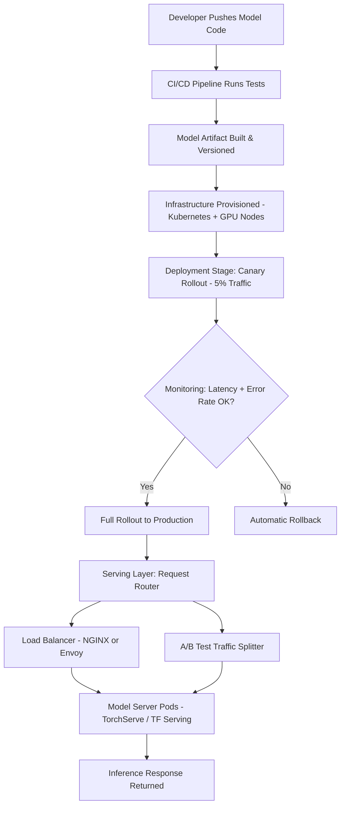
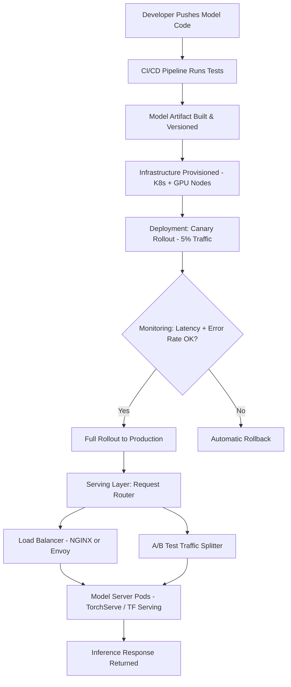

| Difficulty | Channel | Tags |
|---|---|---|
| beginner | devops | mlops, deployment |

When you deploy a machine learning model, you might think the hard part is over. Netflix once thought so too. Serving hundreds of ML model types across 250 million users at over 1 million requests per second, they built a routing layer called Switchboard that intelligently directed requests to the right model version, cluster shard, and A/B test — all while client services stayed blissfully unaware of the complexity underneath [1]. But then Switchboard hit its own scaling limits, and the team faced a truth every ML engineer eventually confronts: deployment and serving are not the same problem, and confusing them will cost you.

---

> ### Real-World Case — Netflix
>
> Netflix serves hundreds of ML model types across 250 million users at over 1 million requests per second. Their ML serving infrastructure needed to route requests to the right model version, on the right cluster shard, for the right user and A/B test — while client services remain completely unaware of the underlying complexity. The routing layer they built (Switchboard) eventually hit its own scaling limits, forcing a second-generation redesign.
>
> | | |
> |---|---|
> | **Challenge** | Distinguishing model deployment (CI/CD, infrastructure, monitoring) from model serving (runtime inference routing, request handling, versioning) at massive scale — and realizing that the serving layer itself becomes a critical infrastructure problem. Off-the-shelf API gateways (AWS API Gateway, service mesh proxies) lacked first-class integration with Netflix's experimentation platform, gRPC support, and domain-specific context routing needed for ML workloads. |
> | **Solution** | Netflix built Switchboard — a custom ML serving router as a centralized proxy handling all traffic, using an 'Objective' abstraction that decouples client services from concrete models. Switchboard performed context-aware routing (device, locale, A/B test allocation), dynamic traffic splitting for canary deployments, shadow mode testing, and instant rollback. When Switchboard hit scaling limits (10–20ms added latency, single point of failure, tenant error propagation), they redesigned it as Lightbulb — separating routing from model selection, moving the data plane to Envoy, and switching from JavaScript to JSON declarative configuration for routing rules. |
> | **Outcome** | The platform serves hundreds of model types and versions at 1 million RPS. Switchboard served 30+ client services before being replaced. The Lightbulb redesign eliminated the added 10–20ms latency from serialization-deserialization in the hot path, improved tenant isolation, and removed the single point of failure — all while preserving the same high-level API for client services and researchers. |
> | **Lesson** | Model deployment and model serving are fundamentally different concerns: deployment is the CI/CD pipeline, infrastructure provisioning, and monitoring setup; serving is the runtime system that routes requests, manages model versions, handles A/B traffic splits, and optimizes latency. Netflix's experience shows that even the serving layer itself needs iterative architectural evolution — a design that works at one scale (Switchboard at moderate RPS) becomes a bottleneck at the next (1M RPS), requiring separation of concerns and delegation to purpose-built infrastructure (Envoy). |

---

## Hook — The Deploy That Looked Perfect (Until Users Showed Up)

Your pipeline passes. Docker images build. Kubernetes rolls out the new pods. Monitoring dashboards glow green. You lean back, satisfied — your ML model is deployed. Then production traffic arrives. Latency spikes to 300ms. A/B tests bleed into each other. The wrong model version serves a request for a user in Brazil. Deployment was clean; serving is on fire. This is the gap that separates teams running toy ML projects from teams running ML systems. Deployment is about getting code from point A to point B. Serving is about what happens the moment a real user request hits your infrastructure — routing, versioning, scaling, and failing gracefully. If you do not understand the distinction, your beautifully deployed model becomes a very expensive way to generate errors.

## Problem — Two Problems Wearing the Same Outfit

Here is the thing most ML teams discover too late: deployment and serving look similar on the surface — both involve Docker, Kubernetes, and YAML files — but they solve fundamentally different problems. Deployment is the full lifecycle: CI/CD pipelines, infrastructure provisioning with tools like Terraform, rollback strategies, and monitoring setup. It is the scaffolding. Serving is runtime: how requests arrive, how models are loaded into memory, how inference results stream back to clients, and how you handle ten different versions of the same model simultaneously for A/B experiments. The real pain point? Many teams build a deployment pipeline, ship a model, and assume serving will just work. It will not. Without a dedicated serving layer, you end up with monolithic inference endpoints that cannot scale horizontally, cannot split traffic for experiments, and cannot handle the cold-start penalty of loading a 4GB model into GPU memory on every new pod. This is not a theoretical problem — it is the reason Netflix had to rebuild their entire routing infrastructure.

## Real-World Case — Netflix's Switchboard, and Why It Broke

Netflix's ML platform serves hundreds of model types and versions at over 1 million requests per second. Their solution, Switchboard, was a routing layer that sat between 30+ client services and the actual model servers. It directed each request to the correct model version, on the correct cluster shard, for the correct user and A/B test [1]. For a while, it worked brilliantly. But as model count and traffic grew, Switchboard itself became the bottleneck. The serialization-deserialization cycle in the hot path added 10–20ms of latency to every single request. Tenant isolation was weak. And worst of all, Switchboard was a single point of failure — if it went down, every model-dependent feature across Netflix went dark. The redesign, Lightbulb, eliminated the serialization overhead, improved isolation, and removed the single point of failure — all while preserving the same high-level API [1]. The lesson? Serving infrastructure is not just deployment with an API bolted on. It is its own system with its own failure modes, its own scaling limits, and its own architectural trade-offs.

## Deep Dive — Deployment vs Serving: The Real Trade-Offs

Let us break down what each layer actually handles, because the distinction matters when things go wrong at 3am.

**Deployment** owns the lifecycle:
- CI/CD pipelines (GitHub Actions, Jenkins) that build, test, and roll out model artifacts
- Infrastructure provisioning (Kubernetes, Terraform, Docker) that creates the runtime environment
- Monitoring and alerting (Prometheus, Grafana, SageMaker Monitoring) that detects drift and failures
- Rollback strategies that let you revert to a known-good version in seconds

**Serving** owns the runtime:
- Inference APIs built with frameworks like TorchServe, TensorFlow Serving, or BentoML
- Request routing that directs traffic to the correct model shard and version
- Model versioning that maintains multiple active versions for A/B testing
- Autoscaling that spins up pods based on request volume, not just CPU usage

The trade-offs become real fast. Consider latency vs throughput: a single model instance might handle 100 QPS with 20ms latency, but batching 10 requests together pushes throughput to 500 QPS while latency climbs to 80ms. For real-time recommendations, you need the former. For offline analytics, the latter wins. Cold starts are another trap. Loading a PyTorch model into GPU memory takes 5–15 seconds. If your serving layer does not pre-warm instances, your p99 latency after a deploy will spike catastrophically. Kubernetes horizontal pod autoscalers (HPA) work well for CPU-bound services, but ML inference is GPU-bound — you need custom metrics or KEDA to scale properly [2].

## Workflow — From Commit to Serving, Step by Step

Here is the end-to-end workflow that separates mature ML platforms from ad-hoc setups. The Mermaid diagram below maps the full journey from code commit to live inference.



Step by step: First, your CI/CD pipeline builds and versions the model artifact — typically stored in an S3-compatible registry or MLflow's artifact store [3]. Next, infrastructure is provisioned: GPU-enabled Kubernetes nodes are spun up, and the model server (TorchServe or TF Serving) is configured. The deployment stage uses a canary rollout — 5% of traffic hits the new version while monitoring tracks latency, error rates, and model-specific metrics like prediction distribution shift. If metrics stay healthy, the rollout proceeds to 100%. If not, automatic rollback kicks in. Once live, the serving layer routes incoming requests through a load balancer (NGINX or Envoy [4]) to the appropriate model server pods. An A/B test splitter sits alongside, sharding traffic between model versions based on user cohort.

## Code Example — A Minimal Serving Router in Python

Below is a practical example of a model serving router that handles version routing and health checks — the kind of component Netflix's Switchboard was doing at massive scale.

```python
import time
import random
from fastapi import FastAPI, Request
from pydantic import BaseModel
import uvicorn

app = FastAPI(title="ML Serving Router")

# Simulated model registry: version -> latency profile
MODEL_REGISTRY = {
    "v1.0": {"endpoint": "http://model-server-v1:8080/predict", "weight": 0.9},
    "v2.0": {"endpoint": "http://model-server-v2:8080/predict", "weight": 0.1},  # canary
}

class PredictRequest(BaseModel):
    user_id: str
    features: dict

class PredictResponse(BaseModel):
    prediction: float
    model_version: str
    latency_ms: float

@app.post("/predict", response_model=PredictResponse)
async def predict(req: PredictRequest):
    """Route request to appropriate model version based on A/B weights."""
    # Weighted random selection for A/B testing
    versions = list(MODEL_REGISTRY.keys())
    weights = [MODEL_REGISTRY[v]["weight"] for v in versions]
    selected_version = random.choices(versions, weights=weights, k=1)[0]
    endpoint = MODEL_REGISTRY[selected_version]["endpoint"]

    # Simulate inference call (replace with actual HTTP/gRPC call)
    start = time.perf_counter()
    # In production: response = await http_client.post(endpoint, json=req.dict())
    prediction = random.random()  # placeholder
    latency_ms = (time.perf_counter() - start) * 1000

    return PredictResponse(
        prediction=prediction,
        model_version=selected_version,
        latency_ms=round(latency_ms, 2),
    )

@app.get("/health")
async def health():
    """Health check endpoint for Kubernetes readiness/liveness probes."""
    return {"status": "healthy", "active_versions": list(MODEL_REGISTRY.keys())}

if __name__ == "__main__":
    uvicorn.run(app, host="0.0.0.0", port=8000)
```

This router does three critical things. First, it maintains a model registry that maps versions to endpoints and traffic weights — enabling A/B testing without touching the client. Second, the `/predict` endpoint selects a model version using weighted random sampling, which mirrors how Netflix's Switchboard directed traffic across model shards [1]. Third, the `/health` endpoint supports Kubernetes liveness and readiness probes, which is essential for zero-downtime deploys [2]. In production, you would replace the simulated inference call with an actual HTTP or gRPC request to TorchServe or TensorFlow Serving, and you would pull version weights from a feature flag service like LaunchDarkly or Unleash rather than hardcoding them.

## Lessons Learned — What to Do Tomorrow Morning

After studying how Netflix, Uber, and other ML-mature organizations handle this problem, here are the patterns that hold up in production:

**1. Treat serving as its own system, not a deployment side effect.** Netflix learned this the hard way when Switchboard — built as a routing utility — became a single point of failure serving 30+ client services [1]. Give serving its own architecture, its own monitoring, and its own on-call rotation.

**2. Pre-warm your model servers.** Cold starts on GPU workloads are 5–15 seconds. If you rely on Kubernetes HPA to scale pods reactively, your p99 latency will spike during traffic surges. Use KEDA or pre-provisioned warm pools instead [2].

**3. Version everything, rollback anything.** Every model artifact, every config, every traffic weight rule should be versioned. MLflow and SageMaker Model Registry handle this well [3]. Your rollback should be a one-click operation, not a weekend project.

**4. Monitor model-specific metrics, not just system metrics.** CPU utilization tells you nothing about model health. Track prediction distribution, feature drift, and latency per model version. Evidently AI and WhyLabs are purpose-built for this [5].

**5. Design for ten times your current scale.** Netflix redesigned Switchboard before it broke, not after [1]. Your serving infrastructure will face traffic spikes, new model types, and unexpected A/B tests. Build the routing layer to absorb that complexity.

The most important takeaway: deployment gets your model to production. Serving keeps it alive. The teams that understand this distinction are the ones whose ML systems actually make it past the demo phase.

---

## ML Model Deployment to Serving Pipeline



<details>
<summary><strong>Original Interview Question</strong></summary>

**Q:** Explain the key differences between model serving and model deployment in ML systems, including specific technologies, scaling considerations, and real-world implementation patterns?

**A:** Deployment encompasses CI/CD pipelines, infrastructure setup, and monitoring using tools like Kubernetes, MLflow, and SageMaker. Serving focuses on runtime inference APIs with frameworks like TensorFlow Serving, TorchServe, or BentoML, handling request routing, model versioning, and autoscaling. Key trade-offs include latency vs throughput, batch vs real-time inference, and cold start optimization.

</details>

## Conclusion

Netflix built Switchboard, scaled it to a million requests per second across 250 million users, and still had to rebuild it because it became the bottleneck [1]. That is the arc every ML platform team eventually walks. The difference between deployment and serving is not academic — it determines whether your model serves users at 20ms or 320ms, whether your A/B tests produce clean results or corrupted ones, and whether your platform survives a traffic spike or collapses under it. Start by separating these concerns in your architecture. Give serving its own routing layer, its own health checks, and its own scaling policy. Instrument model-specific metrics from day one — prediction drift, latency per version, error rates by cohort. And design your routing to be replaceable, because as Netflix proved, even well-built serving layers hit walls. The goal is not a perfect system. The goal is a system you can evolve without rebuilding from scratch.

---

## References

1. [Netflix State of Routing in Model Serving](https://netflixtechblog.com/state-of-routing-in-model-serving-16e22fe18741) — blog
2. [Kubernetes Horizontal Pod Autoscaler Documentation](https://kubernetes.io/docs/tasks/run-application/horizontal-pod-autoscale/) — documentation
3. [MLflow Model Registry Documentation](https://mlflow.org/docs/latest/ml/model-registry.html) — documentation
4. [Envoy Proxy Load Balancing Documentation](https://www.envoyproxy.io/docs/envoy/latest/intro/arch_overview/upstream/load_balancing/load_balancers) — documentation
5. [Evidently AI Open Source ML Monitoring](https://github.com/evidentlyai/evidently) — documentation
6. [PyTorch TorchServe Documentation](https://pytorch.org/serve/) — documentation
7. [TensorFlow Serving Overview](https://www.tensorflow.org/tfx/guide/serving) — documentation
8. [AWS SageMaker Model Deployment Documentation](https://docs.aws.amazon.com/sagemaker/latest/dg/deploy-model.html) — documentation

---

**Author:** Satishkumar Dhule — [GitHub](https://github.com/satishkumar-dhule) · [LinkedIn](https://linkedin.com/in/satishkumar-dhule) · [Website](https://satishkumar-dhule.github.io)
