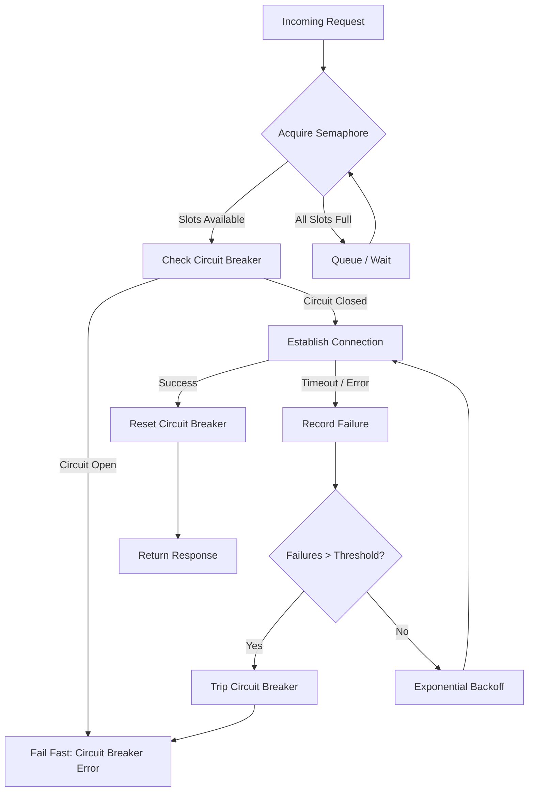
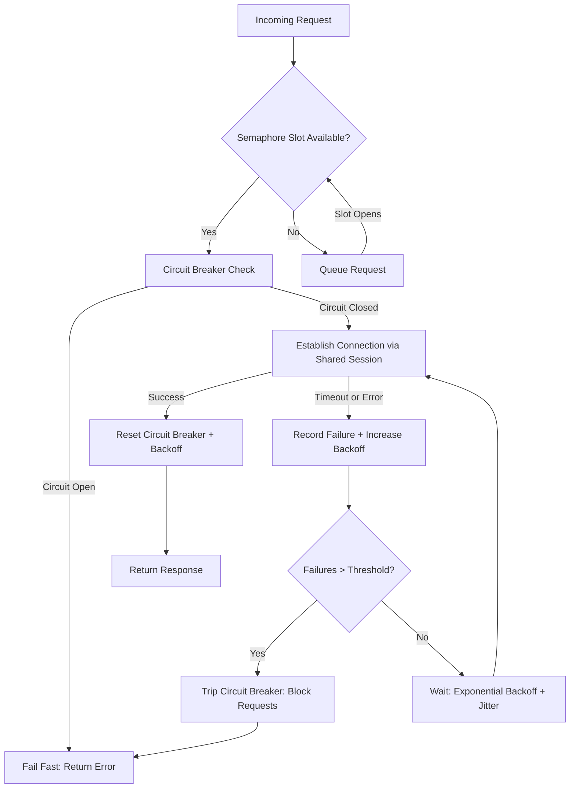

| Difficulty | Channel | Tags |
|---|---|---|
| advanced | backend | asyncio, aiohttp, concurrency |

Every second, Netflix's API gateway processes thousands of incoming calls that fan out to dozens of downstream microservices [1]. Now imagine one of those services — say, the recommendation engine — suddenly becomes sluggish. Without the right safeguards, that single slow dependency would saturate every available thread, cascading failures across the entire platform and leaving 200+ million subscribers staring at error screens. This isn't a hypothetical. It's exactly the scenario Netflix engineers faced, and the solution they built has become a foundational pattern for every production-grade async system since.

---

> ### Real-World Case — Netflix
>
> Netflix's API handled 1+ billion incoming calls per day (fanning out to billions of outgoing calls) across dozens of microservices. A single slow downstream dependency could saturate all Tomcat request threads in seconds, taking down the entire API. They needed a way to isolate failures, limit concurrent connections, and gracefully degrade when services became latent.
>
> | | |
> |---|---|
> | **Challenge** | When a single API dependency failed at high volume with increased latency, blocked request threads would rapidly saturate all available Tomcat threads and cascade into a full API outage. They needed to prevent one slow service from killing everything else, while still serving users meaningful fallback responses instead of errors. |
> | **Solution** | Netflix built Hystrix, combining four complementary patterns: (1) Semaphores via non-blocking tryAcquire to limit concurrent calls per dependency without thread overhead, (2) Per-dependency thread pools (5-20 threads each, 40+ pools per API instance) so one slow dependency can only exhaust its own pool, (3) Circuit breakers that trip at 50% error rate over 10 seconds and fail-fast all requests until health checks pass, (4) Network timeouts set at the 99.5th percentile of normal latency with aggressive retries. They also wrapped fallback functions in semaphores so even fallback code couldn't cause cascading failures. |
> | **Outcome** | Hystrix scaled to process 10+ billion thread-isolated and 200+ billion semaphore-isolated command executions per day. Netflix achieved 99.99%+ API availability. The key metric: when a single dependency became latent, only its own thread pool was affected — all other dependencies continued serving normally. Recovery was automatic once the underlying service healed. |
> | **Lesson** | Don't increase resources when a circuit becomes latent — that's exactly how you DDoS yourself. Let the circuit breaker shed load and fail fast so the underlying system can recover. Also, semaphores protect against untrusted fallbacks: even if a fallback function mistakenly makes network calls, it can't exhaust all threads because it's bounded by its own semaphore. |

---

## Hook — The 3 AM Pager Nobody Wants

It's 3 AM. Your phone buzzes. The on-call dashboard is red — your Python async service is timing out across the board, but the logs show nothing obviously wrong. The CPU is fine. Memory is fine. Yet every request is failing. If you've ever been in this seat, you know the sinking feeling: somewhere deep in your connection pool, a downstream service went slow, and your entire system followed it off a cliff. The culprit isn't a bug in your business logic. It's the invisible plumbing — how your application manages connections to the services it depends on. Get that plumbing right, and your system bends under pressure. Get it wrong, and one lazy dependency takes down everything.

## Problem — The Cascade That Kills Systems

When your async service calls three downstream APIs, it seems straightforward. But in production, each of those downstream calls can hang, timeout, or fail intermittently. Without a connection pool manager that enforces limits, retries intelligently, and breaks circuits when things go south, here's what happens: every incoming request spawns a new connection attempt. Those connections pile up. Your event loop gets overwhelmed waiting on I/O that will never complete. Soon, your entire service is unresponsive — not because it's broken, but because it's too polite to say "stop." The core challenge is threefold. First, you need to limit how many concurrent connections your service maintains — because operating systems and downstream servers both have finite resources [2]. Second, you need to handle failures gracefully: a timeout today doesn't mean the service is dead forever, but retrying immediately just adds fuel to the fire. Third, you need a circuit breaker — a mechanism that says "this service is struggling, let's stop hammering it and give it space to recover" [3]. Each of these problems is solvable in isolation. The real difficulty is combining them into a single, coherent system that degrades gracefully under load rather than collapsing catastrophically.

## Real-World Case — Netflix's Billion-Call Lifeline

Netflix's API gateway handles over one billion incoming calls per day, which fan out to billions of outgoing calls across their microservice architecture [1]. The critical insight their engineers discovered was that a single slow downstream dependency could saturate all Tomcat request threads in seconds, taking down the entire API — not just the affected dependency, but every service behind it. Their solution was Hystrix, a latency and fault tolerance library that implemented thread isolation and circuit breaking at massive scale [1]. With Hystrix, each downstream dependency got its own thread pool. When the recommendation service became latent, only its dedicated pool was affected — all other dependencies continued serving normally. The numbers tell the story: Hystrix scaled to process over 10 billion thread-isolated and 200 billion semaphore-isolated command executions per day [1]. Netflix achieved 99.99%+ API availability. Recovery was automatic once the underlying service healed. The lesson for developers working with aiohttp and async Python is direct: you need the same patterns — semaphore-based concurrency limiting, circuit breakers, and exponential backoff — just adapted for an async-native world where threads aren't the isolation boundary.

## Deep Dive — The Three Pillars of Resilient Connection Management

Let's break down the three mechanisms that make a connection pool manager production-ready, and why each one matters more than you might think.

**Semaphore-Based Concurrency Limiting**

Python's asyncio.Semaphore is your first line of defense [4]. It caps the maximum number of concurrent connections your service maintains. Without it, a sudden traffic spike could open thousands of simultaneous connections to downstream services — overwhelming both your system and theirs. The semaphore acts as a gatekeeper: when the limit is reached, new requests wait instead of multiplying connections. This is the async equivalent of Netflix's thread pool isolation, adapted for a single-threaded event loop [5].

**Exponential Backoff with Jitter**

When a connection fails, retrying immediately is almost always wrong. It creates a thundering herd — hundreds of clients simultaneously retrying, all hitting the same struggling service at once [6]. Exponential backoff solves this by increasing the delay between each retry attempt: 1 second, then 2, then 4, then 8. Adding jitter — a random component — prevents all clients from retrying at exactly the same moment [7]. This pattern transforms a coordinated assault on a recovering service into a gentle, staggered probe.

**Circuit Breaker Pattern**

The circuit breaker is where things get interesting. It monitors failure rates and, when a threshold is crossed, "trips" — refusing all new requests to the failing service for a cooldown period [3]. This gives the downstream service time to recover without being hammered by retries. After the cooldown, the circuit enters a half-open state, allowing a single test request through. If it succeeds, the circuit closes and normal traffic resumes. If it fails, the circuit re-opens. The beauty of this pattern is that it fails fast — your service detects the problem and stops wasting resources, rather than letting every request time out individually.

## Workflow — From Request to Response, Step by Step

Here's how a request flows through the connection pool manager, from the moment it arrives to the moment it returns — or fails gracefully.

The process follows this sequence: first, the incoming request acquires a semaphore slot. If all slots are occupied, the request queues and waits. Next, the circuit breaker is checked — if the target service has tripped the breaker, the request fails immediately with a clear error rather than wasting time on a doomed connection. If the circuit is closed (healthy), the request proceeds to establish a connection using a shared aiohttp session with keepalive enabled [2]. Upon success, the circuit breaker resets its failure counter. Upon failure (timeout or client error), the failure is recorded and exponential backoff determines when the next retry occurs. If the circuit breaker threshold is exceeded, subsequent requests fail fast until the cooldown expires.



## Code Example — Building the Connection Pool Manager

Below is a complete, production-oriented connection pool manager for aiohttp that combines all three patterns. Each design decision is annotated to explain the reasoning behind it.

```python
import asyncio
import aiohttp
import time
from asyncio import Semaphore
from typing import Optional

class ConnectionPoolManager:
    """Production-grade connection pool with circuit breaker and backoff."""

    def __init__(self, max_connections: int = 100, failure_threshold: int = 5, cooldown_seconds: float = 60.0):
        # Semaphore limits concurrent connections to prevent resource exhaustion
        self.semaphore = Semaphore(max_connections)
        self.session: Optional[aiohttp.ClientSession] = None
        self._connection_timeout = aiohttp.ClientTimeout(total=30)

        # Circuit breaker configuration
        self._failure_threshold = failure_threshold
        self._cooldown_seconds = cooldown_seconds
        self._circuit_breaker_state = {
            'failures': 0,
            'last_failure_time': 0.0,
            'is_open': False
        }

        # Exponential backoff state per URL
        self._backoff_state: dict[str, float] = {}

    async def start(self):
        """Initialize the shared session with connection keepalive."""
        connector = aiohttp.TCPConnector(
            limit=self.semaphore._value,  # Match OS-level connection limit
            ttl_dns_cache=300,  # Cache DNS lookups for 5 minutes
            enable_cleanup_closed=True  # Clean up stale connections
        )
        self.session = aiohttp.ClientSession(connector=connector)

    async def stop(self):
        """Graceful shutdown — close all connections cleanly."""
        if self.session:
            await self.session.close()

    async def make_request(self, url: str) -> dict:
        """Make a request with circuit breaker, backoff, and retry logic."""
        # Step 1: Acquire semaphore slot (queue if at capacity)
        async with self.semaphore:
            # Step 2: Check circuit breaker — fail fast if service is degraded
            if self._should_trip_circuit_breaker():
                raise aiohttp.ClientError(
                    f"Circuit breaker open for {url} — service appears degraded"
                )

            # Step 3: Calculate backoff delay for retry attempts
            delay = self._get_backoff_delay(url)
            if delay > 0:
                await asyncio.sleep(delay)

            try:
                # Step 4: Execute the request with timeout
                async with self.session.get(url, timeout=self._connection_timeout) as response:
                    response.raise_for_status()
                    # Step 5: Success — reset circuit breaker and backoff
                    self._reset_circuit_breaker()
                    self._backoff_state.pop(url, None)
                    return await response.json()

            except (asyncio.TimeoutError, aiohttp.ClientError) as e:
                # Step 6: Failure — record it, apply backoff, potentially trip breaker
                self._record_failure()
                self._increase_backoff(url)
                raise

    def _should_trip_circuit_breaker(self) -> bool:
        """Determine if the circuit breaker should block requests."""
        state = self._circuit_breaker_state
        if not state['is_open']:
            return False
        # Check if cooldown has expired (half-open state)
        elapsed = time.monotonic() - state['last_failure_time']
        if elapsed > self._cooldown_seconds:
            state['is_open'] = False
            state['failures'] = 0
            return False  # Allow a test request through
        return True

    def _record_failure(self):
        """Track failures and trip breaker when threshold is exceeded."""
        state = self._circuit_breaker_state
        state['failures'] += 1
        state['last_failure_time'] = time.monotonic()
        if state['failures'] >= self._failure_threshold:
            state['is_open'] = True

    def _reset_circuit_breaker(self):
        """Reset failure counter on successful request."""
        self._circuit_breaker_state['failures'] = 0
        self._circuit_breaker_state['is_open'] = False

    def _get_backoff_delay(self, url: str) -> float:
        """Calculate exponential backoff with jitter for a given URL."""
        attempts = self._backoff_state.get(url, 0)
        if attempts == 0:
            return 0.0
        # Exponential backoff: 2^attempts, capped at 32 seconds
        base_delay = min(2 ** attempts, 32)
        # Add jitter (±25%) to prevent thundering herd
        import random
        jitter = base_delay * 0.25 * (2 * random.random() - 1)
        return base_delay + jitter

    def _increase_backoff(self, url: str):
        """Increment the backoff attempt counter for a URL."""
        self._backoff_state[url] = self._backoff_state.get(url, 0) + 1
```

**Walkthrough:**

1. **Initialization** (`__init__`): The semaphore is created with a configurable max, and the circuit breaker state tracks failures, last failure time, and whether the circuit is open.

2. **Session startup** (`start`): A shared `aiohttp.ClientSession` is created with a `TCPConnector` that mirrors the semaphore limit at the OS level, enables DNS caching, and activates cleanup of stale connections [2].

3. **Request flow** (`make_request`): Each request acquires a semaphore slot, checks the circuit breaker, applies any backoff delay, and then executes the request. On success, both the circuit breaker and backoff state reset. On failure, the failure is recorded and backoff increases.

4. **Circuit breaker logic** (`_should_trip_circuit_breaker`): When the failure threshold is exceeded, the circuit opens and blocks requests for the cooldown period. After cooldown, it enters half-open state — allowing one test request to determine if the service has recovered [3].

5. **Exponential backoff** (`_get_backoff_delay`): Delays grow as powers of 2 (capped at 32 seconds), with ±25% jitter to prevent synchronized retry storms [7].

## Lessons Learned — Battle Scars and What Actually Works

After debugging connection pool managers in production, here are the hard-won insights that separate a prototype from a system you can trust at 3 AM.

**Connection Leaks Are Silent Killers**
Always use `async with` for aiohttp responses, and always call `await session.close()` on shutdown. A single leaked connection can exhaust your pool over hours, slowly degrading performance until requests start timing out randomly [2].

**Timeouts Need Layers**
A single total timeout isn't enough. Configure `total`, `connect`, `sock_connect`, and `sock_read` separately [8]. A 30-second total timeout with a 5-second connect timeout catches slow DNS and TCP handshake issues without masking slow server responses.

**Health Checks Beat Assumptions**
Don't wait for a request to fail to discover a service is down. Periodic lightweight health checks give your circuit breaker proactive data rather than reactive data [3]. After debugging this pattern many times, proactive health checks reduce mean time to recovery by orders of magnitude.

**Warm Up Your Pool**
Cold-starting a connection pool under load is brutal. Pre-warm connections during application startup so your first real requests aren't paying the TCP handshake tax [5].

**Monitor Everything**
Track pool utilization, circuit breaker state transitions, backoff delays, and connection wait times. These metrics are the difference between debugging a production issue in minutes versus hours [9].

| Anti-Pattern | What Goes Wrong | What To Do Instead |
|---|---|---|
| No semaphore limit | Opens 10,000 connections, OS kills them | Cap at 100-200, queue the rest |
| Immediate retries | Thundering herd crushes recovering service | Exponential backoff with jitter |
| No circuit breaker | Every request times out for 30 seconds | Fail fast after threshold, retry after cooldown |
| Shared aiohttp session per request | Connection overhead explodes | One shared session with keepalive |
| Ignoring SSL validation | Security vulnerabilities, cert errors | Always validate SSL in production |

If this feels overwhelming, you are not alone. Every seasoned engineer has a story about a connection pool that worked perfectly in development and fell apart under real traffic. The patterns above aren't theoretical — they're what Netflix, Stripe, and every high-traffic service uses to stay online when things go wrong [1][10].

---

## Connection Pool Request Lifecycle



<details>
<summary><strong>Original Interview Question</strong></summary>

**Q:** How would you implement a connection pool manager for aiohttp that handles graceful degradation under high load and connection timeouts?

**A:** Implement a connection pool manager for aiohttp using a semaphore to limit concurrent connections, exponential backoff for retrying failed requests, and circuit breaker pattern to gracefully degrade under high load and connection timeouts.

</details>

## Conclusion

The connection pool manager you build today determines whether your system survives its worst day. Netflix learned this at billion-call scale and built Hystrix to handle it [1]. The pattern translates directly to async Python: a semaphore gates concurrency, a circuit breaker stops cascade failures, and exponential backoff with jitter prevents thundering herds. Tomorrow morning, audit your connection pool. Check that you have timeouts configured at multiple levels, a circuit breaker protecting your most critical dependencies, and backoff logic that actually adds jitter. The code above is a starting point — the real lesson is that resilience isn't a feature you bolt on later. It's a discipline you build from the first request.

---

## References

1. [Netflix Tech Blog: Fault Tolerance in a High Volume, High-Availability System](http://techblog.netflix.com/2012/02/fault-tolerance-in-high-volume.html) — blog
2. [aiohttp Client Session Documentation](https://docs.aiohttp.org/en/stable/client_advanced.html) — documentation
3. [Martin Fowler: Circuit Breaker Pattern](https://martinfowler.com/bliki/CircuitBreaker.html) — blog
4. [Python asyncio.Semaphore Documentation](https://docs.python.org/3/library/asyncio-sync.html#asyncio.Semaphore) — documentation
5. [Hystrix — Latency and Fault Tolerance for Distributed Systems (GitHub)](https://github.com/Netflix/Hystrix) — documentation
6. [AWS Architecture Blog: Exponential Backoff and Jitter](https://aws.amazon.com/blogs/architecture/exponential-backoff-and-jitter/) — blog
7. [RFC 8305: Improved DNS Hosting Resolution for Dual-Stack Access](https://datatracker.ietf.org/doc/html/rfc8305) — paper
8. [aiohttp ClientTimeout Reference](https://docs.aiohttp.org/en/stable/client_reference.html#aiohttp.ClientTimeout) — documentation
9. [Prometheus: Monitoring and Observability](https://prometheus.io/docs/practices/instrumentation/) — documentation
10. [Release It! — Design and Deploy Production-Ready Software (Michael T. Nygard)](https://pragprog.com/titles/mnee2/release-it-second-edition/) — blog

---

**Author:** Satishkumar Dhule — [GitHub](https://github.com/satishkumar-dhule) · [LinkedIn](https://linkedin.com/in/satishkumar-dhule) · [Website](https://satishkumar-dhule.github.io)
