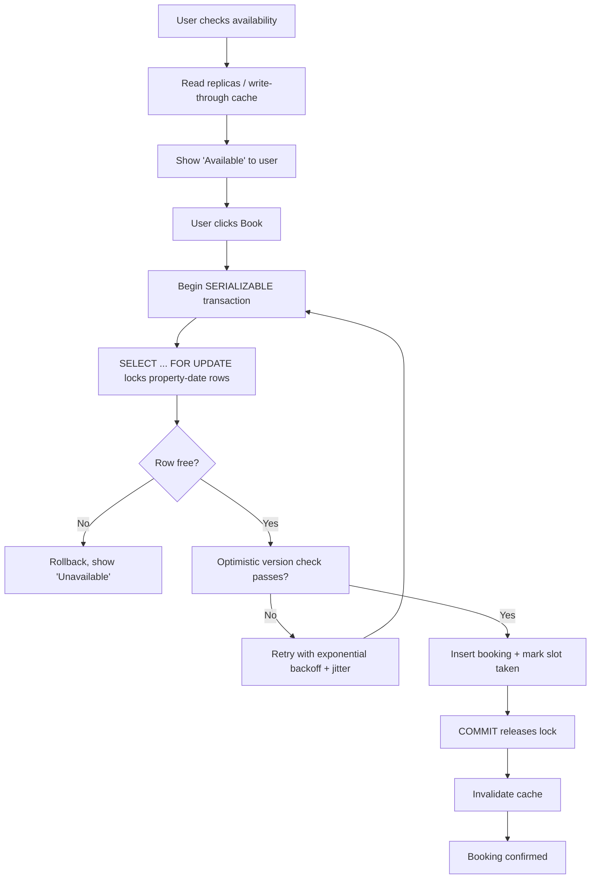

| Difficulty | Channel | Tags |
|---|---|---|
| intermediate | database | acid, isolation-levels, mvcc |

On November 15, 2022, millions of Swifties discovered a brutal truth about concurrent systems: when 3.5 million people race for the same 2 million seats, the database becomes a battlefield [1]. Ticketmaster pushed a record 2 million tickets through in a single day, yet roughly 15% of all site interactions failed, and passcode errors caused fans to lose tickets that were already sitting in their carts. The cause was not bad luck or weak servers - it was the hardest problem in distributed systems: how do you let thousands of customers check the same inventory at the same instant, without ever letting two of them claim the same thing? This is the story of transaction design, and it starts with a lesson every booking system - from Taylor Swift concerts to Airbnb reservations - has to learn.

---

> ### Real-World Case — Ticketmaster
>
> In November 2022, Ticketmaster ran the presale for Taylor Swift's Eras Tour — a textbook case of millions of users racing for scarce, concurrently-reserved inventory (52 stadium shows). Over 3.5 million fans pre-registered, the largest Verified Fan registration in company history, and the onsale was immediately hammered by bot attacks and code-less fans.
>
> | | |
> |---|---|
> | **Challenge** | Ticketing is the same concurrency problem as hotel bookings: a finite inventory of seats fought over by millions of simultaneous users, where correctness (no oversold/duplicate reservations) and high availability must both hold at peak. Ticketmaster's queue and reservation path had to absorb 3.5 billion total system requests — 4x its previous record peak — without dropping carted, in-flight reservations. |
> | **Solution** | Ticketmaster leaned on admission control rather than pure DB tricks: Verified Fan pre-registration as a human/bot gate, unique passcodes validated at check-out, and a virtual queue. When contention blew past design limits, it deliberately slowed and pushed back onsales to stabilize systems (the availability-side escape hatch), sacrificing latency for correctness. The incident exposed that check-then-act cart flows and per-fan queues without hard capacity control collapse under extreme contention — the exact failure mode optimistic/pessimistic locking and serializable transactions are built to prevent. |
> | **Outcome** | 2 million tickets sold on Nov 15 — the most ever sold for an artist in a single day — but roughly 15% of all site interactions failed, including passcode validation errors that caused fans to lose tickets already in their carts. The Capital One presale was pushed back a day, the general public sale was canceled outright, and the fallout triggered a Tennessee AG probe, a DOJ antitrust investigation, and a Senate Judiciary hearing where the CEO was subpoenaed and apologized. |
> | **Lesson** | When millions of users contend for a scarce resource simultaneously, admission control and capacity shaping are not optional — and the reservation path must be isolated from bot/fan traffic and made resilient with idempotent, transactional cart handling. A system that 'usually works' can fail catastrophically at 4x peak, and the cost is measured in lost transactions, canceled sales, and government scrutiny. |

---

## Hook — 3.5 million fans, one under-fire database

It was supposed to be the biggest Verified Fan onsale in Ticketmaster history. Instead, 3.5 billion system requests slammed the site - a staggering 4x the previous traffic peak - and hammered it with bot attacks that no pre-registration wall could fully repel [1]. The result was a paradox: 2 million tickets sold, a record, yet 15% of interactions failed, and fans lost carted seats to passcode validation errors [1]. Here is the tension that should haunt every backend engineer: your system can be fast enough to sell the most tickets ever sold, and still be wrong in ways that trigger Senate hearings, a DOJ antitrust investigation, and an apologizing CEO [1]. When thousands of users check the same scarce resource simultaneously, throughput and correctness collide. You cannot have a queue that is fast and a queue that never lets two people grab the same seat - unless you think very carefully about your transactions.

## Problem — The double-booking race condition

Picture a single property on a booking platform - a beach house, a stadium seat, a hotel room. Two guests open the same listing at the same millisecond. Both see 'Available.' Both hit Book. Without protection, both transactions read 'available = true,' both write 'available = false,' and both commit. That is a lost update, and it produces the nightmare you never want to debug at 2 a.m.: two happy customers, one room, and a cancellation department that hates you. At the heart of this is the read-check-write cycle, a classic check-then-act race that breaks under concurrency [2]. The stakes are higher than a support ticket. Double bookings erode trust, trigger refunds at the worst possible moment, and - as the Ticketmaster saga shows at global scale - can bring regulators to your door [1]. Most developers discover that their default isolation level, often READ COMMITTED, quietly permits these races [2]. You might think turning on a 'safety' flag fixes it. It usually does not.

## Real-World Case — Ticketmaster, November 2022

In November 2022, Ticketmaster ran the presale for Taylor Swift's Eras Tour, a textbook collision of scarce, concurrently-reserved inventory and unprecedented demand: 52 stadium shows, over 3.5 million pre-registered fans - the largest Verified Fan registration ever [1]. When the onsale opened, bot attacks and code-less fans sent traffic to 4x its previous peak, and roughly 15% of interactions across the site failed, including passcode errors that made fans lose tickets they had already carted [1]. The fallout was enormous: the Capital One presale was pushed back a day, the general public sale was canceled outright, and the incident triggered a Tennessee AG probe, a DOJ antitrust investigation, and a Senate Judiciary hearing where the CEO was subpoenaed and apologized [1]. Yet here is the counterintuitive twist: Ticketmaster still sold 2 million tickets that day - the most ever sold for an artist in a single day [1]. Overbooking was not the headline problem; contention and validation failures ate away at correctness under load. The lesson is that under extreme concurrency, you must protect the atomic check-and-claim step, and you must design for graceful failure when contention spikes. When availability and consistency collide, neither survives if you ignore transactions.

## Deep Dive — SERIALIZABLE, MVCC, and the fight between speed and correctness

Building on the Ticketmaster example, the fix for double bookings lives in the interaction between isolation levels and multiversion concurrency control (MVCC). At the strictest end sits SERIALIZABLE, which guarantees that concurrent transactions execute as if one ran completely before the other - eliminating dirty reads, non-repeatable reads, and phantom reads [2]. The catch, and here is the real trade-off, is that SERIALIZABLE costs concurrency: a lock-based implementation holds locks to the end of the transaction, so users wait and contention climbs under load [2]. That is exactly what you do not want during a Taylor Swift drop. This leads to the plot twist most engineers miss: MVCC databases avoid reader-writer blocking by keeping multiple versions of each row, letting readers see a consistent snapshot while writers proceed [3]. The most common level built on MVCC is snapshot isolation, which reads a consistent point-in-time view and aborts a transaction only if its writes conflict with a concurrent update [6]. Snapshot isolation offers great read performance but permits write skew - two writes that each see disjoint data can commit and violate an invariant [6][3]. For a booking system, that means two guests can each reserve a different night of an overlapping stay, or two bookings on the same night can both squeak through. Therefore, availability checks are best served by cheap snapshot reads, but the decisive claim - locking the date range - needs stronger guarantees. This is where you combine patterns: pessimistic row locks for the final write (PostgreSQL's SELECT ... FOR UPDATE locks the selected rows against concurrent updates [4][5]) and optimistic version-column checks for low-contention updates. Neither is a silver bullet; the real skill is choosing the right atomic operation for each stage.

## Workflow — The atomic booking pipeline

Now that you see the trade-offs, here is the workflow that threads the needle between high availability and zero double bookings. Step one: serve availability reads from read replicas or a write-through cache backed by snapshot isolation, so most traffic never touches the hot path [6]. Step two: when a checkout happens, do not trust the cached 'available' flag - re-validate inside a transaction using SERIALIZABLE isolation for the critical claim. Step three: use SELECT ... FOR UPDATE to lock the specific property-date rows, so concurrent checkout attempts serialize on the same row rather than racing [4][5]. Step four: apply optimistic concurrency control with a version column; if the version you read has changed, retry with exponential backoff instead of overwriting a rival's booking. Step five: on a successful commit, invalidate the cache so subsequent availability checks reflect reality. Step six: monitor lock contention, and add a circuit breaker so a single 'hot' property cannot saturate shared resources. The diagram below shows this full journey from read to commit. Refer to Figure 1, the atomic booking flow.

## Code Example — Locking a date range without losing the race

Bringing this to life, below is a Node.js + pg snippet (TypeScript-adjacent) that implements the atomic booking operation: lock the property's availability row, confirm it is still free, then commit the reservation in one transaction. The code deliberately runs the check and the write inside a single transaction so no other request can interleave. Step by step: the transaction begins; the SELECT ... FOR UPDATE acquires an exclusive row lock on the property-date slot [4][5]; if no row or the row is taken, you roll back and return early; otherwise you create the booking and mark the slot unavailable; finally you commit, which releases the lock and makes the change durable. The key design decision is that the lock is acquired before the availability check, not after - otherwise the whole point is defeated. If the database rejects the transaction due to a serialization failure, the caller retries with backoff. Implement retry with exponential backoff and jitter so a burst of guests does not stampede the primary in a synchronized retry loop. Send a best-effort cache invalidation only after commit, never before, so you never delete the freshest state. This pattern scales: the heavy availability reads hit replicas, while only the short, critical claim touches the locked row.

## Lessons Learned — What to take to production tomorrow

So where does this leave you? First, understand that isolation levels are a spectrum with real costs: SERIALIZABLE is correct but expensive, READ COMMITTED is fast but leaky, and snapshot isolation sits in between with a write-skew caveat [2][6][3]. Second, use row-level locks like SELECT ... FOR UPDATE for the precise, decisive claim - they are the mechanism that turns check-then-act into check-and-act-now [4][5]. Third, layer optimistic concurrency control with version columns for updates that are rare in practice, so you are not paying locking costs on every request. Fourth, and this is the one teams often get wrong: never let availability reads bypass final validation. Cache hits and replicas are for showing results, not for guaranteeing them. And prepare for contention gracefully - retry with jitter and circuit-break hot properties, because a single event can generate 4x your normal traffic and 15% failure rates if you are not ready [1]. The memorable insight to share with your team: in a concurrent booking system, the moment of truth is not how fast you respond; it is how often you are wrong. Correctness is the feature, and it is guaranteed by the transaction, not by the queue.

---

## System Flow

<strong>Original Interview Question</strong>

**Q:** You're building a booking system for Airbnb where multiple users can reserve the same property simultaneously. How would you design the transaction handling to prevent double bookings while maintaining high availability?

**A:** Use SERIALIZABLE isolation with optimistic concurrency control. Implement row-level locks on property availability tables, use MVCC snapshot reads for checking availability, and apply application-level validation to ensure atomic booking operations.

## Conclusion

The Ticketmaster night and every double-booking bug share the same root cause: an unprotected check-then-act under concurrency. The fix is not faster servers; it is designing transactions that are correct by construction. Start tomorrow by asking one question of every booking endpoint you own: is the final claim of a scarce resource protected by a row lock and validated inside the same transaction? If the answer is no, you are one sold-out event away from a very long night. Use SERIALIZABLE for the critical claim, SELECT ... FOR UPDATE to lock the decisive row, version columns for optimistic concurrency, and retry with jitter to survive surges. Sleep better knowing that when two guests click Book at the same instant, exactly one of them goes home happy.

---

## References

1. [Ticketmaster incident report](https://business.ticketmaster.com/press-release/taylor-swift-the-eras-tour-onsale-explained/) — article
2. [Isolation (database systems) - Wikipedia](https://en.wikipedia.org/wiki/Isolation_(database_systems)) — documentation
3. [Multiversion concurrency control - Wikipedia](https://en.wikipedia.org/wiki/Multiversion_concurrency_control) — documentation
4. [PostgreSQL SELECT - FOR UPDATE locking clause](https://www.postgresql.org/docs/current/sql-select.html) — documentation
5. [PostgreSQL Explicit Locking - row-level locks](https://www.postgresql.org/docs/current/explicit-locking.html) — documentation
6. [Snapshot isolation - Wikipedia](https://en.wikipedia.org/wiki/Snapshot_isolation) — documentation
7. [ACID - Wikipedia](https://en.wikipedia.org/wiki/ACID) — documentation
8. [async function - MDN Web Docs](https://developer.mozilla.org/en-US/docs/Web/JavaScript/Reference/Statements/async_function) — documentation

---

**Author:** Satishkumar Dhule — [GitHub](https://github.com/satishkumar-dhule) · [LinkedIn](https://linkedin.com/in/satishkumar-dhule) · [Website](https://satishkumar-dhule.github.io)
