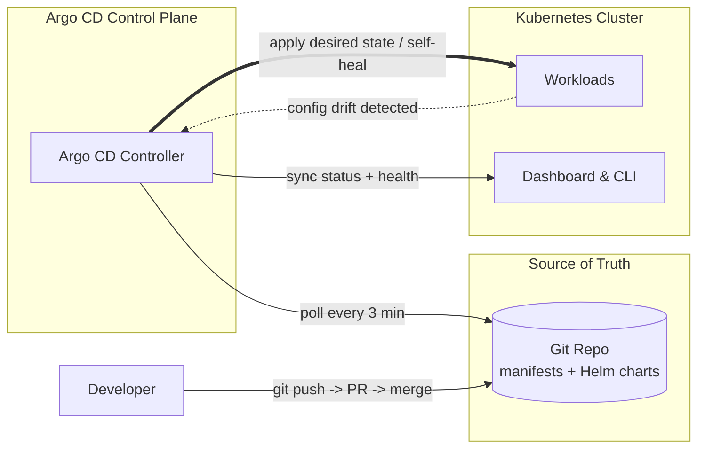

| Difficulty | Channel | Tags |
|---|---|---|
| beginner | devops | argocd, flux, declarative |

Back when Okta's Auth0 platform ran on customer VMs, every new customer meant another manual deployment, another late-night operator session, and another excuse to hope nothing drifted [1]. It worked for a handful of tenants — right up until demand surged and the handful became hundreds. So the team bet the platform on a cloud-native redesign built around the Argo project, where every customer environment became its own Kubernetes cluster, and Git became the single source of truth [1]. Five years later they manage over 1,000 clusters declaratively through Argo CD. This is the story of that journey — and the blueprint for why your next rollout deserves a git commit, not a lucky operator and a prayer.

---

> ### Real-World Case — Okta
>
> Okta's Auth0 platform originally ran customer infrastructure in VMs with manually-executed updates by operators - fine for a handful of customers but completely unscalable as demand surged. They bet on a cloud-native redesign built around the Argo project, where each customer environment became its own Kubernetes cluster.
>
> | | |
> |---|---|
> | **Challenge** | Scale a Kubernetes platform from ~12 to 1,000+ clusters while keeping Git as the single source of truth, where every customer gets a dedicated cluster and one release manifest must map to one Argo CD Application. |
> | **Solution** | Okta mapped one release manifest to one Argo CD Application representing an entire customer cluster. Crucially, they discovered stock auto-sync could not work: Terraform-generated infrastructure must run before the sync, and customers have their own deployment windows. So they built their own 'auto-sync' on top of Argo CD using Argo Workflows plus a control plane, while still using Argo CD's declarative reconciliation as the foundation. |
> | **Outcome** | Grew from roughly a dozen Kubernetes clusters to over 1,000, managed declaratively through Argo CD over roughly five years, with all service provisioning and infra orchestration flowing through Git-backed configuration. |
> | **Lesson** | Auto-sync and self-healing break down when the desired state has dependencies (like infra that must provision first) or time constraints (deployment windows) - teams may have to re-implement the GitOps loop themselves, but Git-as-source-of-truth still holds as long as the reconciler stays declarative. |

---

## Lessons Learned — scars, gotchas, and what to change by tomorrow

Okta scaled from a dozen clusters to over 1,000 not because they hired better operators, but because they engineered operators out of the loop [1]. Five years of Argo CD in production distills into a handful of scars worth learning without the bleeding.

• Enable auto-sync only when Git is the review gate. Pointer-clicking admins + self-heal + no PR process = reconciliation fighting humans to a draw. Git is only the source of truth if everything flows through Git.
• Be careful with prune. It is a scalpel and a chainsaw — set `prune: true` only after your manifests are canonical, or it will delete resources that exist solely in the cluster. Test in a scratch namespace first.
• The interval is a business decision, not a technical one. Shorter polls mean faster convergence but more API load; 3 minutes is the Goldilocks most teams land on [3]. Measure your sync churn before cranking it lower.
• App-of-apps is the upgrade path. As your fleet grows past a few dozen Applications, you declare the Applications themselves in Git and let Argo CD bootstrap Argo CD — recursion as the cure for sprawl.
• One repo, one environment, one team, one review culture. Okta's 1,000-cluster fleet only stays coherent because every change marched through the same merge pipeline [1].

🔥 Hot Take: if your team is still deploying via a confluence runbook of kubectl commands, you have not hit the wall yet — you are simply pre-paying for it. The migration cost rises with every drift-filled environment, and the cheapest moment to switch was the day you suspected drift; the second-cheapest is the next commit.

If this feels like a lot, you are in good company — most platform engineers describe the GitOps shift less as a rewrite than a slow, grateful exhale. The actionable version for tomorrow: take the Application manifest above, point it at a real repo, run the script, and watch a kubectl change get reverted on its own. The moment self-healing snaps your cluster back to Git without you lifting a finger is the moment the philosophy stops being abstract. That is the transformation to replicate — and it is shareable with your whole team in a single status ch�annel message: 'the repo is the source of truth now.'

## Conclusion

Okta's five-year arc — a dozen hand-managed clusters to 1,000+ declarative ones — is the single clearest proof that GitOps is not a fad but an operating model that pays for itself at exactly the moment you feared would break it: scale [1]. The journey from the 2:47 a.m. pager to a dashboard where 'deployed?' is a status column runs through one idea: make the repository the truth, and make the cluster a projection of it, never the reverse. So tomorrow, commit one manifest. Point one Application at it. Flip on self-healing. Because the memorable insight your team should steal today is this: you are not scaling the number of clusters you can operate by hand — you are scaling the number of clusters you can operate without hands at all.

---

## GitOps Reconciliation Loop

<strong>Original Interview Question</strong>

**Q:** You're setting up GitOps for a microservices deployment. How would you configure ArgoCD to automatically sync changes from your Git repository to Kubernetes, and what's the difference between declarative and imperative approaches in this context?

**A:** I'd configure ArgoCD by setting up a Git repository containing Kubernetes manifests or Helm charts, creating an Application CRD that points to the Git repository, enabling auto-sync with a health check interval of 3 minutes, and implementing self-healing to automatically revert any manual changes. The declarative approach involves defining the desired state in Git through YAML manifests, Helm charts, or Kustomize configurations, where ArgoCD continuously reconciles the actual state with the desired state. In contrast, the imperative approach uses kubectl commands to make direct changes to the cluster, bypassing the Git repository as the single source of truth.

## Conclusion

The moral of Okta's story is that scale does not have to mean chaos [1]. By making the Git repository the single source of truth and the cluster merely a projection of it, a team turned the scariest moment in infrastructure — a fleet growing past a hundred environments — into a routine that runs on pull requests and poll intervals. The path from the 2:47 a.m. pager to a dashboard where 'deployed?' is a status column is one idea long: declarative state, reconciled automatically, never trusted to memory. So do this tomorrow: commit a real manifest, point one Argo CD Application at it, and flip on self-healing. Watch an out-of-band kubectl change revert itself, and the philosophy stops being abstract. Share the insight with your team in one message: you are not scaling the clusters you can run by hand — you are scaling the clusters you can run without them.

---

## References

1. [Okta incident report](https://thenewstack.io/how-okta-scaled-from-12-to-1000-kubernetes-clusters-with-argo-cd/) — article
2. [Argo CD — Core Concepts](https://argo-cd.readthedocs.io/en/stable/core_concepts/) — documentation
3. [Argo CD — Automated Sync](https://argo-cd.readthedocs.io/en/stable/user-guide/auto_sync/) — documentation
4. [Kubernetes — Declarative Configuration](https://kubernetes.io/docs/tasks/manage-kubernetes-objects/declarative-config/) — documentation
5. [Helm — Documentation](https://helm.sh/docs/) — documentation
6. [Kustomize — GitHub](https://github.com/kubernetes-sigs/kustomize) — documentation
7. [Argo CD — GitHub](https://github.com/argoproj/argo-cd) — documentation
8. [Flux — Documentation](https://fluxcd.io/docs/) — documentation
9. [Kubernetes — GitHub](https://github.com/kubernetes/kubernetes) — documentation
10. [What is GitOps? — DigitalOcean Community](https://www.digitalocean.com/community/tutorials/what-is-gitops) — blog
11. [GitOps — Wikipedia](https://en.wikipedia.org/wiki/GitOps) — documentation
12. [kubectl Reference — Kubernetes](https://kubernetes.io/docs/reference/kubectl/) — documentation

---

**Author:** Satishkumar Dhule — [GitHub](https://github.com/satishkumar-dhule) · [LinkedIn](https://linkedin.com/in/satishkumar-dhule) · [Website](https://satishkumar-dhule.github.io)
