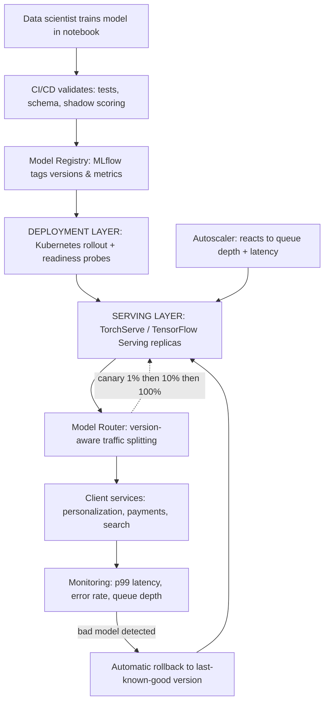

| Difficulty | Channel | Tags |
|---|---|---|
| beginner | devops | mlops, deployment |

Netflix serves more than a million ML prediction requests per second across hundreds of models — powering personalization, payments and fraud, search, and artwork selection — yet for years it had no clean way to route traffic to the right model version, run A/B experiments, or roll back a bad model without touching client service code [1]. Sound catastrophic? It almost is. This is the hidden fault line between model serving and model deployment, two concepts nearly every ML team conflates until something breaks in production. This article walks through where one ends and the other begins, and shows you how to build the layer that keeps a bad model from taking down a good product.

---

> ### Real-World Case — Netflix
>
> Netflix serves 1M+ ML prediction requests per second to ~250M members across hundreds of models (personalization, payments/fraud, search, artwork selection), yet had no clean way to route traffic to the right model version, run A/B experiments, or roll back a bad model without touching client service code. Off-the-shelf options like AWS API Gateway and standalone service mesh proxies weren't built for ML-aware routing.
>
> | | |
> |---|---|
> | **Challenge** | Clients (e.g., Homepage) shouldn't know which model version they're talking to, a single user can sit in 10 different A/B tests at once each requiring different model behavior, broke models must roll back in seconds not minutes, and the same serving infrastructure must be shared by hundreds of heterogeneous model types. |
> | **Solution** | Netflix's serving platform introduced an 'Objective' abstraction (e.g., ContinueWatchingRanking) as the contract between business use cases and concrete models, then built a custom routing layer called Switchboard. Researchers configure traffic splits and A/B rules via a JavaScript-based 'Switchboard Rules' config with an independent release cycle, enabling canary rollouts, model version pinning, and rollback decoupled from code deploys. When scaling exposed Switchboard as a hot-path bottleneck (10-20ms added serialization latency, single point of failure, tail-latency amplification), they refactored it into 'Lightbulb' — a lightweight metadata service for model selection with routing itself pushed into Envoy sidecars, removing the extra network hop while keeping the Objective abstraction and dynamic traffic rules. |
> | **Outcome** | The platform routes over 1 million requests per second to dozens of models (serving 30+ client services), enabling researchers to ship, split traffic, and roll back models without client coordination. The architectural evolution documented eliminating 10-20ms of added inference latency and the shared-failure risk introduced by the centralized router. |
> | **Lesson** | Model serving and model deployment are separate concerns that need different infrastructure: deployment is the CI/CD and lifecycle machinery (versioning, A/B traffic rules, rollback), while serving is the hot data-plane that must stay lean. Putting routing logic in the request path captures innovation velocity but pays for it in latency and blast radius — so mature platforms push routing decisions to the data plane (Envoy) and keep model/metadata selection in a lightweight control service. |

---

## Hook — What if one bad model really could take down your entire product?

The deploy looked fine. Then the metrics flatlined. Your team shipped a fresh version of the recommendation model on Friday afternoon, and by Monday morning the pager is going off — not because the model is slow, but because the traffic-splitting logic lives inside five different client services, and nobody can remember which one points at the broken version. Sound familiar? Many developers discover the hard way that getting a model into production is not the same thing as keeping it safe once it is there. The tools, the trade-offs, the failure modes — all of it splits into two very different jobs: model deployment and model serving. Getting them tangled together is how outages happen [1]. Here is the thing though: once you see the boundary clearly, the whole architecture snaps into focus.

## Problem — Two jobs wearing the same name

Teams say "we deployed the model" and mean everything from 'our CI/CD pipeline pushed a container to Kubernetes' to 'we exposed an inference endpoint.' But those are different disciplines with different failure modes. Deployment is the infrastructure job: CI/CD pipelines, container orchestration, infrastructure-as-code, environment promotion, monitoring dashboards, and rollback strategies — the world of Kubernetes, Docker, Terraform, MLflow, and SageMaker [2][3]. Serving is the runtime job: loading the model weights, answering inference requests with sub-100ms latency, routing requests to the right version, splitting traffic for A/B tests, and autoscaling under load — the world of FastAPI, gRPC, TorchServe, TensorFlow Serving, and BentoML [4][5][6]. You might think this distinction is academic. It is not. When model versioning and routing logic leak into client applications, every experiment requires a coordinated deploy across multiple teams. When serving ignores deployment, you get models that train beautifully and then silently rot in production. The stakes double when you consider cold start: a serving replica that has to load multi-gigabyte weights before it can answer a single request [4]. That latency is fine at 1 RPM and brutal at 1,000 QPS.

## Real-World Case — Netflix: 1M+ requests per second with no model-aware routing

Here is the war story that changed how engineers think about this split. Netflix operates over a million ML prediction requests per second to roughly 250 million members, with hundreds of models serving 30+ client services — personalization, payments and fraud, search, artwork selection. Yet at the core of that platform sat a missing piece: there was no clean way to route traffic to the right model version, run A/B experiments, or roll back a bad model without editing client service code [1]. The off-the-shelf options were a dead end. AWS API Gateway and standalone service-mesh proxies were simply not built for ML-aware routing — they route TCP and HTTP traffic, not experiments and model versions. So Netflix's platform team built its own model-routing layer that routes over 1M requests per second to dozens of models [1]. The payoff: researchers can now ship, split traffic, and roll back models independently, with no client coordination. But the journey had a plot twist — the centralized router introduced a single point of failure and 10–20ms of added inference latency, and the team had to engineer carefully around both [1]. If the streaming giant could accidentally create a shared-failure risk with a router, assume your smaller system can hit the same wall.

## Deep Dive — Latency vs throughput, batch vs real-time, and the cold start trap

At the heart of the serving-versus-deployment split are three trade-offs you will confront in every production ML system. First, latency versus throughput: real-time APIs usually promise sub-100ms responses for one request at a time, while batch pipelines aim for throughput over wall-clock time, happily churning for seconds or minutes on thousands of rows [6][7]. Second, horizontal versus vertical scaling: horizontal scaling means adding pod replicas behind a load balancer — clean, stateless, and the default on Kubernetes [2] — while vertical scaling means shoving more GPU memory and CPU into a single container, which is faster to reason about but hits hard ceilings. Many developers reach for more replicas and never notice that their GPU is 4% utilized. Third, the cold start trap: a freshly spawned serving replica must load weights into memory before it can serve its first request [4][5]. Autoscaling decisions that look correct — scale to zero to save money — become latency bombs when traffic spikes. Here is the key insight from the trade-off table below: every choice shifts cost from one place to another; the winning teams pick their constraints explicitly against an SLA, then instrument everything else.

## Workflow — From notebook to rollback in seven steps

Building on the Netflix story, the mature pattern looks less like a single deploy and more like a lifecycle with a control plane. The workflow is: (1) a data scientist trains a model and logs it to a model registry with version, metric, and tag metadata [3]; (2) CI/CD validates the artifact — runs unit tests, schema checks, and a shadow-scoring pass against live traffic; (3) the deployment layer rolls out the container to Kubernetes, watching readiness probes and Dashboards [2]; (4) the serving layer exposes the model behind a version-aware router that can split traffic; (5) traffic ramps through canary weights — 1%, then 10%, then 100% [9]; (6) an autoscaler reacts to queue depth and latency, not just CPU; and (7) monitoring feeds a rollback trigger that snaps routing back to the last-known-good version [1]. Notice what is absent: no client service knows anything about model versions. That is the whole point. The diagram below shows the full flow, from notebook to automatic rollback.

## Code Example — A version-aware model gateway that makes rollback boring

Since the real problems live at the routing layer, here is a minimal model gateway that mirrors the Netflix pattern: client services call one stable endpoint, and the router decides which model version answers — and when to bail. The payload is intentionally honest about its limits: no tracing, no auth, no batch — just the moving parts that matter.

## Lessons Learned — What Netflix's architecture teaches every team building ML systems

So what do you take back to your team tomorrow? First, deployment and serving are two jobs with two ownership models — if one person owns the pipeline but nobody owns the runtime, your rollback will be manual and slow. Second, keep model-version knowledge out of client code; the router is where the intelligence about canaries and rollbacks belongs, exactly as Netflix did with its million-RPS layer [1]. Third, measure the right things: track p50/p99 latency, error rate, queue depth, and prediction drift alongside model metrics — and set rollback thresholds before the incident, not during it. Fourth, plan for cold starts: prewarm replicas, keep a hot standby, and never scale to zero for latency-critical paths [4][5]. Fifth, accept that the centralized router you build for control is a new single point of failure — run it as a replicated, horizontally scaled service and budget for its added latency [1]. And remember the deeper truth: the goal is not a perfectly trained model, it is a system that lets you ship experiments continuously while containing the blast radius when one of them misfires.

---

## Model Lifecycle: From Notebook to Automatic Rollback

<strong>Original Interview Question</strong>

**Q:** Explain the key differences between model serving and model deployment in ML systems, including specific technologies, scaling considerations, and real-world implementation patterns?

**A:** Deployment encompasses CI/CD pipelines, infrastructure setup, and monitoring using tools like Kubernetes, MLflow, and SageMaker. Serving focuses on runtime inference APIs with frameworks like TensorFlow Serving, TorchServe, or BentoML, handling request routing, model versioning, and autoscaling. Key trade-offs include latency vs throughput, batch vs real-time inference, and cold start optimization.

## Conclusion

The next time your team argues about 'deploying the model,' pause and ask which half of the job they mean. Deployment gets the artifact safely into the cluster — CI/CD, Kubernetes, MLflow, monitoring [2][3]. Serving keeps it useful under real traffic — version-aware routing, canary splits, autoscaling, and honest latency budgets [4][5][6]. Netflix systemized that boundary with a router that handles a million requests per second, and the lesson transfers all the way down to your first production model with two replicas: keep model knowledge out of client code, instrument before you need to, and make rollback a boring, automated action rather than a 2am code change. Do that, and the next bad model your research team ships becomes a 10-minute experiment — not an outage.

---

## References

1. [Netflix incident report](https://netflixtechblog.com/state-of-routing-in-model-serving-16e22fe18741) — article
2. [Kubernetes Documentation](https://kubernetes.io/docs/home/) — documentation
3. [MLflow Documentation](https://mlflow.org/docs/latest/index.html) — documentation
4. [TorchServe Documentation](https://pytorch.org/serve/) — documentation
5. [TensorFlow Serving Guide](https://www.tensorflow.org/tfx/guide/serving) — documentation
6. [gRPC Documentation](https://grpc.io/docs/) — documentation
7. [Amazon SageMaker Documentation](https://docs.aws.amazon.com/sagemaker/) — documentation
8. [FastAPI Documentation](https://fastapi.tiangolo.com/) — documentation
9. [A/B Testing (Wikipedia)](https://en.wikipedia.org/wiki/A/B_testing) — documentation

---

**Author:** Satishkumar Dhule — [GitHub](https://github.com/satishkumar-dhule) · [LinkedIn](https://linkedin.com/in/satishkumar-dhule) · [Website](https://satishkumar-dhule.github.io)
