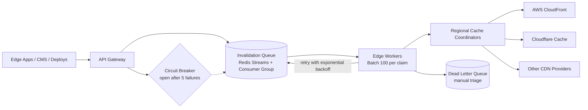

| Difficulty | Channel | Tags |
|---|---|---|
| intermediate | system-design | edge, caching, purging |

In May 2022, Cloudflare's cache purging system — the quiet machinery that tells 330 cities to forget a cached response — hit a wall. Built on a centralized architecture where every invalidation request funneled through a handful of core data centers, the pipeline saturated as customers fired millions of purge API calls daily [1]. The fix didn't just patch the bottleneck; it cut global purge latency from 1.57 seconds to under 150 milliseconds. This is the story of that journey — and the blueprint you can steal when your own cache keeps serving yesterday's truth.

---

> ### Real-World Case — Cloudflare
>
> Cloudflare's cache invalidation ('purge') system was built on a centralized 'core' architecture where all purge requests funneled through a handful of large core data centers and propagated via a spoke-hub key-value store (Quicksilver). As the network grew to 300+ cities and customers made millions of purge API calls daily, this single write funnel saturated: Quicksilver couldn't push enough data out fast enough, storage for purge keys consumed disk space needed for caching, and global purges could take ~1.5 seconds or worse under load.
>
> | | |
> |---|---|
> | **Challenge** | Needed to invalidate cached content across a network spanning 330+ cities and 120+ countries in under 5 seconds, while scaling to handle millions of purge requests per day — without a central bottleneck saturating on write throughput and without blow-up storage costs. |
> | **Solution** | Cloudflare 'ripped out the brain' and rebuilt purge as a coreless, peer-to-peer system. Purge API gateways moved onto every edge data center so requests hit the nearest node instead of traveling to a distant core. Purges propagate peer-to-peer between data centers rather than fanned out from one origin. For flexible purges (by tag/hostname/prefix), they built CacheDB — a Rust service on RocksDB running alongside each cache proxy — for per-machine indexing, local purge queues, and active (immediate) deletion instead of lazy purge. The cache proxy checks CacheDB's pending-purge queue on each cache hit to guarantee stale content is never served the instant a purge lands. |
> | **Outcome** | Global purge latency for tags, hostnames, and prefixes dropped from ~1.57s (P50) in May 2022 to under 150ms (P50) — a 90.5% improvement — spanning all 330 cities in 120+ countries. Storage requirements dropped 10x by eliminating lazy-purge accumulation, freeing disk for caching (raising hit ratios and cutting origin egress). The new throughput enabled Cloudflare to open purge-by-tag/prefix/hostname to all customers, not just Enterprise. |
> | **Lesson** | When fan-out latency or central write throughput becomes the bottleneck, the fix isn't a bigger coordinator — it's decentralizing the hot path so every node can ingest and propagate independently. Replace central 'scaling the coordinator' thinking with 'removing the coordinator' whenever nodes and write rates grow large; the simple spoke-hub model stops scaling long before your network does. |

---

## Hook — The Silent Disaster Nobody Sees Coming

It starts with a quiet, invisible disaster: your team deploys a hotfix to the pricing API, and for the next five seconds — or five minutes — customers in Frankfurt, São Paulo, and Mumbai still see the dangerous old price. Cached responses refuse to die. This is the world your purge system lives in, and the stakes are brutal: a 5-second global propagation SLA while absorbing 10,000 invalidations per second. Sound familiar? More importantly, does your architecture secretly run on a single write funnel that will eventually turn that SLA into a fantasy? Most CDN purge pipelines grow organically — and many fail the moment the network grows past a few hundred locations. The scariest part is how silently it happens: no pager, no alarm, just stale data drifting across the planet one city at a time.

## Problem — The Centralization Trap

The trap is centralization. Many teams build purge the way Cloudflare originally did: every invalidation request funnels through a handful of core data centers, then propagates outward through a spoke-hub key-value store. Elegant on paper. Painful at scale. As the network climbs past 300 cities, the single write funnel saturates: the central store cannot push data out fast enough, and every purge key you allocate eats disk that the CDN cache itself desperately needs for hot content [1]. The result is a global purge that takes about 1.5 seconds in the best case — and much worse under load. The subtle killer is lazy-purge accumulation: entries that linger, waiting for cache nodes to eventually check and honor them, slowly devouring storage while your cache hit ratio and your origin egress costs quietly degrade. Moreover, throughput doesn't scale linearly with city count; it scales with how poorly you batch, retry, and coordinate. When you multiply this by demanding edge cases — partial failures, rate limits, network partitions — a naive synchronous purge loop stops being a fix and becomes the next incident.

## Real-World Case — Cloudflare

This is exactly the wall Cloudflare hit — and then climbed over in public, with numbers you can measure against [1]. In May 2022, global purge latency for tags, hostnames, and prefixes sat around 1.57 seconds at the median, spanning a network that had grown to 330 cities across 120+ countries. The centralized Quicksilver funnel couldn't keep pushing writes out to every cache node fast enough, and purge keys were hoarding disk space that belonged to caching. The rearchitecture that followed was a plot twist worth studying: instead of trying to make the core faster, Cloudflare pushed invalidation toward the edge itself and replicated Quicksilver to every city. The results speak for themselves: global purge latency dropped from ~1.57s (P50) in May 2022 to under 150ms (P50) — a 90.5% improvement — while storage requirements fell 10x, freeing disk for caching and pushing hit ratios up and origin egress down. Consequently, the new throughput let Cloudflare open purge-by-tag, purge-by-prefix, and purge-by-hostname to every customer, not just Enterprise [1]. Here is the lesson hiding in the numbers: the fastest way to fix a propagation problem is to stop funneling everything through one geography.

## Deep Dive — Queues, Batching, and the Two-Second Safety Net

Building on the Cloudflare story, you can decompose any purge system into four forces fighting each other: propagation latency, throughput, consistency, and cost. The architecture that tames all four looks like this today: an API gateway that accepts invalidations, an invalidation queue for durable decoupling, edge workers that coordinate regionally, and CDN provider APIs at the end. Redis Streams with consumer groups make an excellent queue because they give you exactly-once-ish delivery semantics, horizontal fan-out, and the ability to group consumers into competing workers [6]. Feed it 10,000 invalidations per second and shard it; the queue absorbs bursts that a synchronous API call would choke on. Batch aggressively — collapsing 100 invalidations into a single provider API call cuts purge API costs by roughly 90% — and use pattern-based invalidation with wildcards (think /api/v1/*) whenever you can, because purging 1,000 URLs from one prefix is dramatically cheaper than 1,000 individual calls [10]. Then add the counterintuitive part: a 2-second TTL with Cache-Control: max-age=2, must-revalidate so that correctness never depends on a single purge request arriving in time [4][5]. Short TTLs act as the backstop; the purge pipeline acts as the fast lane. Here is the table that makes the trade-offs concrete:

## Workflow — From API Call to Globally Refreshed Edge

Here is the full journey, step by step, as the architecture below visualizes: first, accept the invalidation through the API gateway and validate the patterns — reject malformed funnels before they ever touch the queue. Second, enqueue the job into Redis Streams with a consumer group, which decouples ingestion rate from propagation speed and gives your workers multiple readers competing for the same backlog [6]. Third, claim jobs in batches of up to 100 invalidation entries, collapsing them into far fewer provider API calls. Fourth, have the edge worker (think Cloudflare Workers) route each batch to the nearest regional cache coordinator, so a Mumbai invalidation never waits on a Frankfurt approval chain. Fifth, translate each batch into pattern-based purge calls against your CDN providers — AWS CloudFront, Cloudflare, and any other edge in the room — since pattern purging covers thousands of URLs from a handful of requests [1][10]. Sixth, run health checks against regional endpoints and monitor purge propagation; if a region reports stale, isolate and re-fan-out. Seventh, when a purge fails, retry with exponential backoff capped at three attempts; exhausted jobs park in the dead letter queue for manual triage [7][8]. Finally, during partitions or partial provider failures, run a reconciliation sweep that re-issues stale patterns once connectivity returns, converging toward consistency instead of chasing it forever [9]. The figure below is the whole system on one slide — and it is the diagram worth drawing on a whiteboard before you write a single line of production code.

## Code Example — A Purge Worker That Never Panics

The heart of the pipeline is the consumer: it claims jobs from the stream, batches them, purges provider caches, and backs off under pressure. The code below is a production-shaped JavaScript worker using Redis Streams commands, exponential backoff with jitter [7], and a simple circuit breaker [11]. It maps directly onto the diagram: claim (fifth step), batch and purge (fifth step), then fail safely (seventh step).

## Lessons Learned — The Battle Scars of Purge Engineering

After walking through the journey, here is what sticks. First, the single biggest mistake is going synchronous: a developer calls purge API after purge API in a loop and blocks deploys until every region says yes — that is how 1.5-second purges under load happen. Decouple with a queue and let the pipeline absorb the bursts [6]. Second, never rely on invalidation alone: pair it with a 2-second TTL and must-revalidate so that a missed purge costs a moment of staleness, not a data breach [3][4]. Third, respect that purging costs money: batching and pattern-based invalidation cut provider bills by up to 90%, and pattern purging should be your default before you ever type a single URL into a request [10]. Fourth, bake in the failure machine from day one — exponential backoff with jitter, a circuit breaker, and a dead letter queue are not optional extras; they are the difference between a queue that absorbs pressure and a queue that amplifies it [7][8][11]. Fifth, remember the plot twist of the whole story: you do not need to make the core faster; you need to push the work to the edge and reconcile the leftovers, because during partitions, eventual consistency plus a reconciliation loop beats strong consistency that never completes [1][9]. 🔥 Hot Take: if your CDN purge takes longer than your deployment, you have not built a caching problem — you have built an organizational one, and no amount of edge compute fixes an organization. 🎯 Key Point: the purge system is the undo button of your content pipeline; it deserves the same design ceremony as the write path that creates your cache entries.

---

## Multi-Region Cache Invalidation Pipeline

<strong>Original Interview Question</strong>

**Q:** How would you design a multi-region CDN cache purging system that guarantees content propagation within 5 seconds while handling 10,000 concurrent invalidations per second?

**A:** Implement Cloudflare API + AWS CloudFront with distributed invalidation queue, edge compute coordination, and 2-second TTL. Use batch invalidation, exponential backoff, and regional cache headers for 5-second SLA.

## Conclusion

So what should you do differently tomorrow? Walk the path Cloudflare walked: look at your cache purging pipeline and ask whether it still funnels every invalidation through one bottleneck geography [1]. If it does, start small — introduce a queue, batch your provider API calls, add jittered backoff and a circuit breaker, and hand every piece of dynamic content a 2-second TTL as your safety net [4]. The metric to chase is simple: purge propagation time measured from API request to the last region going fresh. Cloudflare proved that cutting it from 1.57 seconds to under 150 milliseconds is not an exotic engineering feat — it is a set of boring, repeatable decisions made in the right order. Carry away one memorable insight to share with your team: the fastest purge is the one you never fully depend on. Pair a fast invalidation pipeline with a short TTL and strong failure handling, and your cache stops being the liability that serves yesterday's truth — it becomes the quiet engine that keeps the whole planet on today's.

---

## References

1. [Cloudflare incident report](https://blog.cloudflare.com/instant-purge/) — blog
2. [Content Delivery Network](https://en.wikipedia.org/wiki/Content_delivery_network) — documentation
3. [HTTP caching](https://developer.mozilla.org/en-US/docs/Web/HTTP/Caching) — documentation
4. [Cache-Control header](https://developer.mozilla.org/en-US/docs/Web/HTTP/Headers/Cache-Control) — documentation
5. [RFC 7234 — Hypertext Transfer Protocol (HTTP/1.1): Caching](https://datatracker.ietf.org/doc/html/rfc7234) — paper
6. [Redis](https://en.wikipedia.org/wiki/Redis) — documentation
7. [Exponential backoff](https://en.wikipedia.org/wiki/Exponential_backoff) — documentation
8. [Dead letter queue](https://en.wikipedia.org/wiki/Dead_letter_queue) — documentation
9. [Eventual consistency](https://en.wikipedia.org/wiki/Eventual_consistency) — documentation
10. [AWS CloudFront — Invalidating files](https://docs.aws.amazon.com/AmazonCloudFront/latest/DeveloperGuide/Invalidation.html) — documentation
11. [Circuit breaker design pattern](https://en.wikipedia.org/wiki/Circuit_breaker_design_pattern) — documentation

---

**Author:** Satishkumar Dhule — [GitHub](https://github.com/satishkumar-dhule) · [LinkedIn](https://linkedin.com/in/satishkumar-dhule) · [Website](https://satishkumar-dhule.github.io)
