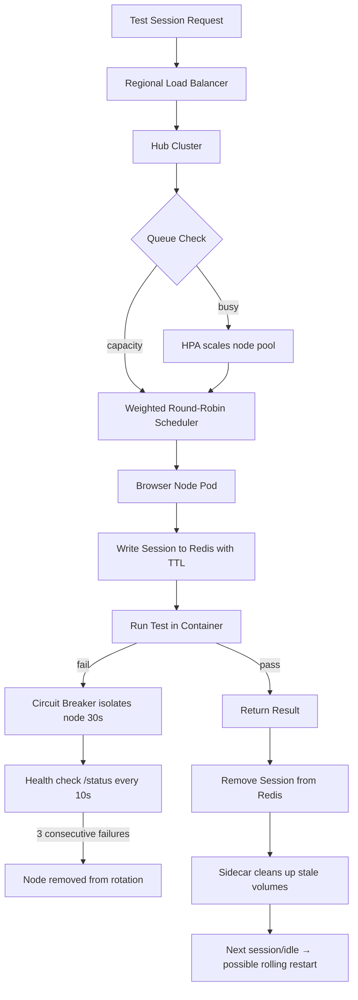

| Difficulty | Channel | Tags |
|---|---|---|
| advanced | system-design | selenium, webdriver, grid |

Every engineer who has ever managed a Selenium Grid knows the ritual: a node drifts out of sync, a browser dies silently, memory creeps upward until the whole cluster groans. Europe's largest online fashion platform, Zalando, lived this struggle across two parallel test infrastructures — until they threw the old rules away and built something elastic [1]. This is the story of how you can design a grid that survives 10,000 concurrent sessions, keeps 99.9% uptime, and never leaks a byte — and it starts with a moment every developer fears.

---

> ### Real-World Case — Zalando
>
> Zalando (Europe's largest online fashion platform) ran UI tests across two parallel infrastructures: a dockerized Selenium Grid for Chrome/Firefox and Sauce Labs for everything else. Their long-lived grid nodes drifted out of sync with browser/WebDriver versions, accumulated memory leaks and leftover state, and had to be manually restarted node-by-node — a maintenance burden that grew with every new team adopting the grid.
>
> | | |
> |---|---|
> | **Challenge** | Maintaining a stable Selenium Grid where every browser node, JVM, and driver version stayed synchronized while hundreds of engineering teams ran parallel UI tests. Long-running nodes leaked memory and carried contaminated state across sessions, and scaling capacity up or down required manual, error-prone operations. |
> | **Solution** | They built and open-sourced Zalenium, a Selenium Grid extension that makes nodes 'disposable': each test run spins up a fresh docker-selenium browser container on demand and disposes of it the moment the test finishes. Nodes are created from scratch per session (guaranteeing clean browser state and zero memory-leak accumulation), the grid scales horizontally to demand in seconds, and requests for browsers it can't serve (Safari/IE/Edge) are automatically redirected to Sauce Labs — effectively a cheap internal grid with cloud overflow. |
> | **Outcome** | Zalando teams got an elastic grid they could run Firefox/Chrome tests on in their own network with per-test video recording, live preview, and a dashboard, while cloud providers handled only the browsers the local grid couldn't. Zalenium was open-sourced, presented at SeleniumConf (Austin 2017), and became one of the community's most widely adopted Selenium Grid distributions used well beyond Zalando itself. |
> | **Lesson** | You don't need to fix memory leaks in long-lived browser nodes — you can design them out of existence. Making grid nodes ephemeral (spawn-per-session, dispose-after-test) eliminates leak accumulation, cross-test contamination, and version drift at the source, trading a small container-startup cost for dramatically simpler, more reliable scaling. |

---

## Hook — The 3 AM ritual no one wants to repeat

Strip the monitoring dashboard back to a single chart and ask the crowd: 'What's your memory usage look like at hour 40?' Watch the silence. Then watch the hands go up. Every one of them belongs to someone who has manually restarted a Selenium node at 3 AM while a release train idled behind them. The stakes are visceral: 10,000 concurrent test sessions, a 99.9% uptime promise, and a fleet of browser nodes that quietly leak memory until they topple. Staring at 10,000 sessions, most engineers reach for more hardware. The real enemy isn't capacity — it's entropy. Remember that, because it becomes the whole game.

## Problem — The grid that grows teeth over time

Here is the thing nobody warns you about: a Selenium Grid doesn't fail catastrophically. It degrades. A Chrome driver silently drifts out of sync with its browser [2]. A WebDriver session finishes but its sockets hang open, keeping the JVM alive longer than it should. A node accumulates leftover state until it eats 80% of its 2GB allotment and starts refusing new sessions. The classic hub-and-spoke pattern — one hub, many nodes that live forever — turns every long-lived node into a ticking time bomb [3]. The math compounds quickly: 10,000 concurrent sessions at roughly 50 sessions per node means you need 200 nodes. Run those nodes as permanent, hand-managed VMs and you've signed up for weekly triage. You might think the answer is just bigger machines or more RAM. Actually, the answer is far stranger: make the nodes disposable.

## Deep Dive — Statelessness, self-healing, and the art of throwing nodes away

Building on Zalando's insight, the modern remedy is a Kubernetes-backed grid where nodes are cattle, not pets [4]. A hub (or a set of hubs) routes sessions to browser nodes governed by StatefulSets spread across multiple availability zones. Sessions never trust local state — every session's identity and TTL live in a Redis cluster with expiration policies, so a node that dies mid-session can be replaced without losing the session's metadata [5]. Memory is controlled at the source: each pod gets tight CPU and memory limits (about 2GB RAM and 1 CPU per node), and the horizontal pod autoscaler scales based on queue depth rather than guessing [6]. The numbers speak for themselves: 200 nodes × 2GB = 400GB baseline, plus 30% headroom for spikes, landing at roughly 520GB of cluster memory. Load is handled by weighted round-robin, biased by node capacity and response time, and every node exposes a /status endpoint checked every 10 seconds. Three consecutive failures and the node is yanked immediately [7]. Add a circuit breaker — the Hystrix pattern — and a failing node is isolated for a 30-second recovery window so its misery doesn't cascade. Spot the pattern: at every level, the system assumes nodes will fail. It plans for the failure, not around it. But even this architecture can't dodge every edge case, and that's where the real courage begins.

## Workflow — The self-healing lifecycle, step by step

However impressive the pieces are individually, the magic is in the orchestration. The Workflow diagram below traces the journey of a single session from request to teardown — a loop designed to be resilient by construction. Each step either succeeds fast or fails into a recovery path, never accumulating garbage.

## Lessons Learned — What actually keeps 99.9% uptime real

So what should you do differently tomorrow? First, refuse to keep long-lived nodes. Every permanent node is a promise you can't keep. Second, treat memory like a budget, not a hope: hard pod limits, weekly rolling restarts, and alerting at 80% usage catch leaks before users do [8]. Third, plan for split-brain during network partitions with leader election, and protect capacity with Pod Disruption Budgets that guarantee at least 85% of nodes stay up during maintenance [6]. Fourth, ship node versions through canary deployments with traffic splitting — a bad release should never take down the fleet wholesale. The distrust-driven design Zalando pioneered isn't pessimism; it's the cheapest insurance you'll ever buy. The single insight worth sharing with your team: reliability doesn't come from making nodes live longer — it comes from making them disposable and letting automation do the rest.

---

## Self-Healing Selenium Grid Session Lifecycle

<strong>Original Interview Question</strong>

**Q:** Design a scalable Selenium Grid architecture to handle 10,000 concurrent test sessions with 99.9% uptime, ensuring zero memory leaks through automatic session lifecycle management, real-time monitoring, and graceful node failure recovery across multiple data centers?

**A:** Deploy Kubernetes cluster with auto-scaling node pools, Redis session store with TTL policies, Prometheus metrics for memory monitoring, circuit breakers for node isolation, and sidecar containers for session cleanup. Implement health checks, resource quotas, and rolling updates.

## Conclusion

The moral of Zalando's story is disarmingly simple: reliability in a 10,000-session grid is not about keeping every node alive forever — it's about making every node affordable to kill and designing automation that fills the gap. Tonight, before you buy another server, put your grid through a different exercise: force-restart every node and ask whether your pipeline recovers on its own. Give your sessions a hard TTL, hand your memory budget to the orchestrator, and let a canary catch your bad releases instead of your users. The payoff is a grid you stop thinking about — and that's the rarest luxury in test infrastructure. Leave your team with this one line: trust the system to forget, and it will always remember what matters.

---

## References

1. [Zalando incident report](https://engineering.zalando.com/posts/2017/02/zalenium-a-disposable-and-flexible-selenium-grid-infrastructure.html) — article
2. [MDN Web Docs: WebDriver](https://developer.mozilla.org/en-US/docs/Web/WebDriver) — documentation
3. [Selenium Grid documentation](https://www.selenium.dev/documentation/grid/) — documentation
4. [Kubernetes: StatefulSets](https://kubernetes.io/docs/concepts/workloads/controllers/statefulset/) — documentation
5. [Redis: Expire — key expiration with TTL](https://redis.io/commands/expire/) — documentation
6. [Kubernetes: Horizontal Pod Autoscaling](https://kubernetes.io/docs/tasks/run-application/horizontal-pod-autoscale/) — documentation
7. [Kubernetes: Probes — health checks for pods](https://kubernetes.io/docs/concepts/workloads/pods/pod-lifecycle/) — documentation
8. [DigitalOcean: Understanding Updates and Rollbacks on Kubernetes](https://www.digitalocean.com/community/tutorials/understanding-updates-and-rollbacks-on-kubernetes) — tutorial

---

**Author:** Satishkumar Dhule — [GitHub](https://github.com/satishkumar-dhule) · [LinkedIn](https://linkedin.com/in/satishkumar-dhule) · [Website](https://satishkumar-dhule.github.io)
