| Difficulty | Channel | Tags |
|---|---|---|
| beginner | backend | redis, memcached, cache-invalidation |

Facebook runs the world's largest memcached deployment — trillions of cached items served across thousands of servers to over a billion users. But here is the plot twist: their naive invalidation approach nearly broke them. When they deleted a hot key and let the next read repopulate it, concurrent readers kept writing stale data back into cache, and popular keys triggered 'thundering herds' that crashed straight into the database [1]. The lease mechanism alone slashed peak database query rate from 17,000 to just 1,300 queries per second — a ~92% reduction. This is the story of that battle, and why your little user-profile cache is fighting the same dragons your profile service will, if you are lucky enough to grow.

---

> ### Real-World Case — Facebook (Meta)
>
> Facebook needed to cache trillions of items across thousands of memcached servers to serve billions of requests per second for over a billion users. But their naive cache invalidation approach — delete the key, let the next read repopulate it — had catastrophic side effects at scale: concurrent readers would set stale data back into the cache, and popular keys under heavy read/write churn triggered cache-miss 'thundering herds' that hammered the database.
>
> | | |
> |---|---|
> | **Challenge** | How to keep a distributed memcached cache consistent with the backing MySQL databases when every profile/content update must invalidate cached keys across many frontend clusters — without reintroducing stale reads or flooding the database on the resulting cache miss. |
> | **Solution** | They made invalidation a first-class pipeline: a daemon called mcsqueal tails each database's commit log and broadcasts batched deletes (delete, not set, since it's idempotent) to all frontend clusters via mcrouter. To fix the race conditions that deletes exposed, they invented 'leases' — a 64-bit token issued on a cache miss that memcached can verify on the set, invalidating it if a delete happened in between, and throttled to one lease per key per ~10 seconds to collapse thundering herds. They also used remote markers and cold-cluster warmup for cross-region consistency and failover. |
> | **Outcome** | The lease mechanism alone cut peak database query rate from 17,000 queries/second to 1,300 queries/second (~92% reduction). The resulting system — the world's largest memcached installation — served over a billion requests per second and held trillions of items, becoming the blueprint for cache-aside + delete-based invalidation that nearly every large-scale web service now copies. |
> | **Lesson** | In a distributed cache, invalidation is not just 'delete the key.' Delete-then-repopulate races and thundering herds are real failure modes that silently cascade into the database; you need explicit coordination (leases, commit-log-driven invalidation) because both naive delete and naive write-through will corrupt consistency or melt your storage tier at scale. |

---

## Hook — The request that should have hit the cache, but didn't

Picture this: your profile service is humming along, serving millions of reads per second from a cache. Then one user updates their profile photo. Nothing special — a single UPDATE statement. But that one write sets off a chain reaction: the cache key gets deleted, a thousand concurrent readers miss, and suddenly your pristine database is drowning in a thundering herd of identical SELECT queries. Sound familiar? Developers have all been there — staring at latency charts at 2am wondering why one write caused a database meltdown. The stakes are real: cache invalidation is the silent killer of backend performance, and the difference between a good system and a great one often comes down to how you handle a single deleted key.

## Problem — The stale-data trap hiding in your delete-then-refetch pattern

The default approach seems harmless: delete the key, let the next read repopulate the cache. It is the 'cache-aside' pattern every tutorial teaches. However, at scale, this innocent strategy has two catastrophic failure modes. First is the race condition: two concurrent readers miss the cache, both hit the database, and one of them writes stale data back into cache because it compared against an old version. The second is the thundering herd: a popular key under heavy read/write churn gets invalidated, and every waiting request stampedes the database at once. Moreover, the problem compounds across a distributed system — when your cache is spread across thousands of nodes, how does every node know a key is stale? This is the hidden cost of cache invalidation, and most developers discover it the hard way, usually at 2am with a screaming pager.

## Real-World Case — Facebook (Meta)

Facebook's engineers hit exactly this wall. Their memcached cluster — the largest on the planet — served over a billion requests per second with trillions of cached items, but their naive delete-and-repopulate invalidation had catastrophic side effects [1]. Concurrent readers would race the delete and write stale values back. Popular keys under heavy churn triggered thundering herds that hammered the database. The fix was a lease mechanism: instead of blindly deleting, the system issued a 'lease token' that only the most recent requester could use to repopulate the cache. Concurrent stale writers were simply rejected. The impact was staggering — the lease cut peak database query rate from 17,000 queries/second to 1,300 queries/second, a roughly 92% reduction [1]. That single mechanism turned chaos into a blueprint that nearly every large-scale web service now copies. Consequently, when you implement write-through caching with a simple delete, you are standing on shoulders of a system that already learned this lesson the expensive way.

## Deep Dive — Redis vs Memcached, and the trade-offs that matter

Building on that war story, the real design decision is which cache to use for your profile service — and how invalidation differs between them. Write-through caching is the foundation: on update, you write to both the database and the cache, keeping them consistent. The key trade-off is between Redis and Memcached. Redis offers pub/sub for automatic distributed invalidation — when one node updates a profile, it publishes an event and every node invalidates its copy. This makes Redis excellent for complex invalidation patterns and durability, since it supports persistence and advanced data structures [3]. Memcached, by contrast, is simpler and faster for pure caching — lower memory overhead and simpler horizontal scaling — but it has no persistence and requires manual coordination across nodes [2]. Here is the real trade-off in plain terms: use Memcached when you simply need blazing-fast reads with a manageable cache size; reach for Redis when you need pub/sub, cross-node invalidation, or durability. Many developers think Redis is always better because it has more features. You might think that, but actually Memcached wins on pure memory efficiency and operational simplicity for the common single-node expiry case.

## Workflow — From profile update to consistent cache, step by step

So how do you wire this together in practice? The workflow follows a clear pipeline. Step one: a user updates their profile, and the write goes to the database. Step two: instead of just updating in place, you delete the cache key and write the fresh data to Redis simultaneously. Step three: if another node holds a stale copy, Redis pub/sub broadcasts an invalidation event so every node drops its local copy. Step four: subsequent reads miss the cache, repopulate from the database using a lease-style check to avoid stale races, and set a TTL (5-30 minutes for profiles) so nothing lingers forever. Step five: you monitor cache hit rates and query latency to tune the TTL and spot staleness. This is the workflow the accompanying diagram visualizes — the lifecycle of a profile from write to consistent read.

## Code Example — Write-through invalidation with Redis pub/sub

Here is where it gets concrete. The code below shows a write-through pattern with TTL-based expiration and a lease-style guard for repopulation. It solves the core problem: preventing stale writes under concurrent reads while keeping the cache fresh.

## Lessons Learned — Battle scars and the blueprint for your next design

Stepping back, there are hard-won lessons worth taking to your next design review. First, delete-then-refetch is a trap at scale — always pair deletion with a lease or version check so stale concurrent writes can't sneak back in [1]. Second, set a TTL on everything; without one, a forgotten key becomes permanent stale data that silently serves the wrong profile. Third, measure your cache hit rate and treat anything below ~95% for hot data as a signal, not a coincidence. Fourth, when you must choose between Redis and Memcached, let your invalidation complexity drive the decision, not feature envy. Finally, remember the plot twist from Facebook: the simplest-looking deletion strategy produced the worst catastrophe. The insight you can share with your team over coffee: cache consistency is a distributed-systems problem wearing a caching disguise, and the lease is worth its weight in gold.

---

## Write-Through Cache Invalidation Flow

```mermaid
flowchart LR
    A[User updates profile] --> B[Write to Database]
    B --> C[Delete cache key]
    C --> D[Write fresh data to Redis]
    D --> E[Broadcast invalidation via pub/sub]
    E --> F[All nodes drop stale copy]
    F --> G[Read request arrives]
    G --> H{Key in cache?}
    H -- Yes --> I[Serve from cache]
    H -- No --> J[Fetch from DB with lease guard]
    J --> K[Check lease/version]
    K --> L[Write back with TTL 5-30min]
    L --> I
    I --> M[Monitor hit rate & latency]
```

<strong>Original Interview Question</strong>

**Q:** You're building a user profile service that caches frequently accessed profiles. How would you implement cache invalidation when a user updates their profile, and what trade-offs would you consider between Redis and Memcached?

**A:** Implement write-through caching with TTL-based expiration. On profile update, invalidate the cache by deleting the key and writing new data to both the database and cache. Redis offers pub/sub for automatic distributed invalidation, while Memcached requires manual coordination across nodes.

## Conclusion

Cache invalidation looks like a footnote in system design, but as Facebook learned, it is the entire story. The fix for your profile service is not more hardware — it is discipline: write-through semantics, TTLs on everything, lease guards against stale races, and the right tool for the complexity you actually have. Tomorrow, audit your cache invalidation: do you delete-then-refetch naively? Do you have a race where stale data can re-enter? Is every key expiring? If you only take one thing, remember the lease — a tiny token that turned 17,000 queries per second into 1,300, and the reason the biggest services on the internet still sleep at night.

---

## References

1. [Facebook (Meta) incident report](https://research.facebook.com/publications/scaling-memcache-at-facebook/) — article
2. [Memcached](https://en.wikipedia.org/wiki/Memcached) — article
3. [Redis](https://en.wikipedia.org/wiki/Redis) — article
4. [An introduction to Redis data types and abstractions](https://docs.redis.com/latest/rs/references/data-types/) — documentation
5. [Cache invalidation](https://en.wikipedia.org/wiki/Cache_invalidation) — article
6. [HTTP caching](https://developer.mozilla.org/en-US/docs/Web/HTTP/Caching) — documentation
7. [Redis Pub/Sub](https://redis.io/docs/latest/develop/interact/pubsub/) — documentation
8. [AWS ElastiCache for Redis](https://docs.aws.amazon.com/AmazonElastiCache/latest/red-ug/WhatIs.html) — documentation

---

**Author:** Satishkumar Dhule — [GitHub](https://github.com/satishkumar-dhule) · [LinkedIn](https://linkedin.com/in/satishkumar-dhule) · [Website](https://satishkumar-dhule.github.io)
