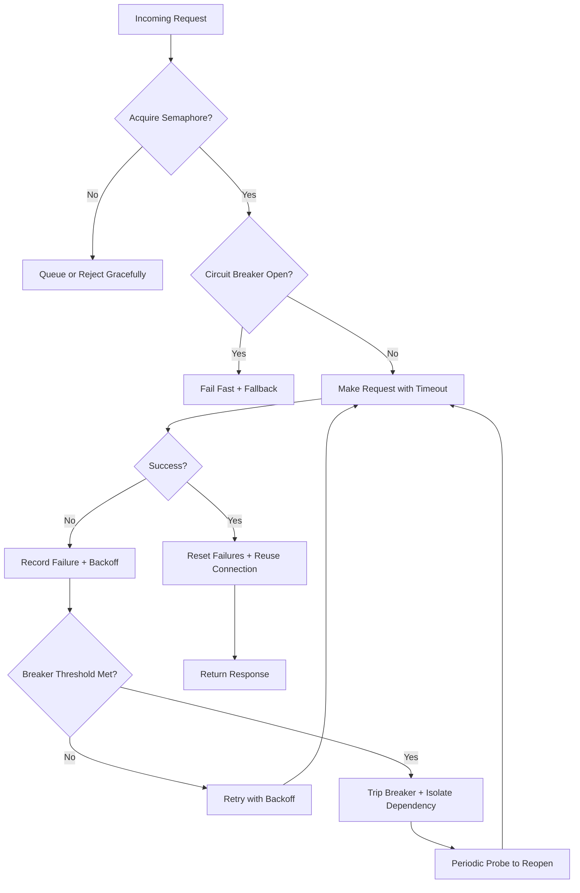

| Difficulty | Channel | Tags |
|---|---|---|
| advanced | backend | asyncio, aiohttp, concurrency |

Ever wondered why your async API suddenly grinds to a halt while a single, long-forgotten downstream dependency crawls? Netflix lived that nightmare at massive scale: one latent service nearly took down their entire platform because hung connections swallowed every available socket [1]. The fix they pioneered, circuit breakers and graceful degradation, is exactly what your aiohttp connection pool has been missing. Here is the journey from that failure to a production-grade pool that survives the storm.

---

> ### Real-World Case — Netflix
>
> Netflix's API layer faced cascading failures: when any downstream dependency became slow or unavailable, hung connections and timeouts would back up thread pools and exhaust connection capacity, dragging down otherwise healthy parts of the platform. A single latent dependency could consume all available resources (e.g., 1000 connections instead of the usual 200-300) and take the whole system down.
>
> | | |
> |---|---|
> | **Challenge** | They needed a way to control access to every remote dependency so that one slow or failing service couldn't saturate connection pools and cause cascade failures under high load and connection timeouts. |
> | **Solution** | Netflix built Hystrix, a fault-tolerance library implementing exactly this pattern: thread-pool and semaphore isolation to cap concurrent connections per dependency, circuit breakers that 'release the pressure' by short-circuiting calls to failing dependencies (fail fast), and fallback/graceful degradation so users still got a degraded-but-functional experience. Notably, when a dependency went latent, the counterintuitive fix was to NOT add more threads/timeouts (which amounts to self-DoSing) but to let the system shed load, short-circuit, and reject until the backend recovered. |
> | **Outcome** | Hystrix became ubiquitous at Netflix, executing 10+ billion thread-isolated and 200+ billion semaphore-isolated command executions per day across 100+ command types and 40+ thread pools. During a documented production incident, the circuit breakers tripped on about one-third of the cluster for a single faulty dependency while all other circuits stayed healthy, with no increase in user-facing 500s because fallbacks delivered a degraded but functional experience. |
> | **Lesson** | Under high load and timeouts, the instinct to 'give a failing dependency more resources' (threads, connections, timeouts) is backwards — it makes things worse. Semaphore/thread isolation plus a circuit breaker that fails fast and sheds load is what lets a system gracefully degrade and recover, preventing one slow service from exhausting your connection pool and causing cascading failures. |

---

## Hook — Ever wondered why one slow endpoint can take down your whole app?

It is 2 a.m. Your pager goes off. Traffic is up, everything looks fine in the dashboard, and yet users are staring at spinning spinners and 500 errors. You dig into the logs and find the real story: a single downstream call is hanging, threads and connections are piling up, and the entire platform is now fighting over a pool that ran out of breath. Sound familiar? This is not a rare failure mode. It is the default behavior of naively built connection management. The stakes are not just a slow endpoint — it is your whole system, your availability, and your users' trust going down with one bad dependency.

## Problem — The cascade failure hiding inside your async code

Asynchronous code makes you feel invincible. You write aiohttp handlers, sprinkle in some connect semantics, and assume concurrency is the answer to everything. But here is the plot twist: concurrency without limits is a silent liability. When dozens of requests hit a slow or dead service, every call waits. Those waits consume connections one by one. Before you know it, healthy endpoints are competing with dying ones for the same finite pool of sockets. Consequently, what started as one failing dependency balloons into a platform-wide outage. Many developers discover this the hard way — they tune timeouts, bump max connections, and still watch the cascade happen. The real problem is not speed; it is isolation and degradation. You need a system that contains the blast radius before it reaches your healthy traffic [1].

## Real-World Case — Netflix

No company has taught the industry more about this battle than Netflix. Their API layer faced precisely the cascade described above: whenever any downstream dependency became slow or unavailable, hung connections and timeouts would back up thread pools and exhaust connection capacity. A single latent dependency could consume all available resources — think 1,000 connections instead of the usual 200 to 300 — and drag the entire platform down with it [1]. Their response was Hystrix, a resilience library built around thread isolation, semaphore isolation, and circuit breakers. The numbers are staggering: Hystrix executed more than 10 billion thread-isolated and 200 billion semaphore-isolated command executions per day across 100+ command types and 40+ thread pools [1]. In one documented production incident, circuit breakers tripped on about one-third of the cluster for a single faulty dependency while all other circuits stayed healthy — and user-facing 500s did not spike, because fallbacks delivered a degraded but functional experience [1]. That is the goal: not avoiding failure, but containing it so your users barely notice.

## Deep Dive — Semaphores, backoff, and the circuit breaker trinity

Netflix's architecture boils down to three ideas you can port straight into aiohttp. First, the semaphore: a hard cap on concurrent connections. It sounds trivial, but it is the difference between bounded degradation and unbounded pile-up [2]. Second, exponential backoff: when a request fails, you do not hammer the service again instantly — you wait, doubling the delay each time, giving the downstream a chance to recover [3]. Third, and most counterintuitively, the circuit breaker: instead of endlessly trying a failing service, you stop trying for a window of time. This is the plot twist. Most developers assume retrying harder is the answer. Actually, the resilient move is to fail fast and refuse to call a service you know is broken, then let a periodic probe decide when it is safe to reopen [1]. Combine these and you get graceful degradation: healthy traffic is protected, dead traffic is isolated, and the system degrades predictably instead of catastrophically.

## Workflow — From request to resilience in five steps

Building on the trinity above, here is the step-by-step pipeline you can implement today. Step one, acquire the semaphore before any request leaves your process — this caps concurrency at the source. Step two, check the circuit breaker state; if it is open, fail fast and route to a fallback instead of wasting a connection. Step three, make the request with a strict, explicit timeout on your aiohttp ClientTimeout so nothing hangs forever. Step four, on success, reset the failure counter and reuse the healthy connection through keepalive. Step five, on timeout or client error, record the failure, decide whether the breaker should trip, and schedule a retry with exponential backoff. The Mermaid diagram below maps this journey visually — follow the green happy path and the red recovery path to see exactly where resilience lives.

## Code Example — Building the ConnectionPoolManager

Now for the part where theory meets the keyboard. The code below is a compact but production-flavored connection pool manager for aiohttp. It wraps concurrency limits in a semaphore, enforces timeouts, records failures, and trips a circuit breaker — the same pattern Netflix used, scaled down to fit your service. The full walkthrough follows the snippet.

## Lessons Learned — What to take into tomorrow's deploy

If you take one thing away from Netflix's war story, let it be this: resilience is a property you design, not an accident of good intentions [1]. Concretely, cap your concurrency with a semaphore so spikes degrade gracefully instead of exhaustively. Always set explicit timeouts — a missing timeout is a hanging connection waiting to happen. Implement a circuit breaker so you stop pouring good connections into a bad dependency. And above all, clean up on shutdown: close your aiohttp session, release semaphore gates, and prune dead connections so a restart actually starts fresh. Avoid the classic battle scars: leaking connections under exceptions, ignoring SSL context validation, and forgetting that async error propagation can mask the root cause. When in doubt, remember Netflix's scale: millions of calls per second, all contained — because they built the container [1]. Your aiohttp pool can be that container too.

---

## Connection Pool Resilience Flow

<strong>Original Interview Question</strong>

**Q:** How would you implement a connection pool manager for aiohttp that handles graceful degradation under high load and connection timeouts?

**A:** Implement a connection pool manager for aiohttp using a semaphore to limit concurrent connections, exponential backoff for retrying failed requests, and circuit breaker pattern to gracefully degrade under high load and connection timeouts.

## Conclusion

The moral of Netflix's story is that you cannot prevent failure — but you can absolutely contain it. Tomorrow, stop hoping your aiohttp connections behave and start designing for the worst case: cap concurrency with a semaphore, set ruthless timeouts, trip a circuit breaker instead of hammering dead services, and clean up your session on shutdown. The best insight to share with your team is deceptively simple: resilient systems do not try harder at failure — they fail fast, in isolation, and give the healthy traffic a way through. That is the difference between a 2 a.m. pager call and a platform that quietly rides out the storm. Go contain your blast radius.

---

## References

1. [Netflix incident report](https://github.com/Netflix/Hystrix/wiki/Operations) — article
2. [Semaphores in Python asyncio](https://docs.python.org/3/library/asyncio-sync.html#semaphores) — documentation
3. [Exponential backoff and jitter](https://aws.amazon.com/blogs/architecture/exponential-backoff-and-jitter/) — blog
4. [aiohttp ClientSession reusable](https://docs.aiohttp.org/en/stable/client_reference.html#aiohttp.ClientSession) — documentation
5. [aiohttp ClientTimeout](https://docs.aiohttp.org/en/stable/client_reference.html#aiohttp.ClientTimeout) — documentation
6. [CircuitBreaker pattern (Microsoft Azure)](https://docs.microsoft.com/en-us/azure/architecture/patterns/circuit-breaker) — documentation
7. [TCP keepalive overview](https://en.wikipedia.org/wiki/Keepalive) — article
8. [Error handling in asynchronous programming](https://docs.python.org/3/library/asyncio-task.html#coroutines) — documentation

---

**Author:** Satishkumar Dhule — [GitHub](https://github.com/satishkumar-dhule) · [LinkedIn](https://linkedin.com/in/satishkumar-dhule) · [Website](https://satishkumar-dhule.github.io)
