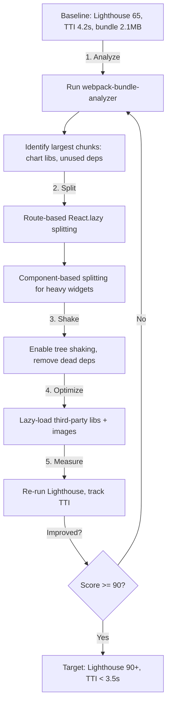

| Difficulty | Channel | Tags |
|---|---|---|
| intermediate | frontend | lighthouse, bundle, lazy-loading |

Ever wondered why a perfectly styled React app still feels slow on real networks? Netflix did, and the answer cost them sign-up conversions. Their logged-out homepage — a client-side React app holding React, Redux, and Lodash — took roughly 7 seconds to load on simulated 3G, a crushing wait for a page whose only job was capturing a new user [1]. By slicing a 300KB JavaScript payload down and rethinking when code actually loads, they cut desktop Time to Interactive under 3.5 seconds and watched sign-up clicks climb. This is the story of how you can reclaim that same performance — one lazy import at a time.

---

> ### Real-World Case — Netflix
>
> Netflix's logged-out sign-up homepage was a client-side React app that took ~7 seconds to load on a simulated 3G connection when measured with Chrome DevTools and Lighthouse. Their JavaScript payload was ~300KB (including React, Redux, and Lodash) and the Time to Interactive was far too slow for a simple landing page, hurting sign-up conversion.
>
> | | |
> |---|---|
> | **Challenge** | Reduce a large client-side JavaScript bundle and improve Time to Interactive on a React app, using Lighthouse to measure success, without breaking the consistency of their server-rendered React architecture or the developer experience. |
> | **Solution** | After profiling, they realized React wasn't needed on the client for the landing page. They kept React server-side to generate HTML, rebuilt the surviving client interactions (like the language switcher) in less than 300 lines of vanilla JS, and cut React/Redux/Lodash plus associated app code from the client bundle — a 200+KB reduction. They then lazily loaded the heavy React/Redux SPA code for the sign-up flow using `` and XHR prefetching while the user was still reading the page, so the framework was only shipped/parsed when it was actually needed. |
> | **Outcome** | Time to Interactive for the logged-out homepage dropped by over 50%, the JavaScript bundle shrank by 200+KB, desktop TTI measured under 3.5s in the lab, and prefetching cut TTI another 30% on subsequent page navigations. Users also clicked the sign-up button at a greater rate after the optimization. |
> | **Lesson** | The biggest TTI win was counterintuitive: instead of optimizing *inside* React, they shipped no framework at all for the first interaction and lazy-loaded it only when needed — modern webpack code-splitting covers the same idea via dynamic `import()` for route/component-level chunks, but sometimes the simplest win is just not to send code the first view doesn't use. |

---

## Hook — 7 seconds of silence, and a sign-up button nobody reached

Picture this: a curious visitor lands on your landing page. The text should draw them in, the button should beg to be clicked. Instead, their screen sits blank while the browser downloads, parses, and executes kilobytes of JavaScript that this particular page barely needs. Seven seconds pass. The visitor is gone. That is not an edge case — it is what a React app measured at 65 on Lighthouse feels like to a real user on a real connection. Sound familiar? You might think a slow homepage is a harmless annoyance. It is not. Every extra second of Time to Interactive is a conversion you quietly lose, and your bundle size is usually the culprit hiding in plain sight.

## Problem — 2.1MB of JavaScript, 4.2 seconds of silence

Now put yourself at your own dashboard: a Lighthouse score of 65, a bundle that weighs 2.1MB, and a Time to Interactive of 4.2 seconds. The math is brutal. On a mid-range phone over 3G, that bundle can balloon into 10+ seconds of total load, and users do not wait. The core problem isn't that your app is too big overall — it is that every single feature is being delivered to every single user on their very first visit, whether they asked for it or not. You ship the analytics dashboard, the charts library, the data tables, and the admin panels all in one eager trip. The stakes are real: this is the difference between a budget-friendly bundle and an unloadable experience, and fixing it requires you to stop thinking about your app as one file and start thinking about it as a set of independent, load-on-demand pieces [2].

## Real-World Case — Netflix's 300KB sign-up page

Building on that idea, consider what Netflix discovered when they pointed Chrome DevTools and Lighthouse at their own logged-out sign-up homepage. Here was a simple landing page — not a video player, not a recommendation engine — yet it shipped a client-side React app carrying roughly 300KB of JavaScript, including React, Redux, and Lodash [1]. On simulated 3G it took about seven seconds to load, and that Time to Interactive was far too slow for a page whose entire job was converting visitors into subscribers. The impact of the fix was dramatic: Time to Interactive dropped by over 50%, the JavaScript bundle shrank by more than 200KB, and desktop TTI measured under 3.5 seconds in the lab [1]. Even better, adding prefetching cut TTI by another 30% on subsequent page navigations, and users clicked the sign-up button at a greater rate after the optimization [1]. The lesson is counterintuitive: the simpler the page, the less business you have shipping heavy code for it.

## Deep Dive — Code splitting, tree shaking, and the lazy-loading mindset

This leads to the real toolkit, and it is more mindset than magic. The first myth to bust: many developers think that improving Lighthouse is about thinning one giant file. Actually, it is about restructuring how and when code arrives. Code splitting breaks your bundle into smaller chunks that load on demand [3]. React powers this natively with React.lazy() and Suspense, letting you defer heavy components until they are actually needed [4]. Then comes tree shaking — dead code elimination that only works if your build ships ES modules, since bundlers can statically analyze import/export statements [5]. However, tree shaking has a plot twist: it is easy to undo. Importing named exports from a CommonJS module, or importing an entire library when you only need one function, silently bloats the output. Meanwhile, route-based splitting handles the visible shell while component-based splitting tackles expensive widgets like charts and editors that sit below the fold [6]. The workflow is a loop: analyze, measure, split, and repeat.

## Workflow — From 65 to 90+ in an afternoon

Whereas a naive approach grabs at random optimizations, a systematic workflow keeps you honest and measurable. Start by measuring your baseline score and TTI. Then profile the bundle with webpack-bundle-analyzer to see exactly which chunks are eating your budget [7]. From there, prioritize the biggest wins: pull heavy third-party libraries into separate chunks, convert billboard charts and editors to dynamic imports, and eliminate unused dependencies. After each change, re-run Lighthouse and confirm the score actually moves — because a fallback spinner that renders nothing useful is a beautiful way to ship a broken experience. This step-by-step loop is summarized in the diagram below, which traces the journey from a bloated bundle to a lean, lazy-loading app.

## Code Example — Route-based and component-based splitting

Now the payoff: turning this workflow into code. The snippet below shows how React enables both route-based and component-based splitting with React.lazy(), Suspense, and an error boundary. Route-based splitting lazy-loads entire pages so the initial shell stays tiny, while component-based splitting defers heavy widgets like charts until they appear. The error boundary is non-negotiable — a lazy import that fails at runtime needs a graceful fallback instead of a white screen. The fallback render in Suspense keeps the UI responsive while the chunk downloads, and React's built-in prefetching behavior helps subsequent navigations feel instant. This pattern maps directly to the Netflix lesson: only ship what the first screen truly needs, and let everything else arrive on demand.

## Lessons Learned — The so-what that changes tomorrow

So what should you do differently tomorrow? First, measure before you change — you cannot improve a score you have not captured. Second, trust the loop: analyze the bundle, split the heavy stuff, shake out the dead code, and re-measure. But here is the battle scar many teams hit: lazy loading is not free. Every lazy boundary inserts a network round-trip, so over-splitting can make things slower — the answer is to split at meaningful seams like routes and genuinely heavy widgets, not every component. And do not forget the human layer: a 90+ Lighthouse score is worthless if it ships to production unminified or without a caching strategy. Finally, keep your users with you. Netflix did not just make a number go up; they made the sign-up button clickable sooner, and more people clicked it [1]. That is the metric that actually matters.

---

## Performance Optimization Loop

<strong>Original Interview Question</strong>

**Q:** You're tasked with improving a React app's Lighthouse performance score from 65 to 90+. The bundle size is 2.1MB and Time to Interactive is 4.2s. What specific steps would you take to optimize the bundle and implement lazy loading?

**A:** Implement code splitting with React.lazy() and Suspense, analyze bundle composition with webpack-bundle-analyzer to identify largest chunks, remove unused dependencies and optimize imports, add dynamic imports for heavy components and third-party libraries, implement route-based splitting for better initial load times, and utilize tree shaking with proper ES module configuration.

## Conclusion

The moral of the story is that performance is not a one-time polish pass — it is an ongoing discovery loop of measure, split, shake, and re-measure. Netflix proved that a dangerously heavy landing page can transform into a lean one by shipping only what the first screen needs and letting everything else arrive on demand [1]. Tomorrow, run one Lighthouse audit, open webpack-bundle-analyzer, and split your single heaviest import. The memorable insight for your team: the fastest code is the code you never ship on first load.

---

## References

1. [Netflix incident report](https://medium.com/dev-channel/a-netflix-web-performance-case-study-c0bcde26a9d9) — article
2. [Code splitting](https://developer.mozilla.org/en-US/docs/Glossary/Code_splitting) — documentation
3. [React.lazy and Suspense - React Documentation](https://developer.mozilla.org/en-US/docs/Web/JavaScript/Reference/Statements/import) — documentation
4. [React code-splitting with React.lazy](https://react.dev/reference/react/lazy) — documentation
5. [ES modules and static analysis](https://developer.mozilla.org/en-US/docs/Web/JavaScript/Guide/Modules) — documentation
6. [webpack code splitting guide](https://webpack.js.org/guides/code-splitting/) — documentation
7. [webpack-bundle-analyzer](https://github.com/webpack-contrib/webpack-bundle-analyzer) — documentation
8. [Lazy loading - web.dev](https://web.dev/articles/lazy-loading) — article

---

**Author:** Satishkumar Dhule — [GitHub](https://github.com/satishkumar-dhule) · [LinkedIn](https://linkedin.com/in/satishkumar-dhule) · [Website](https://satishkumar-dhule.github.io)
