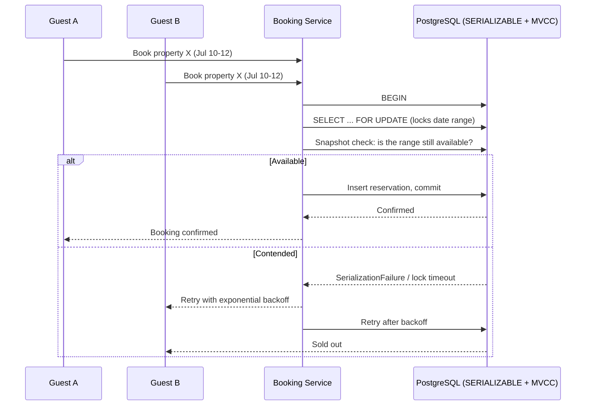

| Difficulty | Channel | Tags |
|---|---|---|
| intermediate | database | acid, isolation-levels, mvcc |

On November 15, 2022, roughly 12 million would-be concertgoers descended on Ticketmaster's Verified Fan presale for Taylor Swift's Eras Tour [1]. Within an hour, the platform was drowning in an estimated 3.5 billion requests — fans got logged out mid-checkout, queues froze with 2,000-plus people on hold, and the general on-sale was eventually canceled outright. Behind every frozen spinner sat the same quiet villain: rows of data competing over who gets the seat. This is the story of that silent battle — and the concurrency controls that decide whether your users get to book, or get burned.

---

> ### Real-World Case — Ticketmaster (Live Nation Entertainment)
>
> On November 15, 2022, Ticketmaster's Verified Fan presale for Taylor Swift's Eras Tour collapsed within an hour of going live. Roughly 12 million unique visitors (including scalper bots) flooded the site, generating an estimated 3.5 billion requests, logging fans out, freezing queues, and forcing Ticketmaster to cancel the general on-sale days later. The meltdown triggered state AG investigations, a U.S. Senate hearing, and eventually a DOJ antitrust lawsuit seeking to break up Live Nation.
>
> | | |
> |---|---|
> | **Challenge** | Ticketmaster had to let millions of users concurrently contend for a finite pool of event inventory (2.6 million seats) while guaranteeing that no seat could be sold twice and without letting the booking platform itself go down under the contention — the exact 'keep it correct AND keep it available' problem a booking system faces. |
> | **Solution** | Ticketmaster gated access to inventory behind its 'Verified Fan' registration program and virtual queueing to serialize booking attempts, protecting the transactional inventory layer from raw demand. The design proved insufficient: the pre-sale system buckled under a 3.5B-request / 12M-concurrent-entity stampede from real fans plus bot traffic attacking the same limited inventory — an object lesson in why high-contention booking needs atomic, idempotent seat-hold transactions, read scaling for availability lookups, capacity headroom above the expected peak, and durable queues that never silently drop in-flight customers. |
> | **Outcome** | The site crashed in under an hour; 2.4 million tickets sold that day (an all-time single-day record for an artist) while fans were simultaneously booted from 2,000+-person queues; the remaining presale was postponed and the general public on-sale canceled entirely, leaving 163,300 tickets (6% of inventory) unallocated. Long-term fallout included multiple class actions, a Senate Judiciary hearing (January 2023), and a DOJ antitrust suit filed May 2024. |
> | **Lesson** | Correctness is not enough — a booking system must also survive its own peak. If you design for 'expected' concurrency instead of worst-case contention, the failure isn't a double-booking, it's a total availability collapse, and for a company with ~70% market share that technical failure becomes a political and regulatory crisis. High-availability booking is a series of deliberate choices: atomic transactions on the write path, replicas on the read path, queues with backpressure, and bot/attack traffic control. |

---

## Hook — When One Row Becomes a War Zone

Raise your hand if you have ever hit 'Book Now' and watched the button spin for what feels like an eternity, only to be told a second later that the slot is gone. Sound familiar? That spinning wheel is not a UI glitch. Somewhere between the click and the confirmation screen, your request joined a queue of strangers fighting over the exact same row in a database, within the exact same few milliseconds. That race — two users, or two million, converging on one unit of availability — is the most expensive engineering problem in the live-events business. The stakes are brutally concrete: get it wrong and you overbook a house, publish a sold-out lie, and maybe trigger four government investigations and a DOJ antitrust suit, like Ticketmaster did [1]. But here is the twist that should make every developer sit up straighter: this is not a venue-scale problem. It is the moment two users try to book the same apartment in your Airbnb-style side project.

## Problem — The Race You Never See in Tests

Double bookings are an availability problem with a concurrency root cause, and they are infuriatingly reproducible. Picture two guests searching the same property at 10:00:01. Both see 'available.' Both click Book. If the code follows the natural instinct — check availability first, then write the reservation as a separate step — both requests sail through the check before either writes a row. That interleaving is a classic lost-update race, and it is the kind of bug that unit tests never catch because tests run one request at a time [4]. The whole discipline of transactions exists precisely because of this: ACID guarantees wrap reads and writes into a single atomic unit so no two actors can observe an intermediate state [4][5]. The naive response is to throw a WHERE clause at it, or worse, a distributed lock and a prayer. But live traffic does not honor prayers. Consequently, the real question is not 'how do I stop the race' — it is 'how do I stop the race without making my database the new bottleneck in a chart that used to show a million sales a day?' Before answering that, it is worth watching a system that answered it wrong at the worst possible moment.

## Real-World Case — Ticketmaster (Live Nation Entertainment)

Here is what a race condition looks like at planetary scale. On the morning of November 15, 2022, Ticketmaster opened the Verified Fan presale for Taylor Swift's Eras Tour, and the site collapsed within an hour [1]. An estimated 12 million unique visitors — fans and scalper bots alike — generated roughly 3.5 billion requests, logging people out, freezing 2,000-person queues, and eventually forcing the cancellation of the public on-sale altogether [1]. The damage reads like a disaster-report bingo card: 2.4 million tickets still sold that day (an all-time single-day record for an artist), while 163,300 tickets — six percent of inventory — sat unallocated because the checkouts that could claim them never finished [1]. The fallout rippled far beyond angry fans: state attorneys general opened investigations, the U.S. Senate Judiciary Committee held a hearing in January 2023, and in May 2024 the DOJ filed an antitrust lawsuit seeking to break up Live Nation [1]. If this feels overwhelming, you are not alone — that is the point. Ticketmaster's meltdown was not caused by one dramatic bug; it was caused by thousands of ordinary operations colliding on the same hot data under load. But the useful artifact here is not the post-mortem. It is the reverse image: what do the systems that survive these storms do differently at the exact moment everyone wants the same row?

## Deep Dive — Isolation Levels, MVCC, and the Art of the Row Lock

At first, the table reads like a warning: SERIALIZABLE sounds like a global lock that serializes every request. That is the plot twist — in PostgreSQL, SERIALIZABLE is built on SSI (Serializable Snapshot Isolation), which rides on top of MVCC rather than brute-force locking [2][5]. MVCC is the engine underneath it all: every transaction sees a consistent snapshot of the database as of its start time, so readers never block writers and writers never block readers [3]. That means a SERIALIZABLE transaction is not a wall; it is a pair of guardians that watch for two transactions touching overlapping data and abort the loser, which then retries. Many developers discover, the hard way, that the danger is not the isolation level — it is knowing when to fall back to heavier tools. Specifically, for the booking write itself, you want an explicit row lock: PostgreSQL's SELECT FOR UPDATE grabs a lock on the exact availability rows for the dates in question, so a second guest's transaction simply waits instead of reading stale data [9]. The interplay matters more than either mechanism alone. MVCC gives you cheap snapshot reads for 'is it available?' checks — perfect for offloading to read replicas — while the row lock guarantees the write path serializes [3]. And because hot rows get hammered, you pair the whole thing with retry loops using exponential backoff and circuit breakers for properties that attract pathological contention [6]. ⚠️ Watch Out: two TILs that cost real teams real weekends — deadlocks when you lock date ranges in inconsistent order across requests, and stale caches that serve a sold-out unit as bookable, so a successful booking must always invalidate the cache on commit. The takeaway is that you are not choosing one weapon. You are stacking snapshot reads, row locks, retries, and cache discipline into a single, layered defense.

## Workflow — The Journey of a Booking, From Click to Commit

The steps, for when you implement this in your own stack: (1) Open the transaction and set the isolation level to SERIALIZABLE for the write path. (2) SELECT FOR UPDATE the exact availability rows for the requested date range, locking them so any concurrent request serializes behind you [9]. (3) Re-read availability while holding the lock — the snapshot alone can be stale, but the lock cannot lie. (4) Write the reservation conditionally, then commit; if the database aborts the transaction with a serialization failure, someone else won the race. (5) Retry with exponential backoff, capped, and only then return 'sold out' to the user [6]. (6) Invalidate the availability cache on commit so the next read hits fresh data. Throughout this, availability checks that do not need exact truth can read from replicas, trading staleness for scale — just never let a replica authorize a booking. 🎯 Key Point: replicas are for 'probably available' search results; the row lock is for 'guaranteed available' at the moment of purchase.

## Code Example — Atomic Booking in Practice

Building on that workflow, here is what step four actually looks like in Python with psycopg2 against PostgreSQL. This function runs the entire reserve operation inside one transaction, locks the hot rows, re-verifies under the lock, and retries honest failures with exponential backoff. It is a production pattern, not a toy: the guardrails that make it safe are the FOR UPDATE locks and the transaction boundary — and if the database ever aborts the transaction because two bookings overlapped, the retry loop absorbs it.

## Lessons Learned — Battle Scars and the Checkout You Do Not Want to Own

So what should you do differently tomorrow? Start by accepting the one line every interview answer hides: correct isolation is a default, not an optimization. Teams that treated SERIALIZABLE as a last resort shipped the database that froze during the next holiday sale, while teams that treated it as a baseline and designed around snapshots and retries rarely think about it again. 🔥 Hot Take: everyone blames Ticketmaster for choosing a captive, under-provisioned architecture — but the deeper scar is that when 3.5 billion requests arrive in an hour, pure brute force cannot win; only a system that degrades gracefully can [1]. The concrete checklist that comes out of this journey: verify your booking write path actually holds row locks rather than 'hoping' the ORM's single UPDATE is atomic; keep search and availability reads on replicas but never let them authorize a purchase; build retry loops with exponential backoff and a hard cap before you need them, because writing them under an incident is how errors get made [6]; invalidate caches on commit, not on a timer, or a sold-out unit will keep appearing bookable; and pre-empt deadlocks by always locking rows in a consistent order across the codebase [9]. 💡 Insight: the queue that Ticketmaster's fans hated was, ironically, a circuit breaker in disguise — contention control is not an admission of weakness, it is the mechanism that lets a handful of checkout workers serve millions of humans fairly. When the button spins next time, remember that behind it, in some database, transactions are politely fighting over who gets to win — and the systems you build now will decide who walks away with the seat.

---

## Booking Race Condition Handling

<strong>Original Interview Question</strong>

**Q:** You're building a booking system for Airbnb where multiple users can reserve the same property simultaneously. How would you design the transaction handling to prevent double bookings while maintaining high availability?

**A:** Use SERIALIZABLE isolation with optimistic concurrency control. Implement row-level locks on property availability tables, use MVCC snapshot reads for checking availability, and apply application-level validation to ensure atomic booking operations.

## Conclusion

The moral of the story: concurrency is not an edge case, it is the default state of the internet — every sale is a tiny war over a shared row, and the only question is whether your database is ready to referee. Start tomorrow by auditing your hottest write path: confirm it holds row locks, runs at SERIALIZABLE, retries with bounded exponential backoff, and invalidates its cache on commit [6]. Run a concurrency test that fires two bookings at the same instant before you ship another checkout, and treat lock-contention dashboards as a first-class metric, not an afterthought [9]. The one insight to carry back to your team: Ticketmaster did not fall because of a missing feature — it fell because millions of ordinary operations all demanded the same row at once, and nothing told them to take turns gracefully [1]. Build the system that takes turns, and your users will never know the war happened at all.

---

## References

1. [Ticketmaster (Live Nation Entertainment) incident report](https://en.wikipedia.org/wiki/Taylor_Swift%E2%80%93Ticketmaster_controversy) — article
2. [PostgreSQL Documentation — Transaction Isolation](https://www.postgresql.org/docs/current/transaction-iso.html) — documentation
3. [PostgreSQL Documentation — Multi-Version Concurrency Control (MVCC)](https://www.postgresql.org/docs/current/mvcc.html) — documentation
4. [ACID — Wikipedia](https://en.wikipedia.org/wiki/ACID) — article
5. [Isolation (database systems) — Wikipedia](https://en.wikipedia.org/wiki/Isolation_(database_systems)) — article
6. [AWS Documentation — Error Retries and Exponential Backoff](https://docs.aws.amazon.com/general/latest/gr/api-retries.html) — documentation
7. [Overbooking — Wikipedia](https://en.wikipedia.org/wiki/Overbooking) — article
8. [CAP theorem — Wikipedia](https://en.wikipedia.org/wiki/CAP_theorem) — article
9. [PostgreSQL Documentation — SELECT (FOR UPDATE lock clause)](https://www.postgresql.org/docs/current/sql-select.html) — documentation
10. [SQLite vs MySQL vs PostgreSQL: A Comparison of Relational Database Management Systems](https://www.digitalocean.com/community/tutorials/sqlite-vs-mysql-vs-postgresql-a-comparison-of-relational-database-management-systems) — blog

---

**Author:** Satishkumar Dhule — [GitHub](https://github.com/satishkumar-dhule) · [LinkedIn](https://linkedin.com/in/satishkumar-dhule) · [Website](https://satishkumar-dhule.github.io)
