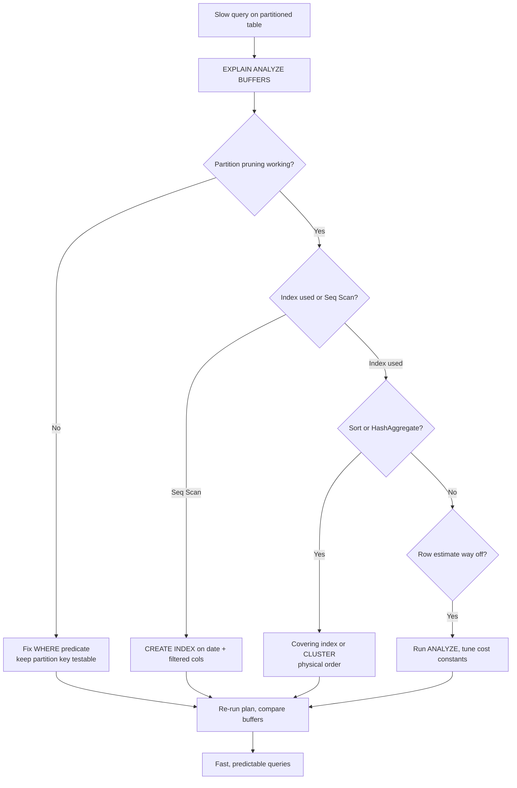

| Difficulty | Channel | Tags |
|---|---|---|
| intermediate | database | explain, query-plan, partitioning |

In 2020, GitLab.com's primary PostgreSQL database crossed 5TB, and its audit_events table — a security log recording every meaningful action on the platform — swelled past hundreds of millions of rows, dragging query performance down with it [1]. GitLab's database team fought back with date-range table partitioning, confining queries to just the relevant monthly partitions and making old-data cleanup nearly instantaneous [1]. This is that story — and the playbook you need when your own partitioned table starts quietly ignoring you.

---

> ### Real-World Case — GitLab
>
> GitLab.com's primary PostgreSQL database grew past 5TB by 2020, with individual tables like the audit_events table (which logs security events) ballooning to hundreds of millions of rows. Query performance degraded badly enough that GitLab's database team introduced PostgreSQL date-range table partitioning, beginning with audit_events as their first partitioned table.
>
> | | |
> |---|---|
> | **Challenge** | Queries on a huge, date-partitioned table were still slow because PostgreSQL can only prune (eliminate) partitions when the WHERE clause includes the partition key column. A query filtering on author_id (a non-partition-key column) like SELECT * FROM audit_events WHERE author_id = 123 ORDER BY created_at DESC LIMIT 100 forces the planner to scan every single monthly partition, negating the benefit of partitioning entirely. |
> | **Solution** | GitLab documented that all performance-sensitive queries on a partitioned model must filter by the partition key column, otherwise the planner scans all partitions. They evaluated composite indexing and chose the partition key that matched how the data is actually accessed (time-range for audit data), and design the query patterns and partition keys together so the planner can prove pruning. |
> | **Outcome** | Partitioning let GitLab isolate queries to just the relevant monthly partition(s) instead of the whole table, keeping multi-hundred-million-row tables fast and making maintenance (dropping old data by dropping a partition instead of mass DELETE) near-instant. The team has since applied this playbook across GitLab.com's many large time-series tables. |
> | **Lesson** | Partitioning is only as good as your ability to prune. The partition key must match your queries' actual filter patterns; if the WHERE clause doesn't include the partition key, PostgreSQL scans every partition and partitioning can even be slower than a single table with a good index. |

---

## Hook — The table that never stopped growing

By 2020, GitLab.com's primary database had quietly crossed the 5TB mark. Tucked inside it sat audit_events, a table logging security events, now pushing past hundreds of millions of rows — and queries that once snapped back in milliseconds were crawling through seconds of sequential scans [1]. No dramatic outage, no 3am pager. Just the creeping dread every team recognizes: the data won. Sound familiar? You're staring at a partitioned table with 100 million rows, and a query over a tidy date range is still slow. Partitioning was supposed to be the answer — which raises an uncomfortable question. Where exactly does the plan go wrong?

## Problem — The lie at the heart of 'just add partitions'

You added the date partitions. You celebrated with a coffee. And then the production query filtering January still takes nine seconds. Many developers discover, the hard way, that partitioning is necessary but not sufficient: a partitioned table can still produce a miserable execution plan if the planner prunes nothing, ignores your indexes, or burns CPU sorting hundreds of thousands of rows. The stakes are real, because every extra second compounds. Slow queries mean blocked deploys, sluggish dashboards, users describing the product as 'getting heavy,' and database teams losing nights to jobs that should have finished in minutes. At 100M rows, brute-force remedies like adding RAM buy you days, not months. The lever that actually moves the needle sits inside the execution plan [9] — PostgreSQL gives you a full transcript of its own decisions, and reading it turns debugging from archaeology into engineering.

## Real-World Case — GitLab

GitLab's database team didn't rescue GitLab.com by guessing. They attacked the bleeding with date-range table partitioning, and chose audit_events as their first partitioned table [1]. The mechanics are deceptively simple: split the table into monthly partitions keyed on event date, so a query scoped to January physically touches only the January partition instead of fanning out across the whole multi-hundred-million-row monster. The impact arrived on two fronts. First, query isolation: reads were confined to the relevant monthly partitions, keeping enormous tables fast. Second, maintenance velocity: dropping old data became a partition drop instead of a mass DELETE, turning a long, lock-laden chore into something near-instant [1]. GitLab has since applied this playbook across many of GitLab.com's large time-series tables. But here is the plot twist nobody warns you about: partition the table and the hard work doesn't end — it relocates. A single month can still be slow if pruning, indexes, and sorts aren't working in concert.

## Deep Dive — Reading the query plan like a detective

Every slow-query investigation begins in the same place: EXPLAIN. For a partitioned table, you're hunting for three suspects.

First, partition pruning. Count the children the planner actually visits. If EXPLAIN lists events_2024_01 through events_2024_06 when you filtered for January alone, the planner failed to prune. The usual culprit is a predicate that hides the partition key inside an expression or an OR clause; constraint exclusion can only prune when the key is testable directly [2].

Second, index utilization. If you see Seq Scan sitting inside a pruned partition, index selection failed. The planner weighs an index against a sequential scan using row estimates and cost constants like random_page_cost [3]. On modern NVMe hardware, the default cost model tends to undervalue indexes — which is why many teams tune random_page_cost downward and watch plans flip from scans to indexed reads.

Third, expensive Sort or Hash Aggregate nodes. ORDER BY over millions of rows makes the planner materialize and sort the whole working set; GROUP BY can spill hash aggregates to disk. A composite index on (date, filtered_column) lets the planner read rows in order and skip the sort entirely [4].

The counterintuitive twist: the same composite index that supercharges pruning can become a liability on write-heavy tables, because every insert now pays to maintain that ordering. And clustering adds a second-order decision — physically reordering the heap along an index makes range scans dramatically cheaper, but it rewrites the table, locks writers, and must be repeated as data churns [5].

Compare the four strategies honestly:

## Workflow — The seven-step tuning pipeline

Start by reproducing the exact slow query with EXPLAIN (ANALYZE, BUFFERS) [3]. Then walk the pipeline in the diagram below: verify pruning first, because everything downstream is wasted effort if the planner is scanning partitions it shouldn't touch. Work top to bottom, re-running the plan after every change until each node is doing the minimal possible work.

## Code Example — Diagnose, index, and cluster with psql

This is the practical sequence for diagnosing a slow query on a partitioned events table, straight from the playbook: baseline with EXPLAIN, fix pruning, add the composite index, and — only after everything else is in order — consider physical clustering. Run these as an ops script or adapt them for your migration tooling. The ORDER BY probe doubles as a quick smoke test: if the sorted read is fast but the filtered read is slow, the problem is selectivity, not scale.

## Lessons Learned — What GitLab's 5TB story teaches you

GitLab's war story [1] and the detour through query-plan archaeology share one through-line: partitioning removes a symptom only to reveal the real problem — planning. The seven takeaways worth putting on a sticky note:

- Verify pruning before touching indexes; an unpruined predicate poisons everything downstream [2].
- Read the whole plan, not just the first line — a Sort node can cost more than ten Seq Scans.
- A composite index (date, filtered_column) packs pruning power and sort avoidance into one structure [4].
- Physical clustering is a maintenance decision, not a query fix — schedule it and expect to repeat it [5].
- Keep statistics fresh; a stale planner cannot make good decisions [3].
- Write-heavy tables pay for every extra index at insert time — measure before you add [4].
- Prefer dropping partitions over mass DELETEs; separation is a maintenance superpower [1].

And the one insight to share at your next standup: a partition is a promise the planner can only keep if your WHERE clause gives it a testable key, your indexes give it direction, and your statistics give it numbers it can trust.

---

## PostgreSQL Query Tuning Pipeline

<strong>Original Interview Question</strong>

**Q:** You have a PostgreSQL table with 100M rows partitioned by date. A query filtering on a specific date range is still slow. What would you check in the EXPLAIN plan and how would you optimize it?

**A:** Check partition pruning effectiveness, index utilization patterns, and expensive sort operations. Create composite indexes on (date, filtered_columns) and evaluate clustering strategies for optimal data access.

## Conclusion

Everything in this article traces back to the day GitLab realized a 5TB database needed structure — and then the months of iteration required to make that structure actually pay off [1]. You can skip the trial and error. Tomorrow, pick your slowest query on a partitioned table and run EXPLAIN (ANALYZE, BUFFERS). Count the partitions, inspect every Seq Scan, and hunt for the Sort node. Whatever you find is fixable — usually with one well-placed composite index and a deliberate physical-ordering decision. Remember, partitioning is the foundation; a predictable query plan is the whole house [2].

---

## References

1. [GitLab incident report](https://docs.gitlab.com/development/database/partitioning/date_range/) — article
2. [PostgreSQL documentation — Table partitioning](https://www.postgresql.org/docs/current/ddl-partitioning.html) — documentation
3. [PostgreSQL documentation — EXPLAIN](https://www.postgresql.org/docs/current/using-explain.html) — documentation
4. [PostgreSQL documentation — CREATE INDEX](https://www.postgresql.org/docs/current/sql-createindex.html) — documentation
5. [PostgreSQL documentation — CLUSTER](https://www.postgresql.org/docs/current/sql-cluster.html) — documentation
6. [PostgreSQL documentation — Index types](https://www.postgresql.org/docs/current/indexes-types.html) — documentation
7. [Wikipedia — Partition (database)](https://en.wikipedia.org/wiki/Partition_(database)) — article
8. [Wikipedia — B-tree](https://en.wikipedia.org/wiki/B-tree) — article
9. [Wikipedia — Execution plan](https://en.wikipedia.org/wiki/Execution_plan) — article

---

**Author:** Satishkumar Dhule — [GitHub](https://github.com/satishkumar-dhule) · [LinkedIn](https://linkedin.com/in/satishkumar-dhule) · [Website](https://satishkumar-dhule.github.io)
