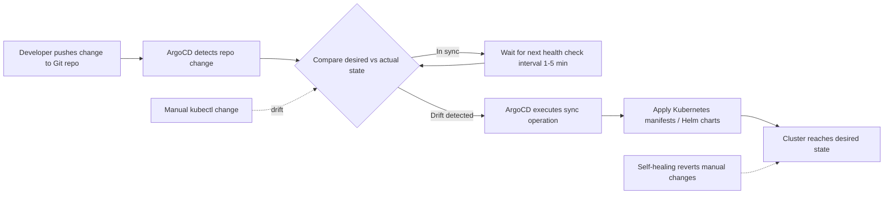

| Difficulty | Channel | Tags |
|---|---|---|
| beginner | devops | argocd, flux, declarative |

What if a single architectural decision across 10,400 pipelines could force an entire enterprise to confront its hidden technical debt? That's exactly what happened at Adobe in 2024. When they launched a forced migration from Moonbeam — a legacy container-as-a-service platform struggling to scale, secure, and operate reliably — to Flex, a GitOps-based delivery platform built on Kubernetes and the entire Argo ecosystem, they discovered something startling [1]. Roughly 80% of their registered services were stale, duplicated, or abandoned. This is the story of how declarative delivery doesn't just make deployments faster — it forces you to confront the messy reality of what you actually run.

---

> ### Real-World Case — Adobe
>
> Adobe's legacy internal platform, Moonbeam (a container-as-a-service), had become difficult to scale, secure, and operate reliably across an enterprise with thousands of developers. In 2024 they launched a forced migration to 'Flex', a GitOps-based delivery platform built on Kubernetes and the entire Argo ecosystem (CD, Workflows, Events, Rollouts), touching 10,400 pipelines across hundreds of teams.
>
> | | |
> |---|---|
> | **Challenge** | Enterprise-scale software delivery based on fragile, queue-based deployment workflows (imperative, script-driven) caused configuration drift, manual intervention, poor auditability, and difficult rollbacks. Migrating thousands of microservices without breaking developer velocity required a declarative single source of truth and continuous reconciliation. |
> | **Solution** | Adobe rebuilt delivery on GitOps: Git became the source of truth, declarative infrastructure and application definitions replaced imperative pipeline commands, and Argo CD continuously reconciled running environments against approved state in source control. They operationalized Argo CD/Workflows/Events/Rollouts inside a governed platform, and built self-service migration tooling with start/pause/continue lifecycle controls orchestrated by Argo Workflows. |
> | **Outcome** | 10,400 pipelines migrated or decommissioned; the platform now manages over 6,000 services across ~50,000 environments including ~19,000 production environments supporting 3,300+ production services for 3,000+ developers. The migration surfaced a counterintuitive windfall: ~80% of previously registered services were stale, duplicated, or abandoned and were retired, contributing meaningful cost savings, plus significantly reduced deployment queue times and improved security/audit posture. |
> | **Lesson** | The biggest wins of declarative GitOps aren't just faster deploys — the single source of truth and lifecycle controls forced a hygiene review that exposed dormant services, and the cleanup itself drove much of the ROI. Also, adoption value beats mandates: teams moved for automatic reconciliation and rollback agility, not deadline pressure. |

---

## Hook — The Moonshot That Almost Didn't Happen

Picture this: your platform team announces a forced migration touching 10,400 pipelines across hundreds of teams. Developers are skeptical, timelines are aggressive, and the existing system — Moonbeam — has been running for years. It was never designed for enterprise scale: thousands of developers, dozens of regions, and a delivery pipeline that feels more like a queue than a highway [1]. Now imagine discovering, mid-migration, that four out of five of the services you thought you were running were actually virtual ghosts — stale forks, abandoned experiments, duplicates of duplicates. That's not a hypothetical. That's Adobe's journey from Moonbeam to Flex. Sound like your Kubernetes cluster? Keep reading, because the lessons here scale down just as well as they scale up.

## Problem — The Silent Drift of Imperative Delivery

Many developers have been there: the deploy looked fine. The rollout completed. Then, three days later, a `kubectl scale` here, a manual `kubectl patch` there, and suddenly the cluster state no longer matches anything in version control. This is configuration drift, and it is the silent killer of reliable microservices delivery. With the imperative approach, you run `kubectl apply`, `kubectl edit`, `kubectl scale`, and every direct command bypasses Git as the source of truth. Nothing is auditable. Nothing is reproducible. When an environment breaks, you roll back 'manually' — which really means you frantically reconstruct whatever the cluster state used to be from memory and hope for the best. For a three-person startup, this is annoying. For Adobe's platform, which supports 3,000+ developers and 3,300+ production services, it was unmanageable. Moonbeam's imperative, queue-based model simply could not scale, secure, or operate reliably across an enterprise of that size [1]. The stakes are high: drift isn't an inconvenience, it's an availability incident waiting to happen.

## Real-World Case — Adobe's Forced Migration to Flex

In 2024, Adobe launched a focused effort to retire Moonbeam and migrate everything to Flex, a GitOps-based delivery platform built on Kubernetes and the Argo ecosystem — Argo CD, Argo Workflows, Argo Events, and Argo Rollouts [1]. The scale is staggering: 10,400 pipelines migrated or decommissioned, and the platform now manages over 6,000 services across ~50,000 environments, including ~19,000 production environments [1]. But here's the plot twist. As teams systematically engaged with the inventory, they found that roughly 80% of previously registered services were stale, duplicated, or abandoned. What looked like a migration was actually a reckoning. By retiring these ghosts, Adobe contributed meaningful cost savings, significantly reduced deployment queue times, and improved its security and audit posture [1]. The counterintuitive insight: adopting declarative delivery forced them to define, once and for all, what should exist — and that clarity was worth more than the migration itself. They also learned a painful early lesson: a script-based migration created real friction for teams, so they rebuilt it as a structured, self-service workflow with explicit start, pause, continue, and end controls, orchestrated by Argo Workflows [1].

## Deep Dive — Declarative vs. Imperative: The Real Tradeoff

So what exactly changes when you move from imperative to declarative delivery? The declarative approach says: define the complete desired state in Git using YAML manifests, Helm charts, or Kustomize overlays, then let ArgoCD continuously reconcile the actual cluster state with that declared state. Every change is a Git commit. Every change is auditable, reviewable, and reversible. ArgoCD acts as a permanent loop: fetch desired state → compare to actual → sync → re-check. Self-healing means if someone sneaks in a manual change, ArgoCD reverts it automatically within the reconciliation interval. The imperative approach, by contrast, treats the cluster as the source of truth. Run a command, the cluster changes, and — unless someone remembers to update Git — the two diverge forever. Here's the real tradeoff, and it's not about who prefers YAML over shell commands. Declarative delivery is a governance decision. It replaces the trust model of 'the person who ran the command knows what happened' with 'everything that happens is codified and reviewable' [2]. For a small team, that feels like overhead. For an enterprise, it's the difference between a platform you can audit and a platform you can only hope is correct. Moreover, declarative systems unlock automated rollbacks: since Git knows the desired state, reverting is just pointing at an older commit [2]. The nuance most tutorials miss is that 'declarative' doesn't mean 'no operators'. It means the operations are codified as reconciliation loops, not ad-hoc commands [3].

## Workflow — How a GitOps Sync Actually Happens

Let's walk through the workflow that Adobe operationalized at scale, and that you can replicate on day one. The flow starts with a developer pushing a change to a Git repository that contains the Kubernetes manifests or Helm charts. ArgoCD, configured to watch that repository, detects the change. It then compares the desired state in Git against the live state in the cluster. If they differ, ArgoCD executes the sync, applying the changes through the appropriate sync operation [5]. After the sync, ArgoCD continues to poll on a health-check interval — typically 1 to 5 minutes — and if it detects any drift (for instance, a manual `kubectl edit`), the self-healing feature reverts it. The diagram below maps this reconciliation loop. This is the visual story: the Git repository is the single source of truth, and ArgoCD is the tireless interpreter between what you want and what exists.

## Code Example — Configuring an ArgoCD Application with Auto-Sync and Self-Healing

Enough theory — let's make it real. You configure ArgoCD by defining an Application Custom Resource (CRD). This manifest points ArgoCD at your Git repo, tells it what to sync, and — critically — enables `automated` sync with `selfHeal`. Here's the practical pattern that runs the deployment loop:

## Lessons Learned — What Adobe's Migration Taught Us

Here's what you should take into your Monday morning standup. First, inventory before you migrate. Adobe's biggest win wasn't the new tooling — it was the 80% cleanup it forced [1]. If you're moving to GitOps, count what you actually run before you automate it; you may find you're automating ghosts. Second, `selfHeal` is your friend, but respect its limits. In Adobe's own scaling notes, they tuned their self-heal timeout from 0 to 5 to 10 minutes to protect the Kubernetes API server against churn [4]. Blindly running self-heal every 30 seconds on thousands of apps will hammer your control plane. Third, the workflow experience matters as much as the technology. Adobe's first script-based migration failed to land; it was the structured, resumable migration interface that made thousands of teams actually move [1]. The technology was only part of the challenge — the governance and UX around it made the migration practical. And finally, remember that declarative delivery is a shift in trust, not just tooling [7]. You're trading the flexibility of direct commands for the reliability of a codified, auditable deployment history. At Adobe's scale, that trade paid for itself — in cost savings, deployment speed, and a security posture that finally holds up to scrutiny. If this feels overwhelming, you're not alone: even Adobe's first attempt hit friction. But the payoff is a platform where 'what should exist' and 'what exists' are finally the same thing. The memorable takeaway to share with your team: GitOps doesn't just sync clusters — it forces you to reconcile with your own technical debt. Start with one app, enable auto-sync, crank up self-heal, and let Git become the launch pad for your hero's journey from chaos to control.

---

## GitOps Reconciliation Loop

<strong>Original Interview Question</strong>

**Q:** You're setting up GitOps for a microservices deployment. How would you configure ArgoCD to automatically sync changes from your Git repository to Kubernetes, and what's the difference between declarative and imperative approaches in this context?

**A:** I'd configure ArgoCD by setting up a Git repository containing Kubernetes manifests or Helm charts, creating an Application CRD that points to the Git repository, enabling auto-sync with a health check interval of 3 minutes, and implementing self-healing to automatically revert any manual changes. The declarative approach involves defining the desired state in Git through YAML manifests, Helm charts, or Kustomize configurations, where ArgoCD continuously reconciles the actual state with the desired state. In contrast, the imperative approach uses kubectl commands to make direct changes to the cluster, bypassing the Git repository as the single source of truth.

## Conclusion

Adobe's migration to Flex proved something profound: GitOps isn't just a tooling choice, it's a forcing function for clarity. When you make Git the single source of truth, you're forced to confront what actually exists, what should exist, and what's been quietly abandoned. The 80% cleanup gave them cost savings; the declarative model gave them auditability and speed. The moral of the story: start small, enable auto-sync and self-heal on one application, and let the reconciliation loop do the heavy lifting. Tomorrow, before you automate anything else, inventory your environment and ask the uncomfortable question — how much of what you're running is actually alive? The answer might surprise you. Then share that one insight with your team: GitOps doesn't just sync clusters; it forces you to reconcile with your own technical debt.

---

## References

1. [Adobe incident report](https://www.cncf.io/case-studies/adobe/) — blog
2. [Kubernetes Declarative Management](https://kubernetes.io/docs/tasks/manage-kubernetes-objects/declarative-config/) — documentation
3. [OpenGitOps Principles](https://opengitops.dev/) — documentation
4. [Scaling Adobe's CI/CD Solution to Support >50K Argo CD Apps](https://static.sched.com/hosted_files/colocatedeventseu2024/b8/Adobe%20Flex%20Scaling.pdf) — paper
5. [Argo CD Documentation](https://argo-cd.readthedocs.io/en/stable/) — documentation
6. [Argo CD GitHub Repository](https://github.com/argoproj/argo-cd) — documentation
7. [GitOps on Wikipedia](https://en.wikipedia.org/wiki/GitOps) — article
8. [Helm Documentation](https://helm.sh/docs/) — documentation
9. [Kustomize Documentation](https://kubectl.docs.kubernetes.io/guides/introduction/kustomize/) — documentation

---

**Author:** Satishkumar Dhule — [GitHub](https://github.com/satishkumar-dhule) · [LinkedIn](https://linkedin.com/in/satishkumar-dhule) · [Website](https://satishkumar-dhule.github.io)
