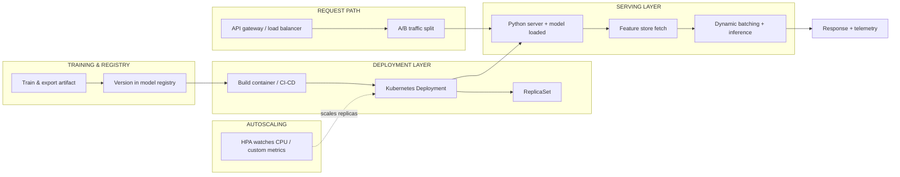

| Difficulty | Channel | Tags |
|---|---|---|
| beginner | devops | mlops, deployment |

It was 2015, and Uber's data scientists were building machine learning models in total isolation — each team standing up its own ad-hoc R or scikit-learn pipelines and deploying models by hand, with no shared infrastructure for the real-time predictions (ETA, surge pricing, fraud) that the company's core products depended on [1]. There was no consistent way to get a model into production, and the churn was painful. That mess is exactly what the ML operations maturity ladder is designed to solve — and at its very foundation sits an overlooked distinction many developers still blur: the difference between model deployment and model serving. This article walks through that divide, the trade-offs hiding in each layer, and how getting it right took Uber from chaos to 250,000+ predictions per second.

---

> ### Real-World Case — Uber
>
> By 2015, Uber's data scientists were building ML models in silos using R and scikit-learn, each team standing up its own ad-hoc pipelines and deploying models by hand. Nothing standardized — no consistent way to get models into production, and no shared infrastructure for the real-time predictions (ETA, surge pricing, fraud) that Uber's core products depended on.
>
> | | |
> |---|---|
> | **Challenge** | Uber needed split deployment from serving: a platform with a CI/CD-like pipeline (train, evaluate, containerize, deploy to clusters, canary, monitor) separate from a runtime inference layer that could serve hundreds of thousands of predictions per second at sub-10ms latency on Uber's highest-traffic online services. |
> | **Solution** | They built Michelangelo, an ML-as-a-service platform. The deployment side standardizes model packaging into Docker containers, a model registry with versioning and lineage, canary/A-B rollouts, and automated production monitoring. The serving side runs a lightweight JVM prediction server that loads models into memory, routes requests by header to the right model version, batches predictions async for offline paths, and pulls online features from a Cassandra feature store to keep training-serving consistency. |
> | **Outcome** | Michelangelo became Uber's de-facto ML system across data centers. Its highest-traffic models serve 250,000+ predictions per second with P95 latency under 5ms (under 10ms when fetching features from the Cassandra feature store), and the platform later scaled to 1M+ predictions/sec company-wide — all while supporting dozens of teams and 100+ production use cases. |
> | **Lesson** | The dominant cost of serving is rarely the model math — it's feature lookup and serialization. By optimizing that path (in-memory models, caching, low-latency feature store) Uber showed that a healthy model-serving layer can be pushed to tens-of-milliseconds budgets even on the highest-QPS services, while deployment (registry, canary, monitoring) is what keeps those 5,000+ live model versions safe. |

---

## Hook — The Hidden Cost of Confusing Two Very Different Jobs

Ever wondered why your model 'works' in the notebook but crumbles in production? Many developers assume that once a model is trained, the hard part is over. The deploy button gets pressed, a container spins up, and surely that is the whole battle. Here is the thing though: that assumption is exactly where ML systems quietly die. Deployment and serving are two separate muscles, and treating them as one is how latency budgets get blown and rollbacks turn into 2am marathons. Sound familiar? If you have ever stared at a 500 error on an inference endpoint wondering whether the model, the network, or the orchestrator betrayed you, this article is for you.

## Problem — Two Jobs, Confusingly Packaged as One

At the risk of oversimplifying: deployment is getting the model onto infrastructure; serving is answering inference requests at runtime. But conflating them leads to real, quantified pain. Deployment covers the CI/CD pipeline, infrastructure setup, monitoring, and rollback strategies — the 'how do I safely get this artifact to a production host' problem. Serving covers the runtime inference API — request routing, model loading, versioning, batching, and response optimization — the 'how do I answer 10,000 requests a second in under 50 milliseconds' problem. A team that masters deployment but ignores serving builds a beautiful pipeline that feeds a slow, unreliable endpoint. A team that masters serving but ignores deployment ships models with no rollback story when the new weights are subtly worse. Both failures are common, and both cost money. This is the fundamental tension: the orchestration problem and the inference-time problem demand different tooling, different scaling strategies, and different mental models.

## Real-World Case — Uber and the Birth of Michelangelo

No company illustrated the cost of this confusion better than Uber. By 2015, data scientists were building models in silos using R and scikit-learn, each team standing up its own ad-hoc pipelines and deploying models entirely by hand [1]. There was no standardization — no repeatable way to push models to production and no shared infrastructure for the real-time predictions that Uber's core products depended on for ETA, surge pricing, and fraud detection [1]. The fix was Michelangelo, Uber's machine learning platform, which unified deployment and serving across the company's data centers [1]. The results are staggering: its highest-traffic models now serve over 250,000 predictions per second with P95 latency under 5 milliseconds — and under 10 milliseconds even when fetching features from the Cassandra feature store [1]. The platform later scaled past 1 million predictions per second company-wide, supporting dozens of teams and more than 100 production use cases [1]. The lesson is not that Uber had brilliant modelers; it is that they standardized the seam between deployment and serving, and the throughput followed.

## Deep Dive — Deployment vs. Serving, Tool by Tool

Building on Uber's story, let us separate the two layers in concrete, tool-level terms. Deployment is orchestration: Kubernetes, Docker, and Terraform provision and manage the infrastructure [3], while platforms like MLflow, SageMaker, and Vertex AI wrap the whole lifecycle in managed services [7]. CI/CD pipelines from GitHub Actions or Jenkins take a trained artifact from registry to production. Serving, by contrast, is the runtime request path: model servers like TensorFlow Serving, TorchServe, or BentoML take care of loading models, routing requests, and batching inference [9][5][6]. Load balancers such as NGINX or Envoy sit in front and route traffic by model version. Here is the plot twist most developers miss: the biggest lever is often the serving layer's request batching and model caching, not adding more pods — for example, TensorFlow Serving's scheduler groups individual requests into joint batches for GPU execution [9]. You might think 'more replicas = lower latency,' but actually, naive horizontal scaling can add network hops and hurt P95 latency if the feature store becomes the bottleneck — which is precisely why Uber separated feature retrieval into its own Cassandra-backed store [1]. Now let us lay out the real trade-offs head-on, because the popular comparison is often misleading:

## Workflow — From Training Run to Live Inference, Step by Step

This leads to the concrete workflow that connects both halves. The journey from training to a live prediction endpoint is a relay race, not a single step. First, package the trained model into a portable artifact (a SavedModel, a TorchScript blob, or a Bento bundle) [9][6]. Second, register and version that artifact in a model registry so you can name, audit, and roll back any iteration [7]. Third, build the container image and run it through CI/CD — this is deployment [4]. Fourth, launch the model server and load the version into memory — this is serving. Fifth, wire a load balancer in front and start routing real traffic, with readiness probes telling the orchestrator which replicas are healthy enough to receive requests [3][4]. Sixth, configure autoscaling so a traffic spike adds replicas automatically — Kubernetes' Horizontal Pod Autoscaler watches metrics like CPU and scales the Deployment's replica count on its own [4]. However, there is one more layer of nuance hidden in the middle of this workflow: the scaling and latency decisions that separate a working system from a great one. Horizontal scaling spins up extra pod replicas to spread load [4], while vertical scaling throws more GPU memory or CPU at a single instance. The real decision is latency requirements: a real-time fraud check wants P95 under 100 milliseconds, while a batch job can happily run under 1 second [1]. A/B testing adds another dimension — you split traffic between model versions to validate a rollout without committing 100% of your users to an unproven change [9]. The trap hiding here is cold start. A freshly spawned model server must load weights into memory before it can answer a request, and if that load takes thirty seconds while your autoscaler only tolerates five, the new pod gets torn down before it ever serves traffic [4]. Many developers discover this the hard way, watching a 'scaled-up' cluster fail to improve latency at all. The mermaid diagram below maps the full flow, from training all the way to the autoscaled serving fleet.

## Code Example — Autoscaling a Model Server with Python + Kubernetes HPA

Let's make this concrete. Below is a production-style Python service that implements the serving concern — request batching and a latency-protecting endpoint — with the deployment layer handled by Kubernetes. In Python, the serving layer is where you handle dynamic batching: instead of running inference once per request, you collect a handful of inputs and run one vectorized inference pass.

## Lessons Learned — What to Do Differently Tomorrow

So what should you take away? First, treat deployment and serving as separate concerns with separate owners, metrics, and playbooks — the blur between them is the single most common source of production ML failures. Second, prioritize the serving hot path: request batching, model caching, and a warm feature store will move your P95 latency far more than over-provisioning pods ever will [1][9]. Third, design for rollback from day one — a versioned registry plus traffic splitting means you can pull a bad model in seconds, not after an emergency redeploy [7]. Fourth, monitor the metrics that actually matter for inference — latency percentiles, p50/p95, error rate, batch utilization, and cold-start time — not just CPU and memory [4]. And finally, remember Uber's real lesson: the people building the models are not the ones who should be hand-deploying them. Standardize the seam, and the scale will follow. Stop bolting serving onto deployment and start designing them as the two distinct disciplines they are.

---

## Deployment vs Serving Architecture Flow

<strong>Original Interview Question</strong>

**Q:** Explain the key differences between model serving and model deployment in ML systems, including specific technologies, scaling considerations, and real-world implementation patterns?

**A:** Deployment encompasses CI/CD pipelines, infrastructure setup, and monitoring using tools like Kubernetes, MLflow, and SageMaker. Serving focuses on runtime inference APIs with frameworks like TensorFlow Serving, TorchServe, or BentoML, handling request routing, model versioning, and autoscaling. Key trade-offs include latency vs throughput, batch vs real-time inference, and cold start optimization.

## Conclusion

The moral of the story: model deployment and model serving are two distinct disciplines, and the teams that blur them are the ones that bleed latency and reliability. Uber's Michelangelo story proves that standardizing the seam between them is what unlocks scale — from siloed hand-deployments to 250,000 predictions per second with sub-5ms P95 latency [1]. Tomorrow, do one small thing: split your ML production playbook into a deployment track (CI/CD, infra, rollback) and a serving track (routing, batching, cold-start, latency percentiles). Give each its own owner and its own dashboard. That single reframe will do more for your production ML than any new model ever will.

---

## References

1. [Uber incident report](https://www.uber.com/us/en/blog/michelangelo-machine-learning-platform) — article
2. [MLOps (Machine Learning Operations)](https://en.wikipedia.org/wiki/MLOps) — documentation
3. [Kubernetes ReplicaSet documentation](https://kubernetes.io/docs/concepts/workloads/controllers/replicaset/) — documentation
4. [Kubernetes Horizontal Pod Autoscaling documentation](https://kubernetes.io/docs/tasks/run-application/horizontal-pod-autoscale/) — documentation
5. [BentoML - Unified Model Serving Framework](https://github.com/bentoml/BentoML) — documentation
6. [PyTorch TorchServe documentation](https://pytorch.org/serve/) — documentation
7. [What is Amazon SageMaker AI](https://docs.aws.amazon.com/sagemaker/latest/dg/whatis.html) — documentation
8. [Machine Learning Operations (MLOps): Overview, Definition, and Architecture](https://arxiv.org/abs/2205.02302) — paper
9. [TensorFlow Serving repository](https://github.com/tensorflow/serving) — documentation

---

**Author:** Satishkumar Dhule — [GitHub](https://github.com/satishkumar-dhule) · [LinkedIn](https://linkedin.com/in/satishkumar-dhule) · [Website](https://satishkumar-dhule.github.io)
