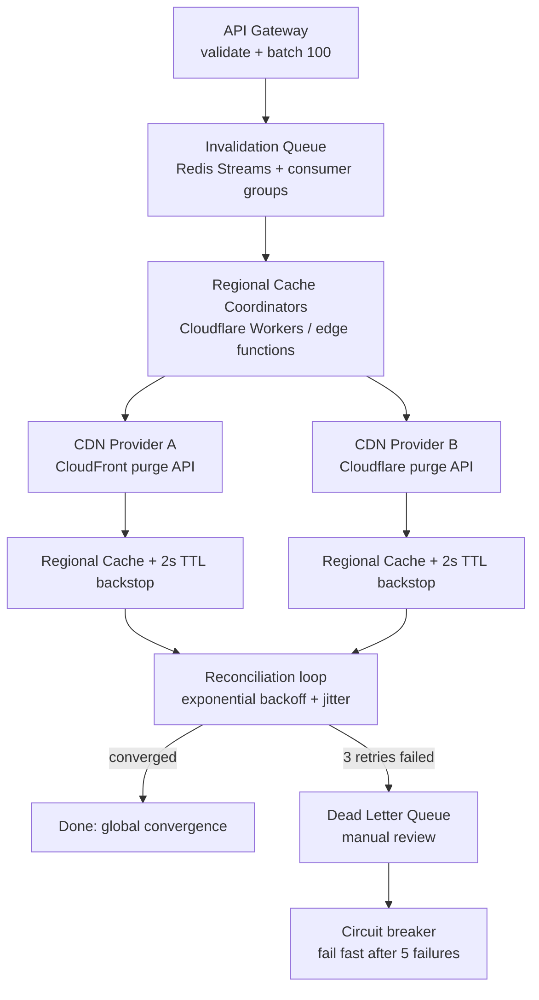

| Difficulty | Channel | Tags |
|---|---|---|
| intermediate | system-design | edge, caching, purging |

Imagine a news site in Australia pushing a breaking update—and a reader across the city still seeing yesterday's headline because a purge request had to cross the Pacific Ocean twice. That was Cloudflare's reality. After more than a decade of growth, their cache-purging system built on Quicksilver hit hard scaling walls, with purge latency crawling toward 1,570ms globally [1]. Then they tore the whole thing down and rebuilt it, slashing global purge latency to 149ms (P50)—a 90.5% improvement across 330 cities and 120+ countries [1]. This is the story of how the hardest problem in distributed systems got solved, and what it teaches you about building cache invalidation that actually scales.

---

> ### Real-World Case — Cloudflare
>
> After over a decade of growth, Cloudflare's cache-purging system, built on Quicksilver (their configuration-distribution service), began hitting hard scaling walls. A purge request from a customer in Australia had to cross the Pacific Ocean to a core data center and back before content was invalidated, and Quicksilver's centralized write throughput became a bottleneck as customers made millions of purge API calls per day.
>
> | | |
> |---|---|
> | **Challenge** | Three compounding problems: (1) purge latency correlated with distance from the centralized US core ingest point (global P50 of 1,570ms, 2–5 second propagation), (2) write-throughput bottleneck at that single ingest point when thousands of customers purged concurrent content, and (3) growing purge-history storage that consumed cache disk space and degraded cache HIT ratios. |
> | **Solution** | Cloudflare rebuilt the system from the ground up as 'Coreless Purge': purge requests are ingested at any edge datacenter and fanned out mesh-style via peer-to-peer distribution (Durable Objects), instead of spoke-hub backhaul to a core. Each cache machine runs a CacheDB sidecar (Rust on RocksDB) that maintains a local index of cached files (by URL, cache-tag, hostname, prefix), so invalidation happens actively via local index lookup — replacing the old 'lazy purge' that compared purge timestamps and waited for requests. In-flight purges are checked in the cache-request hot path so stale content becomes unavailable the instant a purge lands on a machine. |
> | **Outcome** | Global purge latency dropped to 149ms P50 — a 90.5% improvement from 1,570ms in May 2022 — across all 330 cities and 120+ countries. The system also cut purge-history storage by ~10x (freeing disk for longer cache retention and higher HIT ratios), removed the centralized bottleneck, and let Cloudflare open powerful purge-by-tag/hostname/prefix to all plan tiers. |
> | **Lesson** | A perfectly good shared infrastructure component (Quicksilver) can quietly become the wrong tool for a workload as it scales — fast global configuration replication is not the same as low-latency, high-throughput invalidation. The counterintuitive fix was to decentralize the control plane and move invalidation authority down to each edge machine's own index, proving that sub-second global purge is achievable when nothing is forced to 'stop at the core'. |

---

## Hook — The 2 A.M. Headline That Nobody Could Un-see

Picture this: it's a product launch hour, and a developer hits 'deploy' confident that a cached price change will reflect instantly for users everywhere. Thirty seconds later, the first support ticket lands — a customer in Sydney is still seeing the old price, and the chargeback emails are already trickling in. Sound familiar? Cache invalidation is famously one of the two hard things in computer science, and it is deceptively brutal in a multi-region world. The thing is, most tutorials stop at 'just set a short TTL.' But anyone who has run a real global service knows that TTLs are a blunt instrument — they make stale content live long enough to cause real damage. The real question isn't whether you can purge. It's whether you can purge everywhere, fast enough, without breaking under load. Here is the tension: your users demand sub-second consistency, your origin can't survive a global thundering herd of cache misses, and your CDN's purge API happily accepts your request — but 'accepted' is not 'propagated.'

## Problem — The Slow, Centralized Bottleneck Nobody Signed Up For

Let's get concrete about what actually breaks. A multi-region CDN purge has three compounding enemies. First, there's geography: a centralized ingest point means a customer in Australia pays the round-trip latency to a core data center and back before local content is invalidated — and every additional region adds more distance. Second, there's throughput: when customers make millions of purge API calls per day, a centralized write path becomes a choke point, and any buffering you add to smooth the spikes just piles latency on top. Third, there's storage: keeping enough purge history to guarantee correctness eats into the disk you'd rather spend on caching content. Consequently, you're forced into a painful tradeoff — keep purge history long and sacrifice cache HIT ratios, or trim it and risk serving stale data. Most teams respond by reaching for 'just add more TTL' or 'just invoke the provider's purge API everywhere,' but a naive implementation collapses under real concurrency. What does 10,000 concurrent invalidations per second, with a strict 5-second global SLA, actually demand? The answer is a fundamentally different architecture.

## Real-World Case — Cloudflare

Cloudflare lived this exact nightmare at internet scale. Their flexible purge system was built on Quicksilver, their configuration-distribution service — a hammer so good it made every problem look like a nail [1]. For years, purge requests worked through a spoke-hub model: a request entered any data center, got backhauled to a core, and Quicksilver fanned it back out to every other data center. It was simple, and it worked — until it didn't. As their network and customer base grew, three issues surfaced: latency proportional to distance from the centralized ingest, a write bottleneck at that core, and purge-history storage that correlated dangerously with throughput demand [1]. The turning point came when they realized proactive purging was feasible if they could index every cached file's metadata efficiently. They built CacheDB — a Rust service on RocksDB running on every machine beside the cache proxy — and pinned the proxy to check pending local purges before serving any cache HIT. Distribution shifted from spoke-hub to peer-to-peer fan-out. The payoff was dramatic: global purge latency dropped from 1,570ms in May 2022 to 149ms P50 by August 2024, a 90.5% improvement across 330 cities and 120+ countries [1]. They also cut purge-history storage by ~10x, freeing disk for longer cache retention and higher HIT ratios, and removed the centralized bottleneck entirely [1].

## Deep Dive — Latency Budgets, Queues, and the Plot Twist About TTLs

So how do you reproduce that magic at a smaller scale — say, 10,000 invalidations per second with a 5-second global SLA? Let's break down the design tension. Start with the latency budget: 5 seconds globally sounds generous, but across a queue, edge workers, provider API calls, and retries, it disappears fast. The plot twist many developers miss: you should not be waiting around for every purge to complete synchronously. Instead, embrace a two-tier model — a fast path that propagates the invalidation intent asynchronously through a distributed queue, and a correctness backstop that prevents stale content from being served in the meantime. That backstop is where short TTLs shine. A dynamic `Cache-Control: max-age=2, must-revalidate` means even content that hasn't been explicitly purged in a region self-heals within two seconds. The counterintuitive insight: you don't need perfect expiry — you need bounded staleness plus eventual, enforced propagation. For throughput, batch aggressively: 100 invalidations per API call instead of 100 separate calls slashes API cost by roughly 90% and reduces provider rate-limit pressure. For reliability, plan for failure: exponential backoff with jitter for rate limiting, a circuit breaker that fails fast after five consecutive failures, and a dead-letter queue for anything that can't be resolved. Each of these components solves a specific failure you will actually encounter, not a theoretical one.

## Workflow — From API Call to Global Convergence

Let's trace one invalidation through the whole pipeline. The flow starts at the API Gateway, where a batch of 100 invalidation requests lands and is validated. From there it flows into a distributed invalidation queue (Redis Streams with consumer groups work well here) that absorbs the throughput spike and decouples producers from consumers. Regional cache coordinators — think Cloudflare Workers or lightweight edge functions — claim work from the queue and issue batched purge requests to the actual CDN providers. Afterward, every region applies its regional Cache-Control backstop to guarantee convergence even if a purge is delayed. Finally, a reconciliation loop compares purge intent against actual propagation, retrying with exponential backoff until everything converges or the item lands in a dead-letter queue for manual review. Building on this, the architecture is deliberately layered so that no single component is a global write bottleneck. The queue absorbs bursts, the coordinators parallelize provider calls, and the TTL backstop guarantees bounded staleness regardless of any component's failure. The diagram below shows this journey end to end.

## Code Example — A Resilient Region-Aware Purge Coordinator

Here is a production-flavored example of the coordinator that sits between your queue and the CDN providers. It consumes batches, applies provider-specific batching, and implements the retry-and-circuit-breaker discipline that keeps a slow provider from taking down the whole pipeline. The code below builds a batch of invalidations, issues them to Cloudflare's purge API, then CloudFront, and only marks the batch as processed once every provider has acknowledged — or the batch is routed to a dead-letter queue after exhausting retries.

## Lessons Learned — What To Do Differently Tomorrow

What does this saga actually mean for the system you're building right now? Start with the biggest lesson: do not make invalidation synchronous and global by default. Decouple 'accept the request' from 'propagate the purge,' because the former can be fast and resilient while the latter is slow and messy. Embrace a short-TTL backstop — it is your safety net, not a compromise, and it dramatically shrinks the window where any propagation failure could serve stale data. Batch aggressively; 100 invalidations in a single API call is a cost and reliability decision, not a nicety. Plan for partial failure with exponential backoff plus jitter, a circuit breaker on top, and a dead-letter queue for the long tail. Finally, index your cache metadata if you can — Cloudflare's shift from lazy to proactive purging shows that knowing what's on disk makes invalidation dramatically cheaper and faster. The classic mistake is to bolt a purge system onto a CDN and assume it works; the mature move is to design for convergence, measure real P50 and P99 propagation times, and treat stale content as a bounded, controlled risk.

---

## Multi-Region Cache Invalidation Pipeline

<strong>Original Interview Question</strong>

**Q:** How would you design a multi-region CDN cache purging system that guarantees content propagation within 5 seconds while handling 10,000 concurrent invalidations per second?

**A:** Implement Cloudflare API + AWS CloudFront with distributed invalidation queue, edge compute coordination, and 2-second TTL. Use batch invalidation, exponential backoff, and regional cache headers for 5-second SLA.

## Conclusion

The next time someone tells you cache invalidation is unsolvable, point them at Cloudflare's 90.5% latency collapse — the problem isn't hopeless, it's just architected wrong. Tomorrow, stop treating purge as a fire-and-forget API call and start designing for convergence: decouple acceptance from propagation, batch aggressively, add a short-TTL backstop, and build circuit breakers and dead-letter queues for the inevitable partial failures. The one insight to carry to your team: you don't need perfect, instant, global invalidation — you need bounded staleness plus eventual propagation. That mental shift is what turns a system that burns in production into one that quietly, reliably converges. Now go measure your own purge P50 and see where the real bottleneck lives.

---

## References

1. [Cloudflare incident report](https://blog.cloudflare.com/instant-purge/) — article
2. [Amazon CloudFront - Invalidating Files](https://docs.aws.amazon.com/AmazonCloudFront/latest/DeveloperGuide/Invalidation.html) — documentation
3. [MDN - HTTP Caching](https://developer.mozilla.org/en-US/docs/Web/HTTP/Caching) — documentation
4. [RFC 9111 - HTTP Caching](https://datatracker.ietf.org/doc/html/rfc9111) — documentation
5. [Redis Streams Documentation](https://redis.io/docs/data-types/streams/) — documentation
6. [Kubernetes - Retry Design Pattern (Exponential Backoff)](https://kubernetes.io/docs/concepts/architecture/) — documentation
7. [Cloudflare Developers - Purge Cache](https://developers.cloudflare.com/cache/how-to/purge-cache/) — documentation
8. [RocksDB GitHub Repository](https://github.com/facebook/rocksdb) — documentation
9. [Wikipedia - Cache Invalidation](https://en.wikipedia.org/wiki/Cache_invalidation) — documentation

---

**Author:** Satishkumar Dhule — [GitHub](https://github.com/satishkumar-dhule) · [LinkedIn](https://linkedin.com/in/satishkumar-dhule) · [Website](https://satishkumar-dhule.github.io)
