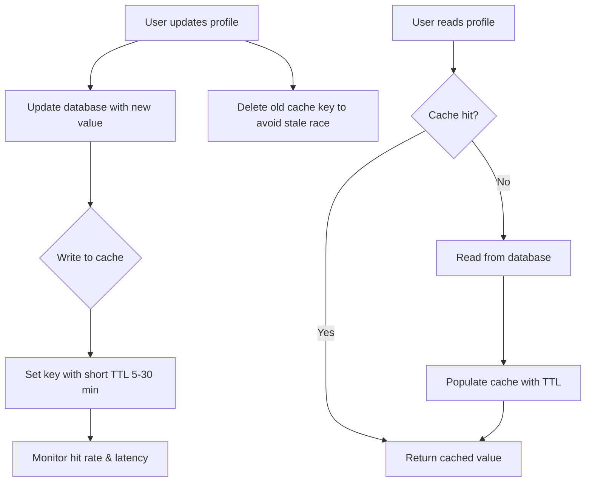

| Difficulty | Channel | Tags |
|---|---|---|
| beginner | backend | redis, memcached, cache-invalidation |

Somewhere in Meta's sprawling infrastructure, a stale piece of data sat in a cache for far too long. Nobody noticed at first. That one invisible, out-of-date profile lingered like a ghost, serving wrong answers to millions of requests until an engineer finally hunted it down [1]. Sound dramatic? Here is the terrifying part: the exact same bug is waiting inside your cache right now.

---

> ### Real-World Case — Meta
>
> Meta operates some of the largest cache deployments in the world, including TAO (a social graph cache) and Memcache, the backbone of its social graph reads. Cache invalidation bugs — where stale values hang around in cache indefinitely — were causing data inconsistency and were unbelievably hard to find, since races only trigger under very specific interleavings of read/write/eviction operations.
>
> | | |
> |---|---|
> | **Challenge** | Cache invalidation race conditions. In dynamic caches like TAO and Memcache, data mutates on both the read (cache fill) and write (invalidation) paths, producing endless race conditions including eviction racing with invalidation. Bugs were hiding in error-handling code behind interleaved operations and transient errors, and could take weeks for an expert to find, if ever. |
> | **Solution** | Meta built Polaris, a generic consistency-measurement service that pretends to be a cache server to receive invalidation events, then queries all cache replicas to verify no stale values persist. It replaced expensive direct-database bypass queries with retried checks and added a flag to tell transient (replication lag) vs permanent inconsistencies apart. They paired it with a stateful tracing library that logs every cache mutation, giving engineers the exact timeline and code path of any inconsistency. |
> | **Outcome** | Improved TAO's cache consistency from 99.9999% (six nines) to 99.99999999% (10 nines) on the five-minute timescale — fewer than 1 in 10 billion cache writes inconsistent after five minutes. Polaris catches anomalies immediately and in one incident let on-call engineers locate a deeply hidden bug in under 30 minutes instead of weeks. |
> | **Lesson** | Write-through caching with delete-on-update is only the baseline; the real challenge at scale is the read/write/eviction race conditions where stale data persists indefinitely. The counterintuitive key to fixing cache invalidation is to stop guessing and start measuring: instrument the system to detect inconsistencies with zero false positives, then trace every mutation until you can reproduce the impossible state. |

---

## Hook — The 2am Pager Call You Never Asked For

It is 2am. Your phone buzzes. The on-call rotation is yours, and the alert says cache hit rates just cratered while a handful of users are seeing profile data that stopped being true hours ago. You open the code, find nothing obviously wrong, and close the laptop. Tomorrow, the same users complain again.

Many developers discover this the hard way: caching is easy to set up and brutally hard to get right. The moment you add a cache to your profile service, you sign a silent contract — every read must reflect the latest write, or users will see data that contradicts itself. The stakes are personal: your product's trust lives or dies on whether your cache tells the truth.

Here is the kicker: this problem does not scale linearly. What is a benign occasional glitch at a thousand requests per second becomes a systemic, high-severity incident at millions. And the reason has nothing to do with your database — it has everything to do with how you invalidate.

## Problem — Why Stale Data Is the Silent Killer

Picture your user profile service. A user updates their display name. The database says 'Alex'. But the cache — that fast, beloved cache — still happily returns 'Alexander' to every subsequent read. Now the user notices their name is wrong on three different screens. They retry. Still wrong. They submit a bug report. The race condition that caused it already evaporated, so your team cannot reproduce it.

This is the core tension of distributed caching: reads want speed, writes want consistency, and these two desires are fundamentally at war [2]. A write-through strategy helps — write to both the database and the cache on every update. But even write-through has a trap: if you write the new value and the cache key never expires, a concurrent read racing between your update and your cache-write can persist the old value right back over the new one.

The classic escape hatch is TTL — time-to-live. Set a profile's entry to expire in five to thirty minutes, and the stale ghost disappears on its own [3]. TTLs are the bandage that keeps most services alive. But here is the uncomfortable question every senior engineer eventually asks: what happens when 'eventually' is not good enough?

## Real-World Case — Meta Takes Down the Stale Ghost

Meta runs some of the largest cache deployments on the planet: TAO, the social graph cache, and Memcache, the backbone of its social graph reads [1]. For years, a specific monster haunted their most valuable systems: cache invalidation bugs. Stale values would hang around indefinitely because races only trigger under very specific interleavings of read, write, and eviction operations — the kind of concurrency chaos that is nearly impossible to reproduce in a test.

These bugs were damaging and unbelievably hard to find. And so Meta built Polaris, a system that detects cache anomalies in real time [1]. The payoffs were astronomical. TAO's consistency jumped from 99.9999% (six nines) to 99.99999999% (ten nines) on the five-minute timescale — fewer than one in ten billion cache writes inconsistent after five minutes. In one incident, on-call engineers used Polaris to locate a deeply buried bug in under thirty minutes instead of weeks [1].

The lesson here is not 'Meta has fancier infrastructure.' The lesson is that stale cache data is a class of bug that hides from intuition and only surfaces under pressure. The companies that solve it do not rely on willpower — they build observability so the ghost becomes visible.

## Deep Dive — Redis vs Memcached: Choosing Your Weapon

Building on that story, the pragmatic question for your team is straightforward: which cache do you deploy? The short answer — it depends on your invalidation strategy. The two heavyweights, Redis and Memcached, take fundamentally different philosophical stances.

Redis is the Swiss-army knife. It ships with pub/sub, so when one node invalidates a key, other nodes hear about it automatically and drop their stale copies too [4]. This gives you distributed invalidation almost for free. Redis also offers persistence (RDB snapshots and AOF logs), so a restart does not necessarily mean a cold, empty cache [5]. And it supports advanced data structures — sorted sets, hashes, streams — that let you model far more than flat key-value pairs.

Memcached is leaner and meaner. Its simpler architecture makes it blazing fast for pure caching workloads, and its memory overhead is lower, which makes horizontal scaling more straightforward [6]. But there is a catch: no persistence, no pub/sub, and no native mechanism to coordinate invalidation across nodes. If you pick Memcached, you own the coordination problem yourself — which is precisely the job Meta's engineers were so desperate to automate.

Here is the trade-off in a table, stripped of the marketing:

| Consideration | Redis | Memcached |
|---|---|---|
| Distributed invalidation | Native pub/sub [4] | Manual, external coordination |
| Persistence | RDB + AOF [5] | None — cache is ephemeral |
| Data structures | Many (hashes, sets, streams) | Flat key-value |
| Memory overhead | Higher | Lower [6] |
| Best for | Complex invalidation + durability | Pure caching, high throughput |

Many developers think Memcached is 'just a worse Redis.' That misses the point. Memcached wins when your workload is embarrassingly simple and you want maximum throughput with minimal operational complexity. Redis wins when your invalidation logic is nontrivial. For a profile service that must stay consistent across many servers, Redis's pub/sub is nearly always the right call.

## Workflow — The Write-Through Dance, Step by Step

This leads to a concrete, repeatable workflow. The goal is a cache that never serves a known-stale value, while still getting the reads fast. The sequence below uses the write-through pattern combined with TTL and cache-aside reads:



Each step matters. Deleting the old key before setting the new one closes the race window that lets a stale read overwrite fresh data [7]. The TTL is your safety net — even if the deletion path fails silently, the entry self-destructs within minutes. And the final monitoring step is the Meta lesson in miniature: cache problems are invisible until you instrument them, so track hit rates, invalidation counts, and unknown-key get rates from day one.

For a cache-aside read, if the key is missing you fall through to the database, repopulate the cache, and the next read hits the fast path again [8]. For distributed deployments, combine this with either Redis pub/sub or a versioned-key scheme so multiple servers do not each silently hold divergent copies.

## Code Example — Invalidation in Action

Here is a production-minded Python implementation that combines write-through with cache-aside, key deletion, and a TTL safety net. This directly solves the stale-profile problem from the opening:

```python
import redis
import time

PROFILE_TTL_SECONDS = 600  # 10 minutes: bounded staleness even if invalidation fails

cache = redis.Redis.from_url("redis://cache-service:6379")

def get_profile(user_id: int) -> dict:
    key = f"profile:{user_id}"

    # Cache-aside read: fast path first
    cached = cache.get(key)
    if cached is not None:
        return json.loads(cached)

    # Slow path: miss, fall through to the source of truth
    profile = db.fetch_profile(user_id)
    if profile:
        # Repopulate, but never without a TTL safety net
        cache.setex(key, PROFILE_TTL_SECONDS, json.dumps(profile))
    return profile

def update_profile(user_id: int, new_data: dict) -> dict:
    key = f"profile:{user_id}"

    # 1) Persist the source of truth first
    updated = db.save_profile(user_id, new_data)

    # 2) Delete the stale key BEFORE writing fresh data,
    #    closing the read/write race that re-stales the cache
    cache.delete(key)

    # 3) Write through with a TTL so a missed delete self-heals
    cache.setex(key, PROFILE_TTL_SECONDS, json.dumps(updated))

    # OPTIONAL: publish so other nodes drop their stale copies too
    cache.publish("profile.invalidated", key)

    return updated
```

The design choices carry the whole argument. `setex` bundles set-plus-TTL into one atomic call, so a crash cannot leave a permanent stale entry. Deleting the key before rewriting closes the race that Meta's Polaris was built to detect. And the optional `publish` line is your doorway into Redis pub/sub — a single node invalidates, and every subscribing server evicts its copy automatically [4]. For a single-process toy this is overkill; for a service spread across a dozen pods, it is the difference between a consistent system and a ghost town of stale data.

## Lessons Learned — What to Do Differently Tomorrow

So what changes tonight? First, if your profile service has no TTL on cached entries, add one within the next hour — this is the single highest-leverage fix and costs almost nothing [3]. Second, instrument invalidation: count deletes, track hit rates, and alert when the unknown-key get rate spikes. Meta did not find their hour-long bug with better caching; they found it with observability [1].

The bigger lesson is philosophical. Caching is not a performance optimization you bolt on — it is a consistency system you design. The write-through pattern, key deletion, TTLs, and distributed invalidation are not optional decorations; each one defends a specific failure mode. If this feels overwhelming, you are not alone — every distributed system struggles with it [2].

⚠️ Watch Out: never assume a cache delete succeeded. Some clients silently return errors on eviction. Pair your deletes with a short TTL so the system degrades to 'eventually consistent' instead of 'permanently wrong.'

🔥 Hot Take: the biggest cache bug is not choosing Redis vs Memcached. It is assuming your cache will eventually fix itself without a TTL, without monitoring, and without a deletion discipline. The tool is secondary; your invalidation story is what keeps users believing your data.

Leave your team with this: the moment you add a cache, you are on the hook for the ghost. Add a TTL, instrument the deletes, and stay curious about the races you cannot yet see.

---

## Write-Through Cache Invalidation Flow


<details>
<summary><strong>Original Interview Question</strong></summary>

**Q:** You're building a user profile service that caches frequently accessed profiles. How would you implement cache invalidation when a user updates their profile, and what trade-offs would you consider between Redis and Memcached?

**A:** Implement write-through caching with TTL-based expiration. On profile update, invalidate the cache by deleting the key and writing new data to both the database and cache. Redis offers pub/sub for automatic distributed invalidation, while Memcached requires manual coordination across nodes.

</details>

## Conclusion

The moral of the story is simple and uncomfortable: a cache is not a shortcut, it is a consistency system with a memory. Meta's ten-nines turnaround did not come from a fancier database — it came from treating stale data as a first-class bug and instrumenting their way to visibility [1]. Tomorrow, audit your profile service. Add a TTL. Instrument your deletes. Most of all, stop assuming your cache will clean up after itself. One memorable insight to carry back to your team: 'The difference between a good cache and a dangerous one is not speed — it is whether it can be trusted to forget.' Tie this back to the opening ghost, and ship that fix.

---

## References

1. [Meta incident report](https://engineering.fb.com/2022/06/08/core-infra/cache-made-consistent/) — blog
2. [Memcached](https://en.wikipedia.org/wiki/Memcached) — documentation
3. [Redis EXPIRE documentation](https://redis.io/docs/latest/commands/expire/) — documentation
4. [Redis Pub/Sub documentation](https://redis.io/docs/latest/develop/use/pubsub/) — documentation
5. [Redis Persistence](https://redis.io/docs/latest/operate/oss_and_stack/management/persistence/) — documentation
6. [Memcached Wiki](https://github.com/memcached/memcached/wiki) — documentation
7. [Cache eviction algorithms](https://en.wikipedia.org/wiki/Cache_replacement_policies) — documentation
8. [Caching patterns at scale](https://www.digitalocean.com/community/tutorials/understanding-key-value-cache-patterns-and-memory) — documentation

---

**Author:** Satishkumar Dhule — [GitHub](https://github.com/satishkumar-dhule) · [LinkedIn](https://linkedin.com/in/satishkumar-dhule) · [Website](https://satishkumar-dhule.github.io)
