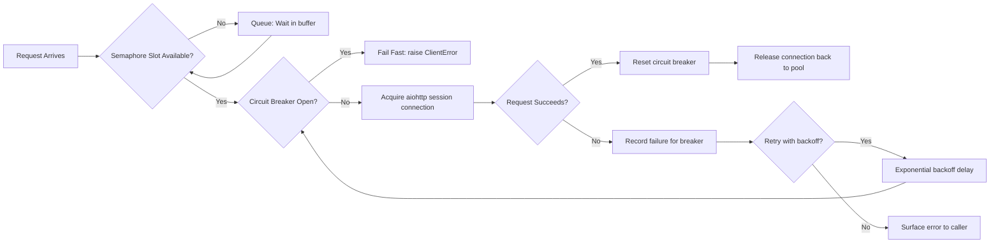

| Difficulty | Channel | Tags |
|---|---|---|
| advanced | backend | asyncio, aiohttp, concurrency |

Netflix once discovered the hard way that a single slow service can take down an entire platform. Inside their service-oriented architecture, one API request touches dozens of downstream services — and when just one of them becomes latent, saturated connection pools cascade into user-facing outages affecting millions [1]. This is the story of how teams built resilience against that chaos, and how you can apply the same patterns to your own aiohttp applications before the pager goes off at 3am.

---

> ### Real-World Case — Netflix
>
> Netflix serves millions of customers through a service-oriented architecture where a single API request touches dozens of downstream services. They experienced repeated production incidents where saturated connection/thread pools, cascading failures, and misconfigured pools triggered major user-impacting outages, even when a single dependency failed or became latent.
>
> | | |
> |---|---|
> | **Challenge** | When one downstream service becomes latent (the worst-case failure mode), it can rapidly saturate all available request threads, blocking requests to unrelated healthy services and bringing down the entire API tier. Netflix needed to restrict concurrent connections to each dependency and gracefully degrade without blocking or cascading failures. |
> | **Solution** | Netflix built Hystrix, a latency and fault-tolerance library that applies semaphore-based and per-dependency thread-pool limiting (bulkheading), circuit breakers that trip at thresholds like 50% error rate over 10 seconds, aggressive timeouts, and fallbacks. It limits concurrent connections so a latent dependency can only saturate its own pool, and the circuit breaker opens to fail fast and shed load from the failing service until health checks pass. |
> | **Outcome** | Hystrix processes over 10 billion command executions per day across the Netflix API (each API request touching 40+ dependency threads at the 90th percentile) with lightweight semaphore overhead. It enabled Netflix to weather real AWS outages with minimal customer impact, and Hystrix became the industry-standard open-source circuit breaker, later adapted into Resilience4j and Spring Cloud. |
> | **Lesson** | A single misconfigured connection pool or timeout can take down an entire API - failure isolation via bulkheading (semaphores/thread pools) plus circuit breakers is essential. Default client configurations are almost never optimal, so you must protect against bad clients, transitive dependencies, and changing service performance rather than trusting them. Graceful degradation (fail fast, fallbacks, feature removal) beats trying to keep every dependency available. |

---

## Hook — It was 3am and one dependency was dying

It is 3am and half your users are staring at spinning spinners. The dashboards show throughput dropping while error rates climb. You check the database — it is fine. The cache — fine. Then you notice it: a single downstream microservice, one that nobody thought was critical, has gone latent. Its connection pool saturated. Your entire API pipeline is now backing up behind it, and every request you make is just adding more weight to an already drowning service.

Sound familiar? If it does not yet, it will. Every developer with a service-oriented backend eventually hits this wall. The surprises are: (1) how quickly a single failure spreads, and (2) how much of the damage is preventable. By the end of this piece, you will know exactly what broke at Netflix, why naive connection pools are a liability, and how to build an aiohttp pool manager that degrades gracefully instead of collapsing.

## Problem — Your connection pool is a single point of collapse

Here is the uncomfortable truth: a connection pool without a failure strategy is not resilience — it is a queue for disaster. When things work, a pool of `aiohttp.ClientSession` connections is elegant. Requests flow, connections get reused, latency stays low. But when a downstream service slows down, that elegant pool becomes a traffic jam. 

Think through what happens when one dependency responds in 30 seconds instead of 50 milliseconds. Every request now holds a connection open ten times longer than normal. Your pool of 100 connections saturates fast. New requests pile up. Timeouts start firing. And now comes the compounding effect: the pool is still trying to open new connections to the degraded service, wasting threads and sockets, while healthy requests behind them starve [4].

Many developers only discover the real problem during an incident. The stakes are high: connection leaks, inadequate timeout configurations, missing cleanup on shutdown, and improper error propagation through the async stack all turn a small latency blip into a full outage. The pool is not the problem — the pool's *lack of a degradation strategy* is.

## Real-World Case — Netflix and the birth of Hystrix

This exact scenario nearly drowned Netflix. Running a service-oriented architecture where a single API request touches dozens of backend services, Netflix suffered repeated production incidents caused by saturated thread and connection pools [1]. When one dependency failed or became latent, the failure cascaded. A single slow service could starve the thread pools of an entire API tier, triggering user-impacting outages across the board.

The fix was Hystrix, a latency and fault-tolerance library built around principles that mirror what you will build today: isolating dependency failures, limiting concurrency with lightweight semaphore control, and failing fast with circuit breakers instead of piling on a dying service [1]. The results were dramatic. Hystrix now processes over 10 billion command executions per day across the Netflix API — with each request touching 40+ dependency threads at the 90th percentile — and it used a lightweight semaphore approach precisely because thread-based isolation was too expensive at that scale [2]. It let Netflix weather real AWS outages with minimal customer impact, and it became the industry-standard open-source circuit breaker, later adapted into Resilience4j and Spring Cloud [1].

## Deep Dive — Semaphores, backoff, and circuit breakers, explained

Building on Netflix's lesson, the real question is: what mechanisms actually create graceful degradation? There are three pillars, and each one handles a different failure mode.

**Semaphore-based limiting.** The first principle is concurrency control. A `Semaphore` caps how many requests can be in flight simultaneously, protecting both your service and the dependency from being overwhelmed [3]. Netflix chose semaphores over dedicated threads for Hystrix precisely because semaphore isolation has near-zero overhead at massive concurrency — the lightweight alternative that only works when you trust your latency bounds [2].

**Exponential backoff.** The second pillar is retry strategy. When a request fails, retrying immediately just multiplies the pressure on an already-struggling system. Exponential backoff, which you can build with asyncio's sleep delays doubled after each attempt, introduces growing gaps between retries. It gives the downstream service time to recover instead of drowning it in retries [5].

**Circuit breaker.** The third pillar, and the most dramatic, is the circuit breaker — the exact pattern Hystrix made famous [1]. Instead of letting requests pile onto a failing service, the breaker detects repeated failures and 'trips open': for a window of time, requests fail fast immediately without even touching the network. This converts a slow, cascading collapse into a quick, contained refusal [6].

The tradeoffs matter though. A semaphore that is too small throttles healthy traffic; one that is too large offers no protection. Circuit breakers need careful thresholds — trip too eagerly and you add avoidable errors; trip too late and the service is already down. Table 1 shows the real choice.

## Workflow — From request arrival to graceful failure

Now that the building blocks are clear, here is the step-by-step journey a request takes through a properly hardened pool. This is the architecture that turns raw resilience ideas into a working system, visualized in Figure 1 [diagramLabel].

1. **Request arrives** on the async event loop.
2. **Semaphore gating** — the request acquires a slot from the semaphore. If the pool is saturated, the request waits in queue instead of hammering the network [4].
3. **Circuit breaker check** — before any network call, the breaker state is inspected. If it is open, the request fails fast with a clear error, no connection wasted [6].
4. **Request execution** — the actual `session.get()` fires against the downstream service.
5. **Success path** — the breaker resets and the connection returns to the pool for reuse via keep-alive.
6. **Failure path** — the failure is recorded, the breaker state updates, and the request is either retried with exponential backoff or surfaced to the caller [5].

This flow is the heart of graceful degradation. Each step is a deliberate decision point, and each one prevents a specific failure from spreading. The diagram captures the whole loop at a glance.

## Code Example — A resilient aiohttp pool manager in action

Building on the workflow, here is how these principles translate into actual Python. The following class wires together a semaphore, exponential backoff, and a circuit breaker into a single `ConnectionPoolManager`. Note the inline comments — each mechanism maps directly to a step in the workflow.

The key design decisions are worth calling out. The `Semaphore(max_connections)` enforces concurrency gating up front. The circuit breaker state tracks failures and refuses requests after a threshold within a 60-second window, failing fast instead of waiting for a timeout. The timeout configuration (30 seconds total) caps how long any request can hold a connection, preventing the slow-dependency starvation problem from the opening story [3]. And because it is all built on asyncio, the entire system can handle thousands of concurrent requests on a single thread — the async equivalent of Netflix's semaphore efficiency lesson [2].

## Lessons Learned — What a decade of outages taught the industry

So what do you do differently tomorrow? Start with your own dependency map — identify the handful of services that, if they slowed, would take you down. Then apply the three pillars systematically.

- **Cap concurrency everywhere.** A pool without a semaphore is not a pool — it is a floodgate [4].
- **Fail fast, not stuck.** Configure timeouts aggressively and let the circuit breaker refuse work before the timeout ever fires [6].
- **Retry with respect.** Exponential backoff is not a nicety; it is what separates a blip from a cascading outage [5].
- **Clean up on shutdown.** Always close the session and flush the pool to avoid connection leaks and zombie sockets [7].
- **Watch your metrics.** Monitor pool saturation and latency percentiles so you see degradation coming, not after it hits [1].

The memorable insight to share with your team: **resilience is not about preventing failures — it is about containing them.** Netflix could not stop every dependency from degrading on a given Tuesday afternoon. But by building isolation, semaphores, and circuit breakers, they made sure no single dependency could ever take the whole platform down again [1]. You can do the same for your aiohttp services.

---

## Graceful Degradation Flow

<strong>Original Interview Question</strong>

**Q:** How would you implement a connection pool manager for aiohttp that handles graceful degradation under high load and connection timeouts?

**A:** Implement a connection pool manager for aiohttp using a semaphore to limit concurrent connections, exponential backoff for retrying failed requests, and circuit breaker pattern to gracefully degrade under high load and connection timeouts.

## Conclusion

The pattern you invest in today is the outage you avoid at 3am tomorrow. Start small: add a semaphore to your existing aiohttp pooling, set aggressive timeouts, and wire in a circuit breaker that fails fast. Then measure — watch saturation and latency percentiles so degradation becomes something you see coming, not something that wakes you up. Netflix's Hystrix proved these ideas at 10 billion executions a day, and they work just as well on a modest async service. The real insight to take back to your team: resilience is not about preventing every failure — it is about containing the damage the moment one happens [1].

---

## References

1. [Netflix incident report](http://benjchristensen.com/2013/06/10/application-resilience-in-a-service-oriented-architecture-using-hystrix/) — article
2. [Making the Netflix API More Resilient](http://benjchristensen.com/2012/02/09/lets-talk-about-thread-pools-and-hystrix/) — blog
3. [aiohttp ClientSession and timeouts](https://docs.aiohttp.org/en/stable/client_advanced.html) — documentation
4. [asyncio Semaphore documentation](https://docs.python.org/3/library/asyncio-sync.html#semaphore) — documentation
5. [Exponential backoff algorithm](https://en.wikipedia.org/wiki/Exponential_backoff) — article
6. [Circuit breaker pattern](https://martinfowler.com/bliki/CircuitBreaker.html) — blog
7. [Context manager and cleanup in asyncio](https://docs.python.org/3/library/asyncio-eventloop.html) — documentation
8. [Graceful degradation in distributed systems](https://developer.mozilla.org/en-US/docs/Glossary/Graceful_degradation) — documentation

---

**Author:** Satishkumar Dhule — [GitHub](https://github.com/satishkumar-dhule) · [LinkedIn](https://linkedin.com/in/satishkumar-dhule) · [Website](https://satishkumar-dhule.github.io)
